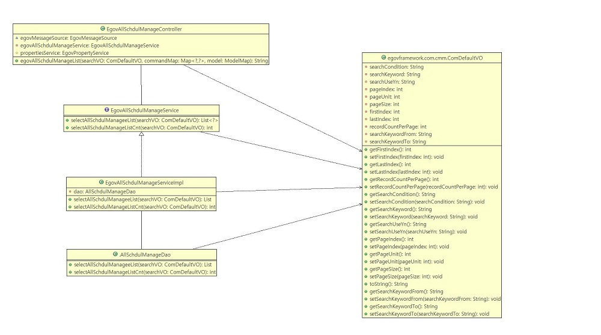
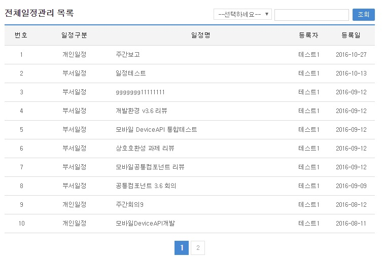

# 전체일정

## 개요

사용자가 일정관리, 부서일정관리를 조회및 관리 할 수 있는 서비스

## 설명

### 패키지 참조 관계

전체일정 패키지는 요소기술의 공통(cmm) 패키지에 대해서만 직접적인 함수적 참조 관계를 가진다. 하지만, 컴포넌트 배포 시 오류 없이 실행되기 위하여 패키지 간의 참조관계에 따라 포맷/날짜/계산, 개인일정관리, 일지관리, 부서일정관리 패키지와 함께 배포 파일을 구성한다.

- 패키지 간 참조 관계 : [협업-일정관리, 문자메시지, 주소록 외 Package Dependency](../intro/package-reference.md#협업)

### 관련소스

| 유형 | 대상소스명 | 비고 |
| --- | --- | --- |
| Controller | egovframework.com.cop.smt.sam.web.EgovAllSchdulManageController.java | 전체일정 Controller Class |
| Service | egovframework.com.cop.smt.sam.service.EgovAllSchdulManageService.java | 전체일정 Service Class |
| ServiceImpl | egovframework.com.cop.smt.sam.service.impl.EgovAllSchdulManageServiceImpl.java | 전체일정 ServiceImpl Class |
| VO | egovframework.com.cmm.ComDefaultVO.java | 검색 VO Class |
| DAO | egovframework.com.cop.smt.sam.service.impl.AllSchdulManageDao.java | 전체일정 Dao Class |
| JSP | /WEB-INF/jsp/egovframework/com/cop/smt/sam/EgovAllSchdulManageList.jsp | 전체일정 목록조회 페이지 |
| Query XML | resources/egovframework/mapper/com/cop/smt/sam/EgovAllSchdulManage_SQL_altibase.xml | 전체일정 관리를 위한 Altibase용 Query XML |
| Query XML | resources/egovframework/mapper/com/cop/smt/sam/EgovAllSchdulManage_SQL_cubrid.xml | 전체일정 관리를 위한 Cubrid용 Query XML |
| Query XML | resources/egovframework/mapper/com/cop/smt/sam/EgovAllSchdulManage_SQL_maria.xml | 전체일정 관리를 위한 MariaDB용 Query XML |
| Query XML | resources/egovframework/mapper/com/cop/smt/sam/EgovAllSchdulManage_SQL_mysql.xml | 전체일정 관리를 위한 MySQL용 Query XML |
| Query XML | resources/egovframework/mapper/com/cop/smt/sam/EgovAllSchdulManage_SQL_oracle.xml | 전체일정 관리를 위한 Oracle용 Query XML |
| Query XML | resources/egovframework/mapper/com/cop/smt/sam/EgovAllSchdulManage_SQL_postgres.xml | 전체일정 관리를 위한 PostgreSQL용 Query XML |
| Query XML | resources/egovframework/mapper/com/cop/smt/sam/EgovAllSchdulManage_SQL_tibero.xml | 전체일정 관리를 위한 Tibero용 Query XML |
| Query XML | resources/egovframework/mapper/com/cop/smt/sam/EgovAllSchdulManage_SQL_goldilocks.xml | 전체일정 관리를 위한 Goldilocks용 Query XML |
| Message properties | resources/egovframework/message/com/message-common_ko.properties | 전체일정 Message properties(한글) |
| Message properties | resources/egovframework/message/com/message-common_en.properties | 전체일정 Message properties(영문) |

### 클래스 다이어그램

### 관련테이블

| 테이블명 | 테이블명(영문) | 비고 |
| --- | --- | --- |
| 일정관리 | COMTNSCHDULINFO | 일정을 관리 한다. |

### 관련코드

| 코드분류 | 코드분류명 | 코드ID | 코드명 |
| --- | --- | --- | --- |
| COM030 | 일정구분 | 1 | 부서일정 |
| COM030 | 일정구분 | 2 | 개인일정 |

## 관련기능

관리자가 기(記) 등록된 전체일정 정보를 리스트 형태로 조회 할 수 있고, 등록버튼을 클릭하여 등록화면으로 이동할 수 있다.

### 전체일정 목록

#### 비즈니스 규칙

관리자가 기(記) 등록된 일지관리 정보를 리스트 형태로 조회 할 수 있고, 등록버튼을 클릭하여 등록화면으로 이동할 수 있다.

#### 관련코드

N/A

#### 관련화면 및 수행매뉴얼

| Action | URL | Controller method | SQL Namespace | SQL QueryID |
| --- | --- | --- | --- | --- |
| 목록조회 | /cop/smt/sam/EgovAllSchdulManageList.do | egovAllSchdulManageList | “AllSchdulManage” | “selectIndvdlSchdulManage” |
| | | | “AllSchdulManage” | “selectIndvdlSchdulManageCnt” |

전체일정 목록은 페이지 당 10건씩 조회되며 페이징은 10페이지씩 이루어진다. 검색조건은 등록자, 일정명, 일정내용에 대해서 수행된다.

페이지 당 검색 범위를 변경하고자 하는 경우

context-properties.xml 파일의 pageUnit, pageSize를 변경한다.(단 해당 설정은 전체 공통서비스 기능에 영향을 미친다.)

목록클릭: 부서일정관리 상세조회, 일정관리 상세조회 화면으로 이동한다.