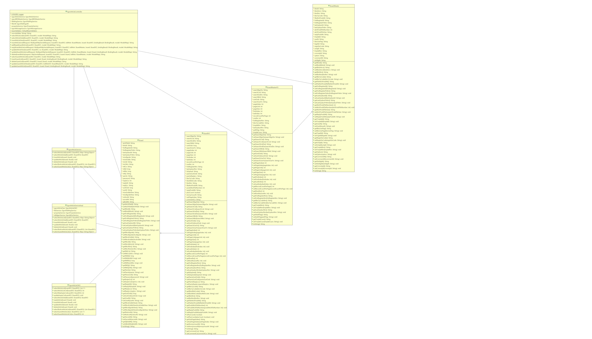
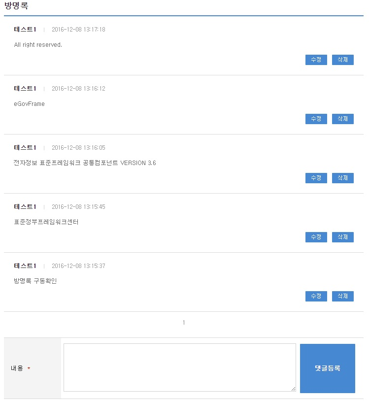
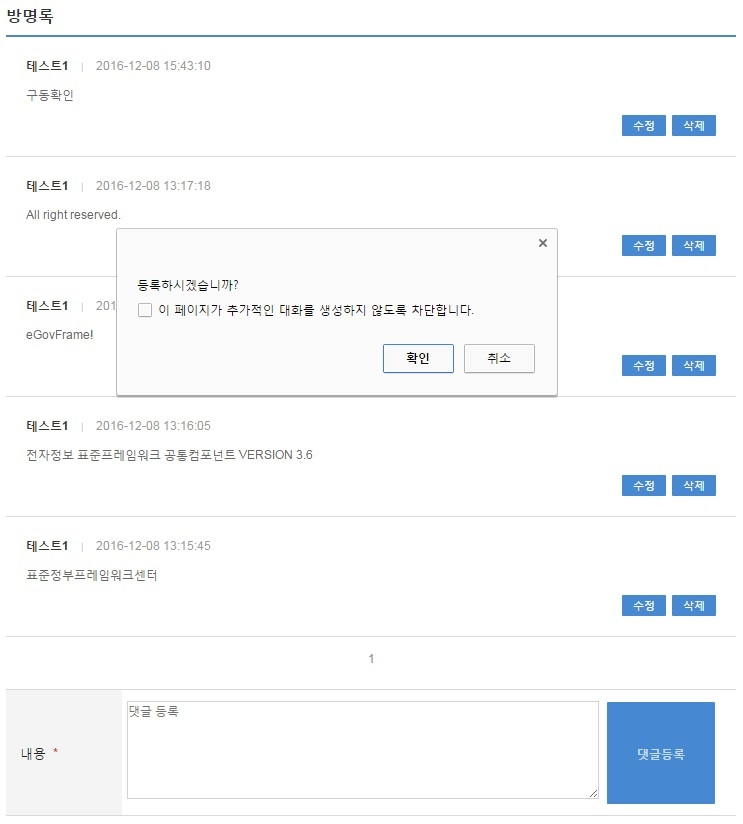
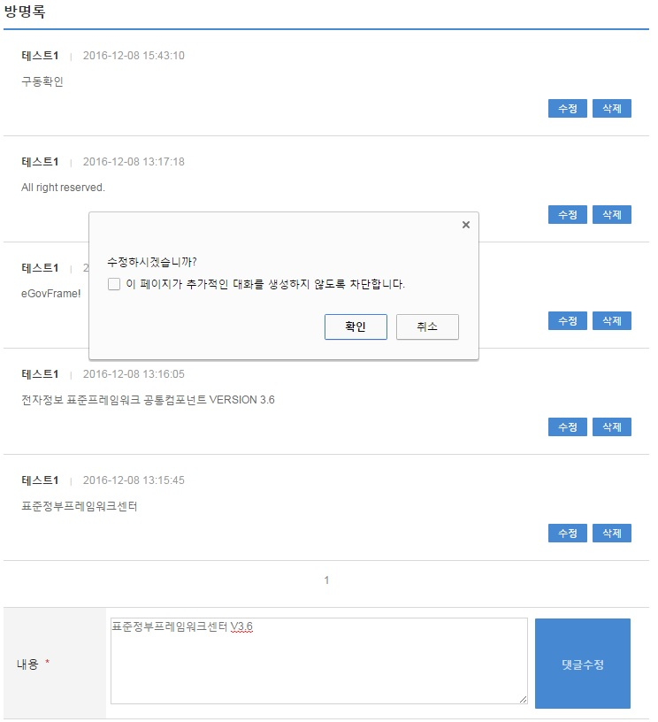

# 게시판(방명록)

## 개요

사용자 간의 정보공유를 위해 공통으로 사용되는 방명록을 관리할 수 있도록 방명록을 등록하고 등록된 방명록을 조회할 수 있는 기능을 제공한다.

## 설명

게시판 관리기능에 의해 생성된 방명록에 사용자가 방명록을 등록, 확인, 수정,삭제 할 수 있는 기능을 제공한다. 각 방명록은 글 생성 및 확인, 수정, 삭제가 가능하며 수정 및 삭제의 경우 글을 작성한 당사자만이 수정, 삭제가 가능하다.

### 패키지 참조 관계

게시판 패키지는 요소기술의 공통 패키지(cmm)에 대해서 직접적인 함수적 참조 관계를 가진다. 하지만, 컴포넌트 배포 시 오류 없이 실행되기 위하여 패키지 간의 참조관계에 따라 협업의 공통기능(com), 디자인템플릿과 함께 배포 파일을 구성한다.

- 패키지 간 참조 관계 : [게시판, 커뮤니티, 동호회 Package Dependency](../intro/package-reference.md/#협업)

### 관련소스

| 유형 | 대상소스 | 비고 |
| --- | --- | --- |
| Controller | egovframework.com.cop.bbs.web.EgovArticleController.java | 방명록 관리를 위한 컨트롤러 클래스 |
| Service | egovframework.com.cop.bbs.service.EgovArticleService.java | 방명록 관리를 위한 서비스 인터페이스 |
| ServiceImpl | egovframework.com.cop.bbs.service.impl.EgovArticleServiceImpl.java | 게시물 관리를 위한 서비스 구현 클래스 |
| Model | egovframework.com.cop.bbs.service.Board.java | 방명록 관리를 위한 모델 클래스 |
| Model | egovframework.com.cop.bbs.service.BoardMaster.java | 방명록 속성 정보를 관리하기 위한 모델 클래스 |
| VO | egovframework.com.cop.bbs.service.BoardVO.java | 방명록 관리를 위한 VO 클래스 |
| VO | egovframework.com.cop.bbs.service.BoardMasterVO.java | 방명록 속성 정보를 관리하기 위한 VO 클래스 |
| DAO | egovframework.com.cop.bbs.service.impl.EgovArticleDAO.java | 방명록 관리를 위한 데이터처리 클래스 |
| JSP | /WEB-INF/jsp/egovframework/com/cop/bbs/EgovGuestArticleList.jsp | 방명록 생성,수정,조회,삭제를 위한 jsp페이지 |
| Query XML | resources/egovframework/mapper/com/cop/bbs/EgovArticle_SQL_mysql.xml | 방명록 관리를 위한 MySQL용 Query XML |
| Query XML | resources/egovframework/mapper/com/cop/bbs/EgovArticle_SQL_oracle.xml | 방명록 관리를 위한 Oracle용 Query XML |
| Query XML | resources/egovframework/mapper/com/cop/bbs/EgovArticle_SQL_tibero.xml | 방명록 관리를 위한 Tibero용 Query XML |
| Query XML | resources/egovframework/mapper/com/cop/bbs/EgovArticle_SQL_altibase.xml | 방명록 관리를 위한 Altibase용 Query XML |
| Query XML | resources/egovframework/mapper/com/cop/bbs/EgovArticle_SQL_cubrid.xml | 방명록 관리를 위한 Cubrid용 Query XML |
| Query XML | resources/egovframework/mapper/com/cop/bbs/EgovArticle_SQL_maria.xml | 방명록 관리를 위한 MariaDB용 Query XML |
| Query XML | resources/egovframework/mapper/com/cop/bbs/EgovArticle_SQL_postgres.xml | 방명록 관리를 위한 PostgreSQL용 Query XML |
| Query XML | resources/egovframework/mapper/com/cop/bbs/EgovArticle_SQL_goldilocks.xml | 방명록 관리를 위한 Goldilocks용 Query XML |
| Validator XML | resources/egovframework/validator/com/cop/bbs/EgovArticleRegist.xml | 방명록 관리를 위한 Validator XML |
| Idgen XML | resources/egovframework/spring/com/idgn/context-idgn-bbs.xml | 방명록 등록 Id생성 Idgen XML |
| Message properties | resources/egovframework/message/com/cop/bbs/message_ko.properties | 방명록 관리를 위한 Message properties(한글) |
| Message properties | resources/egovframework/message/com/cop/bbs/message_en.properties | 방명록 관리를 위한 Message properties(영문) |

### 클래스 다이어그램



### ID Generation

#### ID Generation 관련 DDL 및 DML

ID Generation Service를 활용하기 위해서 Sequence 저장테이블인 COMTECOPSEQ에 NTT_ID 항목을 추가해야 한다.

```sql
CREATE TABLE COMTECOPSEQ ( TABLE_NAME VARCHAR(20) NOT NULL, 
                NEXT_ID NEMERIC(30) NULL,
                  PRIMARY KEY (TABLE_NAME));
 
INSERT INTO COMTECOPSEQ ( TABLE_NAME, NEXT_ID ) VALUES ('NTT_ID', 1);
```

#### ID Generation 환경설정(context-idgn-bbs.xml)

```xml
<bean name="egovNttIdGnrService" class="egovframework.rte.fdl.idgnr.impl.EgovTableIdGnrServiceImpl" destroy-method="destroy">
    <property name="dataSource" ref="egov.dataSource" />
    <property name="strategy"   ref="nttIdStrategy" />
    <property name="blockSize"  value="10"/>
    <property name="table"      value="COMTECOPSEQ"/>
    <property name="tableName"  value="NTT_ID"/>
</bean>
<bean name="nttIdStrategy" class="egovframework.rte.fdl.idgnr.impl.strategy.EgovIdGnrStrategyImpl">
    <property name="cipers"   value="20" />
</bean>
```

### 관련테이블

| 테이블명 | 테이블명(영문) | 비고 |
| --- | --- | --- |
| 게시물 정보 | COMTNBBS | 게시물 정보를 관리한다. |

## 관련기능

게시판 사용을 위한 방법은 시스템에 활용되는 게시판, 커뮤니티에서 활용되는 게시판, 동호회에서 활용되는 게시판 3가지로 구분된다.
방명록관리는 목록 확인, 등록, 수정, 삭제 기능으로 구분되어 있다.

### 방명록 목록조회

#### 비즈니스 규칙

방명록을 확인할 수 있는 화면을 제공한다. 방명록에 대한 확인 화면은 접근은 URL 링크(시스템 사용 게시판), 커뮤니티를 통한 접근, 동호회를 통한 접근 3가지 방식이 존재한다.

#### 관련코드

N/A

#### 관련화면 및 수행매뉴얼

| Action | URL | Controller method | SQL Namespace | SQL QueryID |
| --- | --- | --- | --- | --- |
| 목록조회 | /cop/bbs/selectGuestArticleList.do | selectGuestArticleList | “BBSArticle” | “selectGuestArticle” |
| | | | “BBSArticle” | “selectGuestArticleListCnt” |

게시판 목록은 페이지 당 10건씩 조회되며 페이징은 10페이지씩 이루어진다.

방명록 목록은 페이지 당 10건씩 조회되며 페이징은 10페이지씩 이루어진다. 페이지 를 변경하고자 하는 경우 context-properties.xml 파일의 pageUnit, pageSize를 변경한다.(단 해당 설정은 전체 공통서비스 기능에 영향을 미친다.)



신규 방명록 게시물을 등록하기 위해서는 상단의 등록 버튼을 통해서 내용을 작성한 뒤 게시물을 등록할 수 있다.

게시내용을 확인하기 위해서는 등록한 뒤 화면으로 확인할 수 있다.

### 방명록 등록

#### 비즈니스 규칙

방명록 폼에서 내용을 입력한 뒤 등록 버튼을 선택하면 방명록이 등록된다.등록이 성공적으로 처리되면 방명록 화면에서 게시글을 확인할 수 있다.

#### 관련코드

N/A

#### 관련화면 및 수행매뉴얼

| Action | URL | Controller method | SQL Namespace | SQL QueryID |
| --- | --- | --- | --- | --- |
| 등록 | /cop/bbs/insertGuestArticle.do | insertGuestList | “BBSArticle” | “insertArticle” |



내용 양식에서 내용을 입력한 후 알림창에서 확인을 누르면 작성한 내용을 등록할 수 있다.

### 방명록 수정

#### 비즈니스 규칙

방명록 게시물을 수정할 수 있는 화면을 제공하고 입력된 방명록 수정정보를 저장처리한다.

#### 관련코드

N/A

#### 관련화면 및 수행매뉴얼

| Action | URL | Controller method | SQL Namespace | SQL QueryID |
| --- | --- | --- | --- | --- |
| 수정화면 | /cop/bbs/updateGuestArticleView.do | updateGuestArticleView | | |
| 수정 | /cop/bbs/updateGuestArticle.do | updateGuestArticle | “BBSArticle” | “updateArticle” |



업데이트의 내용을 변경하고 수정 버튼을 누르면 정보가 변경되어 화면에서 확인할 수 있다.

## 참고자료

게시판 생성관리 기능 참조 : [게시판 생성관리](/common-component/collaboration/board-management.md)