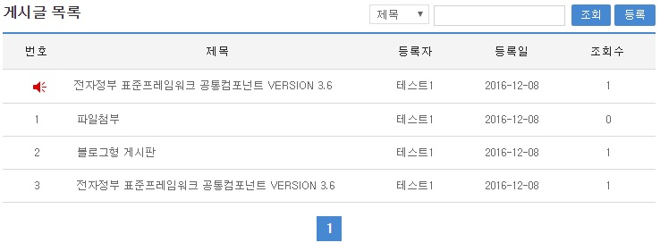
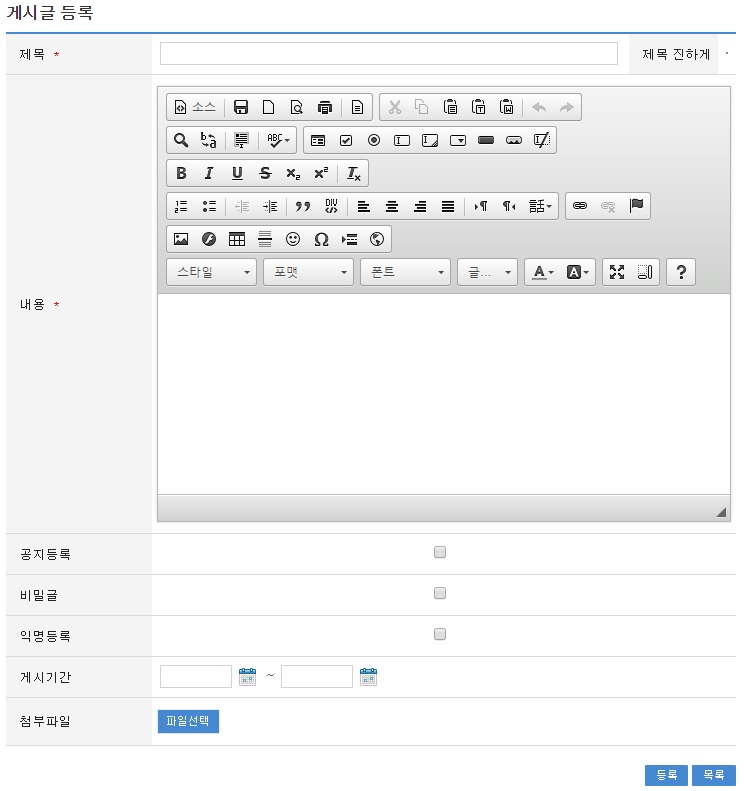
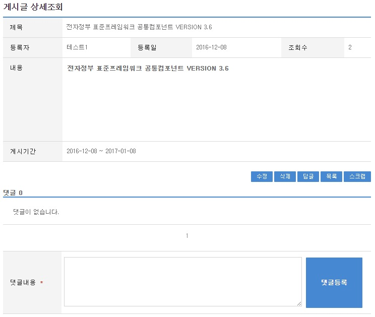
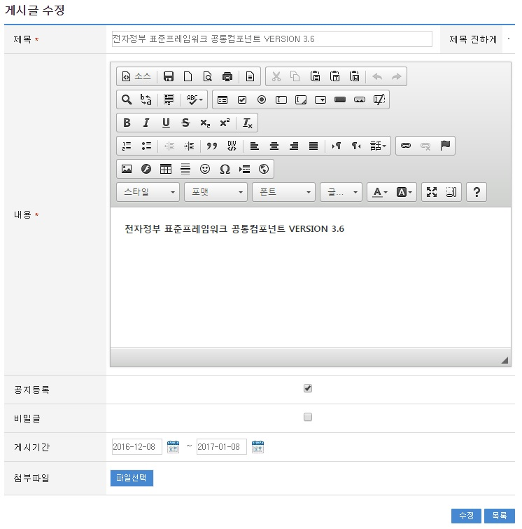
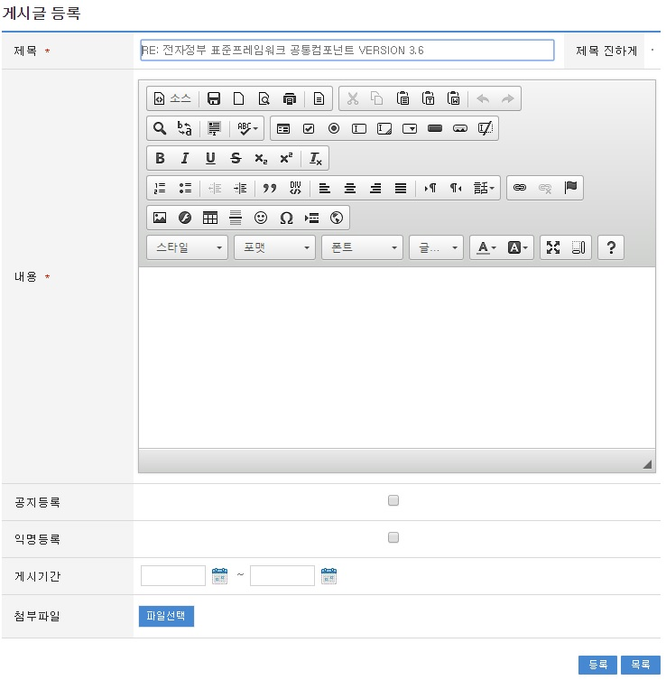

# 게시판(통합 게시판)

## 개요

사용자 간의 정보공유를 위해 공통으로 사용되는 게시판을 관리할 수 있도록 게시물을 등록하고 등록된 게시물의 목록을 조회할 수 있는 기능을 제공한다.

## 설명

게시판 관리 기능에 의해 생성된 게시판에 사용자가 게시물을 등록, 조회, 수정 할 수 있는 기능을 제공한다. 생성된 게시판은 게시판 속성관리에 따라서 지정된 유형 및 속성에 따라서 실제 게시판은 다른 형태로 보여지게 된다. 각 게시판은 글 생성 및 조회, 수정, 삭제가 가능하며 수정 및 삭제의 경우 글을 게시한 당사자만이 수정, 삭제가 가능하다. 익명 게시판의 경우 작성자의 이름이 나오지 않으며, 갤러리 형태의 게시판의 경우 글 생성시 첨부된 이미지 파일(BMP,JPG,GIF,PNG 포맷에 한함)을 본문에 같이 보여주는 기능을 제공한다.

### 패키지 참조 관계

게시판 패키지는 요소 기술의 공통 패키지(cmm)에 대해서 직접적인 함수적 참조 관계를 가진다. 하지만, 컴포넌트 배포 시 오류 없이 실행되기 위하여 패키지 간의 참조 관계에 따라 협업의 공통기능(com), 디자인 템플릿과 함께 배포 파일을 구성한다.

- 패키지 간 참조 관계 : [게시판, 커뮤니티, 동호회 Package Dependency](../intro/package-reference.md/#협업)

### 관련소스

| 유형 | 대상소스 | 비고 |
| --- | --- | --- |
| Controller | egovframework.com.cop.bbs.web.EgovArticleController.java | 게시물 관리를 위한 컨트롤러 클래스 |
| Service | egovframework.com.cop.bbs.service.EgovArticleService.java | 게시물 관리를 위한 서비스 인터페이스 |
| ServiceImpl | egovframework.com.cop.bbs.service.impl.EgovArticleServiceImpl.java | 게시물 관리를 위한 서비스 구현 클래스 |
| Model | egovframework.com.cop.bbs.service.Board.java | 게시물 관리를 위한 모델 클래스 |
| Model | egovframework.com.cop.bbs.service.BoardMaster.java | 게시판 속성 정보를 관리하기 위한 모델 클래스 |
| VO | egovframework.com.cop.bbs.service.BoardVO.java | 게시물 관리를 위한 VO 클래스 |
| VO | egovframework.com.cop.bbs.service.BoardMasterVO.java | 게시판 속성 정보를 관리하기 위한 VO 클래스 |
| DAO | egovframework.com.cop.bbs.service.impl.EgovArticleDAO.java | 게시물 관리를 위한 데이터 처리 클래스 |
| JSP | /WEB-INF/jsp/egovframework/com/cop/bbs/EgovArticleRegist.jsp | 게시물 생성을 위한 jsp페이지 |
| JSP | /WEB-INF/jsp/egovframework/com/cop/bbs/EgovArticleUpdt.jsp | 생성된 게시물 수정을 위한 jsp 페이지 |
| JSP | /WEB-INF/jsp/egovframework/com/cop/bbs/EgovArticleList.jsp | 생성된 게시물 조회를 위한 jsp 페이지 |
| JSP | /WEB-INF/jsp/egovframework/com/cop/bbs/EgovArticleDetail.jsp | 생성된 게시물 상세 조회를 위한 jsp 페이지 |
| JSP | /WEB-INF/jsp/egovframework/com/cop/bbs/EgovArticleReply.jsp | 생성된 게시물에 대한 답변을 등록하기 위한 jsp 페이지 |
| JSP | /WEB-INF/jsp/egovframework/com/cop/bbs/EgovArticleCommentList.jsp | 댓글 등록/조회를 위한 jsp페이지 |
| Query XML | resources/egovframework/mapper/com/cop/bbs/EgovArticle_SQL_mysql.xml | 게시물 관리를 위한 MySQL용 Query XML |
| Query XML | resources/egovframework/mapper/com/cop/bbs/EgovArticle_SQL_oracle.xml | 게시물 관리를 위한 Oracle용 Query XML |
| Query XML | resources/egovframework/mapper/com/cop/bbs/EgovArticle_SQL_tibero.xml | 게시물 관리를 위한 Tibero용 Query XML |
| Query XML | resources/egovframework/mapper/com/cop/bbs/EgovArticle_SQL_altibase.xml | 게시물 관리를 위한 Altibase용 Query XML |
| Query XML | resources/egovframework/mapper/com/cop/bbs/EgovArticle_SQL_cubrid.xml | 게시물 관리를 위한 Cubrid용 Query XML |
| Query XML | resources/egovframework/mapper/com/cop/bbs/EgovArticle_SQL_maria.xml | 게시물 관리를 위한 MariaDB용 Query XML |
| Query XML | resources/egovframework/mapper/com/cop/bbs/EgovArticle_SQL_postgres.xml | 게시물 관리를 위한 PostgreSQL용 Query XML |
| Query XML | resources/egovframework/mapper/com/cop/bbs/EgovArticle_SQL_goldilocks.xml | 게시물 관리를 위한 Goldilocks용 Query XML |
| Validator XML | resources/egovframework/validator/com/cop/bbs/EgovArticleRegist.xml | 게시물 관리를 위한 Validator XML |
| Idgen XML | resources/egovframework/spring/com/idgn/context-idgn-bbs.xml | 게시물 등록 Id 생성 Idgen XML |
| Message properties | resources/egovframework/message/com/cop/bbs/message_ko.properties | 게시물 관리를 위한 Message properties(한글) |
| Message properties | resources/egovframework/message/com/cop/bbs/message_en.properties | 게시물 관리를 위한 Message properties(영문) |

### 클래스 다이어그램


### ID Generation

#### ID Generation 관련 DDL 및 DML

ID Generation Service를 활용하기 위해서 Sequence 저장테이블인 COMTECOPSEQ에 NTT_ID 항목을 추가해야 한다.

```sql
CREATE TABLE COMTECOPSEQ ( TABLE_NAME VARCHAR(20) NOT NULL, 
  		            NEXT_ID NEMERIC(30) NULL,
  		            PRIMARY KEY (TABLE_NAME));
 
INSERT INTO COMTECOPSEQ ( TABLE_NAME, NEXT_ID ) VALUES ('NTT_ID', 1);
```

#### ID Generation 환경 설정(context-idgn-bbs.xml)

```xml
<bean name="egovNttIdGnrService" class="egovframework.rte.fdl.idgnr.impl.EgovTableIdGnrServiceImpl" destroy-method="destroy">
    <property name="dataSource" ref="egov.dataSource" />
    <property name="strategy"   ref="nttIdStrategy" />
    <property name="blockSize"  value="10"/>
    <property name="table"      value="COMTECOPSEQ"/>
    <property name="tableName"  value="NTT_ID"/>
</bean>
<bean name="nttIdStrategy" class="egovframework.rte.fdl.idgnr.impl.strategy.EgovIdGnrStrategyImpl">
    <property name="cipers"   value="20" />
</bean>
```

### 관련 테이블

| 테이블명 | 테이블명(영문) | 비고 |
| --- | --- | --- |
| 게시물 정보 | COMTNBBS | 게시물 정보를 관리한다. |

## 관련 기능

게시판 사용을 위한 방법은 시스템에 활용되는 게시판, 커뮤니티에서 활용되는 게시판, 동호회에서 활용되는 게시판 3가지로 구분된다.

게시물 관리는 게시물 목록 조회, 게시물 등록, 게시물 상세 조회, 게시물 수정, 답글 작성 기능으로 구분되어 있다.

### 게시물 목록조회

#### 비즈니스 규칙

게시물 목록을 조회할 수 있는 화면을 제공한다. 게시물에 대한 목록 조회 화면은 접근은 URL 링크(시스템 사용 게시판), 커뮤니티를 통한 접근, 동호회를 통한 접근 3가지 방식이 존재한다.

#### 관련 코드

N/A

#### 관련 화면 및 수행 매뉴얼

| Action | URL | Controller method | SQL Namespace | SQL QueryID |
| --- | --- | --- | --- | --- |
| 목록조회 | /cop/bbs/selectArticleList.do | selectArticleList | “BBSArticle” | “selectArticleList” |
| | | | “BBSArticle” | “selectArticleListCnt” |



신규 게시물을 등록하기 위해서는 상단의 등록 버튼을 통해서 게시물 등록 화면으로 이동할 수 있다.

게시 내용을 확인하기 위해서는 제목을 선택하면 상세 화면을 제공하는 게시물 상세조회 화면으로 이동한다.

### 게시물 등록

#### 비즈니스 규칙

게시물의 내용을 입력한 뒤 등록 버튼을 선택하면 게시물이 등록된다. 게시판에 대한 유형 및 속성에 따라 게시시간, 작성자, 파일 첨부 등을 입력할 수 있다. 등록이 성공적으로 처리되면 게시물 목록 조회 화면으로 이동된다.

#### 관련 코드

N/A

#### 관련 화면 및 수행 매뉴얼

| Action | URL | Controller method | SQL Namespace | SQL QueryID |
| --- | --- | --- | --- | --- |
| 등록화면 | /cop/bbs/insertArticleView.do | insertArticleView | | |
| 등록 | /cop/bbs/insertArticle.do | insertArticle | “BBSArticle” | “insertArticle” |



목록: 게시물 목록 화면으로 이동한다.

등록: 입력한 게시물 정보들이 저장 처리된다.

### 게시물 상세 조회

#### 비즈니스 규칙

게시물 목록화면에서 제목을 선택하면 상세화면으로 이동한다.

#### 관련 코드

N/A

#### 관련 화면 및 수행 매뉴얼

| Action | URL | Controller method | SQL Namespace | SQL QueryID |
| --- | --- | --- | --- | --- |
| 상세조회 | /cop/bbs/selectArticleDetail.do | selectArticleDetail | “BBSArticle” | “selectArticleDetail” |



상세 화면에서 수정 버튼을 선택하면 게시물 수정 화면으로 이동한다.

삭제 버튼 선택 시 해당 게시글을 삭제하고 게시물 목록 화면으로 이동한다.

### 게시물 수정

#### 비즈니스 규칙

게시물을 수정할 수 있는 화면을 제공하고 입력된 게시물 수정 정보를 저장 처리한다.

#### 관련 코드

N/A

#### 관련 화면 및 수행 매뉴얼

| Action | URL | Controller method | SQL Namespace | SQL QueryID |
| --- | --- | --- | --- | --- |
| 수정화면 | /cop/bbs/updateArticleView.do | updateArticleView | | |
| 수정 | /cop/bbs/updateArticle.do | updateArticle | “BBSArticle” | “updateArticle” |



게시글의 제목과 내용 등을 변경하고 수정 버튼을 누르면 게시글 정보가 변경되어 게시물 목록조회 화면으로 이동한다.

### 답변 작성

#### 비즈니스 규칙

답변 작성은 게시물 등록과 같은 방식으로 입력하여 등록한다.

#### 관련 코드

N/A

#### 관련 화면 및 수행 매뉴얼

| Action | URL | Controller method | SQL Namespace | SQL QueryID |
| --- | --- | --- | --- | --- |
| 답변 작성 화면 | /cop/bbs/replyArticleView.do | addReplyBoardArticle | | |
| 답변 | /cop/bbs/replyArticle.do | replyBoardArticle | “BBSArticle” | “replyArticle” |



정상적으로 답변이 등록되면 게시물 목록 조회 화면으로 이동된다.

## 참고 자료

게시판 생성 관리 기능 참조 : [게시판 생성 관리](/common-component/collaboration/board-management.md)
