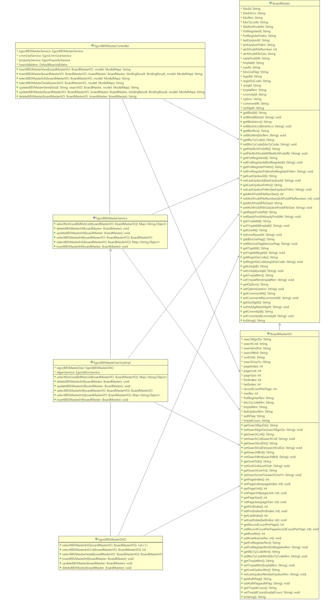
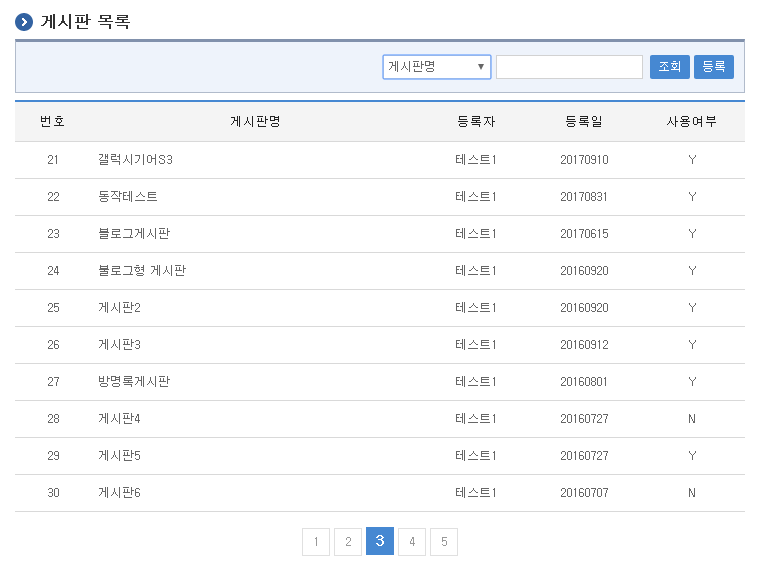
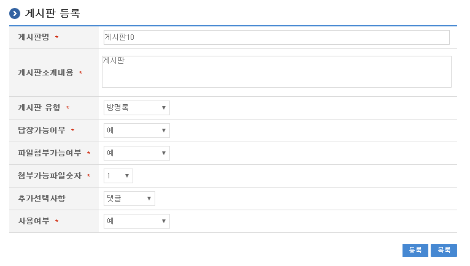
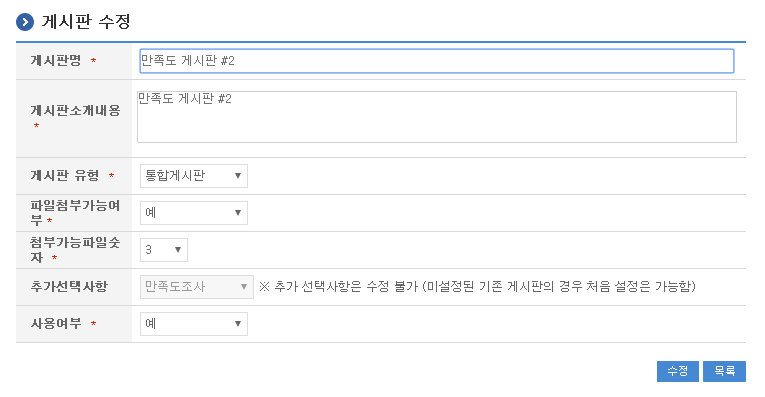

# 게시판 관리

## 개요

게시판 생성 관리 컴포넌트는 통합 게시판, 방명록 등의 게시판을 생성하고 등록된 게시판들에 대하여 관련된 속성 정보를 관리할 수 있는 기능을 제공한다.

## 설명

게시판을 생성할 수 있는 위치는 크게 두 군데(시스템, 동호회/커뮤니티)로 나뉘며 시스템에서 게시판을 생성한 경우 해당 게시판은 시스템의 모든 사용자가 활용할 수 있는 게시판이 된다. 커뮤니티에서 게시판을 생성할 경우, 커뮤니티ID가 연결되어 해당 커뮤니티에서만 사용할 수 있다.

### 패키지 참조 관계

게시판 패키지는 요소기술의 공통 패키지(cmm)에 대해서 직접적인 함수적 참조 관계를 가진다. 하지만, 컴포넌트 배포 시 오류 없이 실행되기 위하여 패키지 간의 참조 관계에 따라 협업의 공통기능(com), 디자인 템플릿과 함께 배포 파일을 구성한다.

- 패키지 간 참조 관계 : [게시판, 커뮤니티, 동호회 Package Dependency](../intro/package-reference.md/#협업)

### 관련 소스

| 유형 | 대상소스 | 비고 |
| --- | --- | --- |
| Controller | egovframework.com.cop.bbs.EgovBBSMasterController.java | 게시판 관리를 위한 컨트롤러 클래스 |
| Service | egovframework.com.cop.bbs.service.EgovBBSMasterService.java | 게시판 관리를 위한 서비스 인터페이스 |
| ServiceImpl | egovframework.com.cop.bbs.service.impl.EgovBBSMasterServiceImpl.java | 게시판 관리를 위한 서비스 구현 클래스 |
| Model | egovframework.com.cop.bbs.service.BoardMaster.java | 게시판 관리를 위한 모델 클래스 |
| Model | egovframework.com.cop.bbs.service.Board.java | 게시판 관리를 위한 모델 클래스 |
| VO | egovframework.com.cop.bbs.service.BoardMasterVO.java | 게시판 관리를 위한 VO 클래스 |
| VO | egovframework.com.cop.bbs.service.BoardVO.java | 게시판 관리를 위한 VO 클래스 |
| DAO | egovframework.com.cop.bbs.service.impl.EgovBBSMasterDAO.java | 게시판 관리를 위한 데이터처리 클래스 |
| JSP | /WEB-INF/jsp/egovframework/com/cop/bbs/EgovBBSMasterRegist.jsp | 게시판 생성을 위한 jsp 페이지 |
| JSP | /WEB-INF/jsp/egovframework/com/cop/bbs/EgovBBSMasterUpdt.jsp | 생성된 게시판 수정을 위한 jsp 페이지 |
| JSP | /WEB-INF/jsp/egovframework/com/cop/bbs/EgovBBSMasterList.jsp | 생성된 게시판 조회를 위한 jsp 페이지 |
| Query XML | resources/egovframework/mapper/com/cop/bbs/EgovBBSMaster_SQL_mysql.xml | 게시판 관리를 위한 MySQL용 Query XML |
| Query XML | resources/egovframework/mapper/com/cop/bbs/EgovBBSMaster_SQL_cubrid.xml | 게시판 관리를 위한 Cubrid용 Query XML |
| Query XML | resources/egovframework/mapper/com/cop/bbs/EgovBBSMaster_SQL_oracle.xml | 게시판 관리를 위한 Oracle용 Query XML |
| Query XML | resources/egovframework/mapper/com/cop/bbs/EgovBBSMaster_SQL_tibero.xml | 게시판 관리를 위한 Tibero용 Query XML |
| Query XML | resources/egovframework/mapper/com/cop/bbs/EgovBBSMaster_SQL_altibase.xml | 게시판 관리를 위한 Altibase용 Query XML |
| Query XML | resources/egovframework/mapper/com/cop/bbs/EgovBBSMaster_SQL_maria.xml | 게시판 관리를 위한 MariaDB용 Query XML |
| Query XML | resources/egovframework/mapper/com/cop/bbs/EgovBBSMaster_SQL_postgres.xml | 게시판 관리를 위한 PostgreSQL용 Query XML |
| Query XML | resources/egovframework/mapper/com/cop/bbs/EgovBBSMaster_SQL_goldilocks.xml | 게시판 관리를 위한 Goldilocks용 Query XML |
| Validator XML | resources/egovframework/validator/com/cop/bbs/EgovBBSMasterRegist.xml | 게시판 관리를위한 Validator XML |
| Message properties | resources/egovframework/message/com/cop/bbs/message_ko.properties | 게시판 관리를 위한 Message properties(한글) |
| Message properties | resources/egovframework/message/com/cop/bbs/message_en.properties | 게시판 관리를 위한 Message properties(영문) |
| Idgen XML | resources/egovframework/spring/com/idgn/context-idgn-bbs.xml | 게시판 관리를 위한 Id생성 Idgen XML |

### 클래스 다이어그램



### ID Generation

#### ID Generation 관련 DDL 및 DML

ID Generation Service를 활용하기 위해서 Sequence 저장 테이블인 COMTECOPSEQ에 BBS_ID 항목을 추가해야 한다.

```sql
CREATE TABLE COMTECOPSEQ(
	      TABLE_NAME            VARCHAR(20) NOT NULL,
	      NEXT_ID               NUMERIC(30) NULL,
	      PRIMARY KEY (TABLE_NAME));
 
INSERT INTO COMTECOPSEQ ( TABLE_NAME, NEXT_ID ) VALUES ('BBS_ID', 1);
```

#### ID Generation 환경 설정(context-idgn-bbs.xml)

```xml
<bean name="egovBBSMstrIdGnrService"
        class="org.egovframe.rte.fdl.idgnr.impl.EgovTableIdGnrServiceImpl"
        destroy-method="destroy">
        <property name="dataSource" ref="egov.dataSource" />
        <property name="strategy" ref="bbsMstrStrategy" />
        <property name="blockSize" 	value="10"/>
        <property name="table"	   	value="COMTECOPSEQ"/>
        <property name="tableName"	value="BBS_ID"/>
</bean>
<bean name="bbsMstrStrategy"
		    class="org.egovframe.rte.fdl.idgnr.impl.strategy.EgovIdGnrStrategyImpl">
        <property name="prefix" value="BBSMSTR_" />
        <property name="cipers" value="12" />
        <property name="fillChar" value="0" />
</bean>
```

### 관련 테이블

| 테이블명 | 테이블명(영문) | 비고 |
| --- | --- | --- |
| 게시판속성 | COMTNBBSMASTER | 게시판의 속성정보를 관리한다. |
| 코드정보 | COMTCCMMNDETAILCODE | 코드 정보를 관리한다. |

### 관련코드

| 코드분류 | 코드분류명 | 코드ID | 코드명 |
| --- | --- | --- | --- | --- |
| COM101 | 게시판유형 | BBST01 | 통합게시판 |
| COM101 | 게시판유형 | BBST02 | 블로그형게시판 |
| COM101 | 게시판유형 | BBST03 | 방명록 |

### 게시판 속성

| 게시판유형 | 설명 | 비고 |
| --- | --- | --- |
| 통합게시판 | 일반적으로 사용되는 통합 게시판 | |
| 블로그형게시판 | 블로그 형태의 디자인을 채택한 게시판 | |
| 방명록 | 방명록 형태의 게시판 | |

## 관련 기능

게시판 생성 관리, 공지사항 관리, 유효 게시판, 익명 게시판, 자료실 관리는 게시판 목록 조회, 게시판 생성, 게시판 수정, 템플릿 조회 팝업 기능으로 구분되어 있다.

### 게시판 목록 조회

#### 비즈니스 규칙

신규 게시판을 생성하기 위해서는 상단의 등록 버튼을 통해서 게시판 생성 화면으로 이동하고 기존 게시판의 속성정보를 수정하고자 하는 경우 해당 게시판 명을 클릭하여 상세 조회 및 수정기능을 제공하는 게시판 수정 화면으로 이동한다.

#### 관련 코드

N/A

#### 관련화면 및 수행매뉴얼

| Action | URL | Controller method | SQL Namespace | SQL QueryID |
| --- | --- | --- | --- | --- |
| 목록조회 | /cop/bbs/selectBBSMasterInfs.do | selectBBSMasterInfs | “BBSMaster” | “selectBBSMasterList” |
| | | | “BBSMaster” | “selectBBSMasterListTotCnt” |

게시판 목록은 페이지 당 10건씩 조회되며 페이징은 10페이지씩 이루어진다.

검색 조건은 게시판명, 게시판 유형에 대해서 수행된다. 페이지 당 검색 범위를 변경하고자 하는 경우 context-properties.xml 파일의 pageUnit, pageSize를 변경한다.(단 해당 설정은 전체 공통서비스 기능에 영향을 미친다.)



조회: 조회하기 위해서는 상단의 검색 조건을 선택 후 해당하는 검색문자를 입력 후 조회 버튼을 클릭한다.

등록: 등록하기 위해서는 상단의 등록 버튼을 통해서 게시판 생성 화면으로 이동한다.

목록클릭: 게시판 상세 조회 화면으로 이동한다.

### 게시판 생성

#### 비즈니스 규칙

게시판의 속성 정보를 입력한 뒤 게시판을 생성한다. 생성이 성공적으로 종료되면 게시판 목록 조회 화면으로 이동한다.

게시판을 생성함에 있어서 파일 첨부가 불가능하다고 선택한 경우에도 첨부 가능 파일 숫자를 세팅이 가능한데 이는 실제 공통 서비스 기능을 사용할 곳에서 관련 비즈니스 규칙에 따라서 화면의 제어를 하는 것을 권장하고 있기 때문이다. 실제 공통 서비스의 기능에서 입력 오류 등을 내는 부분이 아닌 경우에 대해서까지 강제적인 제어를 하는 부분은 드물게 구성되어있다.

추가선택사항으로 댓글, 만족도 조사가 있으며, 선택하지 않을 수 있다.

#### 관련 코드

N/A

#### 관련 화면 및 수행 매뉴얼

| Action | URL | Controller method | SQL Namespace | SQL QueryID |
| --- | --- | --- | --- | --- |
| 등록화면 | /cop/bbs/insertBBSMasterView.do | insertBBSMasterView | | |
| 등록 | /cop/bbs/insertBBSMaster.do | insertBBSMaster | “BBSMaster” | “insertBBSMaster” |



목록: 게시판 목록 화면으로 이동한다.

등록: 입력한 게시판 정보들이 저장 처리된다.

### 게시판 수정

#### 비즈니스 규칙

게시판의 속성 정보중 변경이 가능한 정보를 입력한 뒤 수정 버튼을 누르면 게시판의 속성 정보를 변경하며 변경이 성공적으로 종료되면 게시판 목록 조회 화면으로 이동한다.

사용여부를 '아니오'로 선택 후 수정 버튼을 누르는 경우 해당 게시판은 더 이상 활용이 불가능한 상태가 되며(물리적인 삭제는 되지 않음) 삭제 작업이 성공적으로 종료되면 게시판 목록 조회 화면으로 이동한다.

#### 관련 코드

N/A

#### 관련 화면 및 수행 매뉴얼

| Action | URL | Controller method | SQL Namespace | SQL QueryID |
| --- | --- | --- | --- | --- |
| 수정화면 | /cop/bbs/updateBBSMasterView.do | updateBBSMasterView | “BBSMaster” | “selectBBSMasterDetail” |
| 수정 | /cop/bbs/updateBBSMaster.do | updateBBSMaster | “BBSMaster” | “updateBBSMaster” |



수정: 수정된 정보들이 저장 처리된다.

목록: 게시판 목록 화면으로 이동한다.
