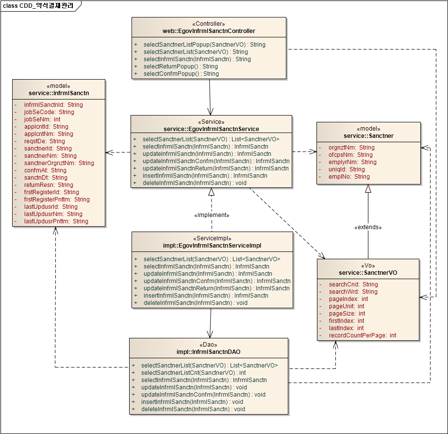

# 약식결재

## 개요

 약식결재는 약식결재 정보를 관리하는 기능을 제공한다.

## 설명

 약식결재는 약식결재 정보를 관리하기 위한 목적으로 약식결재 정보의 등록, 삭제, 조회, 승인, 반려의 기능을 수반한다.

```text
  ① 약식결재등록 : 약식결재정보를 지정하고, 등록 결과를 조회한다.
  ② 약식결재삭제 : 기 등록된 약식결재정보를 삭제한다.
  ③ 약식결재상세조회 : 등록된 약식결재정보를 조회한다. 
  ④ 약식결재승인 : 등록된 약식결재정보를 승인한다. 
  ⑤ 약식결재반려 : 등록된 약식결재정보를 반려한다.
```

### 관련소스

| 유형 | 대상소스명 | 비고 |
| --- | --- | --- |
| Controller | egovframework.com.uss.ion.ism.web.EgovInfrmlSanctnController.java | 약식결재를 위한 controller 클래스 |
| Service | egovframework.com.uss.ion.ism.service.EgovInfrmlSanctnService.java | 약식결재를 위한 Service Interface |
| ServiceImpl | egovframework.com.uss.ion.ism.service.impl.EgovInfrmlSanctnServiceImpl.java | 약식결재를 위한 서비스 구현 클래스 |
| DAO | egovframework.com.uss.ion.ism.service.impl.InfrmlSanctnDAO.java | 약식결재를 위한 데이터처리 클래스 |
| Model | egovframework.com.uss.ion.ism.service.Sanctner.java | 결재자 관리를 위한 Model 클래스 |
| Model | egovframework.com.uss.ion.ism.service.InfrmlSanctn.java | 약식결재를 위한 Model 클래스 |
| VO | egovframework.com.uss.ion.ism.service.SanctnerVO.java | 보고자 관리를 위한 VO 클래스 |
| JSP | /WEB-INF/jsp/egovframework/com/uss/ion/ism/EgovSanctnerList.jsp | 결재자 목록조회를 위한 jsp페이지 |
| JSP | /WEB-INF/jsp/egovframework/com/uss/ion/ism/EgovSanctnerListPopup.jsp | 결재자 팝업 목록조회를 위한 jsp페이지 |
| JSP | /WEB-INF/jsp/egovframework/com/uss/ion/ism/EgovConfmPopup.jsp | 약식결재 승인을 위한 jsp페이지 |
| JSP | /WEB-INF/jsp/egovframework/com/uss/ion/ism/EgovReturnPopup.jsp | 약식결재 반려를 위한 jsp페이지 |
| JSP | /WEB-INF/jsp/egovframework/com/uss/ion/ism/EgovInfrmlSanctnRegist.jsp | 약식결재 지정를 위한 jsp페이지 |
| JSP | /WEB-INF/jsp/egovframework/com/uss/ion/ism/EgovInfrmlSanctnDetail.jsp | 등록된 약식결재를 조회하기 위한 jsp페이지 |
| Query XML | resources/egovframework/mapper/com/uss/ion/ism/EgovInfrmlSanctn\_SQL\_altibase.xml | 약식결재 Altibase XML |
| Query XML | resources/egovframework/mapper/com/uss/ion/ism/EgovInfrmlSanctn\_SQL\_cubrid.xml | 약식결재 Cubrid XML |
| Query XML | resources/egovframework/mapper/com/uss/ion/ism/EgovInfrmlSanctn\_SQL\_mysql.xml | 약식결재 MySQL XML |
| Query XML | resources/egovframework/mapper/com/uss/ion/ism/EgovInfrmlSanctn\_SQL\_maria.xml | 약식결재 MariaDB XML |
| Query XML | resources/egovframework/mapper/com/uss/ion/ism/EgovInfrmlSanctn\_SQL\_tibero.xml | 약식결재 Tibero XML |
| Query XML | resources/egovframework/mapper/com/uss/ion/ism/EgovInfrmlSanctn\_SQL\_postgres.xml | 약식결재 PostgreSQL XML |
| Query XML | resources/egovframework/mapper/com/uss/ion/ism/EgovInfrmlSanctn\_SQL\_oracle.xml | 약식결재 Oracle XML |
| Query XML | resources/egovframework/mapper/com/uss/ion/ism/EgovInfrmlSanctn\_SQL\_goldilocks.xml | 약식결재 Goldilocks XML |
| Idgen XML | resources/egovframework/spring/com/idgn/context-idgn-InfrmlSanctn.xml | 약식결재를 위한 Id생성 Idgen XML |
| Message properties | resources/egovframework/message/com/uss/ion/ism/message\_en.properties | 약식결재를 위한 Message properties(영문) |
| Message properties | resources/egovframework/message/com/uss/ion/ism/message\_ko.properties | 약식결재를 위한 Message properties(한글) |

### 클래스 다이어그램

 

### 관련테이블

| 테이블명 | 테이블명(영문) | 비고 |
| --- | --- | --- |
| 약식결재정보 | COMTNINFRMLSANCTN | 약식결재정보를 관리하기 위한 속성정보를 정의하고, 관리한다. |

#### ID Generation

 ID Generation Service를 활용하기 위해서 Sequence 저장테이블인  COMTECOPSEQ에 INFRML_SANCTN 항목을 추가한다.

```sql
  INSERT INTO COMTECOPSEQ VALUES('INFRML_SANCTN','0');
```

## 사용방법

### ServiceImpl (결재권자 등록/삭제/승인/반려)

 약식결재의 기본 흐름은 해당업무에서 신청(등록)시 결재자를 동시에 등록한다. 그러므로 UI화면에서 결재자를 등록을 필수로 처리해야 한다,
 비즈니스 등록처리 로직에서 약식결재서비스(EgovInfrmlSanctnService)의 결재자등록을 호출하여야 하며, 해당업무와 약식결재의 model VO의 필드를 매핑시켜줘야한다.
 약식결재를 업무에 적용하기 위해서는 ServiceImpl에 아래 로직을 삽입하여 업무상황에 맞도록 수정하여야 한다.
 먼저 약식결재서비스(EgovInfrmlSanctnService)를 import 한다.

```java
import egovframework.com.uss.ion.ism.service.EgovInfrmlSanctnService;
import egovframework.com.uss.ion.ism.service.InfrmlSanctn;
```

```java
	@Resource(name="EgovInfrmlSanctnService")
    protected EgovInfrmlSanctnService infrmlSanctnService;
```

 그리고 아래 EgovInfrmlSanctnService의 Model 항목에 맞춰 Object를 매핑시켜준다.

```text
	/**
	 * Object model을 InfrmlSanctn model로 변환한다.
	 * @param Object
	 * @return InfrmlSanctn
	 * @param object
	 */
	private InfrmlSanctn converToInfrmlSanctnObject(Object object) throws Exception{
		InfrmlSanctn infrmlSanctn = new InfrmlSanctn();
    	infrmlSanctn.setJobSeCode("001");								// 업무구분코드 (공통코드 COM75)
    	infrmlSanctn.setApplcntId(object.getUsid());			      // 사용자ID
    	infrmlSanctn.setReqstDe(object.getReqstDe());				// 신청일자
    	infrmlSanctn.setSanctnerId(object.getSanctnerId());		// 결재자ID
    	infrmlSanctn.setConfmAt(object.getConfmAt());				// 승인구분
    	infrmlSanctn.setSanctnDt(object.getSanctnDt());			   // 결재일시
    	infrmlSanctn.setReturnResn(object.getReturnResn());		// 반려사유
    	infrmlSanctn.setFrstRegisterId(object.getFrstRegisterId()); //최초등록자ID
    	object.setFrstRegisterPnttm(object.getFrstRegisterId());
    	infrmlSanctn.setLastUpdusrId(object.getLastUpdusrId());     //최종수정자ID
    	infrmlSanctn.setLastUpdusrPnttm(object.getLastUpdusrPnttm());
    	infrmlSanctn.setInfrmlSanctnId(object.getInfrmlSanctnId()); // 약식결재ID
    	return infrmlSanctn;
	}
```

 등록 메소드에 아래 로직을 삽입한다.
 등록 시 업무구분코드(공통코드-COM75), 사용자ID, 신청일자, 결재자ID, 최초등록자ID, 최종수정자ID는 필수값이다.
 약식결재메소드에서 처리가 완료되면 약식결재ID, 승인구분 값이 정의된다.

```text
InfrmlSanctn infrmlSanctn = infrmlSanctnService.insertInfrmlSanctn(converToInfrmlSanctnObject(object)); 
object.setInfrmlSanctnId(infrmlSanctn.getInfrmlSanctnId());
object.setConfmAt(infrmlSanctn.getConfmAt());
```

 삭제 메소드에 아래 로직을 삽입한다.
 약식결재ID,신청일자,사용자ID,결재자ID는 필수값이다.

```text
infrmlSanctnService.deleteInfrmlSanctn(converToInfrmlSanctnObject(ctsnnManage));
```

 승인 메소드에 아래 로직을 삽입한다.
 약식결재ID,신청일자,사용자ID,결재자ID,승인구분는 필수값이다.

```properties
infrmlSanctn = infrmlSanctnService.updateInfrmlSanctnConfm(converToInfrmlSanctnObject(ctsnnManage));
```

 반려 메소드에 아래 로직을 삽입한다.
 약식결재ID,신청일자,사용자ID,결재자ID,승인구분는 필수값이다.

```properties
infrmlSanctn = infrmlSanctnService.updateInfrmlSanctnReturn(converToInfrmlSanctnObject(ctsnnManage));
```

### JSP/Script

 지정화면
 지정화면에 아래코드를 삽입한다.

```xml
<jsp:include page="/WEB-INF/jsp/egovframework/com/uss/ion/ism/EgovInfrmlSanctnRegist.jsp" flush="true"/>
```

 수정/상세/승인화면
 수정/상세/승인화면에 아래코드를 삽입한다.
 *object는 해당 업무의 Model VO입니다.

```xml
<jsp:include page="/uss/ion/ism/selectInfrmlSanctn.do" flush="true"> 
<jsp:param name="infrmlSanctnId" value="${object.infrmlSanctnId}"/>
</jsp:include>
```

 승인/반려 화면
 승인(반려)화면에서 승인처리시 약식결재의 승인팝업(반려팝업)을 호출하여 승인사유(반려사유)를 등록 후 해당업무의 승인(반려)처리 프로세스를 처리한다.
 약식 승인화면

```javascript
	function fncPopUpConfm(returnResn,cmd) {
 
		 returnResn = document.targetForm.returnResn.value;
		 cmd = "C"
 
		 var retVal = returnResn+','+cmd;
 
		parent.modalDialogCallback(retVal);		
	}
```

 약식 리턴 화면(경조사관리)

```javascript
	function modalDialogCallback(retVal) {
		if(retVal != null){
 
			debugger; 
 
			var tmp = retVal.split(",");		
 
			var varForm	= document.all["ctsnnManage"];
 
			varForm.returnResn.value = tmp[0];						
 			varForm.confmAt.value = tmp[1]; 
 
		    varForm.action = "<c:url value='/uss/ion/ctn/updtCtsnnConfm.do'/>";
 
			varForm.submit();
		}
	}
```

 약식 결재가 사용되는 컴포넌트는 아래와 같다.
 행사신청관리, 행사접수관리, 포상관리,당직관리,휴가관리,직원경조사관리

## 관련화면 및 수행메뉴얼

### 약식결재권자 지정

| Action | URL | Controller method | QueryID |
| --- | --- | --- | --- |
| 등록 |  | insertInfrmlSanctn | "InfrmlSanctnDAO.insertInfrmlSanctn" |

 약식결재자를 지정한다.

 

### 약식결재 상세조회

| Action | URL | Controller method | QueryID |
| --- | --- | --- | --- |
| 상세조회 | /uss/ion/ism/selectInfrmlSanctn.do | selectInfrmlSanctn | "InfrmlSanctnDAO.selectInfrmlSanctn" |
| 삭제 |  | deleteInfrmlSanctn | "InfrmlSanctnDAO.deleteInfrmlSanctn" |

 약식결재의 속성정보를 조회한다.

 

### 약식결재 승인

| Action | URL | Controller method | QueryID |
| --- | --- | --- | --- |
| 승인 | /uss/ion/ism/EgovConfmPopup.do | selectConfmPopup | "InfrmlSanctnDAO.updateInfrmlSanctnConfm" |

 약식결재의 속성정보를 변경한 후 저장한다.

 

 승인 : 기 등록된 약식결재 속성을 수정한 뒤 상단의 승인 버튼을 통해서 약식결재를 승인한다.
 닫기 : 화면을 닫는다.

### 약식결재 반려

| Action | URL | Controller method | QueryID |
| --- | --- | --- | --- |
| 반려 | /uss/ion/ism/EgovReturnPopup.do | selectReturnPopup | "InfrmlSanctnDAO.updateInfrmlSanctnConfm" |

 약식결재의 속성정보를 변경한 후 저장한다.

 

 반려 : 기 등록된 약식결재 속성을 수정한 뒤 상단의 반려 버튼을 통해서 약식결재를 반려한다.
 닫기 : 화면을 닫는다.
