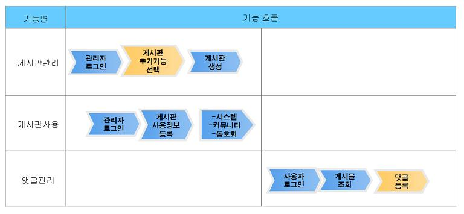
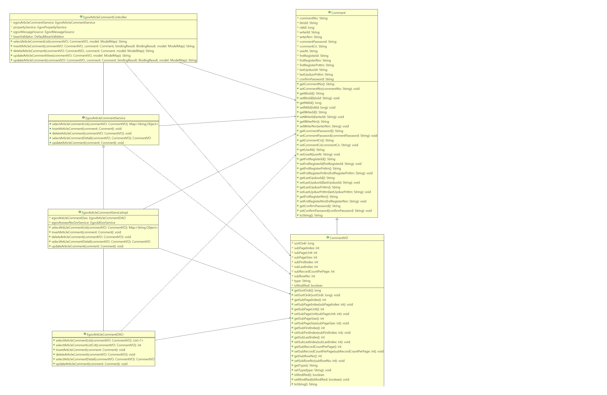
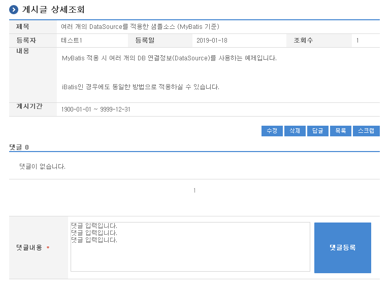
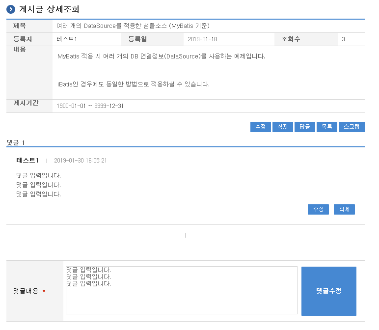

# 댓글관리

## 개요

게시판에 등록된 글에 대하여 댓글을 작성할 수 있는 기능을 제공한다. 댓글관리는 게시판생성관리 기능을 기반으로 운영된다.

- 기능흐름

  

## 설명

댓글이 가능한 게시판을 사용하기 위해서는 게시판관리를 통해 생성된 게시판에 추가 선택사항을 지정하여야 한다.

추가 선택사항은 댓글관리 및 만족도조사가 선택가능하며, 한번 지정이 되면 수정 할 수 없다. 다만, 미설정된 기존 게시판의 경우 처음 설정은 가능하다.

### 패키지 참조 관계

댓글관리 패키지는 요소기술의 공통 패키지(cmm)에 대해서 직접적인 함수적 참조 관계를 가진다. 하지만, 컴포넌트 배포 시 오류 없이 실행되기 위하여 패키지 간의 참조관계에 따라 협업의 공통기능(com), 디자인템플릿과 함께 배포 파일을 구성한다.

- 패키지 간 참조 관계 : [게시판, 커뮤니티, 동호회 Package Dependency](../intro/package-reference.md/#협업)

### 관련소스

| 유형 | 대상소스 | 비고 |
| --- | --- | --- |
| Controller | egovframework.com.cop.cmt.web.EgovArticleCommentController.java | 댓글관리를 위한 컨트롤러 클래스 |
| Service | egovframework.com.cop.cmt.service.EgovArticleCommentService.java | 댓글관리를 위한 서비스 인터페이스 |
| ServiceImpl | egovframework.com.cop.cmt.service.impl.EgovArticleCommentServiceImpl.java | 댓글관리를 위한 서비스 구현 클래스 |
| Model | egovframework.com.cop.bbs.service.Comment.java | 댓글관리를 위한 모델 클래스 |
| VO | egovframework.com.cop.bbs.service.CommentVO.java | 댓글관리를 위한 VO 클래스 |
| DAO | egovframework.com.cop.cmt.service.impl.EgovArticleCommentDAO.java | 댓글관리를 위한 데이터처리 클래스 |
| JSP | /WEB-INF/jsp/egovframework/com/cop/cmt/EgovArticleCommentList.jsp | 댓글관리를 위한 jsp페이지 |
| Query XML | resources/egovframework/mapper/com/cop/cmt/EgovArticleComment_SQL_mysql.xml | 댓글관리를 위한 MySQL용 Query XML 파일 |
| Query XML | resources/egovframework/mapper/com/cop/cmt/EgovArticleComment_SQL_cubrid.xml | 댓글관리를 위한 Cubrid용 Query XML 파일 |
| Query XML | resources/egovframework/mapper/com/cop/cmt/EgovArticleComment_SQL_oracle.xml | 댓글관리를 위한 Oracle용 Query XML 파일 |
| Query XML | resources/egovframework/mapper/com/cop/cmt/EgovArticleComment_SQL_tibero.xml | 댓글관리를 위한 Tibero용 Query XML 파일 |
| Query XML | resources/egovframework/mapper/com/cop/cmt/EgovArticleComment_SQL_altibase.xml | 댓글관리를 위한 Altibase용 Query XML 파일 |
| Query XML | resources/egovframework/mapper/com/cop/cmt/EgovArticleComment_SQL_maria.xml | 댓글관리를 위한 MariaDB용 Query XML 파일 |
| Query XML | resources/egovframework/mapper/com/cop/cmt/EgovArticleComment_SQL_postgres.xml | 댓글관리를 위한 PostgreSQL용 Query XML 파일 |
| Query XML | resources/egovframework/mapper/com/cop/cmt/EgovArticleComment_SQL_goldilocks.xml | 댓글관리를 위한 Goldilocks용 Query XML 파일 |
| Validator XML | resources/egovframework/validator/com/cop/cmt/EgovArticleCommentRegist.xml | 댓글관리를 위한 Validator XML |
| Message properties | resources/egovframework/message/com/cop/cmt/message_ko.properties | 댓글관리를 위한 Message properties(한글) |
| Message properties | resources/egovframework/message/com/cop/cmt/message_en.properties | 댓글관리를 위한 Message properties(영문) |
| Idgen XML | resources/egovframework/spring/com/idgn/context-idgn-AnswerNo.xml | 댓글관리를 위한 Id생성 Idgen XML |

### 클래스 다이어그램



### 관련테이블

| 테이블명 | 테이블명(영문) | 비고 |
| --- | --- | --- |
| 댓글 | COMTNCOMMENT | 댓글 정보를 관리한다. |

### ID Generation

#### ID Generation 관련 DDL 및 DML

ID Generation Service를 활용하기 위해서 Sequence 저장테이블인 COMTECOPSEQ에 ANSWER_NO 항목을 추가해야 한다.

```sql
CREATE TABLE COMTECOPSEQ ( table_name varchar(16) NOT NULL, 
                           next_id DECIMAL(30) NOT NULL,
                           PRIMARY KEY (table_name)
);
 
INSERT INTO COMTECOPSEQ VALUES ('ANSWER_NO','0');
```

#### ID Generation 환경설정(context-idgn-AnswerNo.xml)

```xml
<bean name="egovAnswerNoGnrService" class="egovframework.rte.fdl.idgnr.impl.EgovTableIdGnrServiceImpl" destroy-method="destroy">
    <property name="dataSource" ref="egov.dataSource" />
    <property name="strategy"   ref="answerNoStrategy" />
    <property name="blockSize"  value="10" />
    <property name="table"      value="COMTECOPSEQ" />
    <property name="tableName"  value="ANSWER_NO" />
</bean>
<bean name="answerNoStrategy" class="egovframework.rte.fdl.idgnr.impl.strategy.EgovIdGnrStrategyImpl">
    <property name="cipers"     value="20" />
</bean>
```

## 관련기능

댓글관리는 댓글 목록조회 및 등록, 댓글 수정 및 삭제 기능으로 구분되어 있다.

### 댓글 목록조회 및 등록

#### 비즈니스 규칙

댓글기능이 설정된 게시판의 게시물 목록을 조회한다.

#### 관련코드

N/A

#### 관련화면 및 수행메뉴얼

| Action | URL | Controller method | SQL Namespace | SQL QueryID |
| --- | --- | --- | --- | --- |
| 목록조회 | /cop/cmt/selectArticleCommentList.do | selectArticleCommentList | “ArticleComment” | “selectArticleCommentList” |
| | | | “ArticleComment” | “selectArticleCommentListCnt” |
| 등록 | /cop/cmt/insertArticleComment.do | insertArticleComment | “ArticleComment” | “insertArticleComment” |

댓글 목록은 페이지당 5건씩 조회되며 페이징은 10페이지씩 이루어진다.



댓글등록: 입력한 댓글정보를 저장 처리한다.

### 댓글 수정 및 삭제

#### 비즈니스 규칙

댓글기능이 설정된 게시판의 게시물을 수정 및 삭제할 수 있는 기능을 제공한다.

#### 관련코드

N/A

#### 관련화면 및 수행메뉴얼

| Action | URL | Controller method | SQL Namespace | SQL QueryID |
| --- | --- | --- | --- | --- |
| 수정화면 | /cop/cmt/updateArticleCommentView.do | updateArticleCommentView | “ArticleComment” | “selectArticleCommentDetail” |
| 수정 | /cop/cmt/updateArticleComment.do | updateArticleComment | “ArticleComment” | “updateArticleComment” |
| 삭제 | /cop/cmt/deleteArticleComment.do | deleteArticleComment | “ArticleComment” | “deleteArticleComment” |



댓글수정: 수정된 댓글정보를 저장 처리한다.