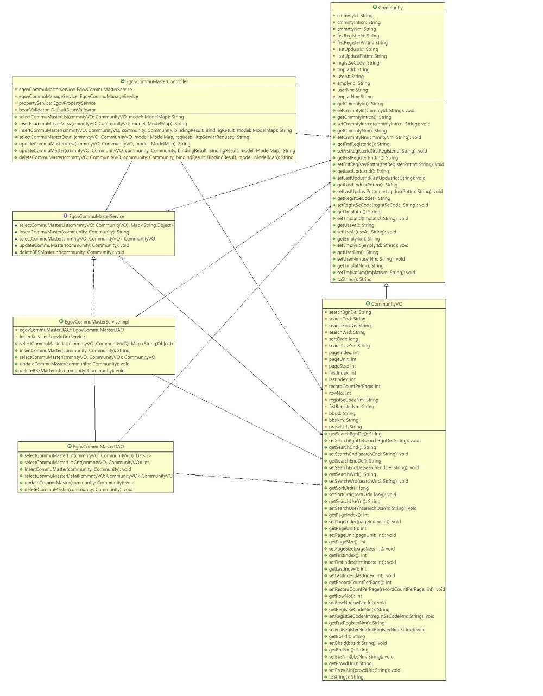
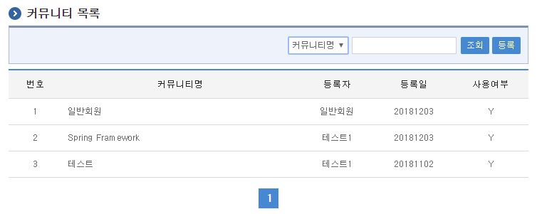
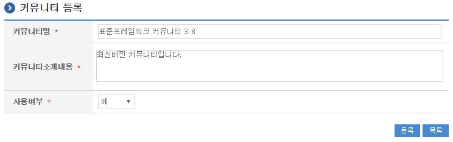
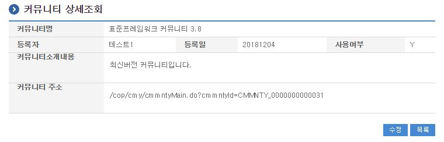
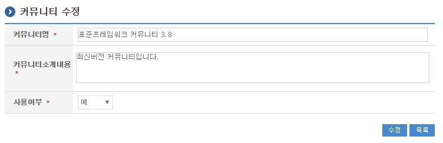

# 커뮤니티생성관리

## 개요

커뮤니티의 관리 컴포넌트는 커뮤니티를 생성하고 등록된 커뮤니티들에 대하여 관련된 속성정보를 관리할 수 있는 기능을 제공한다.

## 설명

커뮤니티에 대한 관리 부분은 별도의 관리 메뉴를 통해 제공된다. 일부 기능은 해당 관리 메뉴를 통해서만 제공되지만, 커뮤니티 자체 관리 기능은 커뮤니티 내에 제공되는 관리 메뉴들로 가능하다.

### 패키지 참조 관계

커뮤니티 패키지는 요소기술의 공통 패키지(cmm), 협업의 공통기능(com) 패키지, 게시판 패키지, 블로그 패키지에 대해서 직접적인 함수적 참조 관계를 가진다. 하지만, 컴포넌트 배포 시 오류 없이 실행되기 위하여 패키지 간의 참조관계에 따라 배포 파일을 구성한다.

- 패키지 간 참조 관계 : [게시판, 커뮤니티(동호회), 블로그 Package Dependency](../intro/package-reference.md)

### 관련소스

| 유형 | 대상소스 | 비고 |
| --- | --- | --- |
| Controller | egovframework.com.cop.cmy.web.EgovCommuMasterController.java | 커뮤니티 관리를 위한 컨트롤러 클래스 |
| Service | egovframework.com.cop.cmy.service.EgovCommuMasterService.java | 커뮤니티 관리를 위한 서비스 인터페이스 |
| ServiceImpl | egovframework.com.cop.cmy.service.impl.EgovCommuMasterServiceImpl.java | 커뮤니티 관리를 위한 서비스 구현 클래스 |
| Model | egovframework.com.cop.cmy.service.Community.java | 커뮤니티 관리를 위한 모델 클래스 |
| VO | egovframework.com.cop.cmy.service.CommunityVO.java | 커뮤니티 관리를 위한 VO 클래스 |
| DAO | egovframework.com.cop.cmy.service.impl.EgovCommuMasterDAO.java | 커뮤니티 관리를 위한 데이터처리 클래스 |
| JSP | /WEB-INF/jsp/egovframework/com/cop/cmy/EgovCommuMasterList.jsp | 커뮤니티 조회를 위한 jsp페이지 |
| JSP | /WEB-INF/jsp/egovframework/com/cop/cmy/EgovCommuMasterRegist.jsp | 커뮤니티 생성을 위한 등록 jsp페이지 |
| JSP | /WEB-INF/jsp/egovframework/com/cop/cmy/EgovCommuMasterUpdt.jsp | 커뮤니티 정보 수정을 위한 jsp페이지 |
| JSP | /WEB-INF/jsp/egovframework/com/cop/cmy/EgovCommuMasterDetail.jsp | 커뮤니티 상세정보 조회를 위한 jsp페이지 |
| JSP | /WEB-INF/jsp/egovframework/com/cop/cmy/EgovCommuMasterListPortlet.jsp | 포털(예제) 메인화면 목록 조회를 위한 jsp 페이지 |
| Query XML | resources/egovframework/sqlmap/com/cop/cmy/EgovCommuMaster_SQL_mysql.xml | 커뮤니티 관리를 위한 MySQL용 Query |
| Query XML | resources/egovframework/sqlmap/com/cop/cmy/EgovCommuMaster_SQL_cubrid.xml | 커뮤니티 관리를 위한 Cubrid용 Query |
| Query XML | resources/egovframework/sqlmap/com/cop/cmy/EgovCommuMaster_SQL_oracle.xml | 커뮤니티 관리를 위한 Oracle용 Query |
| Query XML | resources/egovframework/sqlmap/com/cop/cmy/EgovCommuMaster_SQL_tibero.xml | 커뮤니티 관리를 위한 Tibero용 Query |
| Query XML | resources/egovframework/sqlmap/com/cop/cmy/EgovCommuMaster_SQL_altibase.xml | 커뮤니티 관리를 위한 Altibase용 Query |
| Query XML | resources/egovframework/sqlmap/com/cop/cmy/EgovCommuMaster_SQL_postgres.xml | 커뮤니티 관리를 위한 Postgres용 Query |
| Query XML | resources/egovframework/sqlmap/com/cop/cmy/EgovCommuMaster_SQL_maria.xml | 커뮤니티 관리를 위한 Maria용 Query |
| Query XML | resources/egovframework/sqlmap/com/cop/cmy/EgovCommuMaster_SQL_goldilocks.xml | 커뮤니티 관리를 위한 Goldilocks용 Query |
| Validator XML | resources/egovframework/validator/com/cop/cmy/EgovCommuMasterRegist.xml | 커뮤니티 관리를위한 Validator XML |
| Message properties | resources/egovframework/message/com/cop/cmy/message_ko.properties | 커뮤니티 관리를 위한 Message properties(한글) |
| Message properties | resources/egovframework/message/com/cop/cmy/message_en.properties | 커뮤니티 관리를 위한 Message properties(영문) |
| Idgen XML | resources/egovframework/spring/com/idgn/context-idgn-Cmmnty.xml | 커뮤니티 관리를 위한 Id생성 Idgen XML |

### 클래스 다이어그램



### ID Generation

#### ID Generation 관련 DDL 및 DML

ID Generation Service를 활용하기 위해서 Sequence 저장테이블인 COMTECOPSEQ에 CMMNTY_ID 항목을 추가해야 한다.

```sql
CREATE TABLE COMTECOPSEQ ( table_name varchar(20) NOT NULL, 
  		                     next_id NUMERIC(30) NULL,
  		                     PRIMARY KEY (table_name));
 
INSERT INTO COMTECOPSEQ VALUES('CMMNTY_ID',1);
```

#### ID Generation 환경설정(context-idgn-Cmmnty.xml)

```xml
<bean name="egovCmmntyIdGnrService" class="egovframework.rte.fdl.idgnr.impl.EgovTableIdGnrServiceImpl" destroy-method="destroy">
    <property name="dataSource" ref="egov.dataSource" />
    <property name="strategy"   ref="cmmntyStrategy" />
    <property name="blockSize"  value="10"/>
    <property name="table"      value="COMTECOPSEQ"/>
    <property name="tableName"  value="CMMNTY_ID"/>
</bean>
<bean name="cmmntyStrategy" class="egovframework.rte.fdl.idgnr.impl.strategy.EgovIdGnrStrategyImpl">
    <property name="prefix"   value="CMMNTY_" />
    <property name="cipers"   value="13" />
    <property name="fillChar" value="0" />
</bean>
```

### 관련테이블

| 테이블명 | 테이블명(영문) | 비고 |
| --- | --- | --- |
| 커뮤니티속성 | COMTNCMMNTY | 커뮤니티의 속성정보를 관리한다. |

## 관련기능

커뮤니티생성관리는 커뮤니티 목록조회, 커뮤니티 생성, 커뮤니티 상세조회, 커뮤니티 수정, 템플릿 조회 팝업, 사용자 조회 팝업 기능으로 구분되어 있다.

### 커뮤니티 목록조회

#### 비즈니스 규칙

커뮤니티 목록을 조회하는 기능으로 검색조건은 커뮤니티명 대해서 수행된다. 커뮤니티 목록은 페이지 당 10건씩 조회되며 페이징은 10페이지씩 이루어진다.

#### 관련코드

N/A

#### 관련화면 및 수행매뉴얼

| Action | URL | Controller method | SQL Namespace | SQL QueryID |
| --- | --- | --- | --- | --- |
| 목록조회 | /cop/cmy/selectCommuMasterList.do | selectCommuMasterList | “CommuMaster” | “selectCommuMasterList” |
| | | | “CommuMaster” | “selectCommuMasterListCnt” |

페이지 당 검색 범위를 변경하고자 하는 경우 context-properties.xml 파일의 pageUnit, pageSize를 변경한다.(단 해당 설정은 전체 공통서비스 기능에 영향을 미친다.)



등록: 신규 커뮤니티를 생성하기 위해서는 상단의 등록 버튼을 통해서 커뮤니티 생성 화면으로 이동한다.

목록클릭: 해당 커뮤니티 명을 클릭하여 상세 조회를 제공하는 커뮤니티 상세조회 화면으로 이동한다.

### 커뮤니티 생성

#### 비즈니스 규칙

커뮤니티의 속성정보를 입력한 뒤 커뮤니티을 생성한다. 생성이 성공적으로 종료되면 커뮤니티 목록조회 화면으로 이동한다.

커뮤니티 생성 시 템플릿은 템플릿 조회 팝업 화면을 통해 선택해야 한다. 커뮤니티 관리자 또한 사용자 조회 팝업 화면을 통해 지정해야 한다.

#### 관련코드

N/A

#### 관련화면 및 수행매뉴얼

| Action | URL | Controller method | SQL Namespace | SQL QueryID |
| --- | --- | --- | --- | --- |
| 등록화면 | /cop/cmy/insertCommuMasterView.do | insertCommuMasterView | | |
| 등록 | /cop/cmy/insertCommuMaster.do | insertCommuMaster | “CommuMaster” | “insertCommuMaster” |



등록: 입력된 커뮤니티 정보를 저장 처리한다.

목록: 커뮤니티 목록 화면으로 이동한다.

### 커뮤니티 상세조회

#### 비즈니스 규칙

커뮤니티 목록을 클릭하여 해당 커뮤니티 정보를 상세조회하는 페이지로 이동한다.

#### 관련코드

N/A

#### 관련화면 및 수행매뉴얼

| Action | URL | Controller method | SQL Namespace | SQL QueryID |
| --- | --- | --- | --- | --- |
| 상세조회 | /cop/cmy/selectCommuMasterDetail.do | selectCommuMasterDetail | “CommuMaster” | “selectCommuMasterDetail” |



수정: 커뮤니티의 속성정보를 변경하고자 하는 경우 수정 버튼을 선택한다.

목록: 목록을 다시 조회하고자 하는 경우는 목록 버튼을 선택한다.

### 커뮤니티 수정

#### 비즈니스 규칙

커뮤니티의 속성정보중 변경이 가능한 정보를 입력한 뒤 수정 버튼을 누르면 커뮤니티의 속성정보를 변경하며, 변경이 성공적으로 종료되면 커뮤니티 목록조회 화면으로 이동한다.

#### 관련코드

N/A

#### 관련화면 및 수행매뉴얼

| Action | URL | Controller method | SQL Namespace | SQL QueryID |
| --- | --- | --- | --- | --- |
| 수정화면 | /cop/cmy/updateCommuMasterView.do | updateCommuMasterView | “CommuMaster” | “selectCommuMasterDetail” |
| 수정 | /cop/cmy/updateCommuMaster.do | updateCommuMaster | “CommuMaster” | “updateCommuMaster” |



수정: 입력한 커뮤니티 정보를 저장 처리한다.

목록: 목록을 다시 조회하고자 하는 경우는 목록 버튼을 선택한다.