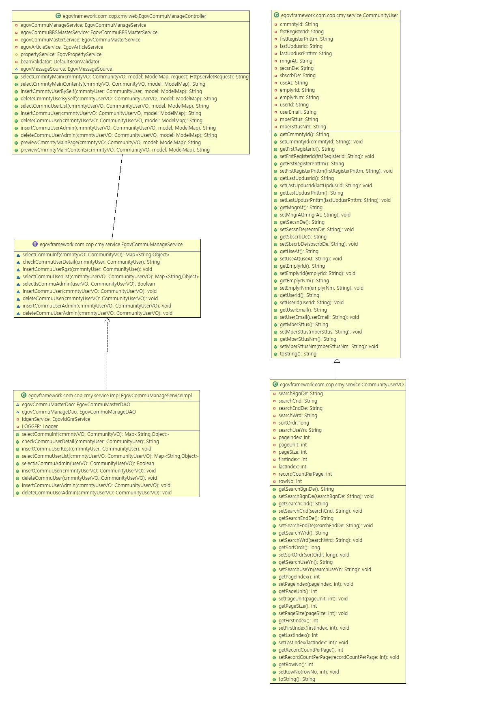
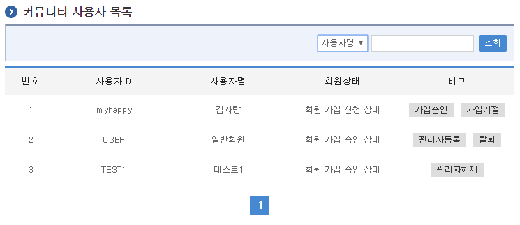

# 커뮤니티회원관리

## 개요

커뮤니티의 회원관리는 커뮤니티 사용자의 신청, 승인, 탈퇴 등 커뮤니티 회원을 관리할 수 있는 기능을 제공한다.

## 설명

### 패키지 참조 관계

커뮤니티 패키지는 요소기술의 공통 패키지(cmm)와 포맷/계산/변환 패키지, 협업의 공통기능(com) 패키지, 게시판 패키지, 블로그 패키지에 대해서 직접적인 함수적 참조 관계를 가진다. 하지만, 컴포넌트 배포 시 오류 없이 실행되기 위하여 패키지 간의 참조관계에 따라 디자인템플릿, 시스템(sim), 달력 패키지와 함께 배포 파일을 구성한다.

- 패키지 간 참조 관계 : [게시판, 커뮤니티, 블로그 Package Dependency](../intro/package-reference.md)

### 관련소스

#### 커뮤니티 사용자관리 및 승인관리

| 유형 | 대상소스 | 비고 |
| --- | --- | --- |
| Controller | egovframework.com.cop.cmy.EgovCommuManageController.java | 커뮤니티 사용자 및 승인정보 관리를 위한 컨트롤러 클래스 |
| Service | egovframework.com.cop.cmy.service.EgovCommuManageService.java | 커뮤니티 사용자 및 승인정보를 관리하기 위한 서비스 클래스 |
| ServiceImpl | egovframework.com.cop.cmy.service.impl.EgovCommuManageServiceImpl.java | 커뮤니티 사용자 및 승인정보를 관리하기 위한 서비스 구현 클래스 |
| Model | egovframework.com.cop.cmy.service.CommunityUserVO.java | 커뮤니티 사용자 및 승인정보를 관리하기 위한 모델 클래스 |
| DAO | egovframework.com.cop.cmy.service.impl.EgovCommuManageDAO.java | 커뮤니티 사용자 및 승인정보 관리를 위한 데이터 접근 클래스 |
| JSP | /WEB-INF/jsp/egovframework/com/cop/com/EgovCommuUserList.jsp | 커뮤니티 사용자 및 승인 목록 jsp페이지 |
| Query XML | resources/egovframework/mapper/com/cop/cmy/EgovCommuManage_SQL_mysql.xml | 커뮤니티 사용자 및 승인정보 관리를 위한 MySQL용 Query XML |
| Query XML | resources/egovframework/mapper/com/cop/cmy/EgovCommuManage_SQL_oracle.xml | 커뮤니티 사용자 및 승인정보 관리를 위한 Oracle용 Query XML |
| Query XML | resources/egovframework/mapper/com/cop/cmy/EgovCommuManage_SQL_tibero.xml | 커뮤니티 사용자 및 승인정보 관리를 위한 Tibero용 Query XML |
| Query XML | resources/egovframework/mapper/com/cop/cmy/EgovCommuManage_SQL_altibase.xml | 커뮤니티 사용자 및 승인정보 관리를 위한 Altibase용 Query XML |
| Query XML | resources/egovframework/mapper/com/cop/cmy/EgovCommuManage_SQL_cubrid.xml | 커뮤니티 사용자 및 승인정보 관리를 위한 Cubrid용 Query XML |
| Query XML | resources/egovframework/mapper/com/cop/cmy/EgovCommuManage_SQL_maria.xml | 커뮤니티 사용자 및 승인정보 관리를 위한 Maria용 Query XML |
| Query XML | resources/egovframework/mapper/com/cop/cmy/EgovCommuManage_SQL_postgres.xml | 커뮤니티 사용자 및 승인정보 관리를 위한 Postgres용 Query XML |
| Query XML | resources/egovframework/mapper/com/cop/cmy/EgovCommuManage_SQL_goldilocks.xml | 커뮤니티 사용자 및 승인정보 관리를 위한 Goldilocks용 Query XML |

### 클래스 다이어그램

#### 커뮤니티 사용자관리

### 관련테이블

| 테이블명 | 테이블명(영문) | 비고 |
| --- | --- | --- |
| 커뮤니티 승인 | COMTHCONFMHISTORY | 커뮤니티의 승인정보를 관리한다. |
| 커뮤니티사용자 | COMTNCMMNTYUSER | 커뮤니티 사용자의 정보를 관리한다. |

## 관련기능

### 커뮤니티 사용자관리 목록조회

#### 비즈니스 규칙

커뮤니티 관리자 메뉴에 해당되는 사용자관리는 해당 커뮤니티에 소속된 사용자를 관리할 수 있으며 사용자별로 처리할 수 있는 이벤트는 탈퇴처리, 운영진등록, 재가입이 가능하다.

검색조건은 사용자명 대해서 수행된다. 사용자 목록은 페이지 당 10건씩 조회되며 페이징은 10페이지씩 이루어진다.

#### 관련코드

N/A

#### 관련화면 및 수행매뉴얼

| Action | URL | Controller method | QueryID |
| --- | --- | --- | --- |
| 목록조회 | /cop/cmy/selectCommuUserList.do | selectCommuUserList | “CommuManage.selectCommuUserList”, |
| | | | “CommuManage.selectCommuUserListCnt” |

페이지 당 검색 범위를 변경하고자 하는 경우 context-properties.xml 파일의 pageUnit, pageSize를 변경한다.(단 해당 설정은 전체 공통서비스 기능에 영향을 미친다.)

조회: 조회하기 위해서는 상단의 검색조건을 선택 후 해당하는 검색문자를 입력 후 조회 버튼을 클릭한다.

## 참고자료

커뮤니티 생성관리 참조 : [커뮤니티 생성관리](/common-component/collaboration/community-creation.md)