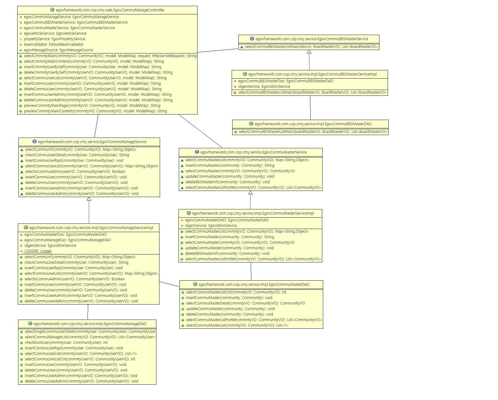
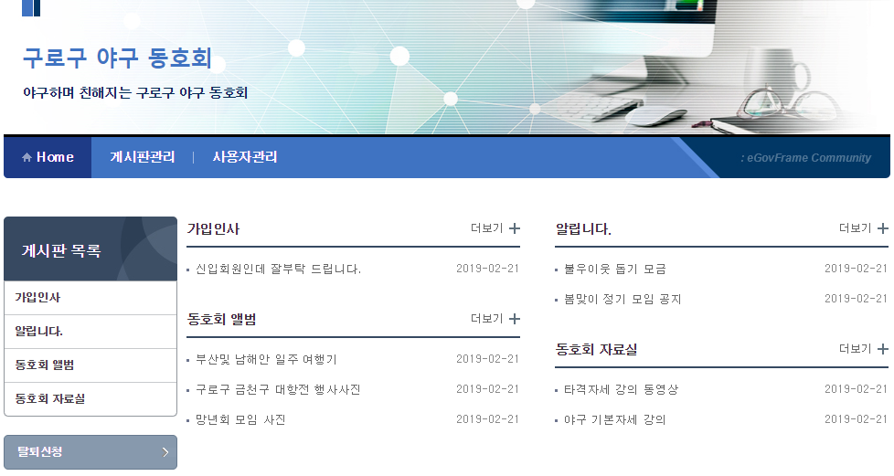
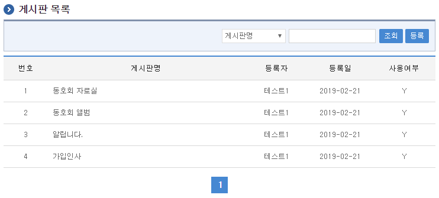
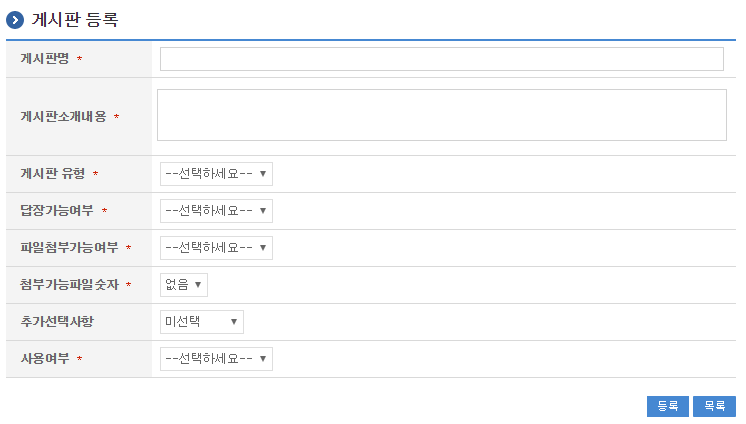
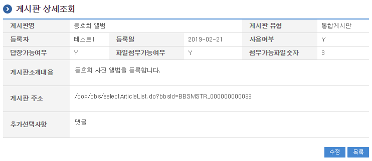
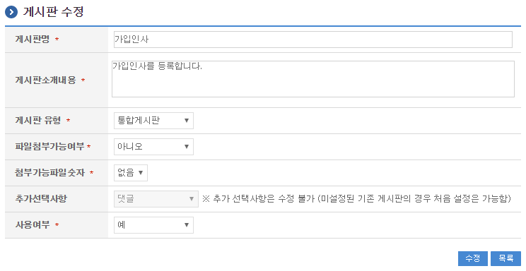

# 커뮤니티사용관리

## 개요

커뮤니티 메인화면 구성과 커뮤니티 게시판 관리 기능을 통해 커뮤니티 기능을 제공한다.

## 설명

커뮤니티 컴포넌트는 협업의 게시판기능과 메인화면 구성을 통해 커뮤니티 서비스를 제공한다.

### 패키지 참조 관계

커뮤니티 패키지는 요소기술의 공통 패키지(cmm)와 포맷/계산/변환 패키지, 협업의 공통기능(com) 패키지, 게시판 패키지에 대해서 직접적인 함수적 참조 관계를 가진다. 하지만, 컴포넌트 배포 시 오류 없이 실행되기 위하여 패키지 간의 참조관계에 따라 디자인템플릿, 시스템(sim), 달력 패키지와 함께 배포 파일을 구성한다.

- 패키지 간 참조 관계 : [게시판, 커뮤니티(동호회), 블로그 Package Dependency](../intro/package-reference.md)

### 관련소스

#### 커뮤니티 게시판 사용

| 유형 | 대상소스 | 비고 |
| --- | --- | --- |
| Controller | egovframework.com.cop.cmy.web.EgovCommuManageController.java | 커뮤니티 메인을 위한 컨트롤러 클래스 |
| Service | egovframework.com.cop.cmy.service.EgovCommuMasterService.java | 커뮤니티 관리를 위한 서비스 인터페이스 |
| ServiceImpl | egovframework.com.cop.cmy.service.impl.EgovCommuMasterServiceImpl.java | 커뮤니티 관리를 위한 서비스 구현 클래스 |
| Model | egovframework.com.cop.cmy.service.Community.java | 커뮤니티 관리를 위한 모델 클래스 |
| VO | egovframework.com.cop.cmy.service.CommunityVO.java | 커뮤니티 관리를 위한 VO 클래스 |
| DAO | egovframework.com.cop.cmy.service.impl.EgovCommuMasterDAO.java | 커뮤니티 관리를 위한 데이터처리 클래스 |
| JSP | /WEB-INF/jsp/egovframework/com/cop/cmy/EgovCommuMain.jsp | 커뮤니티 메인을 위한 jsp페이지 |
| JSP | /WEB-INF/jsp/egovframework/com/cop/cmy/EgovCmmntyBaseTmplContents.jsp | 커뮤니티 메인에서 대표 게시판 표시를 위한 jsp페이지 |
| Query XML | resources/egovframework/mapper/com/cop/cmy/EgovCommuManage_SQL_mysql.xml | 커뮤니티 메인을 위한 MySQL용 Query |
| Query XML | resources/egovframework/mapper/com/cop/cmy/EgovCommuManage_SQL_cubrid.xml | 커뮤니티 메인을 위한 Cubrid용 Query |
| Query XML | resources/egovframework/mapper/com/cop/cmy/EgovCommuManage_SQL_oracle.xml | 커뮤니티 메인을 위한 Oracle용 Query |
| Query XML | resources/egovframework/mapper/com/cop/cmy/EgovCommuManage_SQL_tibero.xml | 커뮤니티 메인을 위한 Tibero용 Query |
| Query XML | resources/egovframework/mapper/com/cop/cmy/EgovCommuManage_SQL_altibase.xml | 커뮤니티 메인을 위한 Altibase용 Query |
| Query XML | resources/egovframework/mapper/com/cop/cmy/EgovCommuManage_SQL_postgres.xml | 커뮤니티 메인을 위한 Postgres용 Query |
| Query XML | resources/egovframework/mapper/com/cop/cmy/EgovCommuManage_SQL_maria.xml | 커뮤니티 메인을 위한 Maria용 Query |
| Query XML | resources/egovframework/mapper/com/cop/cmy/EgovCommuManage_SQL_goldilocks.xml | 커뮤니티 메인을 위한 Goldilocks용 Query |
| Message properties | resources/egovframework/message/com/cop/cmy/message_ko.properties | 커뮤니티 관리를 위한 Message properties(한글) |
| Message properties | resources/egovframework/message/com/cop/cmy/message_en.properties | 커뮤니티 관리를 위한 Message properties(영문) |
| Idgen XML | resources/egovframework/spring/com/idgn/context-idgn-Cmmnty.xml | 커뮤니티 관리를 위한 Id생성 Idgen XML |

#### 커뮤니티 게시판 관리

커뮤니티 게시판 관리기능은 [게시판 관리](../collaboration/board-management.md) 기능을 통해 제공되며 해당 기능을 참조한다.

### 클래스 다이어그램



### ID Generation

[게시판 관리](../collaboration/board-management.md/#id-generation) 기능과 동일하게 ID Generation 을 설정한다.

### 관련테이블

| 테이블명 | 테이블명(영문) | 비고 |
| --- | --- | --- |
| 커뮤니티속성 | COMTNCMMNTY | 커뮤니티의 속성정보를 관리한다. |
| 커뮤니티사용자 | COMTNCMMNTYUSER | 커뮤니티 사용자 관리한다. |

### 게시판유형

커뮤니티가 새롭게 생성이 될 때에 다음과 같은 기본적인 게시판을 생성된다.

| 게시판 유형 | 추가선택사항 | 비고 |
| --- | --- | --- |
| 통합게시판 | 댓글,만족도조사 | |
| 블로그형게시판 | 댓글,만족도조사 | |
| 방명록 | 댓글,만족도조사 | |

### 커뮤니티 메인화면

커뮤니티에 대한 접근은 별도의 URL 링크를 통해 제공된다. 첫 메인 화면은 템플릿으로 지정된 화면이 나타나며 관리자인 경우 별도의 관리자 메뉴가 나타난다. 왼쪽에는 커뮤니티에 사용되는 게시판 목록과 동호회 목록이 나타나며 템플릿을 통해 수정이 가능하다.

```text
/cop/cmy/CmmntyMainPage.do?cmmntyId=커뮤니티ID
```



## 관련기능

커뮤니티사용관리는 커뮤니티 게시판관리 목록조회, 커뮤니티 게시판관리 등록, 커뮤니티 게시판관리 상세조회, 커뮤니티 게시판관리 수정 기능으로 구분되어 있다.

### 커뮤니티 게시판관리 목록조회

#### 비즈니스 규칙

커뮤니티 관리자 메뉴에 해당되는 게시판관리는 해당 커뮤니티에 생성된 게시판을 관리할 수 있다.

#### 관련코드

N/A

#### 관련화면 및 수행매뉴얼

| Action | URL | Controller method | QueryID |
| --- | --- | --- | --- |
| 목록조회 | /cop/bbs/selectBBSMasterInfs.do | selectBBSMasterInfs | "EgovBBSMasterDAO.selectBBSMasterList", |
| | | | "EgovBBSMasterDAO.selectBBSMasterListTotCnt" |

게시판관리 목록은 기본적인 페이징 처리가 되며 다음과 같은 정보를 제공한다.



게시판을 새롭게 생성하기 위해서는 상단의 등록 버튼을 통해서 커뮤니티 게시판관리 등록 화면으로 이동한다.

기존 게시판 속성정보를 수정하고자 하는 경우 해당 게시판 명을 클릭하여 상세 조회 및 수정기능을 제공하는 커뮤니티 게시판관리 수정 화면으로 이동한다.

### 커뮤니티 게시판관리 등록

#### 비즈니스 규칙

커뮤니티에서 사용을 위한 게시판 마스터 등록 화면으로 이동한다.

#### 관련코드

N/A

#### 관련화면 및 수행매뉴얼

| Action | URL | Controller method | QueryID |
| --- | --- | --- | --- |
| 등록화면 | /cop/bbs/insertBBSMasterView.do | insertBBSMasterView | |
| 등록 | /cop/bbs/insertBBSMaster.do | insertBBSMaster | "BBSMaster.insertBBSMaster" |

게시판관리 목록조회 화면에서 상단의 등록 버튼을 선택하면 다음과 같은 등록화면으로 이동한다.



등록: 입력한 커뮤니티 게시판관리 정보를 저장 처리한다.

목록: 커뮤니티 게시판관리 목록 화면으로 이동한다.

### 커뮤니티 게시판관리 상세보기

#### 비즈니스 규칙

커뮤니티에서 사용을 위한 게시판 마스터 상세조회 화면으로 이동한다.

#### 관련코드

N/A

#### 관련화면 및 수행매뉴얼

| Action | URL | Controller method | QueryID |
| --- | --- | --- | --- |
| 상세보기화면 | /cop/bbs/selectBBSMasterDetail.do | selectBBSMasterDetail | "BBSMaster.selectBBSMasterDetail" |

게시판관리 목록에서 게시판명을 선택하면 게시판에 대한 속성정보를 수정할 수 있는 수정화면으로 이동한다.



### 커뮤니티 게시판관리 수정

#### 비즈니스 규칙

커뮤니티에서 사용을 위한 게시판 마스터 수정 화면으로 이동한다.

#### 관련코드

N/A

#### 관련화면 및 수행매뉴얼

| Action | URL | Controller method | QueryID |
| --- | --- | --- | --- |
| 수정화면 | /cop/bbs/updateBBSMasterView.do | updateBBSMasterView | "BBSMaster.selectBBSMasterDetail" |
| 수정 | /cop/bbs/updateBBSMaster.do | updateBBSMaster | "BBSMaster.updateBBSMaster" |

게시판관리 목록에서 게시판명을 선택하면 게시판에 대한 속성정보를 수정할 수 있는 수정화면으로 이동한다.



## 참고자료

게시판 생성관리 참조 : [게시판 생성관리](/common-component/collaboration/board-management.md)

커뮤니티 생성관리 참조 : [커뮤니티 생성관리](/common-component/collaboration/community-creation.md)

블로그관리 참조 : [블로그관리](/common-component/collaboration/blog-management.md)
