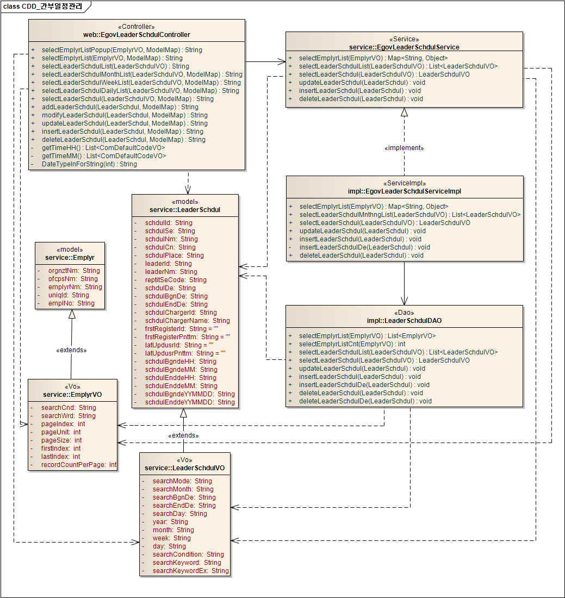
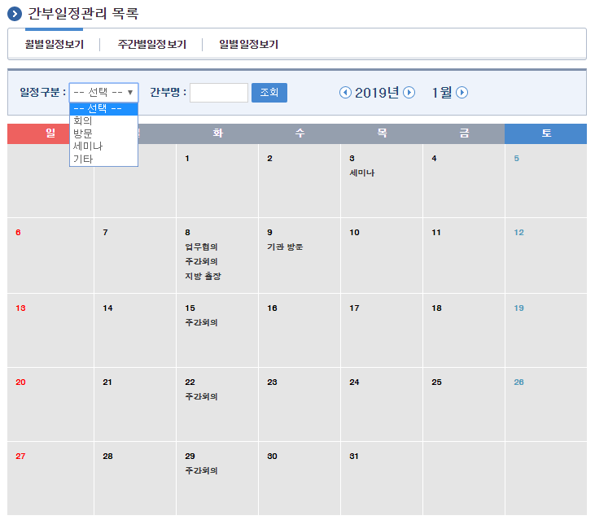
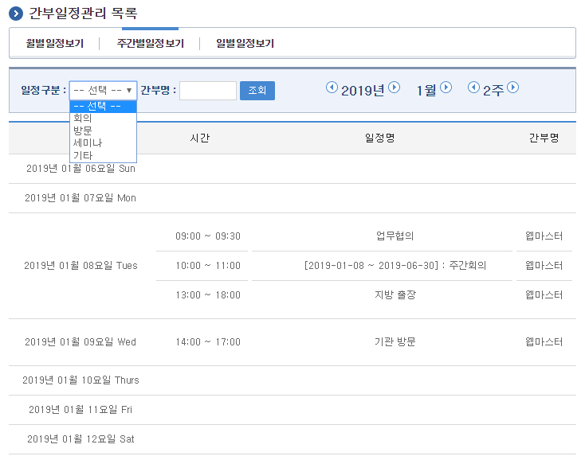
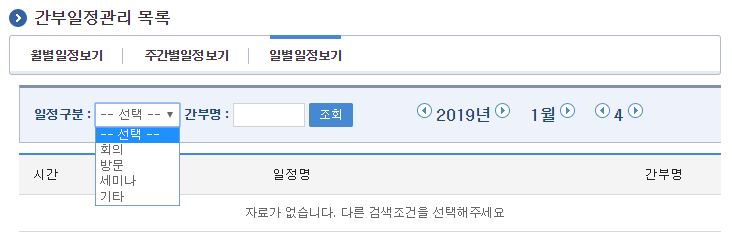
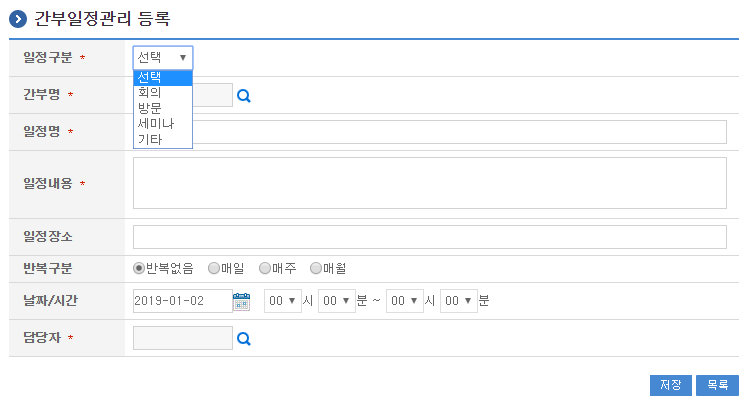
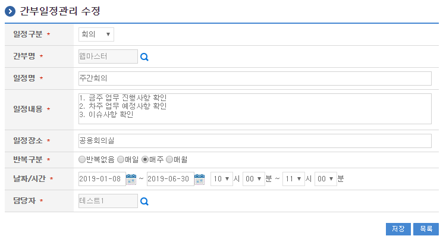
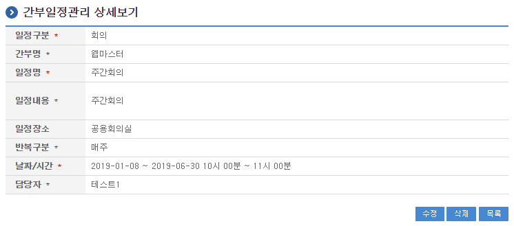

# 간부일정관리

## 개요

간부일정관리는 간부일정 정보를 관리하며, 일/주/월별 일정현황을 검색할 수 있는 기능을 제공한다.

## 설명

간부일정관리는 간부일정 정보를 관리하기 위한 목적으로 간부일정 정보의 등록, 수정, 삭제, 조회, 목록조회의 기능을 수반한다.

```text
① 월별간부일정목록조회 : 간부일정으로 정의된 정보를 월별로 조회하고, 그 결과 목록을 화면에 반영한다.
② 주별간부일정목록조회 : 간부일정으로 정의된 정보를 주별로 조회하고, 그 결과 목록을 화면에 반영한다.
③ 일별간부일정목록조회 : 간부일정으로 정의된 정보를 일별로 조회하고, 그 결과 목록을 화면에 반영한다.
④ 간부일정등록 : 간부일정정보를 등록하고, 등록 결과를 조회한다.
⑤ 간부일정수정 : 기 등록된 간부일정정보의 항목들을 수정한다.
⑥ 간부일정삭제 : 기 등록된 간부일정정보를 삭제한다.
⑦ 간부일정상세조회 : 등록된 간부일정정보를 조회한다.
```

### 패키지 참조 관계

간부일정관리 패키지는 요소기술의 공통(cmm) 패키지에 대해서만 직접적인 함수적 참조 관계를 가진다. 하지만, 컴포넌트 배포 시 오류 없이 실행되기 위하여 패키지 간의 참조관계에 따라 포맷/날짜/계산, 개인일정관리, 일지관리, 부서일정관리 패키지와 함께 배포 파일을 구성한다.

- 패키지 간 참조 관계 : [협업-일정관리, 문자메시지, 주소록 외 Package Dependency](../intro/package-reference.md/#협업)

### 관련소스

| 유형 | 대상소스명 | 비고 |
| --- | --- | --- |
| Controller | egovframework.com.cop.smt.lsm.web.EgovLeaderSchdulController.java | 간부일정관리를 위한 controller 클래스 |
| Service | egovframework.com.cop.smt.lsm.service.EgovLeaderSchdulService.java | 간부일정관리를 위한 Service Interface |
| ServiceImpl | egovframework.com.cop.smt.lsm.service.impl.EgovLeaderSchdulServiceImpl.java | 간부일정관리를 위한 서비스 구현 클래스 |
| Model | egovframework.com.cop.smt.lsm.service.Emplyr.java | 사용자 관리를 위한 Model 클래스 |
| Model | egovframework.com.cop.smt.lsm.service.LeaderSchdul.java | 간부일정관리를 위한 Model 클래스 |
| Model | egovframework.com.cop.smt.lsm.service.LeaderSttus.java | 간부상태관리를 위한 Model 클래스 |
| VO | egovframework.com.cop.smt.lsm.service.EmplyrVO.java | 사용자 관리를 위한 VO 클래스 |
| VO | egovframework.com.cop.smt.lsm.service.LeaderSchdulVO.java | 검간부일정관리를 위한 VO 클래스 |
| VO | egovframework.com.cop.smt.lsm.service.LeaderSttusVO.java | 간부상태관리를 위한 VO 클래스 |
| DAO | egovframework.com.cop.smt.lsm.service.impl.LeaderSchdulDAO.java | 간부일정관리를 위한 데이터처리 클래스 |
| JSP | /WEB-INF/jsp/egovframework/com/cop/smt/lsm/EgovEmplyrList.jsp | 사용자 목록조회를 위한 jsp페이지 |
| JSP | /WEB-INF/jsp/egovframework/com/cop/smt/lsm/EgovEmplyrListPopup.jsp | 사용자 팝업 목록조회를 위한 jsp페이지 |
| JSP | /WEB-INF/jsp/egovframework/com/cop/smt/lsm/EgovLeaderSchdulList.jsp | 일지관리 수정 페이지 |
| JSP | /WEB-INF/jsp/egovframework/com/cop/smt/dsm/EgovDiaryManageDetail.jsp | 간부일정 목록조회를 위한 jsp페이지 |
| JSP | /WEB-INF/jsp/egovframework/com/cop/smt/lsm/EgovLeaderSchdulMonthList.jsp | 월별 간부일정 목록조회를 위한 jsp페이지 |
| JSP | /WEB-INF/jsp/egovframework/com/cop/smt/lsm/EgovLeaderSchdulWeekList.jsp | 주별 간부일정 목록조회를 위한 jsp페이지 |
| JSP | /WEB-INF/jsp/egovframework/com/cop/smt/lsm/EgovLeaderSchdulDailyList.jsp | 일별 간부일정 목록조회를 위한 jsp페이지 |
| JSP | /WEB-INF/jsp/egovframework/com/cop/smt/lsm/EgovLeaderSchdulRegist.jsp | 간부일정 등록를 위한 jsp페이지 |
| JSP | /WEB-INF/jsp/egovframework/com/cop/smt/lsm/EgovLeaderSchdulDetail.jsp | 등록된 간부일정를 조회하기 위한 jsp페이지 |
| Query XML | resources/egovframework/mapper/com/cop/smt/lsm/EgovLeaderSchdul_SQL_altibase.xml | 간부일정관리를 위한 Altibase용 Query XML |
| Query XML | resources/egovframework/mapper/com/cop/smt/lsm/EgovLeaderSchdul_SQL_cubrid.xml | 간부일정관리를 위한 Cubrid용 Query XML |
| Query XML | resources/egovframework/mapper/com/cop/smt/lsm/EgovLeaderSchdul_SQL_maria.xml | 간부일정관리를 위한 MariaDB용 Query XML |
| Query XML | resources/egovframework/mapper/com/cop/smt/lsm/EgovLeaderSchdul_SQL_mysql.xml | 간부일정관리를 위한 MySQL용 Query XML |
| Query XML | resources/egovframework/mapper/com/cop/smt/lsm/EgovLeaderSchdul_SQL_oracle.xml | 간부일정관리를 위한 Oracle용 Query XML |
| Query XML | resources/egovframework/mapper/com/cop/smt/lsm/EgovLeaderSchdul_SQL_postgres.xml | 간부일정관리를 위한 PostgreSQL용 Query XML |
| Query XML | resources/egovframework/mapper/com/cop/smt/lsm/EgovLeaderSchdul_SQL_tibero.xml | 간부일정관리를 위한 Tibero용 Query XML |
| Query XML | resources/egovframework/mapper/com/cop/smt/lsm/EgovLeaderSchdul_SQL_goldilocks.xml | 간부일정관리를 위한 Goldilocks용 Query XML |
| Message properties | resources/egovframework/message/com/cop/smt/lsm/message_en.properties | 간부일정관리를 위한 Message properties(영문) |
| Message properties | resources/egovframework/message/com/cop/smt/lsm/message_ko.properties | 간부일정관리를 위한 Message properties(한글) |
| Idgen XML | resources/egovframework/spring/com/idgn/context-idgn-LeaderSchdu.xml | 간부일정관리를 위한 Id생성 Idgen XML |

### 클래스 다이어그램



### 관련테이블

| 테이블명 | 테이블명(영문) | 비고 |
| --- | --- | --- |
| 간부일정정보 | COMTNLEADERSCHDUL | 간부일정정보를 관리하기 위한 속성정보를 정의하고, 관리한다. |

### ID Generation

#### ID Generation 관련 DDL 및 DML

ID Generation Service를 활용하기 위해서 Sequence 저장테이블인 COMTECOPSEQ에 LEADER_SCHDUL_ID 항목을 추가해야 한다.

```sql
CREATE TABLE COMTECOPSEQ (table_name varchar(20) NOT NULL, 
                          next_id NUMERIC(30) NULL,
                          PRIMARY KEY (table_name)
);
 
INSERT INTO COMTECOPSEQ (TABLE_NAME, NEXT_ID ) VALUES ('LEADER_SCHDUL_ID','1');
```

#### ID Generation 환경설정(context-idgn-LeaderSchdu.xml)

```xml
 <bean name="egovLeaderSchdulIdGnrService" class="egovframework.rte.fdl.idgnr.impl.EgovTableIdGnrService" destroy-method="destroy">
    <property name="dataSource" ref="egov.dataSource" />
    <property name="strategy"   ref="LeaderSchdulStrategy" />
    <property name="blockSize"  value="10" />
    <property name="table"      value="COMTECOPSEQ" />
    <property name="tableName"  value="LEADER_SCHDUL_ID" />
</bean>
<bean name="LeaderSchdulStrategy" class="egovframework.rte.fdl.idgnr.impl.strategy.EgovIdGnrStrategyImpl">
    <property name="prefix"     value="LDSCHDUL_" />
    <property name="cipers"     value="11" />
    <property name="fillChar"   value="0" />
</bean>
```

## 관련기능

간부일정관리는 월별 간부일정 목록조회, 주별 간부일정 목록조회, 일별 간부일정 목록조회, 간부일정 등록, 간부일정 수정, 간부일정 상세조회 기능으로 구분되어 있다.

### 월별 간부일정 목록조회

#### 비즈니스 규칙

월별 간부일정 목록을 조회한다. 검색조건은 일정구분, 년도, 월, 간부에 대해서 수행된다.

#### 관련코드

N/A

#### 관련화면 및 수행매뉴얼

| Action | URL | Controller method | SQL Namespace | SQL QueryID |
| --- | --- | --- | --- | --- |
| 월별 목록조회 | /cop/smt/lsm/usr/selectLeaderSchdulMonthList.do | selectLeaderSchdulMonthList | "LeaderSchdulDAO" | "selectLeaderSchdulList" |



조회 : 기 등록된 간부일정의 목록을 조회한다.

일자클릭 : 신규 간부일정를 등록하기 위해서는 상단의 해당일자를 클릭하여 간부일정 등록 화면으로 이동한다.

내용클릭 : 해당 간부일정 상세조회 화면으로 이동한다.

### 주별 간부일정 목록조회

#### 비즈니스 규칙

주간별 간부일정 목록을 조회한다. 검색조건은 일정구분, 년도, 월, 주, 간부에 대해서 수행된다.

#### 관련코드

N/A

#### 관련화면 및 수행매뉴얼

| Action | URL | Controller method | SQL Namespace | SQL QueryID |
| --- | --- | --- | --- | --- |
| 주별 목록조회 | /cop/smt/lsm/usr/selectLeaderSchdulWeekList.do | selectLeaderSchdulWeekList | "LeaderSchdulDAO" | "selectLeaderSchdulList" |



조회 : 기 등록된 간부일정의 목록을 조회한다.

일자클릭 : 신규 간부일정를 등록하기 위해서는 상단의 해당일자를 클릭하여 간부일정 등록 화면으로 이동한다.

내용클릭 : 해당 간부일정 상세조회 화면으로 이동한다.

### 일별 간부일정 목록조회

#### 비즈니스 규칙

일별 간부일정 목록을 조회한다. 검색조건은 일정구분, 년도, 월, 일, 간부에 대해서 수행된다.

#### 관련코드

N/A

#### 관련화면 및 수행매뉴얼

| Action | URL | Controller method | SQL Namespace | SQL QueryID |
| --- | --- | --- | --- | --- |
| 일별 목록조회 | /cop/smt/lsm/usr/selectLeaderSchdulDailyList.do | selectLeaderSchdulDailyList | "LeaderSchdulDAO" | "selectLeaderSchdulList" |



조회 : 기 등록된 간부일정의 목록을 조회한다.

내용클릭 : 해당 간부일정 상세조회 화면으로 이동한다.

### 간부일정 등록

#### 비즈니스 규칙

간부일정의 속성정보를 입력한 뒤 등록한다.

#### 관련코드

N/A

#### 관련화면 및 수행매뉴얼

| Action | URL | Controller method | SQL Namespace | SQL QueryID |
| --- | --- | --- | --- | --- |
| 등록화면 | /cop/smt/lsm/mng/addLeaderSchdul.do | addLeaderSchdul | | |
| 등록 | /cop/smt/lsm/mng/insertLeaderSchdul.do | insertLeaderSchdul | "LeaderSchdulDAO" | "insertLeaderSchdul" |



저장 : 신규 간부일정를 등록하기 위해서는 간부일정 속성을 입력한 뒤 하단의 저장 버튼을 통해서 간부일정를 등록한다.

목록 : 간부일정 목록조회 화면으로 이동한다.

반복구분 필드에서 반복없음 선택시 날짜/시간 필드의 반복기간을 정의하지 않음


반복구분 필드에서 매일, 매주, 매월 선택시는 날짜/시간 필드의 반복기간을 정의해야함.


### 간부일정 수정

#### 비즈니스 규칙

간부일정의 속성정보를 변경한 후 저장한다.

#### 관련코드

N/A

#### 관련화면 및 수행매뉴얼

| Action | URL | Controller method | SQL Namespace | SQL QueryID |
| --- | --- | --- | --- | --- |
| 수정 | /cop/smt/lsm/mng/updateLeaderSchdul.do | updateLeaderSchdul | "LeaderSchdulDAO" | "updateLeaderSchdul" |



저장 : 기 등록된 간부일정 속성을 수정한 뒤 하단의 저장 버튼을 통해서 간부일정를 수정한다.

목록 : 간부일정 목록조회 화면으로 이동한다.

### 간부일정 상세조회

#### 비즈니스 규칙

간부일정의 속성정보를 조회한다.

#### 관련코드

N/A

#### 관련화면 및 수행매뉴얼

| Action | URL | Controller method | SQL Namespace | SQL QueryID |
| --- | --- | --- | --- | --- |
| 상세조회 | /cop/smt/lsm/usr/selectLeaderSchdul.do | selectLeaderSchdul | "LeaderSchdulDAO" | "selectLeaderSchdul" |
| 삭제 | /cop/smt/lsm/mng/deleteLeaderSchdul.do | deleteLeaderSchdul | "LeaderSchdulDAO" | "deleteLeaderSchdul" |



수정 : 기 등록된 간부일정 속성을 수정한 뒤 하단의 수정 버튼을 통해서 간부일정수정화면으로 이동한다.

삭제 : 기 등록된 간부일정를 삭제한다.

목록 : 간부일정 목록조회 화면으로 이동한다.

## 참고자료

N/A
