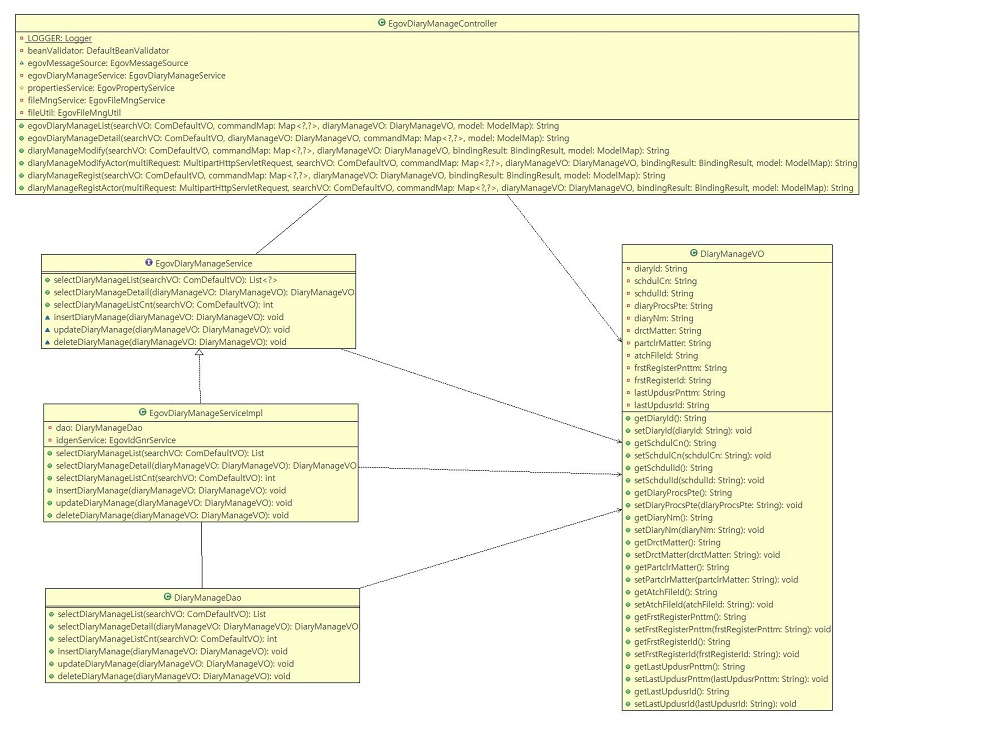
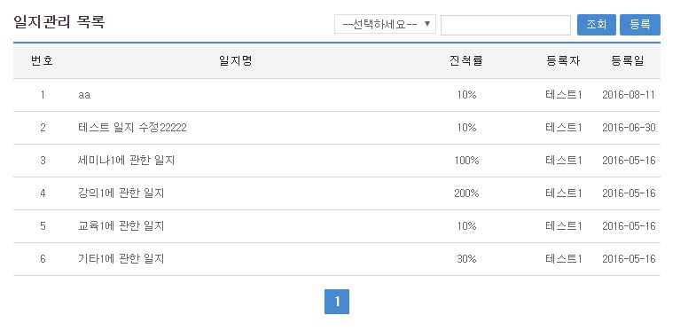
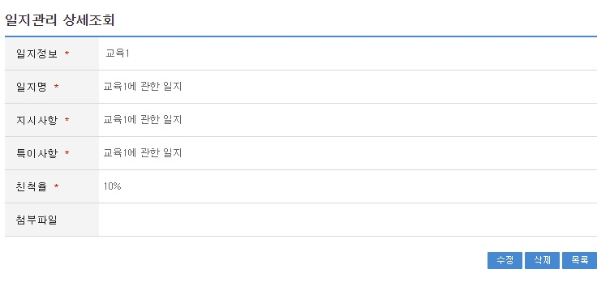
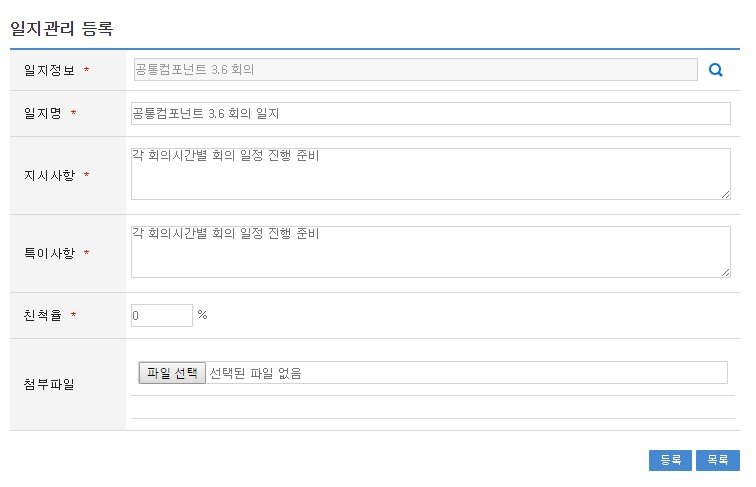
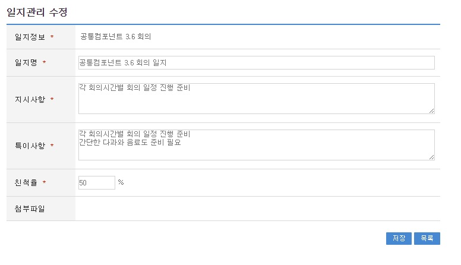

# 일지관리

## 개요

사용자가 일정관리와 부서일정관리를 이용할때 일정에 대한 기록을 남길때 본 서비스를 이용한다.

## 설명

### 패키지 참조 관계

일지관리 패키지는 요소기술의 공통(cmm) 패키지에 대해서만 직접적인 함수적 참조 관계를 가진다. 하지만, 컴포넌트 배포 시 오류 없이 실행되기 위하여 패키지 간의 참조관계에 따라 포맷/날짜/계산, 개인일정관리, 부서일정관리, 전체일정 패키지와 함께 배포 파일을 구성한다.

- 패키지 간 참조 관계 : [협업-일정관리, 문자메시지, 주소록 외 Package Dependency](../intro/package-reference.md/#협업)

### 관련소스

| 유형 | 대상소스명 | 비고 |
| --- | --- | --- |
| Controller | egovframework.com.cop.smt.dsm.web.EgovDiaryManageController.java | 일지관리 Controller Class |
| Service | egovframework.com.cop.smt.dsm.service.EgovDiaryManageService.java | 일지관리 Service Class |
| ServiceImpl | egovframework.com.cop.smt.dsm.service.impl.EgovDiaryManageServiceImpl.java | 일지관리 ServiceImpl Class |
| VO | egovframework.com.cop.smt.dsm.service.DiaryManageVO.java | 일지관리 VO Class |
| VO | egovframework.com.cmm.ComDefaultVO.java | 검색 VO Class |
| DAO | egovframework.com.cop.smt.dsm.service.impl.DiaryManageDao.java | 일지관리 Dao Class |
| JSP | /WEB-INF/jsp/egovframework/com/cop/smt/dsm/EgovDiaryManageList.jsp | 일지관리 목록조회 페이지 |
| JSP | /WEB-INF/jsp/egovframework/com/cop/smt/dsm/EgovDiaryManageRegist.jsp | 일지관리 등록 페이지 |
| JSP | /WEB-INF/jsp/egovframework/com/cop/smt/dsm/EgovDiaryManageModify.jsp | 일지관리 수정 페이지 |
| JSP | /WEB-INF/jsp/egovframework/com/cop/smt/dsm/EgovDiaryManageDetail.jsp | 일지관리 상세조회 페이지 |
| Query XML | resources/egovframework/mapper/com/cop/smt/dsm/EgovDiaryManage_SQL_altibase.xml | 일지관리를 위한 Altibase용 Query XML |
| Query XML | resources/egovframework/mapper/com/cop/smt/dsm/EgovDiaryManage_SQL_cubrid.xml | 일지관리를 위한 Cubrid용 Query XML |
| Query XML | resources/egovframework/mapper/com/cop/smt/dsm/EgovDiaryManage_SQL_maria.xml | 일지관리를 위한 MariaDB용 Query XML |
| Query XML | resources/egovframework/mapper/com/cop/smt/dsm/EgovDiaryManage_SQL_mysql.xml | 일지관리를 위한 MySQL용 Query XML |
| Query XML | resources/egovframework/mapper/com/cop/smt/dsm/EgovDiaryManage_SQL_oracle.xml | 일지관리를 위한 Oracle용 Query XML |
| Query XML | resources/egovframework/mapper/com/cop/smt/dsm/EgovDiaryManage_SQL_postgres.xml | 일지관리를 위한 PostgreSQL용 Query XML |
| Query XML | resources/egovframework/mapper/com/cop/smt/dsm/EgovDiaryManage_SQL_tibero.xml | 일지관리를 위한 Tibero용 Query XML |
| Query XML | resources/egovframework/mapper/com/cop/smt/dsm/EgovDiaryManage_SQL_goldilocks.xml | 일지관리를 위한 Goldilocks용 Query XML |
| Validator Rule XML | resources/egovframework/validator/validator-rules.xml | Validator Rule을 정의한 XML |
| Validator XML | resources/egovframework/validator/com/cop/smt/dsm/EgovDiaryManage.xml | 일지관리 Validator XML |
| Message properties | resources/egovframework/message/com/message-common_ko.properties | 일지관리 Message properties(한글) |
| Message properties | resources/egovframework/message/com/message-common_en.properties | 일지관리 Message properties(영문) |
| Idgen XML | resources/egovframework/spring/com/idgn/context-idgn-diaryManage.xml | 일지관리 Id생성 Idgen XML |

### 클래스 다이어그램



### ID Generation

#### ID Generation 관련 DDL 및 DML

ID Generation Service를 활용하기 위해서 Sequence 저장테이블인 COMTECOPSEQ에 DIARY_ID 항목을 추가해야 한다.

```sql
CREATE TABLE COMTECOPSEQ (table_name varchar(20) NOT NULL, 
  		                    next_id NUMERIC(30) NULL,
  		                    PRIMARY KEY (table_name));

INSERT INTO COMTECOPSEQ VALUES('DIARY_ID',1); 
```

#### ID Generation 환경설정(context-idgn-diaryManage.xml)

```xml
<bean name="diaryManageIdGnrService" class="egovframework.rte.fdl.idgnr.impl.EgovTableIdGnrServiceImpl" destroy-method="destroy">
    <property name="dataSource" ref="egov.dataSource" />
    <property name="strategy"   ref="DiaryManageInfotrategy" />
    <property name="blockSize"  value="10"/>
    <property name="table"      value="COMTECOPSEQ"/>
    <property name="tableName"  value="DIARY_ID"/>
</bean>
<bean name="DiaryManageInfotrategy" class="egovframework.rte.fdl.idgnr.impl.strategy.EgovIdGnrStrategyImpl">
    <property name="prefix"   value="DIARY_" />
    <property name="cipers"   value="14" />
    <property name="fillChar" value="0" />
</bean>
```

### 관련테이블

| 테이블명 | 테이블명(영문) | 비고 |
| --- | --- | --- |
| 일지관리 | COMTNDIARYINFO | 일지관리를 관리 한다. |

## 관련기능

일지관리 기능은 일지관리 목록조회, 일지관리 상세조회, 일지관리 등록, 일지관리 수정기능으로 구성되어 있다.

### 일지관리 목록조회

#### 비즈니스 규칙

관리자가 기(記) 등록된 일지관리 정보를 리스트 형태로 조회 할 수 있고, 등록버튼을 클릭하여 등록화면으로 이동할수있다.

#### 관련코드

N/A

#### 관련화면 및 수행매뉴얼

| Action | URL | Controller method | SQL Namespace | SQL QueryID |
| --- | --- | --- | --- | --- |
| 목록조회 | /cop/smt/dsm/EgovDiaryManageList.do | egovDiaryManageList | “DiaryManage” | “selectDiaryManage” |
| | | | “DiaryManage” | “selectDiaryManageCnt” |

일지관리 목록은 페이지 당 10건씩 조회되며 페이징은 10페이지씩 이루어진다. 검색조건은 등록자, 외부인사명에 대해서 수행된다.

페이지 당 검색 범위를 변경하고자 하는 경우

context-properties.xml 파일의 pageUnit, pageSize를 변경한다.(단 해당 설정은 전체 공통서비스 기능에 영향을 미친다.)



조회: 조회하기 위해서는 상단의 검색조건을 선택 후 해당하는 검색문자를 입력 후 조회 버튼을 클릭한다.

등록: 등록하기 위해서는 상단의 등록 버튼을 통해서 일지관리 등록 화면으로 이동한다.

목록클릭: 일지관리 상세조회 화면으로 이동한다.

### 일지관리 상세조회

#### 비즈니스 규칙

일지관리 목록에서 목록 클릭 시 이동되는 화면으로 일지관리에 대한 상세정보를 보여준다.

#### 관련코드

N/A

#### 관련화면 및 수행매뉴얼

| Action | URL | Controller method | SQL Namespace | SQL QueryID |
| --- | --- | --- | --- | --- |
| 상세조회 | /cop/smt/dsm/EgovDiaryManageDetail.do | egovDiaryManageDetail | “DiaryManage” | “selectDiaryManageDetail” |
| 삭제 | /cop/smt/dsm/EgovDiaryManageDetail.do | egovDiaryManageDetail | “DiaryManage” | “deleteDiaryManage” |



수정: 수정버튼 클릭 시 일지관리 수정 화면으로 이동한다.

삭제: 삭제버튼 클릭 시 삭제여부를 확인하는 메시지를 보여주고 삭제처리를 할 수 있다.

목록: 일지관리 목록 화면으로 이동한다.

### 일지관리 등록

#### 비즈니스 규칙

일지관리에 관한 기본정보를 입력 저장처리한다. 입력명 우측의 빨간* 표시는 반드시 입력해야할 항목을 표시한다.

#### 관련코드

N/A

#### 관련화면 및 수행매뉴얼

| Action | URL | Controller method | SQL Namespace | SQL QueryID |
| --- | --- | --- | --- | --- |
| 등록화면 | /cop/smt/dsm/EgovDiaryManageRegist.do | diaryManageRegist | | |
| 등록 | /cop/smt/dsm/EgovDiaryManageRegistActor.do | diaryManageRegistActor | “DiaryManage” | “insertDiaryManage” |



등록: 입력한 일지관리 정보들이 저장 처리된다.

목록: 일지관리 목록 화면으로 이동한다.

### 일지관리 수정

#### 비즈니스 규칙

입력한 일지관리 정보를(을) 저장 처리한다. 입력명 우측의 빨간* 표시는 수정 시 반드시 입력해야 할 항목을 표시한다.

#### 관련코드

N/A

#### 관련화면 및 수행매뉴얼

| Action | URL | Controller method | SQL Namespace | SQL QueryID |
| --- | --- | --- | --- | --- |
| 수정화면 | /cop/smt/dsm/EgovDiaryManageModify.do | diaryManageModify | | |
| 수정 | /cop/smt/dsm/EgovDiaryManageModifyActor.do | diaryManageModifyActor | “DiaryManage” | “updateDiaryManage” |



저장: 수정된 정보들이 저장 처리된다.

목록: 일지관리 목록 화면으로 이동한다.