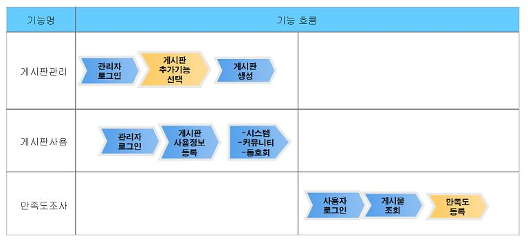
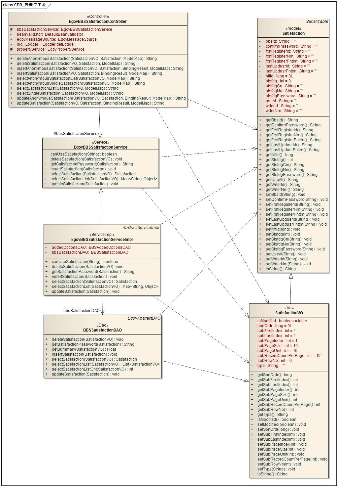
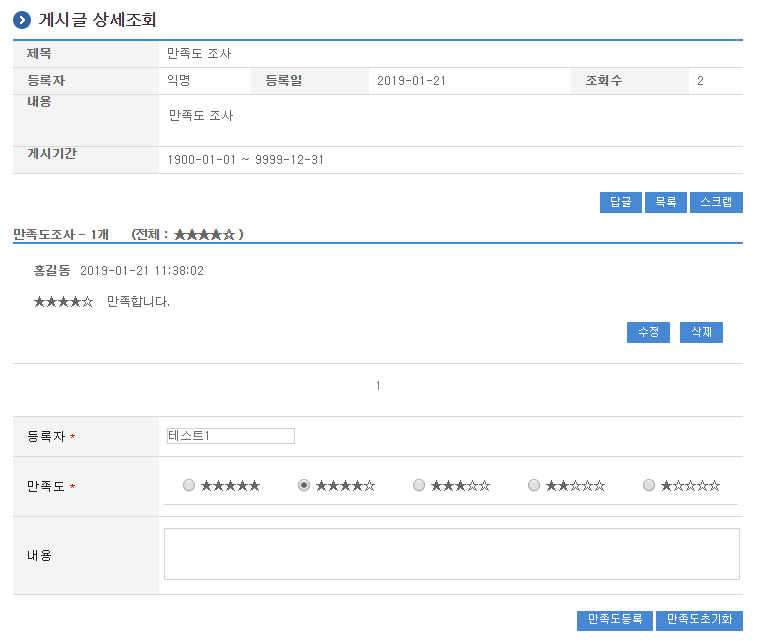
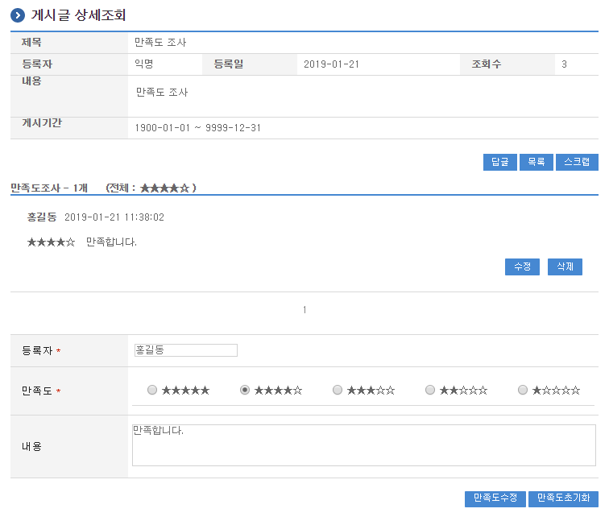

# 만족도조사

## 개요

게시판에 등록된 글에 대하여 만족도를 작성할 수 있는 기능을 제공한다. 만족도조사는 게시판관리 기능을 기반으로 운영된다.

- 기능흐름

  

## 설명

만족도조사가 가능한 게시판을 사용하기 위해서는 게시판관리를 통해 생성된 게시판에 추가 선택사항을 지정하여야 한다. 추가 선택사항은 댓글 관리 및 만족도조사가 선택가능하며, 한번 지정이 되면 수정 할 수 없다. 다만, 미설정된 기존 게시판의 경우 처음 설정은 가능하다. 추가 선택사항을 사용하기 위해서는 기존 게시판생성관리 기능 및 게시판사용 기능의 수정이 선행되어야 한다.

### 패키지 참조 관계

만족도조사 패키지는 요소기술의 공통 패키지(cmm)와 게시판 패키지에 대해서 직접적인 함수적 참조 관계를 가진다. 하지만, 컴포넌트 배포 시 오류 없이 실행되기 위하여 패키지 간의 참조관계에 따라 포맷/계산/변환, 협업의 공통기능(com), 디자인템플릿, 시스템(sim), 달력 패키지와 함께 배포 파일을 구성한다.

- 패키지 간 참조 관계 : [게시판, 커뮤니티, 동호회 Package Dependency](../intro/package-reference.md/#협업)

### 관련소스

| 유형 | 대상소스 | 비고 |
| --- | --- | --- |
| Controller | egovframework.com.cop.stf.web.EgovBBSSatisfactionController.java | 만족도조사를 위한 컨트롤러 클래스 |
| Service | egovframework.com.cop.stf.service.EgovBBSSatisfactionService.java | 만족도조사를 위한 서비스 인터페이스 |
| ServiceImpl | egovframework.com.cop.stf.service.impl.EgovBBSSatisfactionServiceImpl.java | 만족도조사를 위한 서비스 구현 클래스 |
| Model | egovframework.com.cop.bbs.service.Satisfaction.java | 만족도조사를 위한 모델 클래스 |
| VO | egovframework.com.cop.bbs.service.SatisfactionVO.java | 만족도조사를 위한 VO 클래스 |
| DAO | egovframework.com.cop.stf.service.impl.BBSSatisfactionDAO.java | 만족도조사를 위한 데이터처리 클래스 |
| JSP | /WEB-INF/jsp/egovframework/com/cop/stf/EgovSatisfactionList.jsp | 만족도조사를 위한 jsp페이지 |
| Query XML | resources/egovframework/mapper/com/cop/stf/EgovBBSSatisfaction_SQL_mysql.xml | 만족도조사를 위한 MySQL용 Query XML 파일 |
| Query XML | resources/egovframework/mapper/com/cop/stf/EgovBBSSatisfaction_SQL_cubrid.xml | 만족도조사를 위한 Cubrid용 Query XML 파일 |
| Query XML | resources/egovframework/mapper/com/cop/stf/EgovBBSSatisfaction_SQL_oracle.xml | 만족도조사를 위한 Oracle용 Query XML 파일 |
| Query XML | resources/egovframework/mapper/com/cop/stf/EgovBBSSatisfaction_SQL_tibero.xml | 만족도조사를 위한 Tibero용 Query XML 파일 |
| Query XML | resources/egovframework/mapper/com/cop/stf/EgovBBSSatisfaction_SQL_altibase.xml | 만족도조사를 위한 Altibase용 Query XML 파일 |
| Query XML | resources/egovframework/mapper/com/cop/stf/EgovBBSSatisfaction_SQL_maria.xml | 만족도조사를 위한 MariaDB용 Query XML 파일 |
| Query XML | resources/egovframework/mapper/com/cop/stf/EgovBBSSatisfaction_SQL_postgres.xml | 만족도조사를 위한 PostgreSQL용 Query XML 파일 |
| Query XML | resources/egovframework/mapper/com/cop/stf/EgovBBSSatisfaction_SQL_goldilocks.xml | 만족도조사를 위한 Goldilocks용 Query XML 파일 |
| Validator Rule XML | resources/egovframework/validator/validator-rules.xml | Validator Rule을 정의한 XML |
| Message properties | resources/egovframework/message/com/cop/stf/message_ko.properties | 만족도조사를 위한 Message properties(한글) |
| Message properties | resources/egovframework/message/com/cop/stf/message_en.properties | 만족도조사를 위한 Message properties(영문) |

### 클래스 다이어그램

### 관련테이블

| 테이블명 | 테이블명(영문) | 비고 |
| --- | --- | --- |
| 만족도 | COMTNSTSFDG | 만족도조사 정보를 관리한다. |

## 관련기능

만족도조사 만족도 목록조회 및 등록, 만족도 수정 및 삭제 기능으로 구분되어 있다.

### 만족도 목록조회 및 등록

#### 비즈니스 규칙

만족도조사가 설정된 게시판의 게시물에 대한 만족도 목록의 조회한다. 만족도에 대한 전체 평균은 상단에 표시가 된다. (tooltip으로 평균값 표시)

#### 관련코드

N/A

#### 관련화면 및 수행매뉴얼

| Action | URL | Controller method | QueryID |
| --- | --- | --- | --- |
| 목록조회 | /cop/stf/selectSatisfactionList.do | selectSatisfactionList | “BBSSatisfactionDAO.selectSatisfactionList”, |
| | | | “BBSSatisfactionDAO.selectSatisfactionListCnt” |
| 등록 | /cop/stf/insertSatisfaction.do | insertSatisfaction | “BBSSatisfactionDAO.insertSatisfaction” |

만족도 목록은 페이지당 10건씩 조회되며 페이징은 10페이지씩 이루어진다.

페이지당 검색 범위를 변경하고자 하는 경우 context-properties.xml 파일의 pageUnit, pageSize를 변경한다.(단 해당 설정은 전체 공통서비스 기능에 영향을 미친다.)

만족도등록: 입력한 만족도 정보를 저장 처리한다.

만족도초기화: 폼에 입력한 만족도 정보를 초기화한다.

### 만족도 수정 및 삭제

#### 비즈니스 규칙

만족도조사가 설정된 게시판의 게시물에 대한 만족도를 수정 및 삭제할 수 있는 기능을 제공한다.

#### 관련코드

N/A

#### 관련화면 및 수행매뉴얼

| Action | URL | Controller method | QueryID |
| --- | --- | --- | --- |
| 수정화면 | /cop/stf/selectSingleSatisfaction.do | selectSingleSatisfaction | |
| 수정 | /cop/stf/updateSatisfaction.do | updateSatisfaction | “BBSSatisfactionDAO.updateSatisfaction” |
| 삭제 | /cop/stf/deleteSatisfaction.do | deleteSatisfaction | “BBSSatisfactionDAO.deleteSatisfaction” |

만족도수정: 수정된 만족도 정보를 저장 처리한다.

만족도초기화: 폼에 입력한 만족도 정보를 초기화한다.