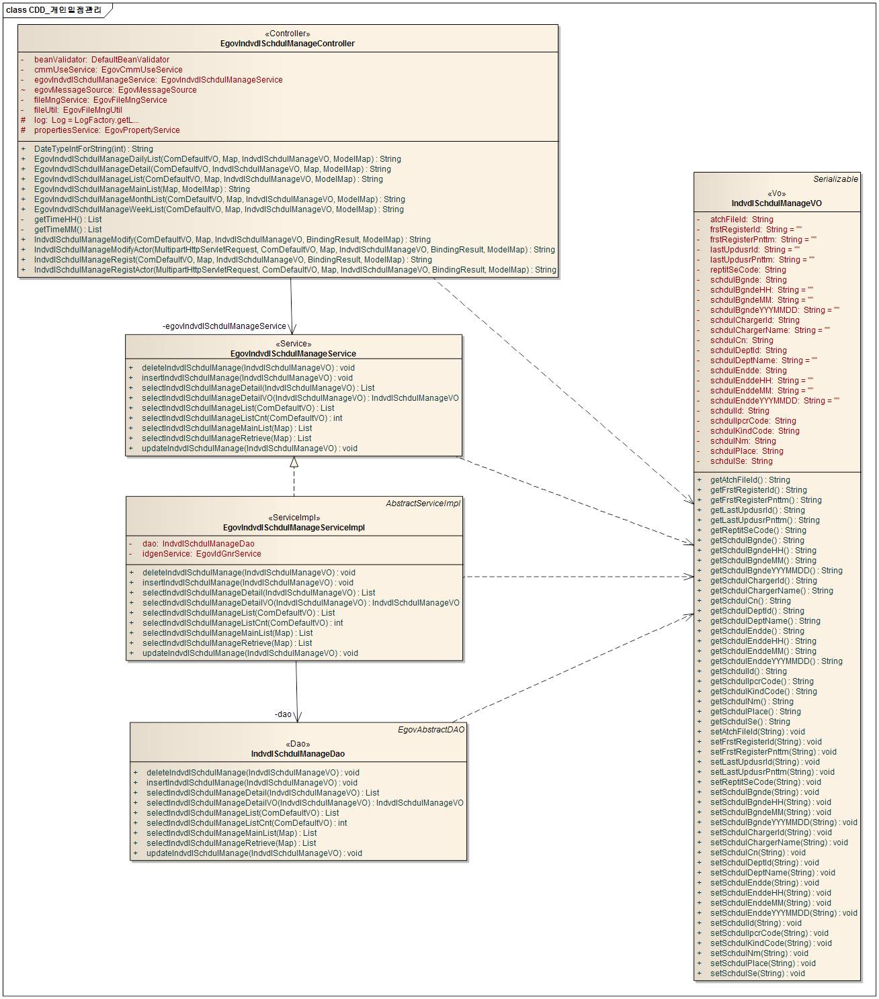
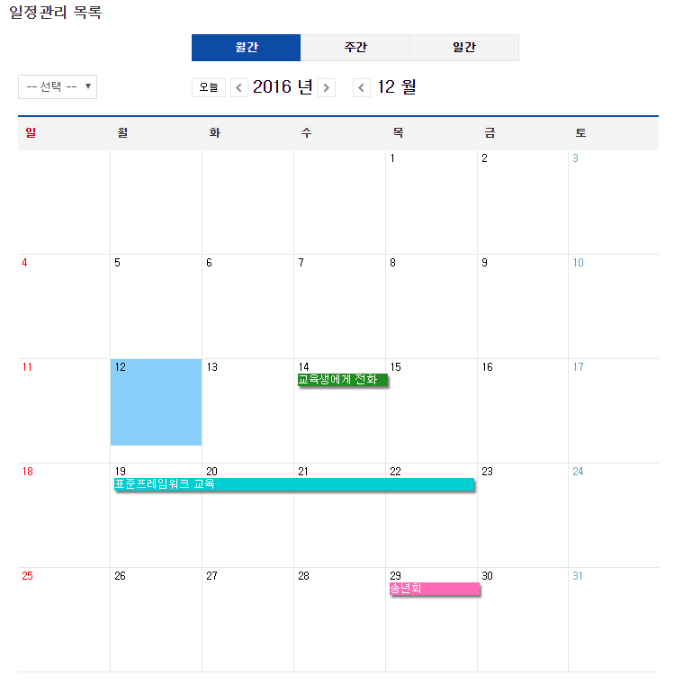
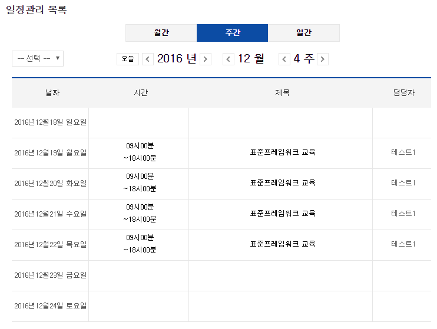
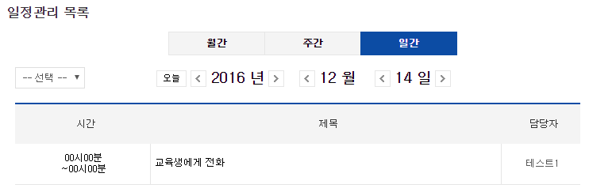
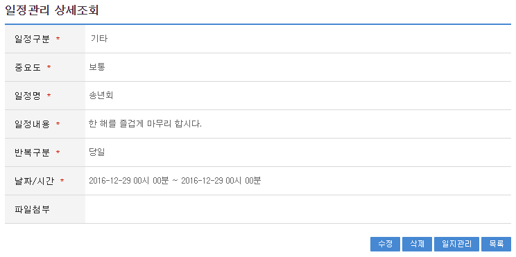
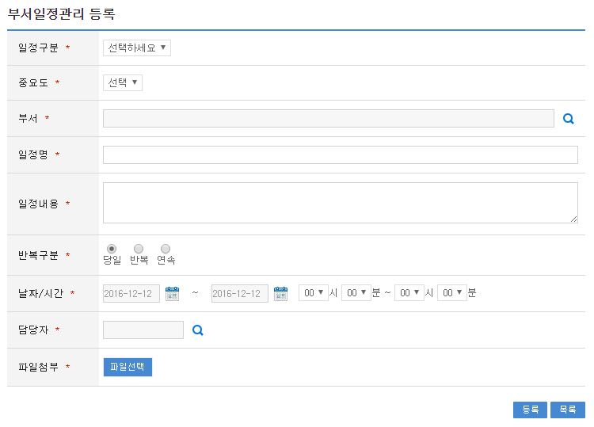
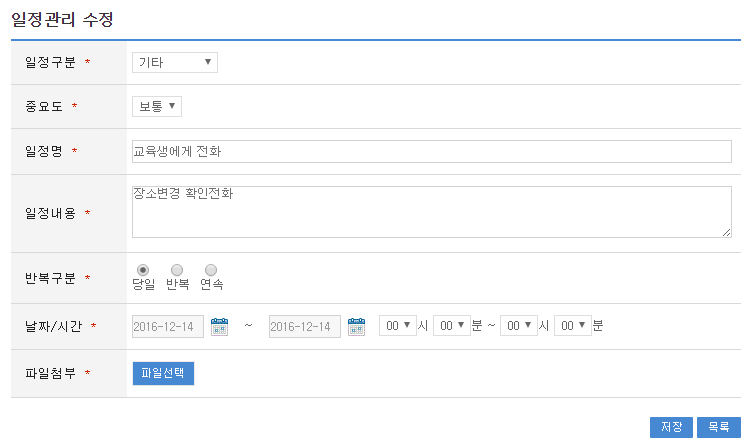

# 일정관리

## 개요

사용자의 /세미나/강의/교육/회의/기타 일정에 대한 계획을 쉽고 편하게 관리 할 수 있는 서비스로 월별일정보기, 주간별일정보기, 일별일정보기 기능을 제공한다.

## 설명

### 패키지 참조 관계

개인일정관리 패키지는 요소기술의 공통(cmm) 패키지에 대해서만 직접적인 함수적 참조 관계를 가진다. 하지만, 컴포넌트 배포 시 오류 없이 실행되기 위하여 패키지 간의 참조관계에 따라 부서일정관리, 일지관리, 전체일정 패키지와 함께 배포 파일을 구성한다.

- 패키지 간 참조 관계 : [협업-일정관리, 문자메시지, 주소록 외 Package Dependency](../intro/package-reference.md/#협업)

### 관련소스

| 유형 | 대상소스명 | 비고 |
| --- | --- | --- |
| Controller | egovframework.com.cop.smt.sim.web.EgovIndvdlSchdulManageController.java | 일정관리 Controller Class |
| Service | egovframework.com.cop.smt.sim.service.EgovIndvdlSchdulManageService.java | 일정관리 Service Class |
| ServiceImpl | egovframework.com.cop.smt.sim.service.impl.EgovIndvdlSchdulManageServiceImpl.java | 일정관리 ServiceImpl Class |
| VO | egovframework.com.cop.smt.sim.service.IndvdlSchdulManageVO.java | 일정관리 VO Class |
| VO | egovframework.com.cmm.ComDefaultVO.java | 검색 VO Class |
| DAO | egovframework.com.cop.smt.sim.service.impl.IndvdlSchdulManageDao.java | 일정관리 Dao Class |
| JSP | /WEB-INF/jsp/egovframework/com/cop/smt/sim/EgovIndvdlSchdulManageMainList.jsp | 일정관리 조회 메인페이지 |
| JSP | /WEB-INF/jsp/egovframework/com/cop/smt/sim/EgovIndvdlSchdulManageList.jsp | 일정관리 목록조회 페이지 |
| JSP | /WEB-INF/jsp/egovframework/com/cop/smt/sim/EgovIndvdlSchdulManageMonthList.jsp | 일정관리 월간 목록 페이지 |
| JSP | /WEB-INF/jsp/egovframework/com/cop/smt/sim/EgovIndvdlSchdulManageWeetList.jsp | 일정관리 주간 목록 페이지 |
| JSP | /WEB-INF/jsp/egovframework/com/cop/smt/sim/EgovIndvdlSchdulManageDailyList.jsp | 일정관리 일간 목록 페이지 |
| JSP | /WEB-INF/jsp/egovframework/com/cop/smt/sim/EgovIndvdlSchdulManageRegist.jsp | 일정관리 등록 페이지 |
| JSP | /WEB-INF/jsp/egovframework/com/cop/smt/sim/EgovIndvdlSchdulManageModify.jsp | 일정관리 수정 페이지 |
| JSP | /WEB-INF/jsp/egovframework/com/cop/smt/sim/EgovIndvdlSchdulManageDetail.jsp | 일정관리 상세조회 페이지 |
| Query XML | resources/egovframework/mapper/com/cop/smt/sim/EgovIndvdlSchdulManage_SQL_altibase.xml | 일정관리를 위한 Altibase용 Query XML |
| Query XML | resources/egovframework/mapper/com/cop/smt/sim/EgovIndvdlSchdulManage_SQL_cubrid.xml | 일정관리를 위한 Cubrid용 Query XML |
| Query XML | resources/egovframework/mapper/com/cop/smt/sim/EgovIndvdlSchdulManage_SQL_maria.xml | 일정관리를 위한 MariaDB용 Query XML |
| Query XML | resources/egovframework/mapper/com/cop/smt/sim/EgovIndvdlSchdulManage_SQL_mysql.xml | 일정관리를 위한 MySQL용 Query XML |
| Query XML | resources/egovframework/mapper/com/cop/smt/sim/EgovIndvdlSchdulManage_SQL_oracle.xml | 일정관리를 위한 Oracle용 Query XML |
| Query XML | resources/egovframework/mapper/com/cop/smt/sim/EgovIndvdlSchdulManage_SQL_postgres.xml | 일정관리를 위한 PostgreSQL용 Query XML |
| Query XML | resources/egovframework/mapper/com/cop/smt/sim/EgovIndvdlSchdulManage_SQL_tibero.xml | 일정관리를 위한 Tibero용 Query XML |
| Query XML | resources/egovframework/mapper/com/cop/smt/sim/EgovIndvdlSchdulManage_SQL_goldilocks.xml | 일정관리를 위한 Goldilocks용 Query XML |
| Validator XML | resources/egovframework/validator/com/cop/smt/sim/EgovIndvdlSchdulManage.xml | 일정관리 Validator XML |
| Message properties | resources/egovframework/message/com/cop/smt/sim/message_ko.properties | 마이페이지 Message properties(한글) |
| Message properties | resources/egovframework/message/com/cop/smt/sim/message_en.properties | 마이페이지 Message properties(영문) |
| Idgen XML | resources/egovframework/spring/com/idgn/context-idgn-diaryManage.xml | 일정관리 Id생성 Idgen XML |

### 클래스 다이어그램



### ID Generation

#### ID Generation 관련 DDL 및 DML

ID Generation Service를 활용하기 위해서 Sequence 저장테이블인 COMTECOPSEQ에 SCHDUL_ID 항목을 추가해야 한다.

```sql
CREATE TABLE COMTECOPSEQ (TABLE_NAME VARCHAR(20) NOT NULL, 
  		                    NEXT_ID NUMERIC(30) NULL,
  		                    PRIMARY KEY (TABLE_NAME));

INSERT INTO COMTECOPSEQ VALUES('SCHDUL_ID','1');
```

#### ID Generation 환경설정(context-idgn-diaryManage.xml)

```xml
<bean name="diaryManageIdGnrService" class="egovframework.rte.fdl.idgnr.impl.EgovTableIdGnrServiceImpl" destroy-method="destroy">
    <property name="dataSource" ref="egov.dataSource" />
    <property name="strategy"   ref="DiaryManageInfotrategy" />
    <property name="blockSize"  value="10"/>
    <property name="table"      value="COMTECOPSEQ"/>
    <property name="tableName"  value="DIARY_ID"/>
</bean>
<bean name="DiaryManageInfotrategy" class="egovframework.rte.fdl.idgnr.impl.strategy.EgovIdGnrStrategyImpl">
    <property name="prefix"   value="DIARY_" />
    <property name="cipers"   value="14" />
    <property name="fillChar" value="0" />
</bean>
```

### 관련테이블

| 테이블명 | 테이블명(영문) | 비고 |
| --- | --- | --- |
| 일정관리 | COMTNMTGINFO | 일정관리를 관리 한다. |

## 관련기능

일정관리관리기능은 일정관리 월별목록, 일정관리 주간별목록, 일정관리 일별목록, 일정관리 상세조회, 일정관리 등록, 일정관리 수정기능으로 구성되어 있다.

### 일정관리 월별목록

#### 비즈니스 규칙

관리자가 기(記) 등록된 일정관리 정보를 리스트 형태로 조회 할 수 있고, 등록버튼을 클릭하여 등록화면으로 이동할 수 있다.

#### 관련코드

N/A

#### 관련화면 및 수행매뉴얼

| Action | URL | Controller method | SQL Namespace | SQL QueryID |
| --- | --- | --- | --- | --- |
| 월별 목록조회 | /cop/smt/sim/EgovIndvdlSchdulManageList.do | egovIndvdlSchdulManageMonthList | “IndvdlSchdulManage” | “selectIndvdlSchdulManageRetrieve” |



날짜클릭 : 빈 날짜를 클릭하면 일정관리 등록 화면으로 이동한다.

일정클릭 : 일정관리 상세조회 화면으로 이동한다.

### 일정관리 주간별목록

#### 비즈니스 규칙

관리자가 기(記) 등록된 일정관리 정보를 리스트 형태로 조회 할 수 있고, 등록버튼을 클릭하여 등록화면으로 이동할 수 있다.

#### 관련코드

N/A

#### 관련화면 및 수행매뉴얼

| Action | URL | Controller method | SQL Namespace | SQL QueryID |
| --- | --- | --- | --- | --- |
| 주간별 목록조회 | /cop/smt/sim/EgovIndvdlSchdulManageWeekList.do | egovIndvdlSchdulManageWeekList | “IndvdlSchdulManage” | “selectIndvdlSchdulManageRetrieve” |



일정클릭 : 일정관리 상세조회 화면으로 이동한다

### 일정관리 일별목록

#### 비즈니스 규칙

관리자가 기(記) 등록된 일정관리 정보를 리스트 형태로 조회 할 수 있고, 등록버튼을 클릭하여 등록화면으로 이동할 수 있다.

#### 관련코드

N/A

#### 관련화면 및 수행매뉴얼

| Action | URL | Controller method | SQL Namespace | SQL QueryID |
| --- | --- | --- | --- | --- |
| 일별 목록조회 | /cop/smt/sim/EgovIndvdlSchdulManageDailyList.do | egovIndvdlSchdulManageDailyList | “IndvdlSchdulManage” | “selectIndvdlSchdulManageRetrieve” |



일정클릭 : 일정관리 상세조회 화면으로 이동한다

### 일정관리 상세조회 및 삭제

#### 비즈니스 규칙

관리자가 기(記) 등록된 일정관리 정보를 리스트 형태로 조회 할 수 있고, 등록버튼을 클릭하여 등록화면으로 이동할 수 있다.

#### 관련코드

N/A

#### 관련화면 및 수행매뉴얼

| Action | URL | Controller method | SQL Namespace | SQL QueryID |
| --- | --- | --- | --- | --- |
| 상세조회 | /cop/smt/sim/EgovIndvdlSchdulManageDetail.do | egovIndvdlSchdulManageDetail | “IndvdlSchdulManage” | “selectIndvdlSchdulManageDetailVO” |
| 일정삭제 | /cop/smt/sim/EgovIndvdlSchdulManageDetail.do | egovIndvdlSchdulManageDetail | “IndvdlSchdulManage” | “deleteIndvdlSchdulManage” |



수정 : 수정버튼 클릭 시 부서일정관리 수정 화면으로 이동한다.

삭제 : 삭제버튼 클릭 시 삭제처리를 할 수 있다.

일지관리 : 일지관리 클릭 시 일지관리를 할 수 있는 목록으로 이동한다.

목록: 일정관리 상세조회 화면으로 이동한다.

### 일정관리 등록

#### 비즈니스 규칙

일정관리에 관한 기본정보를 입력 저장처리한다. 입력명 우측의 빨간* 표시는 반드시 입력해야할 항목을 표시한다.

#### 관련코드

N/A

#### 관련화면 및 수행매뉴얼

| Action | URL | Controller method | SQL Namespace | SQL QueryID |
| --- | --- | --- | --- | --- |
| 등록화면 | /cop/smt/sim/EgovIndvdlSchdulManageRegist.do | indvdlSchdulManageRegist | | |
| 등록 | /cop/smt/sim/EgovIndvdlSchdulManageRegistActor.do | indvdlSchdulManageRegistActor | “IndvdlSchdulManage” | “insertIndvdlSchdulManage” |



등록 : 입력한 일정관리 정보들이 저장 처리된다.

목록 : 일정관리 목록 화면으로 이동한다.

### 일정관리 수정

#### 비즈니스 규칙

입력한 일정관리 정보를(을) 저장 처리한다. 입력명 우측의 빨간* 표시는 수정 시 반드시 입력해야 할 항목을 표시한다.

#### 관련코드

N/A

#### 관련화면 및 수행매뉴얼

| Action | URL | Controller method | SQL Namespace | SQL QueryID |
| --- | --- | --- | --- | --- |
| 수정화면 | /cop/smt/sim/EgovIndvdlSchdulManageModify.do | indvdlSchdulManageModify | | |
| 수정 | /cop/smt/sim/EgovIndvdlSchdulManageModifyActor.do | indvdlSchdulManageModifyActor | “IndvdlSchdulManage” | “updateIndvdlSchdulManage” |



저장 : 수정된 정보들이 저장 처리된다.

목록 : 일정관리 목록 화면으로 이동한다.