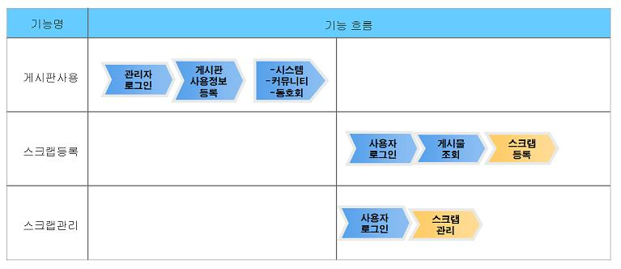
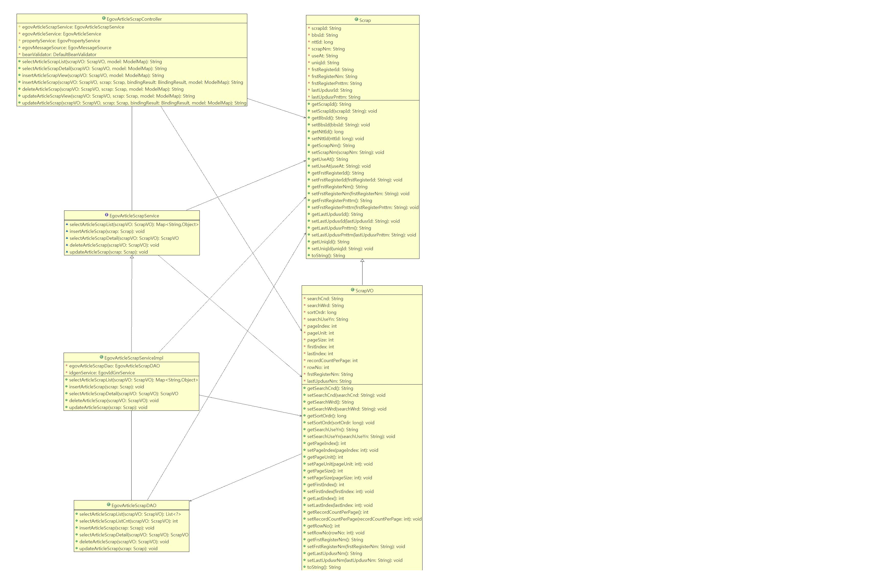
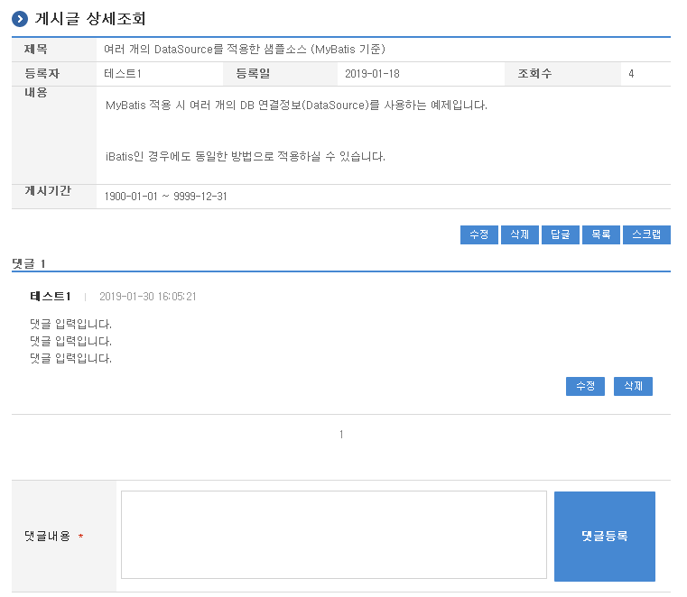
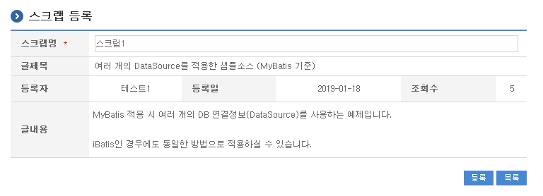
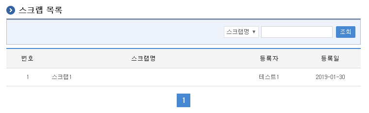
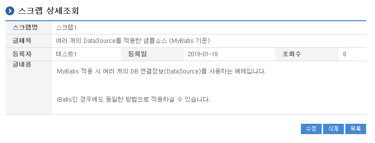
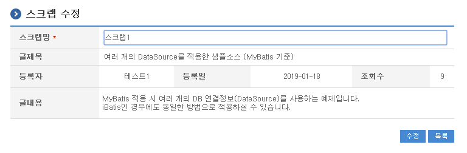

# 스크랩관리

## 개요

게시판에 등록된 글중에 특정 글들을 한 곳에 모아 조회할 수 있는 기능을 제공한다. 스크랩기능은 게시판생성관리 기능을 기반으로 운영된다.

- 기능흐름

  

## 설명

추가 선택사항을 사용하기 위해서는 기존 게시판생성관리 기능 및 게시판사용 기능의 수정이 선행되어야 한다.

### 패키지 참조 관계

스크랩관리 패키지는 요소기술의 공통 패키지(cmm)에 대해서 직접적인 함수적 참조 관계를 가진다. 하지만, 컴포넌트 배포 시 오류 없이 실행되기 위하여 패키지 간의 참조관계에 따라 협업의 공통기능(com), 디자인템플릿과 함께 배포 파일을 구성한다.

- 패키지 간 참조 관계 : [게시판, 커뮤니티, 동호회 Package Dependency](../intro/package-reference.md#협업)

### 관련소스

| 유형 | 대상소스 | 비고 |
| --- | --- | --- |
| Controller | egovframework.com.cop.scp.web.EgovArticleScrapController.java | 스크랩기능을 위한 컨트롤러 클래스 |
| Service | egovframework.com.cop.scp.service.EgovArticleScrapService.java | 스크랩기능을 위한 서비스 인터페이스 |
| ServiceImpl | egovframework.com.cop.scp.service.impl.EgovArticleScrapServiceImpl.java | 스크랩기능을 위한 서비스 구현 클래스 |
| VO | egovframework.com.cop.scp.service.Scrap.java | 스크랩기능을 위한 모델 클래스 |
| VO | egovframework.com.cop.scp.service.ScrapVO.java | 스크랩기능을 위한 VO 클래스 |
| DAO | egovframework.com.cop.scp.service.impl.EgovArticleScrapDAO.java | 스크랩기능을 위한 데이터처리 클래스 |
| JSP | /WEB-INF/jsp/egovframework/com/cop/scp/EgovArticleScrapList.jsp | 스크랩기능을 위한 목록조회 jsp페이지 |
| JSP | /WEB-INF/jsp/egovframework/com/cop/scp/EgovArticleScrapRegist.jsp | 스크랩기능을 위한 등록 jsp페이지 |
| JSP | /WEB-INF/jsp/egovframework/com/cop/scp/EgovArticleScrapDetail.jsp | 스크랩기능을 위한 상세조회 jsp페이지 |
| JSP | /WEB-INF/jsp/egovframework/com/cop/scp/EgovArticleScrapUpdt.jsp | 스크랩기능을 위한 수정 jsp페이지 |
| Query XML | resources/egovframework/mapper/com/cop/scp/EgovArticleScrap_SQL_mysql.xml | 스크랩기능을 위한 MySQL용 Query XML 파일 |
| Query XML | resources/egovframework/mapper/com/cop/scp/EgovArticleScrap_SQL_cubrid.xml | 스크랩기능을 위한 Cubrid용 Query XML 파일 |
| Query XML | resources/egovframework/mapper/com/cop/scp/EgovArticleScrap_SQL_oracle.xml | 스크랩기능을 위한 Oracle용 Query XML 파일 |
| Query XML | resources/egovframework/mapper/com/cop/scp/EgovArticleScrap_SQL_tibero.xml | 스크랩기능을 위한 Tibero용 Query XML 파일 |
| Query XML | resources/egovframework/mapper/com/cop/scp/EgovArticleScrap_SQL_altibase.xml | 스크랩기능을 위한 Altibase용 Query XML 파일 |
| Query XML | resources/egovframework/mapper/com/cop/scp/EgovArticleScrap_SQL_maria.xml | 스크랩기능을 위한 MariaDB용 Query XML 파일 |
| Query XML | resources/egovframework/mapper/com/cop/scp/EgovArticleScrap_SQL_postgres.xml | 스크랩기능을 위한 PostgreSQL용 Query XML 파일 |
| Query XML | resources/egovframework/mapper/com/cop/scp/EgovArticleScrap_SQL_goldilocks.xml | 스크랩기능을 위한 Goldilocks용 Query XML 파일 |
| Message properties | resources/egovframework/message/com/cop/scp/message_ko.properties | 스크랩기능을 위한 Message properties(한글) |
| Message properties | resources/egovframework/message/com/cop/scp/message_en.properties | 스크랩기능을 위한 Message properties(영문) |
| Idgen XML | resources/egovframework/spring/com/idgn/context-idgn-Scrap.xml | 스크랩기능을 위한 Id생성 Idgen XML |

### 클래스 다이어그램



### ID Generation

#### ID Generation 관련 DDL 및 DML

ID Generation Service를 활용하기 위해서 Sequence 저장테이블인 COMTECOPSEQ에 SCRAP_ID 항목을 추가해야 한다.

```sql
CREATE TABLE COMTECOPSEQ(
              TABLE_NAME            VARCHAR(20) NOT NULL,
              NEXT_ID               NUMERIC(30) NULL,
              PRIMARY KEY (TABLE_NAME));
 
INSERT INTO COMTECOPSEQ ( TABLE_NAME, NEXT_ID ) VALUES ('SCRAP_ID', 1);
```

#### ID Generation 환경설정(context-idgn-Scrap.xml)

```xml
<bean name="egovScrapIdGnrService"
      class="org.egovframe.rte.fdl.idgnr.impl.EgovTableIdGnrServiceImpl"
      destroy-method="destroy">
      <property name="dataSource" ref="egov.dataSource" />
      <property name="strategy" ref="scrapStrategy" />
      <property name="blockSize" 	value="10"/>
      <property name="table"	   	value="COMTECOPSEQ"/>
      <property name="tableName"	value="SCRAP_ID"/>
</bean>
<bean name="scrapStrategy"
      class="org.egovframe.rte.fdl.idgnr.impl.strategy.EgovIdGnrStrategyImpl">
      <property name="prefix" value="SCRIP_" />
      <property name="cipers" value="14" />
      <property name="fillChar" value="0" />
</bean>
```

### 관련테이블

| 테이블명 | 테이블명(영문) | 비고 |
| --- | --- | --- |
| 스크랩 | COMTNSCRAP | 스크랩 정보를 관리한다. |

## 관련기능

스크랩관리는 스크랩 등록, 스크랩 목록조회, 스크랩 상세조회, 스크랩 수정 기능으로 구분되어 있다.

### 스크랩 등록

#### 비즈니스 규칙

일반 게시판, 커뮤니티 및 동호회의 게시판의 게시물에 대해 스크랩을 등록할 수 있는 기능버튼을 제공한다. 스크랩이 정상적으로 등록되면 스크랩 목록조회 화면으로 이동한다.

#### 관련코드

N/A

#### 관련화면 및 수행매뉴얼

| Action | URL | Controller method | SQL Namespace | SQL QueryID |
| --- | --- | --- | --- | --- |
| 등록화면 | /cop/scp/insertArticleScrapView.do | insertArticleScrapView | "BBSArticle" | "selectArticleDetail" |
| 등록 | /cop/scp/insertArticleScrap.do | insertArticleScrap | "ArticleScrap" | "insertArticleScrap" |



게시글에서 스크랩 버튼을 선택하면 다음과 같이 스크랩 등록화면으로 이동한다.



등록: 입력한 스크랩정보를 저장 처리한다.

목록: 스크랩 목록으로 돌아간다.

### 스크랩 목록조회

#### 비즈니스 규칙

스크랩 목록화면은 현재 사용자가 등록한 스크랩에 대한 목록을 제공한다.

#### 관련코드

N/A

#### 관련화면 및 수행매뉴얼

| Action | URL | Controller method | SQL Namespace | SQL QueryID |
| --- | --- | --- | --- | --- |
| 목록조회 | /cop/scp/selectArticleScrapList.do | selectArticleScrapList | "ArticleScrap" | "selectArticleScrapList" |
| | | | "ArticleScrap" | "selectArticleScrapListCnt" |

스크랩 목록은 페이지당 10건씩 조회되며 페이징은 10페이지씩 이루어진다.

페이지당 검색 범위를 변경하고자 하는 경우 context-properties.xml 파일의 pageUnit, pageSize를 변경한다.(단 해당 설정은 전체 공통서비스 기능에 영향을 미친다.)



조회: 조회하기 위해서는 상단의 검색조건을 선택 후 해당하는 검색문자를 입력 후 조회 버튼을 클릭한다.

목록클릭: 스크랩 상세조회 화면으로 이동한다.

### 스크랩 상세조회

#### 비즈니스 규칙

스크랩 상세조회는 스크랩에 정보(제목)뿐만 아니라 해당 게시글에 대한 전체 정보를 제공한다. 해당 게시글에 정보가 변경된 경우 스크랩 상세조회에 나오는 내용도 변경이 된다.

#### 관련코드

N/A

#### 관련화면 및 수행매뉴얼

| Action | URL | Controller method | SQL Namespace | SQL QueryID |
| --- | --- | --- | --- | --- |
| 상세조회 | /cop/scp/selectArticleScrapDetail.do | selectArticleScrapDetail | "ArticleScrap" | "selectArticleScrapDetail" |
| 삭제 | /cop/scp/deleteArticleScrap.do | deleteArticleScrap | "ArticleScrap" | "deleteArticleScrap" |



수정: 수정버튼 클릭 시 스크랩 수정 화면으로 이동한다.

삭제: 삭제버튼 클릭 시 삭제여부를 확인하는 메시지를 보여주고 삭제처리를 할 수 있다.

목록: 스크랩 목록 화면으로 이동한다.

### 스크랩 수정

#### 비즈니스 규칙

스크랩에 대한 수정은 스크랩 자체 정보(제목)에 대한 수정만을 제공한다.

#### 관련코드

N/A

#### 관련화면 및 수행매뉴얼

| Action | URL | Controller method | SQL Namespace | SQL QueryID |
| --- | --- | --- | --- | --- |
| 수정화면 | /cop/scp/updateArticleScrapView.do | updateArticleScrapView | "ArticleScrap" | "selectArticleScrapDetail" |
| 수정 | /cop/scp/updateArticleScrap.do | updateArticleScrap | "ArticleScrap" | "updateArticleScrap" |



수정: 수정된 정보들이 저장 처리된다.

목록: 스크랩 목록 화면으로 이동한다.
