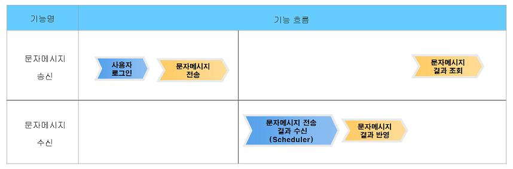
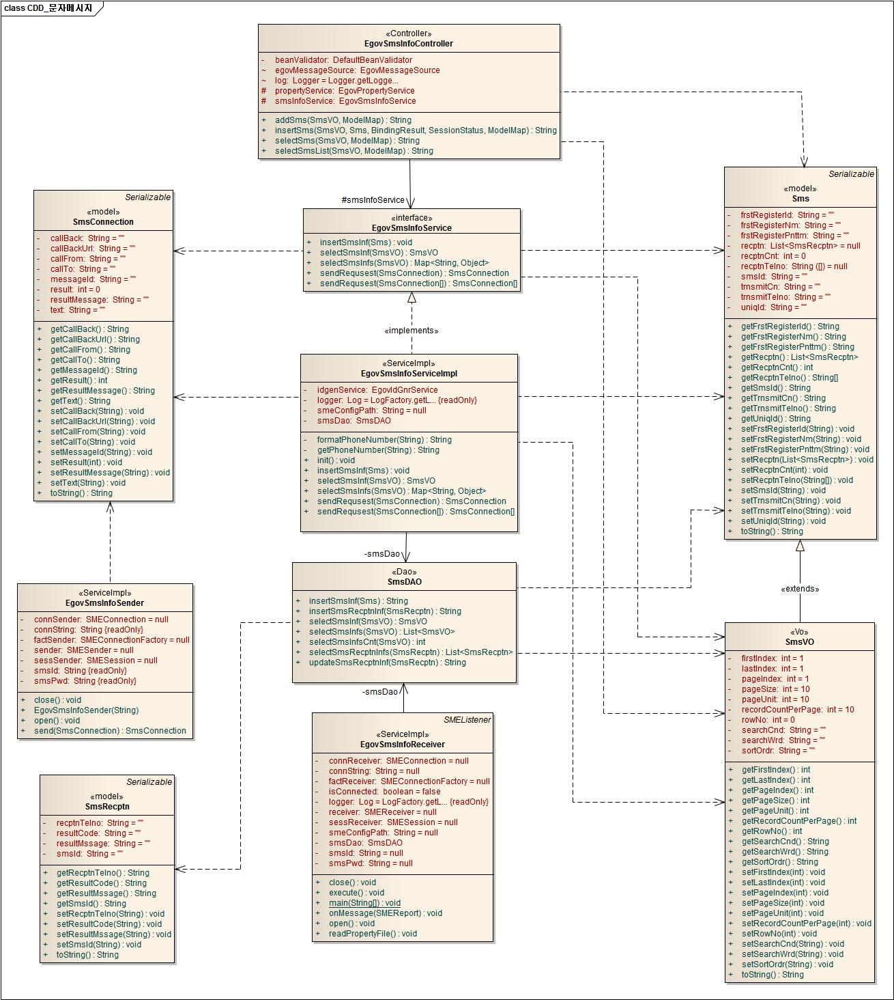
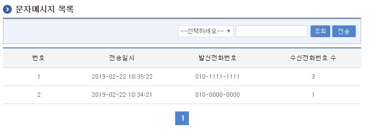
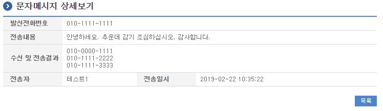
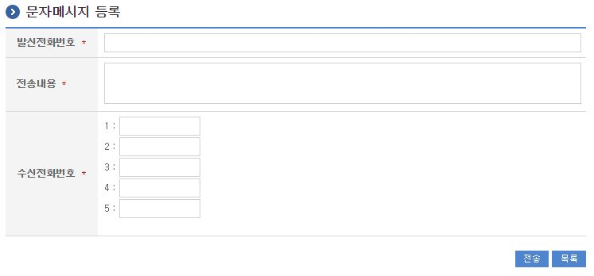

# 문자메시지서비스

## 개요

문자메시지서비스는 전자정부 SMS 서비스(모바일 전자정부 M-Gov)를 이용하기 위한 문자메시지 전송 인터페이스를 제공하며 별도의 M-Gov 신청을 통해 사용할 수 있다.

- 기능흐름

  

전자정부 표준프레임워크 등의 프레임워크를 사용하지 않는 경우는 [SMS 서비스](#)를 참조하여 적용한다.

## 전제조건

문자메시지서비스를 사용하기 위해서는 별도로 전자정부 SMS 서비스(모바일 전자정부 M-Gov)를 신청하여야 하며, 이는 행정안전부 정보통합전산센터에서 주관하고 있다.

서비스 신청 절차는 다음과 같다.

① 서비스이용신청 : 서비스 종류에 따라 별지 1호 내지 3호 서식(해당 사이트 이용규정 참조)의 이용신청서를 센터에 제출

② 이용통보 : 검토 결과를 접수일로부터 15일 이내에 이용신청기관에게 서면으로 통보

③ 서비스준비 : 이용신청기관은 센터에서 제공하는 “M-Gov 연동 API“를 사용하여 연동

④ 서비스개통 : 이용신청기관은 승인 후 60일 이내에 서비스 개통을 하지 않을 경우 센터는 이용통보를 취소할 수 있음

기타 자세한 정보 확인 및 문의는 모바일 전자정부 M-gov(https://www.mgov.go.kr)를 참고한다.

## 설명

공통컴포넌트에서 제공하는 문자메시지서비스는 “M-Gov 연동 API“를 통해 SMS서비스를 제공할 뿐만 아니라 전송에 대한 이력 관리를 제공한다. (이력 관리가 필요없는 경우를 위해 별도의 메소드를 제공하고 있으나 송신 결과에 대한 내용을 확인할 수 없음)

### 패키지 참조 관계

문자메시지서비스 패키지는 요소기술의 공통(cmm) 패키지에 대해서만 직접적인 함수적 참조 관계를 가진다. 하지만, 컴포넌트 배포 시 오류 없이 실행되기 위하여 패키지 간의 참조관계에 따라 포맷/날짜/계산 패키지와 함께 배포 파일을 구성한다.

- 패키지 간 참조 관계 : [협업-게시판, 커뮤니티, 동호회 Package Dependency](../intro/package-reference.md/#협업)

### 관련소스

| 유형 | 대상소스 | 비고 |
| --- | --- | --- |
| Controller | egovframework.com.cop.sms.web.EgovSmsInfoController.java | 문자메시지서비스를 위한 컨트롤러 클래스 |
| Service | egovframework.com.cop.sms.service.EgovSmsInfoService.java | 문자메시지서비스를 위한 서비스 인터페이스 |
| ServiceImpl | egovframework.com.cop.sms.service.impl.EgovSmsInfoServiceImpl.java | 문자메시지서비스를 위한 서비스 구현 클래스 |
| ServiceImpl | egovframework.com.cop.sms.service.impl.EgovSmsInfoSender.java | 문자메시지 연동 처리를 위한 클래스 |
| ServiceImpl | egovframework.com.cop.sms.service.impl.EgovSmsInfoReceiver.java | 문자메시지 연동 결과 수신 처리를 위한 클래스 |
| Model | egovframework.com.cop.sms.service.Sms.java | 문자메시지서비스를 위한 모델 클래스 |
| Model | egovframework.com.cop.sms.service.SmsConnection.java | 문자메시지서비스를 위한 모델 클래스 (연결정보) |
| VO | egovframework.com.cop.sms.service.SmsVO.java | 문자메시지서비스를 위한 VO 클래스 |
| VO | egovframework.com.cop.sms.service.SmsRecptn.java | 문자메시지서비스를 위한 모델 클래스 (수신정보) |
| DAO | egovframework.com.cop.sms.service.impl.SmsDAO.java | 문자메시지서비스를 위한 데이터처리 클래스 |
| JSP | /WEB-INF/jsp/egovframework/com/cop/sms/EgovSmsInfoList.jsp | 문자메시지서비스를 위한 목록조회 jsp페이지 |
| JSP | /WEB-INF/jsp/egovframework/com/cop/sms/EgovSmsInfoRegist.jsp | 문자메시지서비스를 위한 등록 jsp페이지 |
| JSP | /WEB-INF/jsp/egovframework/com/cop/sms/EgovSmsInfoDetail.jsp | 문자메시지서비스를 위한 상세조회 jsp페이지 |
| Query XML | resources/egovframework/mapper/com/cop/sms/EgovSms_SQL_altibase.xml | 문자메시지서비스를 위한 Altibase용 Query 파일 |
| Query XML | resources/egovframework/mapper/com/cop/sms/EgovSms_SQL_cubrid.xml | 문자메시지서비스를 위한 Cubrid용 Query 파일 |
| Query XML | resources/egovframework/mapper/com/cop/sms/EgovSms_SQL_maria.xml | 문자메시지서비스를 위한 Maria용 Query 파일 |
| Query XML | resources/egovframework/mapper/com/cop/sms/EgovSms_SQL_mysql.xml | 문자메시지서비스를 위한 Mysql용 Query 파일 |
| Query XML | resources/egovframework/mapper/com/cop/sms/EgovSms_SQL_oracle.xml | 문자메시지서비스를 위한 Oracle용 Query 파일 |
| Query XML | resources/egovframework/mapper/com/cop/sms/EgovSms_SQL_postgres.xml | 문자메시지서비스를 위한 Postgres용 Query 파일 |
| Query XML | resources/egovframework/mapper/com/cop/sms/EgovSms_SQL_Tibero.xml | 문자메시지서비스를 위한 Tibero용 Query 파일 |
| Query XML | resources/egovframework/mapper/com/cop/sms/EgovSms_SQL_goldilocks.xml | 문자메시지서비스를 위한 Goldilocks용 Query 파일 |
| Validator Rule XML | resources/egovframework/validator/validator-rules.xml | Validator Rule을 정의한 XML |
| Validator XML | resources/egovframework/validator/com/uss/olp/cns/EgovCnsltManage.xml | 문자메시지서비스를 위한 Validator XML |
| Message properties | resources/egovframework/message/com/cop/sms/message_ko.properties | 문자메시지서비스를 위한 Message properties(한글) |
| Message properties | resources/egovframework/message/com/cop/sms/message_en.properties | 문자메시지서비스를 위한 Message properties(영문) |
| Idgen XML | resources/egovframework/spring/com/idgn/context-idgn-Sms.xml | 문자메시지서비스를 위한 Id생성 Idgen XML |

### 관련 클래스 다이어그램



### ID Generation

#### ID Generation 관련 DDL 및 DML

ID Generation Service를 활용하기 위해서 Sequence 저장테이블인 COMTECOPSEQ에 SMS_ID 항목을 추가해야 한다.

```sql
CREATE TABLE COMTECOPSEQ
(
    TABLE_NAME            VARCHAR(20) NOT NULL,
    NEXT_ID               NUMERIC(30) NULL,
    PRIMARY KEY (TABLE_NAME)
);

INSERT INTO COMTECOPSEQ ( TABLE_NAME, NEXT_ID ) VALUES ('SMS_ID', 1);
```

#### ID Generation 환경설정(context-idgn-Sms)

```xml
<bean name="egovSmsIdGnrService" class="egovframework.rte.fdl.idgnr.impl.EgovTableIdGnrServiceImpl" destroy-method="destroy">
    <property name="dataSource" ref="egov.dataSource" />
    <property name="strategy"   ref="smsStrategy" />
    <property name="blockSize"  value="10"/>
    <property name="table"      value="COMTECOPSEQ"/>
    <property name="tableName"  value="SMS_ID"/>
</bean>
<bean name="smsStrategy" class="egovframework.rte.fdl.idgnr.impl.strategy.EgovIdGnrStrategyImpl">
    <property name="prefix"   value="SMS_" />
    <property name="cipers"   value="16" />
    <property name="fillChar" value="0" />
</bean>
```

### 관련테이블

| 테이블명 | 테이블명(영문) | 비고 |
| --- | --- | --- |
| 문자메시지 | COMTNSMS | 문자메시지 전송 정보를 관리한다. |
| 문자메시지수신 | COMTNSMSRECPTN | 문자메시지 수신 정보를 관리한다. |

### 환경설정

본 문자메시지서비스를 사용하기 위해서는 “M-Gov 연동 API“에서 제공하는 “SMEConfig.properties” 파일을 지정되어야 한다.

이를 지정하기 위해서는 globals.properties 속성 파일에 추가 속성을 설정하여야 한다.

globals.properties에 관련된 내용은 요소기술 [프로퍼티 및 명령어 쉘스크립트](#) 부분을 참조한다.

- Globals.SMEConfigPath 추가

  ```
  ...
  # 문자메시지서비스 환경 설정파일 위치(상대경로)
  Globals.SMEConfigPath = conf/SMEConfig.properties
  ...
  ```

참고로 SMEConfig.properties는 모바일 전자정부 M-Gov에서 제공하는 파일로 M-Gov 센터 정보 및 계정정보 등을 포함한다.

#### 전송결과 수신 scheduler 등록

전송에 대한 결과는 별도의 스케쥴러를 통해 반영된다. 해당 스케쥴러를 등록하기 위해서는 …/spring/com/context-scheduling-cop-sms.xml(예시)에 다음과 같은 스케쥴러를 등록한다.

```xml
<!-- SMS 전송 결과 수신 처리 -->
<bean id="smsInfoReceiver" class="org.springframework.scheduling.quartz.MethodInvokingJobDetailFactoryBean">
  <property name="targetObject" ref="EgovSmsInfoReceiver" />
  <property name="targetMethod" value="execute" />
  <property name="concurrent" value="false" />
</bean>

<bean id="smsInfoReceiverTrigger" class="org.springframework.scheduling.quartz.SimpleTriggerBean">
  <property name="jobDetail" ref="smsInfoReceiver" />
  <!-- 시작하고 1분후에 실행한다. (milisecond) -->
  <property name="startDelay" value="60000" />
  <!-- 매 60초마다 실행한다. (milisecond) 데몬 형식으로 계속 기동 중 -->
  <property name="repeatInterval" value="60000" />
</bean>

<bean id="smsInfoReceiverScheduler" class="org.springframework.scheduling.quartz.SchedulerFactoryBean">
  <property name="triggers">
    <list>
      <ref bean="smsInfoReceiverTrigger" />
    </list>
  </property>
</bean>
```

## 관련기능

문자메시지서비스는 문자메시지 목록조회, 문자메시지 상세조회, 문자메시지 전송 기능으로 구분되어 있다.

### 문자메시지 목록조회

#### 비즈니스 규칙

문자메시지 목록화면은 현재 사용자가 전송한 문자메시지에 대한 목록을 제공한다.

#### 관련코드

N/A

#### 관련화면 및 수행매뉴얼

| Action | URL | Controller method | SQL Namespace | SQL QueryID |
| --- | --- | --- | --- | --- |
| 목록조회 | /cop/sms/selectSmsList.do | selectSmsList | “SmsDAO” | “selectSmsInfs”, |
| | | | “SmsDAO” | “selectSmsInfsCnt” |

문자메시지 목록은 페이지당 10건씩 조회되며 페이징은 10페이지씩 이루어진다. 페이지당 검색 범위를 변경하고자 하는 경우 context-properties.xml 파일의 pageUnit, pageSize를 변경한다.(단 해당 설정은 전체 공통서비스 기능에 영향을 미친다.)



조회: 조회하기 위해서는 상단의 검색조건을 선택 후 해당하는 검색문자를 입력 후 조회 버튼을 클릭한다.

전송: 문자메시지 전송 화면으로 이동한다.

### 문자메시지 상세조회

#### 비즈니스 규칙

문자메시지 상세조회는 발신정보, 수신 및 전송결과 정보를 제공한다.

#### 관련코드

N/A

#### 관련화면 및 수행매뉴얼

| Action | URL | Controller method | SQL Namespace | SQL QueryID |
| --- | --- | --- | --- | --- |
| 상세조회 | /cop/sms/selectSms.do | selectSms | “SmsDAO” | “selectSmsInf” |



목록: 문자메시지 목록 화면으로 이동한다.

### 문자메시지 전송

#### 비즈니스 규칙

문자메시지 전송은 발신전화번호를 수신전화번호 등을 입력한다. 수신전화번호는 기본적으로 5개까지 입력가능하다.

#### 관련코드

N/A

#### 관련화면 및 수행매뉴얼

| Action | URL | Controller method | SQL Namespace | SQL QueryID |
| --- | --- | --- | --- | --- |
| 등록화면 | /cop/sms/addSms.do | addSms | | |
| 전송 | /cop/sms/insertSms.do | insertSms | “SmsDAO” | “insertSmsInf” |



전송: 입력한 문자메시지를 전송한다.

목록: 문자메시지 목록 화면으로 이동한다.