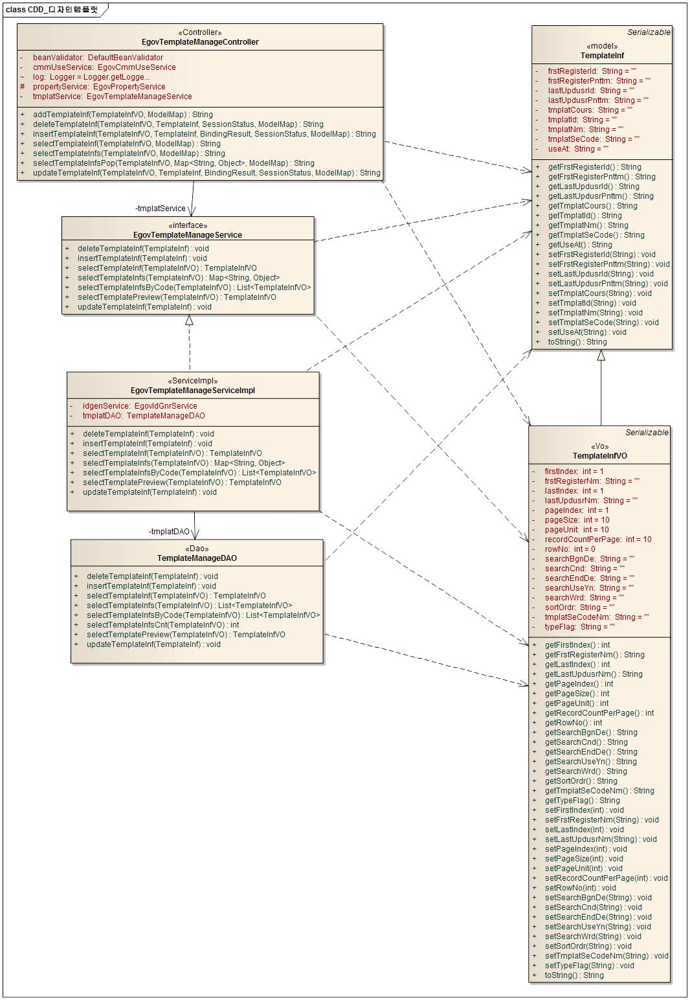
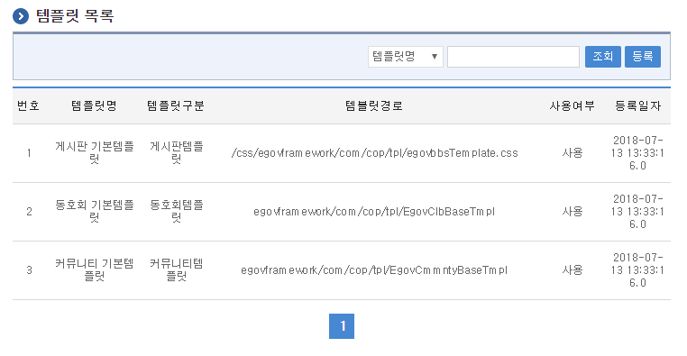
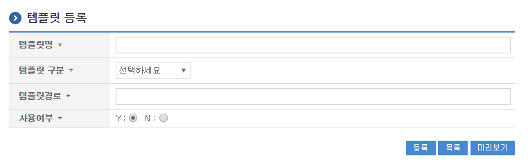
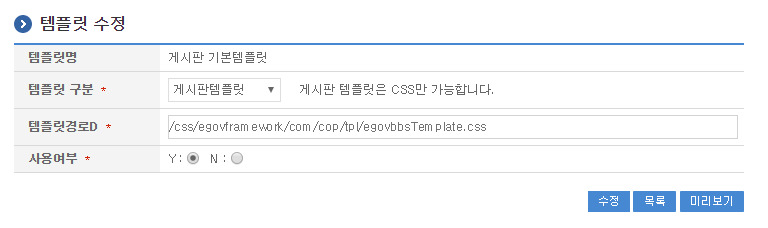
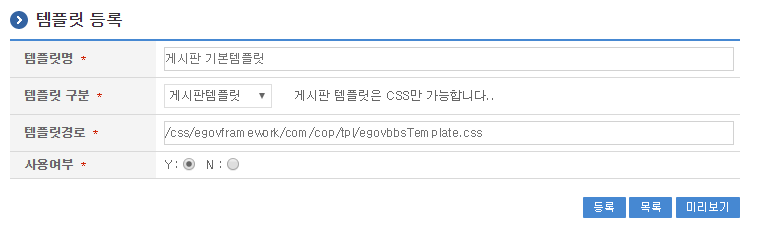

# 템플릿관리

## 개요

디자인 템플릿 기능은 게시판에 대한 디자인을 적용할 수 있는 기능을 제공한다.

## 설명

디자인 템플릿은 CSS를 기반으로 제공되며 게시판 생성시 지정하도록 되어 있고, 게시판 관리 기능을 통해 다른 템플릿으로 변경할 수 있다.

추가적으로 템플릿 등록, 삭제 등의 템플릿 관리 기능은 게시판 관리 또는 사용 기능과 분리되어 제공된다.

### 패키지 참조 관계

디자인템플릿 패키지는 요소기술의 공통 패키지(cmm)에 대해서만 직접적인 함수적 참조 관계를 가진다. 하지만, 컴포넌트 배포 시 오류 없이 실행되기 위하여 패키지 간의 참조관계에 따라 시스템(sim), 포맷/계산/변환, 협업의 공통기능(com), 게시판, 달력 패키지와 함께 배포 파일을 구성한다.

- 패키지 간 참조 관계 : [게시판, 커뮤니티, 동호회 Package Dependency](../intro/package-reference.md/#협업)

### 관련소스

| 유형 | 대상소스 | 비고 |
| --- | --- | --- |
| Controller | egovframework.com.cop.tpl.web.EgovTemplateManageController.java | 템플릿 관리를 위한 컨트롤러 클래스 |
| Service | egovframework.com.cop.tpl.service.EgovTemplateManageService.java | 템플릿 관리를 위한 서비스 인터페이스 |
| ServiceImpl | egovframework.com.cop.tpl.service.impl.EgovTemplateManageServiceImpl.java | 템플릿 관리를 위한 서비스 구현 클래스 |
| VO | egovframework.com.cop.tpl.service.TemplateInf.java | 템플릿 관리를 위한 모델 클래스 |
| VO | egovframework.com.cop.tpl.service.TemplateInfVO.java | 템플릿 관리를 위한 VO 클래스 |
| DAO | egovframework.com.cop.tpl.service.impl.TemplateManageDAO.java | 템플릿 관리를 위한 데이터처리 클래스 |
| JSP | /WEB-INF/jsp/egovframework/com/cop/tpl/EgovTemplateRegist.jsp | 템플릿 생성을 위한 jsp페이지 |
| JSP | /WEB-INF/jsp/egovframework/com/cop/tpl/EgovTemplateUpdt.jsp | 생성된 템플릿 수정을 위한 jsp페이지 |
| JSP | /WEB-INF/jsp/egovframework/com/cop/tpl/EgovTemplateList.jsp | 생성된 템플릿 조회를 위한 jsp페이지 |
| JSP | /WEB-INF/jsp/egovframework/com/cop/tpl/EgovTemplateInqirePopup.jsp | 템플릿 정보 팝업 조회를 위한 jsp페이지 |
| Query XML | resources/egovframework/mapper/com/cop/tpl/EgovTemplate_SQL_mysql.xml | 템플릿 관리를 MySQL용 위한 Query XML |
| Query XML | resources/egovframework/mapper/com/cop/tpl/EgovTemplate_SQL_cubrid.xml | 템플릿 관리를 Cubrid용 위한 Query XML |
| Query XML | resources/egovframework/mapper/com/cop/tpl/EgovTemplate_SQL_oracle.xml | 템플릿 관리를 Oracle용 위한 Query XML |
| Query XML | resources/egovframework/mapper/com/cop/tpl/EgovTemplate_SQL_tibero.xml | 템플릿 관리를 위한 Tibero용 Query XML |
| Query XML | resources/egovframework/mapper/com/cop/tpl/EgovTemplate_SQL_altibase.xml | 템플릿 관리를 위한 Altibase용 Query XML |
| Query XML | resources/egovframework/mapper/com/cop/tpl/EgovTemplate_SQL_maria.xml | 템플릿 관리를 위한 Maria용 Query XML |
| Query XML | resources/egovframework/mapper/com/cop/tpl/EgovTemplate_SQL_postgres.xml | 템플릿 관리를 위한 PostgreSQL용 Query XML |
| Query XML | resources/egovframework/mapper/com/cop/tpl/EgovTemplate_SQL_goldilocks.xml | 템플릿 관리를 위한 Goldilocks용 Query XML |
| Message properties | resources/egovframework/message/com/cop/tpl/message_ko.properties | 템플릿 관리 Message properties(한글) |
| Message properties | resources/egovframework/message/com/cop/tpl/message_en.properties | 템플릿 관리 Message properties(영문) |
| Validator Rule XML | resources/egovframework/validator/validator-rules.xml | Validator Rule을 정의한 XML |
| Idgen XML | resources/egovframework/spring/com/idgn/context-idgn-Tmplat.xml | 템플릿 관리를위한 Id생성 Idgen XML |

### 클래스 다이어그램



### ID Generation

#### ID Generation 관련 DDL 및 DML

ID Generation Service를 활용하기 위해서 Sequence 저장테이블인 COMTECOPSEQ에 TMPLAT_ID 항목을 추가해야 한다.

```sql
CREATE TABLE COMTECOPSEQ ( table_name varchar(16) NOT NULL, 
                next_id DECIMAL(30) NOT NULL,
  		          PRIMARY KEY (table_name));
 
INSERT INTO COMTECOPSEQ VALUES('TMPLAT_ID','0');
```

#### ID Generation 환경설정(context-idgn-Tmplat.xml)

```xml
<bean name="egovTmplatIdGnrService"
      class="egovframework.rte.fdl.idgnr.impl.EgovTableIdGnrService"
      destroy-method="destroy">
      <property name="dataSource" ref="egov.dataSource" />
      <property name="strategy" ref="tmplatStrategy" />
      <property name="blockSize" 	value="10"/>
      <property name="table"	   	value="COMTECOPSEQ"/>
      <property name="tableName"	value="TMPLAT_ID"/>
</bean>
<bean name="tmplatStrategy"
      class="egovframework.rte.fdl.idgnr.impl.strategy.EgovIdGnrStrategyImpl">
      <property name="prefix" value="TMPLAT_" />
      <property name="cipers" value="13" />
      <property name="fillChar" value="0" />
</bean>
```

### 관련테이블

| 테이블명 | 테이블명(영문) | 비고 |
| --- | --- | --- |
| 템플릿 | COMTNTMPLATINFO | 템플릿 정보 관리한다. |

## 관련기능

디자인템플릿은 템플릿 목록조회, 템플릿 등록, 템플릿 수정, 게시판 기본 템플릿, 게시판 템플릿 활용 기능으로 구분되어 있다.

### 템플릿 목록조회

#### 비즈니스 규칙

검색조건은 템플릿명, 템플릿구분에 대해서 수행된다. 템플릿 목록은 페이지 당 10건씩 조회되며 페이징은 10페이지씩 이루어진다.

#### 관련코드

N/A

#### 관련화면 및 수행매뉴얼

| Action | URL | Controller method | QueryID |
| --- | --- | --- | --- |
| 목록조회 | /cop/tpl/selectTemplateInfs.do | selectTemplateInfs | “TemplateManageDAO.selectTemplateInfs”, |
| | | | “TemplateManageDAO.selectTemplateInfsCnt” |
| 팝업 목록조회 | /cop/tpl/selectTemplateInfsPop.do | selectTemplateInfsPop | “TemplateManageDAO.selectTemplateInfs” |



신규 템플릿을 생성하기 위해서는 상단의 등록 버튼을 통해서 템플릿 등록 화면으로 이동한다.

기존 템플릿의 속성정보를 수정하고자 하는 경우 해당 템플릿 명을 클릭하여 상세 조회 및 수정기능을 제공하는 템플릿 수정 화면으로 이동한다.

### 템플릿 등록

#### 비즈니스 규칙

템플릿에 대한 보를 입력한 뒤 템플릿을 등록한다. 성공적으로 등록되면 템플릿 목록조회 화면으로 이동한다.

템플릿을 등록하기 위해서는 서버에 경로에 해당되는 템플릿 파일(CSS 또는 JSP)이 등록되어 있어야 한다. 또한 미리보기 버튼을 통해 템플릿 미리보기를 확인할 수 있다.

#### 템플릿 경로설정

동호회 및 커뮤니티 템플릿 등록 시 해당 템플릿(JSP 파일)의 경로를 “egovframework/com/cop/tpl/” 아래로 지정한다.

게시판 템플릿 등록 시 해당 템플릿(CSS 파일)의 경로를 ”/css/egovframework/com/cop/tpl/” 아래로 지정한다.

```text
동호회 기본템플릿 경로: "egovframework/com/cop/tpl/EgovClbBaseTmpl" 
커뮤니티 기본템플릿 경로: "egovframework/com/cop/tpl/EgovCmmntyBaseTmpl" 
게시판 기본템플릿 경로: "/css/egovframework/com/cop/tpl/egovbbsTemplate.css"
```

#### 관련코드

N/A

#### 관련화면 및 수행매뉴얼

| Action | URL | Controller method | QueryID |
| --- | --- | --- | --- |
| 등록화면 | /cop/tpl/addTemplateInf.do | addTemplateInf | |
| 등록 | /cop/tpl/insertTemplateInf.do | insertTemplateInf | “TemplateManageDAO.insertTemplateInf” |



목록: 템플릿 목록 화면으로 이동한다.

저장: 입력한 템플릿 정보들이 저장 처리된다.

미리보기: 템플릿 미리보기 화면을 보여준다.

### 템플릿 수정

#### 비즈니스 규칙

템플릿의 정보중 변경이 가능한 정보를 입력한 뒤 수정 버튼을 누르면 템플릿의 정보가 변경하며 템플릿 목록조회 화면으로 이동한다. 미리보기 버튼을 누르는 경우 템플릿에 대한 미리보기 기능을 제공한다.

#### 관련코드

N/A

#### 관련화면 및 수행매뉴얼

| Action | URL | Controller method | QueryID |
| --- | --- | --- | --- |
| 수정 | /cop/tpl/updateTemplateInf.do | updateTemplateInf | “TemplateManageDAO.updateTemplateInf” |



저장: 수정된 정보들이 저장 처리된다.

목록: 템플릿 목록 화면으로 이동한다.

미리보기: 템플릿 미리보기 화면을 보여준다.

### 게시판 기본 템플릿

기본적으로 제공되는 게시판 템플릿 경로는 다음과 같다.

```text
/css/egovframework/com/cop/tpl/egovbbsTemplate.css
```

기본 템플릿은 다음과 같이 정보를 등록하면 된다.



또는 DB에 다음과 같이 직접 등록도 가능하다.

```sql
INSERT INTO COMTNTMPLATINFO
(TMPLAT_ID, TMPLAT_NM, TMPLAT_SE_CODE, TMPLAT_COURS, USE_AT, FRST_REGISTER_ID, FRST_REGISTER_PNTTM )
VALUES
('TMPLAT_BOARD_DEFAULT', '게시판 기본템플릿', 'TMPT01', '/css/egovframework/cop/bbs/egovbbsTemplate.css', 
'Y', 'SYSTEM', SYSDATE)
```

### 게시판 템플릿 활용

기본적으로 제공되는 게시판 템플릿은 다음과 같다.

```css
/* Border */
div#border {
	width: 730px;
}
 
/* 리스트 테이블 */
.listTable{BORDER-TOP: #1A90D8 2px solid; BORDER-bottom: #BABABA 1px solid;border-collapse: collapse;}
  .listTable th{BORDER-bottom: #A3A3A3 1px solid; padding-left:2px;padding-right:2px;background-color: #E4EAF8; height:20px;}
  .listTable td{BORDER-bottom: #E0E0E0 1px solid; padding-left:2px;padding-right:2px;background-color: #F7F7F7; height:20px;}
 
/* 리스트 타이틀 */
.listTitle{font-family:"돋움"; font-size:9pt; color:#000000 ; 
        font-weight: bold ; vertical-align: middle}
 
/* 리스트 내용 */
.listCenter {font-size:9pt; color:#000000; font-family:"돋움, Arial"; height:24px; text-align:center; vertical-align:middle;}
.listLeft {font-size:9pt; color:#000000; font-family:"돋움, Arial"; height:24px; text-align:left; vertical-align:middle;}
.listRight {font-size:9pt; color:#000000; font-family:"돋움, Arial"; height:24px; text-align:right; vertical-align:middle;}
 
/* 일반 테이블 */
.generalTable{BORDER-TOP: #D2D4D1 1px solid;BORDER-bottom: #D2D4D1 1px solid;BORDER-left: #D2D4D1 1px solid;
              BORDER-right: #D2D4D1 1px solid; border-collapse: collapse;}
  .generalTable th{padding-left:2px;padding-right:5px;background-color: #E4EAF8; Text-align: right ;}
  .generalTable td{padding-left:2px;padding-right:5px;background-color: #F7F7F7;}
 
/* 강조 내용 */
.emphasisCenter {font-family:"돋움"; font-size:9pt; color:#2E4B90 ; font-weight: bold ; padding-right:3px; text-align: 
                 center ; vertical-align: middle}
.emphasisLeft {font-family:"돋움"; font-size:9pt; color:#2E4B90 ; font-weight: bold ; padding-right:3px; text-align: left; 
               vertical-align: middle}
.emphasisRight {font-family:"돋움"; font-size:9pt; color:#2E4B90 ; font-weight: bold ; padding-right:3px; text-align: right; 
                vertical-align: middle}
```

각 Class의 의미는 다음과 같으며 Class 요소를 변경하여 적용하므로서 게시판 디자인을 일괄 변경할 수 있다.

| Class ID | 설명 | 비고 |
| --- | --- | --- |
| div#border | 전체 width를 적용하기 위해 CSS | |
| listTable | 목록 리스트 테이블을 위한 CSS | |
| listTable th | 목록 리스트 테이블 요소 중 th tag에 적용되는 CSS | 테이블 헤더 |
| listTable td | 목록 리스트 테이블 요소 중 td tag에 적용되는 CSS | |
| listTitle | 목록 리스트 테이블 요소 중 제목 부분을 위한 CSS | |
| listCenter | 목록 리스트 테이블에 대한 일반 항목으로 중간정렬을 위한 CSS | |
| listLeft | 목록 리스트 테이블에 대한 일반 항목으로 왼쪽정렬을 위한 CSS | |
| listRight | 목록 리스트 테이블에 대한 일반 항목으로 오른쪽정렬을 위한 CSS | |
| generalTable | 일반 테이블(상세보기 등)을 위한 CSS | |
| generalTable th | 일반 테이블 요소 중 th tag에 적용되는 CSS | 테이블 헤더 |
| generalTable td | 일반 테이블 요소 중 td tag에 적용되는 CSS | |
| emphasisCenter | 필수입력 항목과 같은 강조 항목을 위한 CSS | |
| emphasisLeft | 필수입력 항목과 같은 강조 항목을 위한 CSS | |
| emphasisRight | 필수입력 항목과 같은 강조 항목을 위한 CSS | |

## 참고자료

게시판 템플릿 참조 : [게시판템플릿](#)

커뮤니티 템플릿 참조 : [커뮤니티템플릿](#)