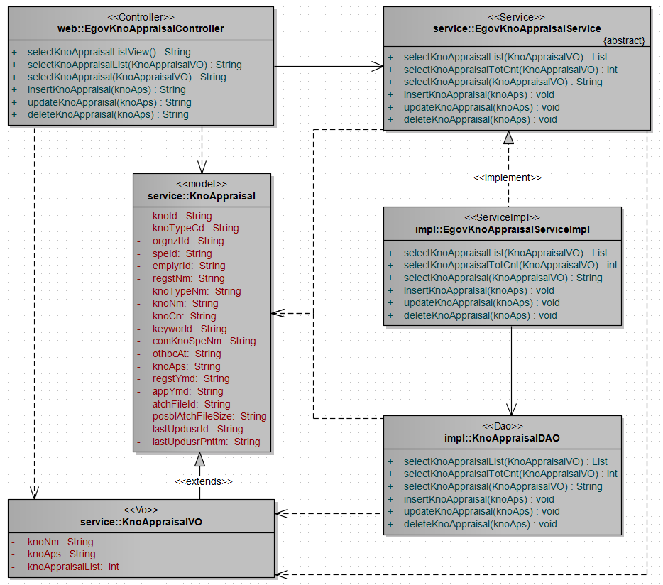
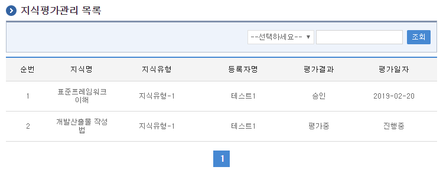
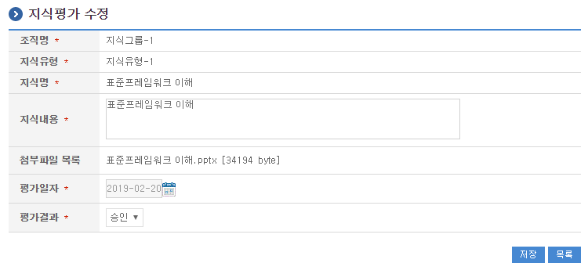
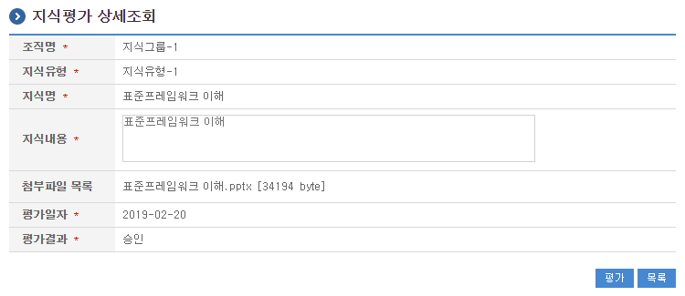

# 지식평가관리

## 개요

 지식평가관리는 필요지식을 생성하여 시스템에 등록할 때, 전문가의 평가를 거치는 기능을 제공한다.

## 설명

 지식평가관리는 필요지식을 생성하여 시스템에 등록할 때, 전문가의 평가하기 위한 목적으로 지식평가의 수정, 삭제, 상세조회, 목록조회의 기능을 수반한다.

 ① 지식평가목록조회 : 지식평가 정보를 최근 등록 순서대로 조회하고, 그 결과 목록을 화면에 반영한다.
 ② 지식평가수정 : 기 등록된 지식평가정보의 항목들을 수정한다.
 ③ 지식평가삭제 : 기 등록된 지식평가정보를 삭제한다.
 ④ 지식평가상세조회 : 등록된 지식평가정보를 상세 조회한다.

### 관련소스

| 유형 | 대상소스명 | 비고 |
| --- | --- | --- |
| Controller | egovframework.com.dam.app.web.EgovKnoAppraisalController.java | 지식평가 관리를 위한 컨트롤러 클래스 |
| Service | egovframework.com.dam.app.service.EgovKnoAppraisalService.java | 지식평가 관리를 위한  서비스 인터페이스 |
| ServiceImpl | egovframework.com.dam.app.service.impl.EgovKnoAppraisalServiceImpl.java | 지식평가 관리를 위한 서비스 구현 클래스 |
| DAO | egovframework.com.dam.app.service.impl.KnoAppraisalDAO.java | 지식평가 관리를 위한 데이터처리 클래스 |
| Model | egovframework.com.dam.app.service.KnoAppraisal.java | 지식평가 관리를 위한 Model 클래스 |
| VO | egovframework.com.dam.app.service.KnoAppraisalVO.java | 지식평가 관리를 위한 VO 클래스 |
| JSP | /WEB-INF/jsp/egovframework/com/dam/app/EgovComDamAppraisalList.jsp | 지식평가 목록조회를 위한 jsp페이지 |
| JSP | /WEB-INF/jsp/egovframework/com/dam/app/EgovComDamAppraisalModify.jsp | 지식평가 수정를 위한 jsp페이지 |
| JSP | /WEB-INF/jsp/egovframework/com/dam/app/EgovComDamAppraisalDetail.jsp | 등록된 지식평가을 조회하기 위한 jsp페이지 |
| Query XML | resources/egovframework/mapper/com/dam/app/EgovDamKnoAppraisal\_SQL\_altibase.xml | 지식평가 관리를 위한 Altibase용 Query XML |
| Query XML | resources/egovframework/mapper/com/dam/app/EgovDamKnoAppraisal\_SQL\_cubrid.xml | 지식평가 관리를 위한 Cubrid용 Query XML |
| Query XML | resources/egovframework/mapper/com/dam/app/EgovDamKnoAppraisal\_SQL\_maria.xml | 지식평가 관리를 위한 MariaDB용 Query XML |
| Query XML | resources/egovframework/mapper/com/dam/app/EgovDamKnoAppraisal\_SQL\_mysql.xml | 지식평가 관리를 위한 MySQL용 Query XML |
| Query XML | resources/egovframework/mapper/com/dam/app/EgovDamKnoAppraisal\_SQL\_oracle.xml | 지식평가 관리를 위한 Oracle용 Query XML |
| Query XML | resources/egovframework/mapper/com/dam/app/EgovDamKnoAppraisal\_SQL\_postgres.xml | 지식평가 관리를 위한 PostgreSQL용 Query XML |
| Query XML | resources/egovframework/mapper/com/dam/app/EgovDamKnoAppraisal\_SQL\_tibero.xml | 지식평가 관리를 위한 Tibero용 Query XML |
| Query XML | resources/egovframework/mapper/com/dam/app/EgovDamKnoAppraisal\_SQL\_goldilocks.xml | 지식평가 관리를 위한 Goldilocks용 Query XML |
| Message properties | resources/egovframework/message/com/dam/app/message\_en.properties | 지식평가 관리를 위한 Message properties(영문) |
| Message properties | resources/egovframework/message/com/dam/app/message\_ko.properties | 지식평가 관리를 위한 Message properties(한글) |

### 클래스 다이어그램

 

### 관련테이블

| 테이블명 | 테이블명(영문) | 비고 |
| --- | --- | --- |
| 지식평가 | COMTNDAMKNOIFM | 지식평가정보를 관리하기 위한 속성정보를 정의하고, 관리한다. |

## 관련화면 및 수행매뉴얼

### 지식평가 목록조회

| Action | URL | Controller method | QueryID |
| --- | --- | --- | --- |
| 조회 | /dam/app/EgovComDamAppraisalList.do | selectKnoAppraisalList | "KnoAppraisalDAO.selectKnoAppraisalList" |
| 상세조회 | /dam/app/EgovComDamAppraisal.do | selectKnoAppraisal | "KnoAppraisalDAO.selectKnoAppraisal" |

 지식평가관리 목록은 페이지당 10건씩 조회되며 페이징은 10페이지씩 이루어진다.
 검색조건은 지식명, 등록자명에 대해서 수행된다.

 

 조회 : 기 등록된 지식평가의 목록을 조회한다.
 상세조회 : 목록중 지식명을 클릭하여 지식평가 상세조회 화면으로 이동한다.

### 지식평가 수정

| Action | URL | Controller method | QueryID |
| --- | --- | --- | --- |
| 수정 | /dam/app/EgovComDamAppraisalModify.do | updateKnoAppraisal | "KnoAppraisalDAO.updateKnoAppraisal" |

 지식평가의 속성정보를 변경한 후 저장한다.

 

 저장 : 기 등록된 지식평가 속성을 수정한 뒤 하단의 저장 버튼을 통해서 지식평가정보를 수정한다.
 목록 : 지식평가 목록조회 화면으로 이동한다.

### 지식평가 상세조회

| Action | URL | Controller method | QueryID |
| --- | --- | --- | --- |
| 상세조회 | /dam/app/EgovComDamAppraisal.do | selectKnoAppraisal | "KnoAppraisalDAO.selectKnoAppraisal" |
| 삭제 | /dam/app/EgovComDamAppraisalRemove.do | deleteKnoAppraisal | "KnoAppraisalDAO.deleteKnoAppraisal" |

 지식평가의 속성정보를 조회한다.

 

 평가 : 기 등록된 지식의 평가를 위해 하단의 평가 버튼을 통해서 지식평가관리수정화면으로 이동한다.
 목록 : 지식평가관리 목록조회 화면으로 이동한다.
