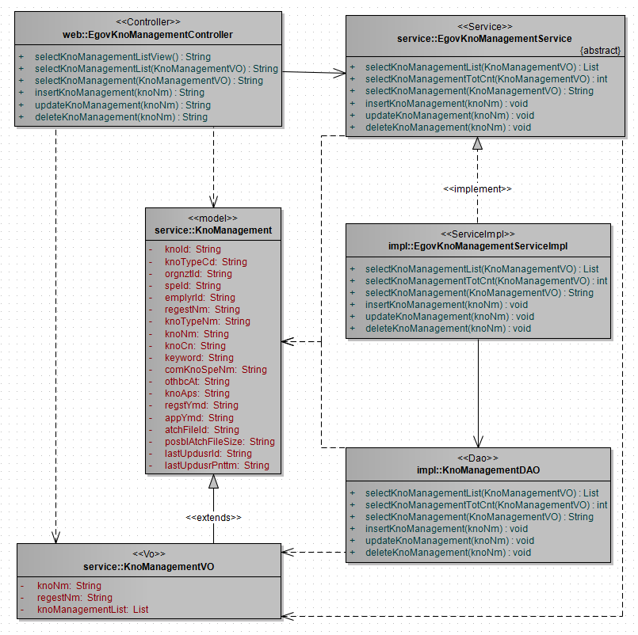
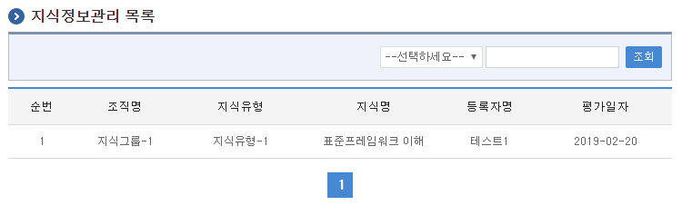
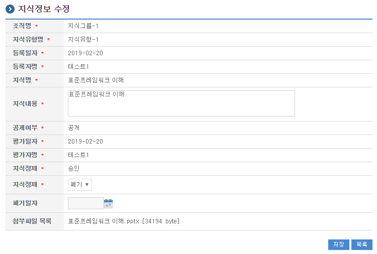
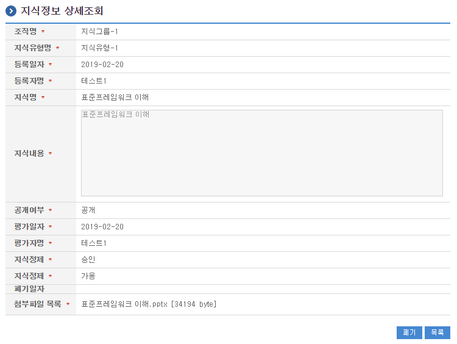

# 지식정보관리

## 개요

 지식정보관리는 지식 수정, 폐기 와 같은 지식정보를 정제하는 기능을 제공 한다.

## 설명

 지식정보관리는 지식 수정, 폐기 와 같은 지식정보를 정제하기 위한 목적으로 지식정보의 수정, 상세조회, 목록조회의 기능을 수반한다.

 ① 지식정보목록조회 : 지식정보 정보를 최근 등록 순서대로 조회하고, 그 결과 목록을 화면에 반영한다.
 ② 지식정보수정 : 기 등록된 지식정보정보의 항목들을 수정한다.
 ③ 지식정보상세조회 : 등록된 지식정보정보를 상세 조회한다.

### 관련소스

| 유형 | 대상소스명 | 비고 |
| --- | --- | --- |
| Controller | egovframework.com.dam.mgm.web.EgovKnoManagementController.java | 지식정보 관리를 위한 컨트롤러 클래스 |
| Service | egovframework.com.dam.mgm.service.EgovKnoManagementService.java | 지식정보 관리를 위한  서비스 인터페이스 |
| ServiceImpl | egovframework.com.dam.mgm.service.impl.EgovKnoManagementServiceImpl.java | 지식정보 관리를 위한 서비스 구현 클래스 |
| DAO | egovframework.com.dam.mgm.service.impl.KnoManagementDAO.java | 지식정보 관리를 위한 데이터처리 클래스 |
| Model | egovframework.com.dam.mgm.service.KnoManagement.java | 지식정보 관리를 위한 Model 클래스 |
| VO | egovframework.com.dam.mgm.service.KnoManagementVO.java | 지식정보 관리를 위한 VO 클래스 |
| JSP | /WEB-INF/jsp/egovframework/dam/mgm/EgovComDamManagementList.jsp | 지식정보 목록조회를 위한 jsp페이지 |
| JSP | /WEB-INF/jsp/egovframework/dam/mgm/EgovComDamManagementModify.jsp | 지식정보 수정를 위한 jsp페이지 |
| JSP | /WEB-INF/jsp/egovframework/dam/mgm/EgovComDamManagementDetail.jsp | 등록된 지식정보을 조회하기 위한 jsp페이지 |
| Query XML | resources/egovframework/mapper/com/dam/mgm/EgovKnoManagement\_SQL\_altibase.xml | 지식정보 관리를 위한 Altibase용 Query XML |
| Query XML | resources/egovframework/mapper/com/dam/mgm/EgovKnoManagement\_SQL\_cubrid.xml | 지식정보 관리를 위한 Cubrid용 Query XML |
| Query XML | resources/egovframework/mapper/com/dam/mgm/EgovKnoManagement\_SQL\_maria.xml | 지식정보 관리를 위한 MariaDB용 Query XML |
| Query XML | resources/egovframework/mapper/com/dam/mgm/EgovKnoManagement\_SQL\_mysql.xml | 지식정보 관리를 위한 MySQL용 Query XML |
| Query XML | resources/egovframework/mapper/com/dam/mgm/EgovKnoManagement\_SQL\_oracle.xml | 지식정보 관리를 위한 Oracle용 Query XML |
| Query XML | resources/egovframework/mapper/com/dam/mgm/EgovKnoManagement\_SQL\_postgres.xml | 지식정보 관리를 위한 PostgreSQL용 Query XML |
| Query XML | resources/egovframework/mapper/com/dam/mgm/EgovKnoManagement\_SQL\_tibero.xml | 지식정보 관리를 위한 Tibero용 Query XML |
| Query XML | resources/egovframework/mapper/com/dam/mgm/EgovKnoManagement\_SQL\_goldilocks.xml | 지식정보 관리를 위한 Goldilocks용 Query XML |
| Message properties | resources/egovframework/message/com/dam/mgm/message\_en.properties | 지식정보 관리를 위한 Message properties(영문) |
| Message properties | resources/egovframework/message/com/dam/mgm/message\_ko.properties | 지식정보 관리를 위한 Message properties(한글) |

### 클래스 다이어그램

 

### 관련테이블

| 테이블명 | 테이블명(영문) | 비고 |
| --- | --- | --- |
| 지식정보 | COMTNDAMKNOIFM | 지식정보정보를 관리하기 위한 속성정보를 정의하고, 관리한다. |

## 관련화면 및 수행메뉴얼

### 지식정보 목록조회

| Action | URL | Controller method | QueryID |
| --- | --- | --- | --- |
| 조회 | /dam/mgm/EgovComDamManagementList.do | selectKnoManagementList | "KnoManagementDAO.selectKnoManagementList" |
| 상세조회 | /dam/mgm/EgovComDamManagement.do | selectKnoManagement | "KnoManagementDAO.selectKnoManagement" |

 지식정보관리 목록은 페이지당 10건씩 조회되며 페이징은 10페이지씩 이루어진다.
 검색조건은 지식명, 등록자명에 대해서 수행된다.

 

 조회 : 기 등록된 지식정보의 목록을 조회한다.
 상세조회 : 목록중 지식명을 클릭하여 지식정보 상세조회 화면으로 이동한다.

### 지식정보 수정

| Action | URL | Controller method | QueryID |
| --- | --- | --- | --- |
| 수정 | /dam/mgm/EgovComDamManagementModify.do | updateKnoManagement | "KnoManagementDAO.updateKnoManagement" |

 지식정보의 속성정보를 변경한 후 저장한다.

 

 저장 : 기 등록된 지식정보 속성을 수정한 뒤 하단의 저장 버튼을 통해서 지식정보정보를 수정한다.
 목록 : 지식정보 목록조회 화면으로 이동한다.

### 지식정보 상세조회

| Action | URL | Controller method | QueryID |
| --- | --- | --- | --- |
| 상세조회 | /dam/mgm/EgovComDamManagement.do | selectKnoManagement | "KnoManagementDAO.selectKnoManagement" |

 지식정보의 속성정보를 조회한다.

 

 폐기 : 기 등록된 지식정보 폐기를 위하여 하단의 폐기 버튼을 통해서 지식정보관리수정화면으로 이동한다.
 목록 : 지식정보관리 목록조회 화면으로 이동한다.
 비즈니스규칙 : 지식정보관리 폐기의 권한은 지식관리자에게만 부여 된다.
