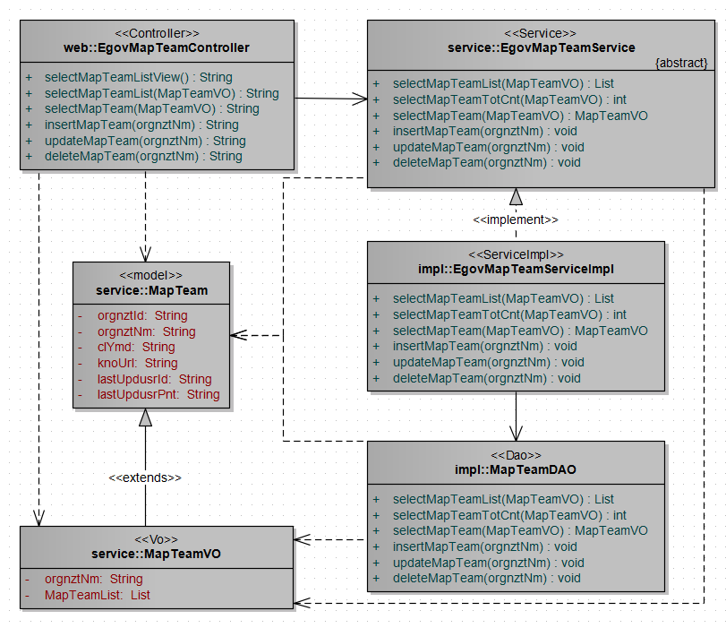
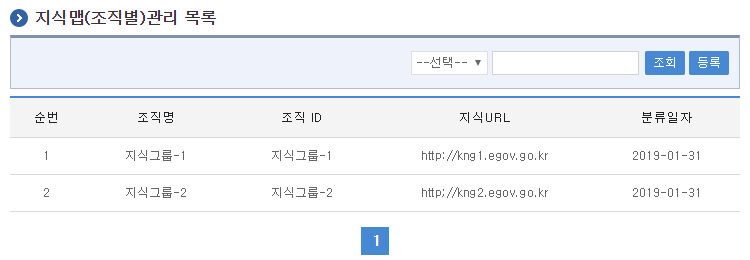
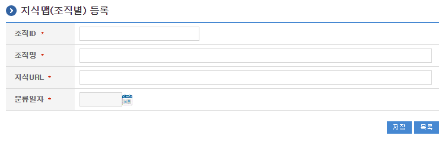
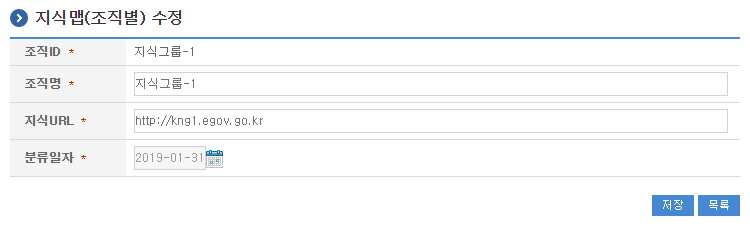
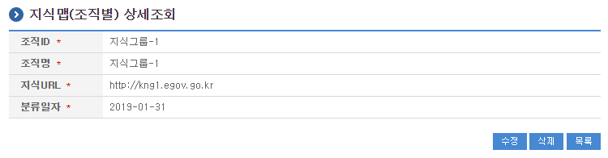

# 지식맵(조직별)

## 개요

 지식맵(조직별)관리는 지식에 대한 분류를 조직별로 분류하고 활용할 수 있는 기능을 제공한다.

## 설명

 지식맵(조직별)관리는 지식에 대한 분류를 조직별로 분류하고 관리하기 위한 목적으로 지식맵(조직별)의 등록, 수정, 삭제, 상세조회, 목록조회의 기능을 수반한다.

 ① 지식맵(조직별)목록조회 : 지식맵(조직별) 정보를 최근 등록 순서대로 조회하고, 그 결과 목록을 화면에 반영한다.
 ② 지식맵(조직별)등록 : 지식맵(조직별) 정보를 등록하고, 등록 결과를 조회한다.
 ③ 지식맵(조직별)수정 : 기 등록된 지식맵(조직별)정보의 항목들을 수정한다.
 ④ 지식맵(조직별)삭제 : 기 등록된 지식맵(조직별)정보를 삭제한다.
 ⑤ 지식맵(조직별)상세조회 : 등록된 지식맵(조직별)정보를 상세 조회한다.

### 관련소스

| 유형 | 대상소스명 | 비고 |
| --- | --- | --- |
| Controller | egovframework.com.dam.map.tea.web.EgovMapTeamController.java | 지식맵(조직별) 관리를 위한 컨트롤러 클래스 |
| Service | egovframework.com.dam.map.tea.service.EgovMapTeamService.java | 지식맵(조직별) 관리를 위한  서비스 인터페이스 |
| ServiceImpl | egovframework.com.dam.map.tea.service.impl.EgovMapTeamServiceImpl.java | 지식맵(조직별) 관리를 위한 서비스 구현 클래스 |
| DAO | egovframework.com.dam.map.tea.service.impl.MapTeamDAO.java | 지식맵(조직별) 관리를 위한 데이터처리 클래스 |
| Model | egovframework.com.dam.map.tea.service.MapTeam.java | 지식맵(조직별) 관리를 위한 Model 클래스 |
| VO | egovframework.com.dam.map.tea.service.MapTeamVO.java | 지식맵(조직별) 관리를 위한 VO 클래스 |
| JSP | /WEB-INF/jsp/egovframework/dam/map/tea/EgovComDamMapTeamList.jsp | 지식맵(조직별) 목록조회를 위한 jsp페이지 |
| JSP | /WEB-INF/jsp/egovframework/dam/map/tea/EgovComDamMapTeamRegist.jsp | 지식맵(조직별) 등록를 위한 jsp페이지 |
| JSP | /WEB-INF/jsp/egovframework/dam/map/tea/EgovComDamMapTeamModify.jsp | 지식맵(조직별) 수정를 위한 jsp페이지 |
| JSP | /WEB-INF/jsp/egovframework/dam/map/tea/EgovComDamMapTeamDetail.jsp | 등록된 지식맵(조직별)을 조회하기 위한 jsp페이지 |
| Query XML | resources/egovframework/mapper/com/dam/map/tea/EgovDamMapTeamMapTeam\_SQL\_altibase.xml | 지식맵(조직별) 관리를 위한 Altibase용 Query XML |
| Query XML | resources/egovframework/mapper/com/dam/map/tea/EgovDamMapTeamMapTeam\_SQL\_cubrid.xml | 지식맵(조직별) 관리를 위한 Cubrid용 Query XML |
| Query XML | resources/egovframework/mapper/com/dam/map/tea/EgovDamMapTeamMapTeam\_SQL\_maria.xml | 지식맵(조직별) 관리를 위한 MariaDB용 Query XML |
| Query XML | resources/egovframework/mapper/com/dam/map/tea/EgovDamMapTeamMapTeam\_SQL\_mysql.xml | 지식맵(조직별) 관리를 위한 MySQL용 Query XML |
| Query XML | resources/egovframework/mapper/com/dam/map/tea/EgovDamMapTeamMapTeam\_SQL\_oracle.xml | 지식맵(조직별) 관리를 위한 Oracle용 Query XML |
| Query XML | resources/egovframework/mapper/com/dam/map/tea/EgovDamMapTeamMapTeam\_SQL\_postgres.xml | 지식맵(조직별) 관리를 위한 PostgreSQL용 Query XML |
| Query XML | resources/egovframework/mapper/com/dam/map/tea/EgovDamMapTeamMapTeam\_SQL\_tibero.xml | 지식맵(조직별) 관리를 위한 Tibero용 Query XML |
| Query XML | resources/egovframework/mapper/com/dam/map/tea/EgovDamMapTeamMapTeam\_SQL\_goldilocks.xml | 지식맵(조직별) 관리를 위한 Goldilocks용 Query XML |
| Message properties | resources/egovframework/message/com/dam/map/tea/message\_en.properties | 지식맵(조직별) 관리를 위한 Message properties(영문) |
| Message properties | resources/egovframework/message/com/dam/map/tea/message\_ko.properties | 지식맵(조직별) 관리를 위한 Message properties(한글) |

### 클래스 다이어그램

 

### 관련테이블

| 테이블명 | 테이블명(영문) | 비고 |
| --- | --- | --- |
| 지식맵(조직별) | COMTNDAMMAPTEAM | 지식맵(조직별)정보를 관리하기 위한 속성정보를 정의하고, 관리한다. |

## 관련화면 및 수행메뉴얼

### 지식맵(조직별) 목록조회

| Action | URL | Controller method | QueryID |
| --- | --- | --- | --- |
| 조회 | /dam/map/tea/EgovComDamMapTeamList.do | selectMapTeamList | "MapTeamDAO.selectMapTeamList" |
| 상세조회 | /dam/map/tea/EgovComDamMapTeam.do | selectMapTeamDetail | "MapTeamDAO.selectMapTeamDetail" |

 지식맵(조직별)관리 목록은 페이지당 10건씩 조회되며 페이징은 10페이지씩 이루어진다.
 검색조건은 지식유형, 지식명에 대해서 수행된다.

 

 조회 : 기 등록된 지식맵(조직별)의 목록을 조회한다.
 등록 : 신규 지식맵(조직별)을 등록하기 위해서는 상단의 등록 버튼을 통해서 지식맵(조직별)관리 등록 화면으로 이동한다.
 상세조회 : 목록중 조직명을 클릭하여 지식맵(조직별) 상세조회 화면으로 이동한다.

### 지식맵(조직별) 등록

| Action | URL | Controller method | QueryID |
| --- | --- | --- | --- |
| 등록 | /dam/map/tea/EgovComDamMapTeamRegist.do | insertMapTeam | "MapTeamDAO.insertMapTeam" |

 지식맵(조직별)의 속성정보를 입력한 뒤 등록한다.

 

 저장 : 신규 지식맵(조직별)을 등록하기 위해서는 지식맵(조직별) 속성을 입력한 뒤 하단의 저장 버튼을 통해서 지식맵(조직별)을 등록한다.
 목록 : 지식맵(조직별) 목록조회 화면으로 이동한다.

### 지식맵(조직별) 수정

| Action | URL | Controller method | QueryID |
| --- | --- | --- | --- |
| 수정 | /dam/map/tea/EgovComDamMapTeamModify.do | updateMapTeam | "MapTeamDAO.updateMapTeam" |

 지식맵(조직별)의 속성정보를 변경한 후 저장한다.

 

 저장 : 기 등록된 지식맵(조직별) 속성을 수정한 뒤 하단의 저장 버튼을 통해서 지식맵(조직별)정보를 수정한다.
 목록 : 지식맵(조직별) 목록조회 화면으로 이동한다.

### 지식맵(조직별) 상세조회

| Action | URL | Controller method | QueryID |
| --- | --- | --- | --- |
| 상세조회 | /dam/map/tea/EgovComDamMapTeam.do | selectMapTeamDetail | "MapTeamDAO.selectMapTeamDetail" |
| 삭제 | /dam/map/tea/EgovComDamMapTeamRemove.do | deleteMapTeam | "MapTeamDAO.deleteMapTeam" |

 지식맵(조직별)의 속성정보를 조회한다.

 

 수정 : 기 등록된 지식맵(조직별) 속성을 수정한 뒤 하단의 수정 버튼을 통해서 지식맵(조직별)관리수정화면으로 이동한다.
 삭제 : 기 등록된 지식맵(조직별)정보를 삭제한다.
 목록 : 지식맵(조직별)관리 목록조회 화면으로 이동한다.
