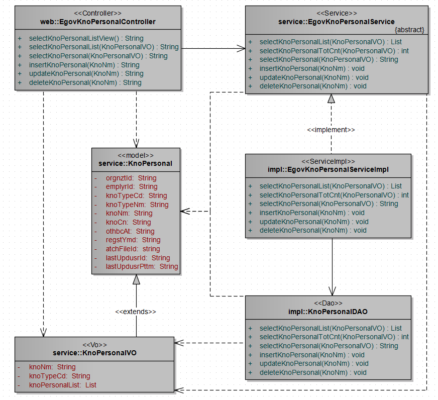
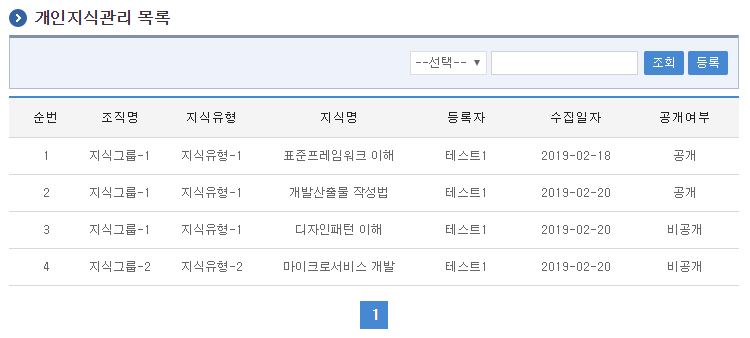
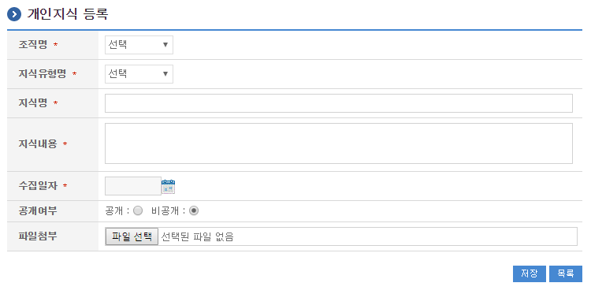
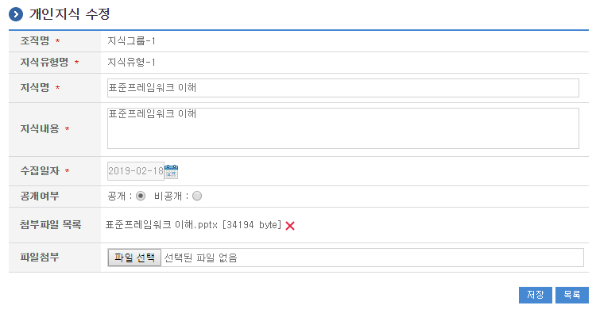
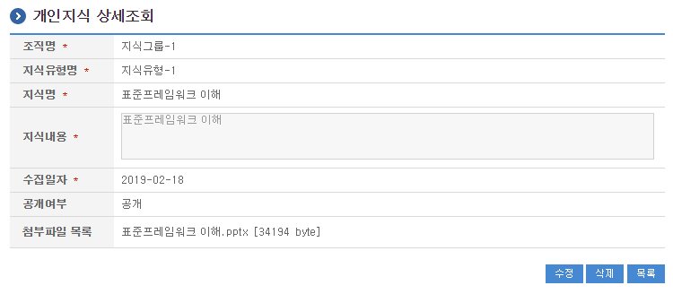

# 개인지식관리

## 개요

 개인지식관리는 개인의 노하우 등 지식을 수집하고 체계적으로 활용할 수 있는 기능을 제공한다.

## 설명

 개인지식관리는 개인의 노하우 등 지식을 수집하고 활용하기 위한 목적으로 개인지식의 등록, 수정, 삭제, 상세조회, 목록조회의 기능을 수반한다.

 ① 개인지식목록조회 : 개인지식 정보를 최근 등록 순서대로 조회하고, 그 결과 목록을 화면에 반영한다.
 ② 개인지식등록 : 개인지식 정보를 등록하고, 등록 결과를 조회한다.
 ③ 개인지식수정 : 기 등록된 개인지식정보의 항목들을 수정한다.
 ④ 개인지식삭제 : 기 등록된 개인지식정보를 삭제한다.
 ⑤ 개인지식상세조회 : 등록된 개인지식정보를 상세 조회한다.

### 관련소스

| 유형 | 대상소스명 | 비고 |
| --- | --- | --- |
| Controller | egovframework.com.dam.per.web.EgovKnoPersonalController.java | 개인지식 관리를 위한 컨트롤러 클래스 |
| Service | egovframework.com.dam.per.service.EgovKnoPersonalService.java | 개인지식 관리를 위한  서비스 인터페이스 |
| ServiceImpl | egovframework.com.dam.per.service.impl.EgovKnoPersonalServiceImpl.java | 개인지식 관리를 위한 서비스 구현 클래스 |
| DAO | egovframework.com.dam.per.service.impl.KnoPersonalDAO.java | 개인지식 관리를 위한 데이터처리 클래스 |
| Model | egovframework.com.dam.per.service.KnoPersonal.java | 개인지식 관리를 위한 Model 클래스 |
| VO | egovframework.com.dam.per.service.KnoPersonalVO.java | 개인지식 관리를 위한 VO 클래스 |
| JSP | /WEB-INF/jsp/egovframework/dam/per/EgovComDamPersonalList.jsp | 개인지식 목록조회를 위한 jsp페이지 |
| JSP | /WEB-INF/jsp/egovframework/dam/per/EgovComDamPersonalRegist.jsp | 개인지식 등록를 위한 jsp페이지 |
| JSP | /WEB-INF/jsp/egovframework/dam/per/EgovComDamPersonalModify.jsp | 개인지식 수정를 위한 jsp페이지 |
| JSP | /WEB-INF/jsp/egovframework/dam/per/EgovComDamPersonalDetail.jsp | 등록된 개인지식을 조회하기 위한 jsp페이지 |
| Query XML | resources/egovframework/mapper/com/dam/per/EgovDamKnoPersonal\_SQL\_altibase.xml | 개인지식 관리를 위한 Altibase용 Query XML |
| Query XML | resources/egovframework/mapper/com/dam/per/EgovDamKnoPersonal\_SQL\_cubrid.xml | 개인지식 관리를 위한 Cubrid용 Query XML |
| Query XML | resources/egovframework/mapper/com/dam/per/EgovDamKnoPersonal\_SQL\_maria.xml | 개인지식 관리를 위한 MariaDB용 Query XML |
| Query XML | resources/egovframework/mapper/com/dam/per/EgovDamKnoPersonal\_SQL\_mysql.xml | 개인지식 관리를 위한 MySQL용 Query XML |
| Query XML | resources/egovframework/mapper/com/dam/per/EgovDamKnoPersonal\_SQL\_oracle.xml | 개인지식 관리를 위한 Oracle용 Query XML |
| Query XML | resources/egovframework/mapper/com/dam/per/EgovDamKnoPersonal\_SQL\_postgres.xml | 개인지식 관리를 위한 PostgreSQL용 Query XML |
| Query XML | resources/egovframework/mapper/com/dam/per/EgovDamKnoPersonal\_SQL\_tibero.xml | 개인지식 관리를 위한 Tibero용 Query XML |
| Query XML | resources/egovframework/mapper/com/dam/per/EgovDamKnoPersonal\_SQL\_goldilocks.xml | 개인지식 관리를 위한 Goldilocks용 Query XML |
| Message properties | resources/egovframework/message/com/dam/per/message\_en.properties | 개인지식 관리를 위한 Message properties(영문) |
| Message properties | resources/egovframework/message/com/dam/per/message\_ko.properties | 개인지식 관리를 위한 Message properties(한글) |
| Idgen XML | resources/egovframework/spring/com/idgn/context-idgn-DamManage.xml | 개인지식  관리를 위한 Id생성 Idgen XML |

### 클래스 다이어그램

 

### 관련테이블

| 테이블명 | 테이블명(영문) | 비고 |
| --- | --- | --- |
| 지식정보 | COMTNDAMKNOIFM | 개인지식정보를 관리하기 위한 속성정보를 정의하고, 관리한다. |

### ID Generation

#### ID Generation 관련 DDL 및 DML

 ID Generation Service를 활용하기 위해서 Sequence 저장테이블인  COMTECOPSEQ에 DAM_ID 항목을 추가해야 한다.

```sql
CREATE TABLE COMTECOPSEQ ( table_name varchar(16) NOT NULL, 
                               next_id DECIMAL(30) NOT NULL,
                               PRIMARY KEY (table_name)
    );
 
    INSERT INTO COMTECOPSEQ VALUES ('DAM_ID','0');
```

#### ID Generation 환경설정(context-idgn-DamManage.xml)

```xml
<bean name="egovDamManageIdGnrService" class="egovframework.rte.fdl.idgnr.impl.EgovTableIdGnrServiceImpl" destroy-method="destroy">
        <property name="dataSource" ref="egov.dataSource" />
        <property name="strategy"   ref="damManageStrategy" />
        <property name="blockSize"  value="10"/>
        <property name="table"      value="COMTECOPSEQ"/>
        <property name="tableName"  value="DAM_ID"/>
    </bean>
    <bean name="damManageStrategy" class="egovframework.rte.fdl.idgnr.impl.strategy.EgovIdGnrStrategyImpl">
        <property name="prefix"     value="DMID_" />
        <property name="cipers"     value="15" />
        <property name="fillChar"   value="0" />
    </bean>
```

## 관련화면 및 수행매뉴얼

### 개인지식 목록조회

| Action | URL | Controller method | QueryID |
| --- | --- | --- | --- |
| 조회 | /dam/per/EgovComDamPersonalList.do | selectKnoPersonalList | "KnoPersonalDAO.selectKnoPersonalList" |
| 상세조회 | /dam/per/EgovComDamPersonal.do | selectKnoPersonal | "KnoPersonalDAO.selectKnoPersonal" |

 개인지식관리 목록은 페이지당 10건씩 조회되며 페이징은 10페이지씩 이루어진다.
 검색조건은 지식유형, 지식명에 대해서 수행된다.

 

 조회 : 기 등록된 개인지식의 목록을 조회한다.
 등록 : 신규 개인지식을 등록하기 위해서는 상단의 등록 버튼을 통해서 개인지식관리 등록 화면으로 이동한다.
 상세조회 : 목록중 지식명을 클릭하여 개인지식관리 상세조회 화면으로 이동한다.

### 개인지식 등록

| Action | URL | Controller method | QueryID |
| --- | --- | --- | --- |
| 등록 | /dam/per/EgovComDamPersonalRegist.do | insertKnoPersonal | "KnoPersonalDAO.insertKnoPersonal" |

 개인지식의 속성정보를 입력한 뒤 등록한다.

 

 저장 : 신규 개인지식을 등록하기 위해서는 개인지식 속성을 입력한 뒤 하단의 저장 버튼을 통해서 개인지식을 등록한다.
 목록 : 개인지식 목록조회 화면으로 이동한다.
 비즈니스규칙 : 공개여부가 공개일 경우 해당지식유형의 전문가에 의해 평가가 진행 된다.

### 개인지식 수정

| Action | URL | Controller method | QueryID |
| --- | --- | --- | --- |
| 수정 | /dam/per/EgovComDamPersonalModify.do | updateKnoPersonal | "KnoPersonalDAO.updateKnoPersonal" |

 개인지식의 속성정보를 변경한 후 저장한다.

 

 저장 : 기 등록된 개인지식 속성을 수정한 뒤 하단의 저장 버튼을 통해서 개인지식정보를 수정한다.
 목록 : 개인지식 목록조회 화면으로 이동한다.

### 개인지식 상세조회

| Action | URL | Controller method | QueryID |
| --- | --- | --- | --- |
| 상세조회 | /dam/per/EgovComDamPersonal.do | selectKnoPersonal | "KnoPersonalDAO.selectKnoPersonal" |
| 삭제 | /dam/per/EgovComDamPersonalRemove.do | deleteKnoPersonal | "KnoPersonalDAO.deleteKnoPersonal" |

 개인지식의 속성정보를 조회한다.

 

 수정 : 기 등록된 개인지식 속성을 수정한 뒤 하단의 수정 버튼을 통해서 개인지식관리수정화면으로 이동한다.
 삭제 : 기 등록된 개인지식정보를 삭제한다.
 목록 : 개인지식관리 목록조회 화면으로 이동한다.
