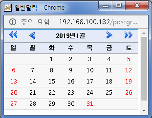
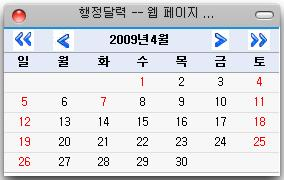
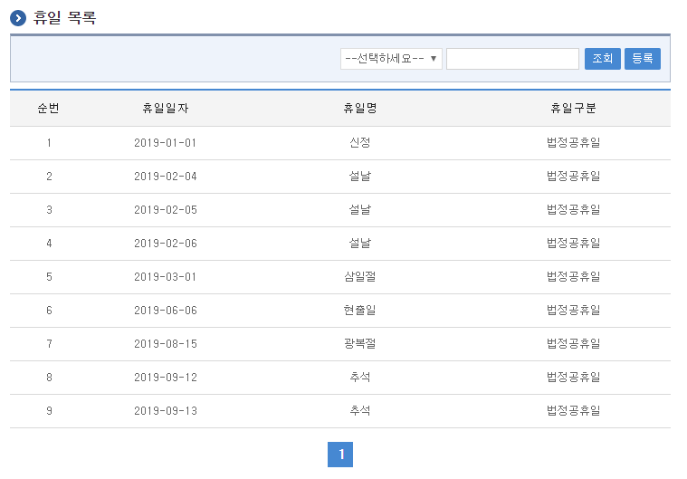
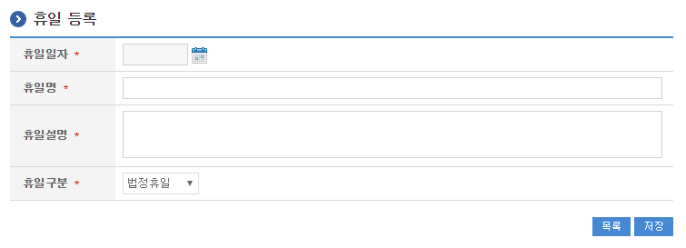
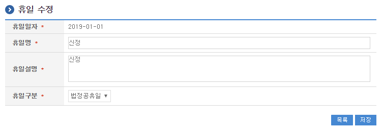
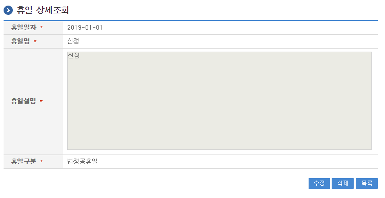

<!-- markdownlint-disable MD013 MD025 MD033 -->


# 달력

## 개요

일반달력, 행정달력은 서비스 화면에서 날짜를 선택하는 기능으로 활용하며, 구간에 따른 조회화면을 제공한다.  
휴일 관리는 휴일을 등록, 수정, 목록조회, 상세조회를 제공한다.

## 설명

일반달력, 행정달력은 팝업화면과 일간/주간/월간/연간 조회화면으로 구성되어있다.  
휴일의 관리는 목록조회, 상세조회, 등록, 수정, 삭제 처리 할 수 있도록 구성되어있다.

### 관련소스

| 유형               | 대상소스명                                                                       | 비고                                           |
| ------------------ | -------------------------------------------------------------------------------- | ---------------------------------------------- |
| Controller         | `egovframework.com.sym.cal.web.EgovCalRestdeManageController.java`               | 달력, 휴일관리를 위한 컨트롤러 클래스          |
| Model              | `egovframework.com.sym.cal.service.Restde.java`                                  | 휴일 정보 Model 클래스                         |
| VO                 | `egovframework.com.sym.cal.service.RestdeVO.java`                                | 달력, 휴일관리를 위한 VO 클래스                |
| Service            | `egovframework.com.sym.cal.service.EgovCalRestdeManageService.java`              | 달력, 휴일관리를 위한 서비스 인터페이스        |
| ServiceImpl        | `egovframework.com.sym.cal.service.impl.EgovCalRestdeManageServiceImpl.java`     | 달력, 휴일관리를 위한 위한 서비스구현 클래스   |
| DAO                | `egovframework.com.sym.cal.service.impl.RestdeManageDAO.java`                    | 휴일 정보 관리를 위한 데이터처리 클래스        |
| JS                 | `/webapp/js/egovframework/cmm/sym/cal/EgovCalPopup.js`                           | 일반달력, 행정달력 팝업 호출을 위한 JavaScript |
| JSP                | `/WEB-INF/jsp/egovframework/cmm/sym/cal/EgovAdministCalPopup.jsp`                | 행정달력 팝업을 위한 JSP 페이지                |
| JSP                | `/WEB-INF/jsp/egovframework/cmm/sym/cal/EgovAdministCalendar.jsp`                | 행정달력 팝업의 내용을 위한 JSP 페이지         |
| JSP                | `/WEB-INF/jsp/egovframework/cmm/sym/cal/EgovAdministDayCalendar.jsp`             | 행정달력 일간을위한 JSP 페이지                 |
| JSP                | `/WEB-INF/jsp/egovframework/cmm/sym/cal/EgovAdministMonthCalendar.jsp`           | 행정달력 월간을위한 JSP 페이지                 |
| JSP                | `/WEB-INF/jsp/egovframework/cmm/sym/cal/EgovAdministWeekCalendar.jsp`            | 행정달력 주간을위한 JSP 페이지                 |
| JSP                | `/WEB-INF/jsp/egovframework/cmm/sym/cal/EgovAdministYearCalendar.jsp`            | 행정달력 연간을위한 JSP 페이지                 |
| JSP                | `/WEB-INF/jsp/egovframework/cmm/sym/cal/EgovNormalCalPopup.jsp`                  | 일반달력 팝업을 위한 JSP 페이지                |
| JSP                | `/WEB-INF/jsp/egovframework/cmm/sym/cal/EgovNormalCalendar.jsp`                  | 일반달력 팝업의 내용을 위한 JSP 페이지         |
| JSP                | `/WEB-INF/jsp/egovframework/cmm/sym/cal/EgovNormalDayCalendar.jsp`               | 일반달력 일간을위한 JSP 페이지                 |
| JSP                | `/WEB-INF/jsp/egovframework/cmm/sym/cal/EgovNormalMonthCalendar.jsp`             | 일반달력 월간을위한 JSP 페이지                 |
| JSP                | `/WEB-INF/jsp/egovframework/cmm/sym/cal/EgovNormalWeekCalendar.jsp`              | 일반달력 주간을위한 JSP 페이지                 |
| JSP                | `/WEB-INF/jsp/egovframework/cmm/sym/cal/EgovNormalYearCalendar.jsp`              | 일반달력 연간을위한 JSP 페이지                 |
| JSP                | `/WEB-INF/jsp/egovframework/cmm/sym/cal/EgovRestdeDetail.jsp`                    | 휴일 상세보기를 위한 JSP 페이지                |
| JSP                | `/WEB-INF/jsp/egovframework/cmm/sym/cal/EgovRestdeList.jsp`                      | 휴일 목록을 위한 JSP 페이지                    |
| JSP                | `/WEB-INF/jsp/egovframework/cmm/sym/cal/EgovRestdeModify.jsp`                    | 휴일 수정을 위한 JSP 페이지                    |
| JSP                | `/WEB-INF/jsp/egovframework/cmm/sym/cal/EgovRestdeRegist.jsp`                    | 휴일 등록을 위한 JSP 페이지                    |
| Query XML          | `resources/egovframework/mapper/com/sym/cal/EgovRestdeManage_SQL_altibase.xml`   | 달력, 휴일관리를 위한 Altibase용 Query XML     |
| Query XML          | `resources/egovframework/mapper/com/sym/cal/EgovRestdeManage_SQL_cubrid.xml`     | 달력, 휴일관리를 위한 Cubrid용 Query XML       |
| Query XML          | `resources/egovframework/mapper/com/sym/cal/EgovRestdeManage_SQL_maria.xml`      | 달력, 휴일관리를 위한 MariaDB용 Query XML      |
| Query XML          | `resources/egovframework/mapper/com/sym/cal/EgovRestdeManage_SQL_mysql.xml`      | 달력, 휴일관리를 위한 MySQL용 Query XML        |
| Query XML          | `resources/egovframework/mapper/com/sym/cal/EgovRestdeManage_SQL_oracle.xml`     | 달력, 휴일관리를 위한 Oracle용 Query XML       |
| Query XML          | `resources/egovframework/mapper/com/sym/cal/EgovRestdeManage_SQL_postgres.xml`   | 달력, 휴일관리를 위한 PostgreSQL용 Query XML   |
| Query XML          | `resources/egovframework/mapper/com/sym/cal/EgovRestdeManage_SQL_tibero.xml`     | 달력, 휴일관리를 위한 Tibero용 Query XML       |
| Query XML          | `resources/egovframework/mapper/com/sym/cal/EgovRestdeManage_SQL_goldilocks.xml` | 달력, 휴일관리를 위한 Goldilocks용 Query XML   |
| Validator Rule XML | `resources/egovframework/validator/validator-rules.xml`                          | Validator Rule을 정의한 XML                    |
| Validator XML      | `resources/egovframework/validator/com/sym/cal/EgovRestdeManage.xml`             | 달력, 휴일관리를 위한 Validator XML            |
| Message properties | `resources/egovframework/message/com/sym/cal/message_en.properties`              | 달력, 휴일관리를 위한 Message properties(영문) |
| Message properties | `resources/egovframework/message/com/sym/cal/message_ko.properties`              | 달력, 휴일관리를 위한 Message properties(한글) |
| Idgen XML          | `resources/egovframework/spring/com/idgn/context-idgn-RestDe.xml`                | 달력, 휴일관리를 위한 Id생성 Idgen XML         |

### 관련테이블

| 테이블명 | 테이블명(영문) | 비고             |
| -------- | -------------- | ---------------- |
| 휴일     | `COMTNRESTDE`  | 휴일 정보를 관리 |

## 환경설정

휴일 관리 기능을 위하여 필요한 항목 및 그 환경 설정은 다음과 같다.

### ID Generation 관련 DDL 및 DML

ID Generation Service를 활용하기 위해서 Sequence 저장테이블인 `COMTECOPSEQ`에 **RESTDE_ID** 항목을 추가해야 한다.

```sql
CREATE TABLE COMTECOPSEQ (
    table_name varchar(16) NOT NULL,
    next_id DECIMAL(30) NOT NULL,
    PRIMARY KEY (table_name)
);

INSERT INTO COMTECOPSEQ VALUES ('RESTDE_ID','0');
```

### ID Generation 환경설정(context-idgn-LeaderSchdu.xml)

```xml
<bean name="egovRestDeIdGnrService" class="egovframework.rte.fdl.idgnr.impl.EgovTableIdGnrServiceImpl" destroy-method="destroy">
    <property name="dataSource" ref="egov.dataSource" />
    <property name="blockSize" value="10" />
    <property name="table" value="COMTECOPSEQ" />
    <property name="tableName" value="RESTDE_ID" />
</bean>
```

## 사용방법

### 일반달력 팝업

일반달력 팝업 호출을 위하여 다음사항을 적용한다.  
`_editor_url` 변수는 `EgovCalPopup.js` 호출하는 자바스크립트보다 반드시 위줄에 위치하여야 한다.(변수를 선언하여 그 값을 받아오기 때문임)

```html
<script type="text/javascript">
    _editor_url =
        "<c:url value='/html/egovframework/com/cmm/utl/htmlarea3.0/'/>";
</script>

<script
    type="text/javascript"
    src="<c:url value='/js/egovframework/cmm/sym/cal/EgovCalPopup.js' />"
></script>
```

일반달력 팝업 호출을 위하여 `EgovCalPopup.js` 를 해당 페이지에 등록한다.

```html
<form
    name="Form1"
    action="<c:url value='/sym/cmm/EgovNormalCalPopup.do'/>"
    method="post"
>
    <input
        type="hidden"
        name="sDate"
        value=""
        size="8"
        readonly
        onClick="javascript:fn_egov_NormalCalendar(document.Form1, document.Form1.sDate, document.Form1.vDate);"
    />
    <input
        type="text"
        name="vDate"
        value=""
        size="10"
        readonly
        onClick="javascript:fn_egov_NormalCalendar(document.Form1, document.Form1.sDate, document.Form1.vDate);"
    />
    "
        onClick="javascript:fn_egov_NormalCalendar(document.Form1, document.Form1.sDate, document.Form1.vDate);"
    />
</form>
```

날짜를 사용할 폼에 받기위해 위 샘플 소스처럼 호출하여 사용한다.  
`sDate`는 일자 연월일 8자리를 받고, `vDate`는 `-`를 포함하여 받는다.



#### 달력 팝업 DB 없이 사용하기

일반달력 팝업으로 휴일을 관리하지 않고 데이터베이스 없이 팝업 달력을 사용하기 위하여 아래와 같이 변경하여 사용할 수 있다.

| URL                                    | Controller                      |
| -------------------------------------- | ------------------------------- |
| `/sym/cmm/EgovselectNormalCalendar.do` | `EgovCalRestdeManageController` |

다음 소스코드 부분을

```java
restde.setYear(Integer.toString(iYear));
restde.setMonth(Integer.toString(iMonth));

cal.set(iYear,iMonth-1,1);

restde.setStartWeekMonth(cal.get(Calendar.DAY_OF_WEEK));
restde.setLastDayMonth(cal.getActualMaximum(Calendar.DATE));

List CalInfoList = restdeManageService.selectNormalRestdePopup(restde);
```

아래와 같이 변경하여 사용할 수 있다.

```java
cal.set(iYear,iMonth-1,1);

int firstWeek = cal.get(Calendar.DAY_OF_WEEK);
int lastDay   = cal.getActualMaximum(Calendar.DATE);
int week      = cal.get(Calendar.DAY_OF_WEEK);

String year   = Integer.toString(iYear);
String month  = Integer.toString(iMonth);
String day    = Integer.toString(cal.get(Calendar.DAY_OF_MONTH));

restde.setStartWeekMonth(firstWeek);
restde.setLastDayMonth(lastDay);
restde.setYear(year);
restde.setMonth(month);

List CalInfoList = new ArrayList();
String tmpDay = "";

/**
 * 계산... START
 */
for(int i=0; i<42;i++) {
    ListOrderedMap map = new ListOrderedMap();
    int cc = i + 1;
    int dd = cc-firstWeek+1;

    if (dd > 0 && dd <= lastDay) {
        tmpDay = Integer.toString(dd);
    } else {
        tmpDay = "";
    }

    map.put("year",     year);
    map.put("month",    month);
    map.put("day",      tmpDay);
    map.put("cellNum",  cc);
    map.put("weeks",    (cc - 1) / 7 + 1);
    map.put("week",     (week-1) % 7 + 1);
    map.put("restAt",   ((week-1) % 7 + 1==1) ? "Y" : "N");

    if (dd > 0 && dd <= lastDay) {
        week ++;
    }
    CalInfoList.add(map);

}
/**
 * 계산... END
 */
```

### 행정달력 팝업

행정달력 팝업 호출을 위하여 다음사항을 적용한다.  
`_editor_url` 변수는 `EgovCalPopup.js` 호출하는 자바스크립트보다 반드시 위줄에 위치하여야 한다.(변수를 선언하여 그 값을 받아오기 때문임)

```html
<script type="text/javascript">
    _editor_url =
        "<c:url value='/html/egovframework/com/cmm/utl/htmlarea3.0/'/>";
</script>

<script
    type="text/javascript"
    src="<c:url value='/js/egovframework/cmm/sym/cal/EgovCalPopup.js' />"
></script>
```

행정달력 팝업 호출을 위하여 `EgovCalPopup.js` 를 해당 페이지에 등록한다.

```html
<form
    name="Form2"
    action="<c:url value='/sym/cmm/EgovAdministCalPopup.do'/>"
    method="post"
>
    <input
        type="hidden"
        name="sDate"
        value=""
        size="8"
        readonly
        onClick="javascript:fn_egov_AdministCalendar(document.Form2, document.Form2.sDate, document.Form2.vDate);"
    />
    <input
        type="text"
        name="vDate"
        value=""
        size="10"
        readonly
        onClick="javascript:fn_egov_AdministCalendar(document.Form2, document.Form2.sDate, document.Form2.vDate);"
    />
    "
        onClick="javascript:fn_egov_AdministCalendar(document.Form2, document.Form2.sDate, document.Form2.vDate);"
    />
</form>
```

날짜를 사용할 폼에 받기위해 위 샘플 소스처럼 호출하여 사용한다.  
`sDate`는 일자 연월일 8자리를 받고, `vDate`는 `-`를 포함하여 받는다.



### 행정달력 일간/주간/월간/연간 조회

행정달력 일간/주간/월간/연간 조회 할 수 있는 조회 화면으로 URL은 다음과 같다.

| 기능     | URL                                     | Controller                      | method                        | 화면(URL)                                |
| -------- | --------------------------------------- | ------------------------------- | ----------------------------- | ---------------------------------------- |
| 일간조회 | `/sym/cal/EgovAdministDayCalendar.do`   | `EgovCalRestdeManageController` | `selectAdministDayCalendar`   | `/cmm/sym/cal/EgovAdministDayCalendar`   |
| 주간조회 | `/sym/cal/EgovAdministWeekCalendar.do`  | `EgovCalRestdeManageController` | `selectAdministWeekCalendar`  | `/cmm/sym/cal/EgovAdministWeekCalendar`  |
| 월간조회 | `/sym/cal/EgovAdministMonthCalendar.do` | `EgovCalRestdeManageController` | `selectAdministMonthCalendar` | `/cmm/sym/cal/EgovAdministMonthCalendar` |
| 연간조회 | `/sym/cal/EgovAdministYearCalendar.do`  | `EgovCalRestdeManageController` | `selectAdministYearCalendar`  | `/cmm/sym/cal/EgovAdministYearCalendar`  |

### 휴일 목록

휴일 목록 조회를 할 수 있는 목록조회 화면으로 URL은 다음과 같다.

`/sym/cal/EgovRestdeList.do`

| 기능     | URL                          | Controller                      | method             | 화면(URL)                     |
| -------- | ---------------------------- | ------------------------------- | ------------------ | ----------------------------- |
| 목록조회 | `/sym/cal/EgovRestdeList.do` | `EgovCalRestdeManageController` | `selectRestdeList` | `/cmm/sym/cal/EgovRestdeList` |

휴일 목록은 페이지 당 10건씩 조회되며 페이징은 10페이지씩 이루어진다.  
검색조건은 휴일일자, 휴일명에 대해서 수행된다.  
페이지 당 검색 범위를 변경하고자 하는 경우 `context-properties.xml` 파일의 `pageUnit`, `pageSize`를 변경한다.(단 해당 설정은 전체 공통서비스 기능에 영향을 미친다.)



### 휴일 등록

휴일 등록 할 수 있는 등록 화면으로 URL은 다음과 같다.

`/sym/cal/EgovRestdeRegist.do`

| 기능 | URL                            | Controller                      | method         | 화면(URL)                       |
| ---- | ------------------------------ | ------------------------------- | -------------- | ------------------------------- |
| 등록 | `/sym/cal/EgovRestdeRegist.do` | `EgovCalRestdeManageController` | `insertRestde` | `/cmm/sym/cal/EgovRestdeRegist` |

휴일에 대한 상세내용을 등록한다.  
등록이 성공하면 휴일 목록 화면으로 이동한다.



### 휴일 수정

휴일 수정 할 수 있는 수정 화면으로 URL은 다음과 같다.

`/sym/cal/EgovRestdeModify.do`

| 기능 | URL                            | Controller                      | method         | 화면(URL)                       |
| ---- | ------------------------------ | ------------------------------- | -------------- | ------------------------------- |
| 수정 | `/sym/cal/EgovRestdeModify.do` | `EgovCalRestdeManageController` | `updateRestde` | `/cmm/sym/cal/EgovRestdeModify` |

수정이 성공하면 휴일 목록 화면으로 이동한다.



### 휴일 상세 조회

휴일 상세 조회 할 수 있는 상세 조회 화면으로 URL은 다음과 같다.

`/sym/cal/EgovRestdeDetail.do`

| 기능     | URL                            | Controller                      | method               | 화면(URL)                       |
| -------- | ------------------------------ | ------------------------------- | -------------------- | ------------------------------- |
| 상세조회 | `/sym/cal/EgovRestdeDetail.do` | `EgovCalRestdeManageController` | `selectRestdeDetail` | `/cmm/sym/cal/EgovRestdeDetail` |

상세조회 화면에서는 삭제, 수정, 목록 버튼을 제공한다.


