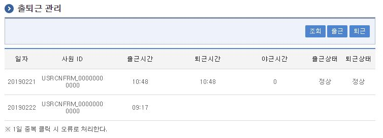

# 출퇴근 관리

## 개요

 **출퇴근 관리**는 출근, 퇴근 정보를 관리하는 기능을 제공한다.

## 설명

 **출퇴근 관리**는 출근, 퇴근 정보를 관리하기 위한 목적으로, 출근, 퇴근, 조회 기능을 수반한다.

### 관련소스

| 유형 | 대상소스명 | 비고 |
| --- | --- | --- |
| Controller | egovframework.com.uss.cmt.web.EgovCmtManageController.java | 출퇴근관리 Controller Class |
| Service | egovframework.com.uss.cmt.service.EgovCmtManageService.java | 출퇴근관리 Service Class |
| ServiceImpl | egovframework.com.uss.cmt.service.impl.EgovCmtManageServiceImpl.java | 출퇴근관리 Serviceimpl Class |
| VO | egovframework.com.uss.cmt.service.CmtDefaultVO.java | 검색 VO Class |
| VO | egovframework.com.uss.cmt.service.CmtManageVO.java | 출퇴근 관리 VO Class |
| DAO | egovframework.com.uss.cmt.service.impl.EgovCmtManageDAO.java | 출퇴근관리 DAO Class |
| JSP | /WEB-INF/jsp/egovframework/com/uss/cmt/EgovCmtManageList.jsp | 출퇴근관리 목록조회 페이지 |
| QUERY XML | resources/egovframework/mapper/com/uss/cmt/EgovCmtManage\_SQL\_altibase.xml | 출퇴근관리 Altibase용 QUERY XML |
| QUERY XML | resources/egovframework/mapper/com/uss/cmt/EgovCmtManage\_SQL\_cubrid.xml | 출퇴근관리 Cubrid용 QUERY XML |
| QUERY XML | resources/egovframework/sqlmap/com/uss/cmt/EgovCmtManage\_SQL\_maria.xml | 출퇴근관리 Maria용 QUERY XML |
| QUERY XML | resources/egovframework/sqlmap/com/uss/cmt/EgovCmtManage\_SQL\_mysql.xml | 출퇴근관리 Mysql용 QUERY XML |
| QUERY XML | resources/egovframework/sqlmap/com/uss/cmt/EgovCmtManage\_SQL\_oracle.xml | 출퇴근관리 Oracle용 QUERY XML |
| QUERY XML | resources/egovframework/sqlmap/com/uss/cmt/EgovCmtManage\_SQL\_postgres.xml | 출퇴근관리 Postgres용 QUERY XML |
| QUERY XML | resources/egovframework/sqlmap/com/uss/cmt/EgovCmtManage\_SQL\_tibero.xml | 출퇴근관리 Tibero용 QUERY XML |
| QUERY XML | resources/egovframework/sqlmap/com/uss/cmt/EgovCmtManage\_SQL\_goldilocks.xml | 출퇴근관리 Goldilocks용 QUERY XML |
| Idgen XML | resources/egovframework/spring/com/idgn/context-idgn-Cmt.xml | 출퇴근관리 Id생성 Idgen XML |
| Message | resources/egovframework/message/com/uss/cmt/message\_ko.properties | 출퇴근관리 message properties(한글) |
| Message | resources/egovframework/message/com/uss/cmt/message\_ko.properties | 출퇴근관리 message properties(영문) |

### 클래스 다이어그램

 

### ID Generation

#### ID Generation 관련 DDL 및 DML

- ID Generation Service를 활용하기 위해서 Sequence 저장테이블인 COMTECOPSEQ에 **WRKTM\_ID** 항목을 추가해야 한다.

```sql
CREATE TABLE COMTECOPSEQ
(
    TABLE_NAME            VARCHAR(20) NOT NULL,
    NEXT_ID               NUMERIC(30) NULL,
     PRIMARY KEY (TABLE_NAME)
)
;
INSERT INTO COMTECOPSEQ ( TABLE_NAME, NEXT_ID ) VALUES ('WRKTM_ID', 1);
 
```

#### ID Generation 환경설정(context-idgn-Cmt.xml)

```xml
	<bean name="egovCmtManageIdGnrService" class="egovframework.rte.fdl.idgnr.impl.EgovTableIdGnrService" destroy-method="destroy">
        <property name="dataSource" ref="egov.dataSource" />
        <property name="strategy"   ref="cmtIdStrategy" />
        <property name="blockSize"  value="10"/>
        <property name="table"      value="COMTECOPSEQ"/>
        <property name="tableName"  value="WRKTM_ID"/>
    </bean>
    <bean name="cmtIdStrategy" class="egovframework.rte.fdl.idgnr.impl.strategy.EgovIdGnrStrategyImpl">
        <property name="prefix"   value="WRKTM_" />
        <property name="cipers"   value="13" />
        <property name="fillChar" value="0" />
    </bean>
```

### 관련테이블

| 테이블명 | 테이블명(영문) | 비고 |
| --- | --- | --- |
| 연계메시지 | COMTNCOMMUTE | 출, 퇴근 정보를 관리한다 |

## 관련화면 및 수행매뉴얼

### 출퇴근관리 조회

| Action | URL | Controller method | SQL Namespace | SQL QueryID |
| --- | --- | --- | --- | --- |
| 목록조회 | /uss/cmt/EgovCmtManageList.do | selectUserCmtList | cmtManageDAO” | “selectCmtList\_S |

 

 조회 : 기 등록된 출퇴근 관리의 목록을 조회한다.  
출근 : 출근 버튼을 클릭한 시간을 기준으로 출근시간이 등록된다.  
퇴근 : 퇴근 버튼을 클릭한 시간을 기준으로 퇴근시간, 야근시간이 등록된다.  

* * *

### 출퇴근관리 출근

| Action | URL | Controller method | SQL Namespace | SQL QueryID |
| --- | --- | --- | --- | --- |
| 등록 | uss/cmt/EgovCmtWrkStartInsert.do | insertWrkStartCmtInfo | cmtManageDAO” | “insertWrkStartCmtInfo\_S |

 

- 출근 버튼을 클릭한 시간을 기준으로 출근시간이 등록된다.  
- 1일 기준 중복 클릭 시 오류로 처리한다.  


* * *

### 출퇴근관리 퇴근

| Action | URL | Controller method | SQL Namespace | SQL QueryID |
| --- | --- | --- | --- | --- |
| 등록 | uss/cmt/EgovCmtWrkEndInsert.do | insertWrkEndCmtInfo | cmtManageDAO” | “insertWrkEndCmtInfo\_S |

 

- 퇴근 버튼을 클릭한 시간을 기준으로 퇴근시간이 등록된다.  
- 퇴근시간 등록과 함께 야근시간, 출퇴근 상태가 등록된다.  
- 1일 기준 중복 클릭시 오류로 처리한다.