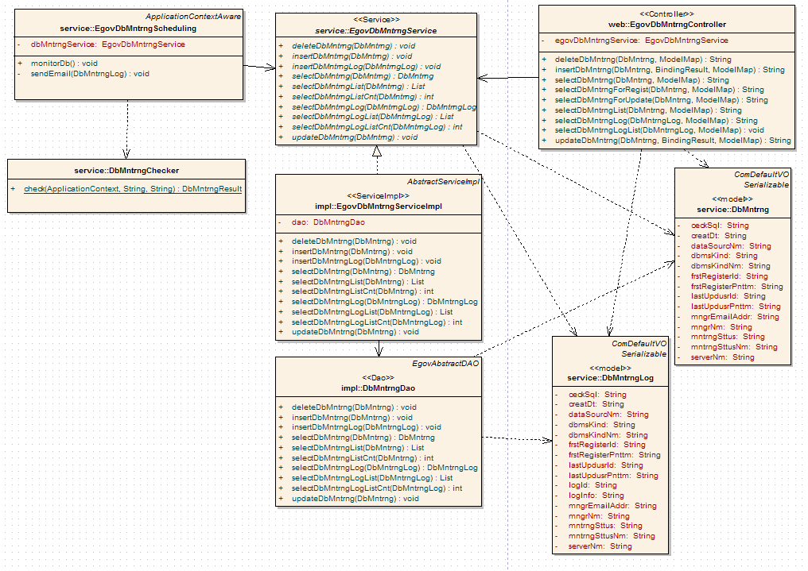
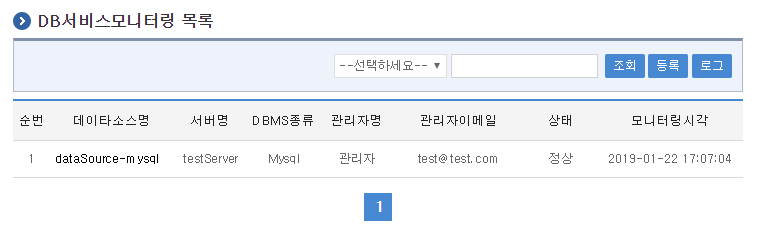
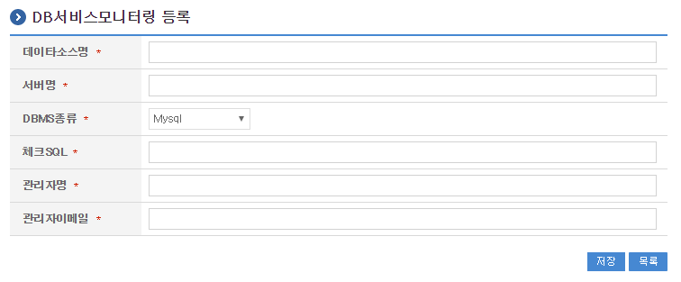
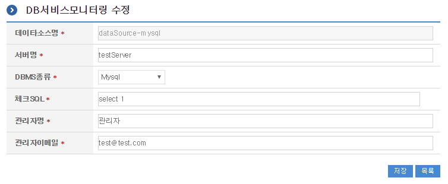
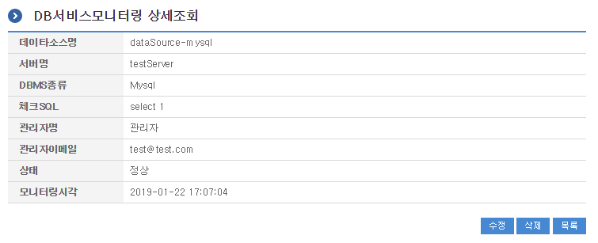
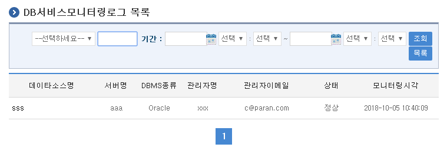
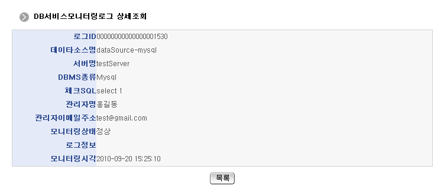

<!-- markdownlint-disable MD025 -->

# DB서비스모니터링

## 개요

DB서비스모니터링은 DB 서버의 서비스 상태를 주기적으로 모니터링하는 기능을 제공한다.
모니터링 대상 DB 서버는 DataSource가 전자정부 표준프레임워크(eGovFrame)에 Bean으로 등록되어 있어야 한다.

## 주요 개념

### 모니터링 스케줄링

주기적으로 DB 서버의 상태를 체크하여 연결 상태를 확인하고 그 결과를 로그에 기록하는 기능이다.
Quartz 스케줄러를 활용하여 모니터링 시작 지연 시간과 실행 주기를 설정할 수 있다.

### DB 연결 검사 (Checker)

각 DB에 대해 `DataSource`를 Lookup하여 데이터베이스 연결을 시도하고,
설정된 SQL 문을 실행하여 해당 DB가 활성화된 상태인지 검증한다.

## 관련 문서

- [네트워크서비스모니터링](./network-service-monitoring.md)
- [HTTP서비스모니터링](./http-service-monitoring.md)
- [송수신모니터링](./send-receive-monitoring.md)
- [서버자원모니터링](./server-resource-monitoring.md)
- [파일시스템모니터링](./file-system-monitoring.md)
- [프로세스모니터링](./process-monitoring.md)

## 설명

DB서비스모니터링은 등록된 DB의 연결 정보 및 설정에 따라 서비스 작동 여부를 확인하고,
관련 이력을 로그로 기록·조회하는 기능을 포함한다.

### 주요 기능

1. **DB서비스모니터링 목록 조회**: 등록된 모니터링 정보를 최근 등록 순서대로 조회하며 페이징과 검색 기능을 제공한다.
2. **DB서비스모니터링 등록**: 데이터소스명, 체크 SQL, 관리자 정보 등을 입력하여 모니터링 대상을 등록한다.
3. **DB서비스모니터링 수정**: 기 등록된 DB서비스모니터링 정보의 항목들을 수정한다.
4. **DB서비스모니터링 삭제**: 기 등록된 DB서비스모니터링 정보를 삭제한다.
5. **DB서비스모니터링 상세 조회**: 등록된 DB서비스모니터링 정보의 상세 내역을 조회한다.
6. **DB서비스모니터링 로그 목록 조회**: 스케줄러에 의해 주기적으로 실행된 모니터링 로그 정보를 최근 등록 순서대로 조회한다.
7. **DB서비스모니터링 로그 상세 조회**: 등록된 DB서비스모니터링 로그 정보를 상세 조회한다.

### 관련 소스

<!-- markdownlint-disable MD013 -->
| 유형 | 대상소스명 | 비고 |
| :--- | :--- | :--- |
| Controller | `egovframework.com.utl.sys.dbm.web.EgovDbMntrngController.java` | DB서비스모니터링을 위한 컨트롤러 클래스 |
| Service | `egovframework.com.utl.sys.dbm.service.EgovDbMntrngService.java` | DB서비스모니터링을 위한 서비스 인터페이스 |
| ServiceImpl | `egovframework.com.utl.sys.dbm.service.impl.EgovDbMntrngServiceImpl.java` | DB서비스모니터링을 위한 서비스 구현 클래스 |
| DAO | `egovframework.com.utl.sys.dbm.service.impl.DbMntrngDAO.java` | DB서비스모니터링을 위한 데이터처리 클래스 |
| Model | `egovframework.com.utl.sys.dbm.service.DbMntrng.java` | DB서비스모니터링을 위한 Model 클래스 |
| Model | `egovframework.com.utl.sys.dbm.service.DbMntrngLog.java` | DB서비스모니터링로그정보를 위한 Model 클래스 |
| 스케줄링 | `egovframework.com.utl.sys.dbm.service.EgovDbMntrngScheduling.java` | DB서비스모니터링로그정보를 위한 스케줄링 클래스 |
| 스케줄링 | `egovframework.com.utl.sys.dbm.service.DbMntrngChecker.java` | DB서비스모니터링로그정보를 위한 스케줄링 클래스 |
| 기타 | `egovframework.com.utl.sys.dbm.service.DbMntrngResult.java` | DB서비스모니터링로그정보에 대한 결과를 처리하기 위한 클래스 |
| JSP | `/WEB-INF/jsp/egovframework/utl/sys/dbm/EgovDbMntrngList.jsp` | DB서비스모니터링 목록 조회를 위한 JSP 페이지 |
| JSP | `/WEB-INF/jsp/egovframework/utl/sys/dbm/EgovDbMntrngRegist.jsp` | DB서비스모니터링 등록을 위한 JSP 페이지 |
| JSP | `/WEB-INF/jsp/egovframework/utl/sys/dbm/EgovDbMntrngUpdt.jsp` | DB서비스모니터링 수정을 위한 JSP 페이지 |
| JSP | `/WEB-INF/jsp/egovframework/utl/sys/dbm/EgovDbMntrngDetail.jsp` | 등록된 DB서비스모니터링을 조회하기 위한 JSP 페이지 |
| JSP | `/WEB-INF/jsp/egovframework/utl/sys/dbm/EgovDbMntrngLogList.jsp` | DB서비스모니터링 로그 목록 조회를 위한 JSP 페이지 |
| JSP | `/WEB-INF/jsp/egovframework/utl/sys/dbm/EgovDbMntrngLogDetail.jsp` | 등록된 DB서비스모니터링 로그를 조회하기 위한 JSP 페이지 |
| Query XML | `resources/egovframework/mapper/com/utl/sys/dbm/EgovDbMntrng_SQL_altibase.xml` | DB서비스모니터링을 위한 Altibase용 Query XML |
| Query XML | `resources/egovframework/mapper/com/utl/sys/dbm/EgovDbMntrng_SQL_cubrid.xml` | DB서비스모니터링을 위한 Cubrid용 Query XML |
| Query XML | `resources/egovframework/mapper/com/utl/sys/dbm/EgovDbMntrng_SQL_maria.xml` | DB서비스모니터링을 위한 MariaDB용 Query XML |
| Query XML | `resources/egovframework/mapper/com/utl/sys/dbm/EgovDbMntrng_SQL_mysql.xml` | DB서비스모니터링을 위한 MySQL용 Query XML |
| Query XML | `resources/egovframework/mapper/com/utl/sys/dbm/EgovDbMntrng_SQL_oracle.xml` | DB서비스모니터링을 위한 Oracle용 Query XML |
| Query XML | `resources/egovframework/mapper/com/utl/sys/dbm/EgovDbMntrng_SQL_postgres.xml` | DB서비스모니터링을 위한 PostgreSQL용 Query XML |
| Query XML | `resources/egovframework/mapper/com/utl/sys/dbm/EgovDbMntrng_SQL_tibero.xml` | DB서비스모니터링을 위한 Tibero용 Query XML |
| Query XML | `resources/egovframework/mapper/com/utl/sys/dbm/EgovDbMntrng_SQL_goldilocks.xml` | DB서비스모니터링을 위한 Goldilocks용 Query XML |
| Validator Rule XML | `resources/egovframework/validator/validator-rules.xml` | Validator Rule을 정의한 XML |
| Validator XML | `resources/egovframework/validator/com/utl/sys/dbm/EgovDbMntrng.xml` | DB서비스모니터링을 위한 Validator XML |
| Message properties | `resources/egovframework/message/com/utl/sys/dbm/message_ko.properties` | DB서비스모니터링을 위한 Message properties(한글) |
| Message properties | `resources/egovframework/message/com/utl/sys/dbm/message_en.properties` | DB서비스모니터링을 위한 Message properties(영문) |
| Idgen XML | `resources/egovframework/spring/com/idgn/context-idgn-DbMntrngLog.xml` | DB서비스모니터링을 위한 ID 생성 Idgen XML |
<!-- markdownlint-enable MD013 -->

### 클래스 다이어그램



### 관련 테이블

| 테이블명 | 테이블명(영문) | 설명 |
| :--- | :--- | :--- |
| DB서비스모니터링 | `COMTNDBMNTRNG` | DB서비스모니터링 정보를 관리하기 위한 속성정보를 정의하고 관리한다. |
| DB서비스모니터링로그정보 | `COMTHDBMNTRNGLOGINFO` | DB서비스모니터링 로그 정보를 관리하기 위한 속성정보를 정의하고 관리한다. |

### ID Generation DDL 및 DML

ID Generation Service를 활용하기 위해서 Sequence 저장 테이블인 `COMTECOPSEQ`에 `DB_MNTRNG_LOG_ID` 항목을 추가해야 한다.

```sql
CREATE TABLE COMTECOPSEQ (
    table_name VARCHAR(16) NOT NULL,
    next_id DECIMAL(30) NOT NULL,
    PRIMARY KEY (table_name)
);

INSERT INTO COMTECOPSEQ VALUES ('DB_MNTRNG_LOG_ID', 0);
```

### ID Generation 환경설정 (`context-idgn-DbMntrngLog.xml`)

```xml
<bean name="egovDbMntrngLogIdGnrService" class="egovframework.rte.fdl.idgnr.impl.EgovTableIdGnrServiceImpl" destroy-method="destroy">
    <property name="dataSource" ref="egov.dataSource" />
    <property name="strategy"   ref="dbMntrngLogIdStrategy" />
    <property name="blockSize"  value="10" />
    <property name="table"      value="COMTECOPSEQ" />
    <property name="tableName"  value="DB_MNTRNG_LOG_ID" />
</bean>
<bean name="dbMntrngLogIdStrategy" class="egovframework.rte.fdl.idgnr.impl.strategy.EgovIdGnrStrategyImpl">
    <property name="prefix"     value="" />
    <property name="cipers"     value="20" />
    <property name="fillChar"   value="0" />
</bean>
```

### 스케줄러 등록 (`context-scheduling.xml`)

DB서비스모니터링 스케줄러를 등록하기 위해서 `context-scheduling.xml` 파일에 다음과 같이 빈 및 트리거를 정의한다.

```xml
<!-- DB서비스모니터링 Job -->
<bean id="dbMntrng" class="org.springframework.scheduling.quartz.MethodInvokingJobDetailFactoryBean">
    <property name="targetObject" ref="egovDbMntrngScheduling" />
    <property name="targetMethod" value="monitorDb" />
    <property name="concurrent" value="false" />
</bean>

<!-- DB서비스모니터링 트리거 -->
<bean id="dbMntrngTrigger" class="org.springframework.scheduling.quartz.SimpleTriggerFactoryBean">
    <property name="jobDetail" ref="dbMntrng" />
    <property name="startDelay" value="60000" />
    <property name="repeatInterval" value="600000" />
</bean>
```

- `startDelay`는 서버 시작 후 몇 밀리초(ms) 뒤에 시작할지를 설정한다. (60000ms = 1분)
- `repeatInterval`은 몇 밀리초(ms)에 한 번씩 실행될지를 설정한다. (600000ms = 10분)

```xml
<!-- 모니터링 스케줄러 -->
<bean id="mntrngScheduler" class="org.springframework.scheduling.quartz.SchedulerFactoryBean">
    <property name="triggers">
        <list>
            <ref bean="dbMntrngTrigger" />
        </list>
    </property>
</bean>
```

## 관련 화면 및 기능 설명

### DB서비스모니터링 목록 조회

| Action | URL | Controller Method | Query ID |
| :--- | :--- | :--- | :--- |
| 조회 | `/utl/sys/dbm/selectDbMntrngList.do` | `selectDbMntrngList` | `DbMntrngDAO.selectDbMntrngList` |
| 조회 | `/utl/sys/dbm/selectDbMntrngList.do` | `selectDbMntrngList` | `DbMntrngDAO.selectDbMntrngListCnt` |

DB서비스모니터링 목록은 페이지당 10건씩 조회되며 페이징은 10페이지씩 이루어진다.
검색 조건은 DB명(연계명), 관리자명에 대해 제공된다.



- **조회**: 등록된 DB서비스모니터링 목록을 조회한다.
- **등록**: 신규 모니터링 설정을 위해 우측 상단의 등록 버튼을 눌러 DB서비스모니터링 등록 화면으로 이동한다.

### DB서비스모니터링 등록

| Action | URL | Controller Method | Query ID |
| :--- | :--- | :--- | :--- |
| 등록 | `/utl/sys/dbm/addDbMntrng.do` | `insertDbMntrng` | `DbMntrngDAO.insertDbMntrng` |

모니터링 대상 DB의 속성정보를 입력한 뒤 등록한다.
**데이터소스명** 항목에는 `context-datasource.xml`에 정의된 Spring Bean DataSource ID(예: `egov.dataSource`)를
정확하게 기입해야 한다.



- **저장**: 입력한 DB서비스모니터링 정보를 등록한다.
- **목록**: DB서비스모니터링 목록 조회 화면으로 이동한다.

### DB서비스모니터링 수정

| Action | URL | Controller Method | Query ID |
| :--- | :--- | :--- | :--- |
| 수정 | `/utl/sys/dbm/updateDbMntrng.do` | `updateDbMntrng` | `DbMntrngDAO.updateDbMntrng` |

기 등록된 DB서비스모니터링의 속성 정보를 수정한다.



- **저장**: 수정된 내용을 데이터베이스에 저장한다.
- **목록**: DB서비스모니터링 목록 조회 화면으로 이동한다.

### DB서비스모니터링 상세 조회

| Action | URL | Controller Method | Query ID |
| :--- | :--- | :--- | :--- |
| 상세조회 | `/utl/sys/dbm/getDbMntrng.do` | `selectDbMntrng` | `DbMntrngDAO.selectDbMntrng` |
| 삭제 | `/utl/sys/dbm/deleteDbMntrng.do` | `deleteDbMntrng` | `DbMntrngDAO.deleteDbMntrng` |

등록된 DB서비스모니터링의 속성정보를 확인한다.



- **수정**: DB서비스모니터링 수정 화면으로 이동한다.
- **삭제**: 기 등록된 DB서비스모니터링 정보를 삭제한다.
- **목록**: DB서비스모니터링 목록 조회 화면으로 이동한다.

### DB서비스모니터링 로그 목록 조회

| Action | URL | Controller Method | Query ID |
| :--- | :--- | :--- | :--- |
| 조회 | `/utl/sys/dbm/selectDbMntrngLogList.do` | `selectDbMntrngLogList` | `DbMntrngDAO.selectDbMntrngLogList` |
| 조회 | `/utl/sys/dbm/selectDbMntrngLogList.do` | `selectDbMntrngLogList` | `DbMntrngDAO.selectDbMntrngLogListCnt` |

스케줄러에 의해 주기적으로 실행된 모니터링 로그 목록을 조회한다.
검색 조건은 DB명(연계명), 관리자명, 모니터링시각 범위에 대해 제공된다.



- **조회**: 검색 조건에 해당하는 DB서비스모니터링 로그 목록을 조회한다.

### DB서비스모니터링 로그 상세 조회

| Action | URL | Controller Method | Query ID |
| :--- | :--- | :--- | :--- |
| 상세조회 | `/utl/sys/dbm/getDbMntrngLog.do` | `selectDbMntrngLog` | `DbMntrngDAO.selectDbMntrngLog` |

특정 모니터링 이력의 로그 상세 정보를 조회한다.
대상 DB의 데이터소스명, 연결 상태 결과 및 에러 발생 시의 상세 에러 메시지가 표시된다.



- **목록**: DB서비스모니터링 로그 목록 조회 화면으로 이동한다.

## 참고자료

- [전자정부 표준프레임워크 DokuWiki - DB서비스모니터링](https://www.egovframe.go.kr/wiki/doku.php?id=egovframework:com:v5.0:utl:sys:dbm:db서비스모니터링)
