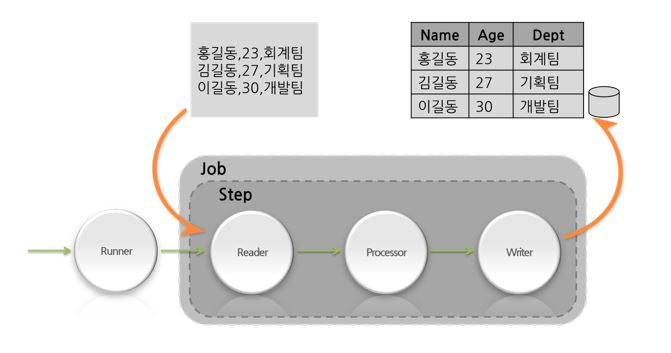

## 개요

 Batch 개발은 업무 특성으로 일반 개발과 달라, 학습과 설정이 필요하다. **Easy Batch**는 는 이 부분을 간소화 할 수 있는 기능을 제공한다. Batch 업무 특성 상 그 구조가 정형화 되어있으므로, 기본 구조의 Job 개발일 경우 본 모듈을 사용하면, 많은 설정부분들에 대한 내용없이 개발이 가능하다.  
기본적인 형태(ItemReader - ItemProcessor - ItemWriter)의 Job인 경우 ItemReader, ItemWriter 설정에 Easy Batch 가 제공하는 Reader, Writer를 설정하면, XML 설정을 간략화해서 사용가능하다.

## 설명

 Easy Batch는 표준프레임워크 배치 실행환경 기반으로 작성되었으며, 표준프레임워크 배치 중 아래의 부분을 간단하게 사용하는 기능을 제공한다. 표준프레임워크 배치프레임워크에 대한 상세 내용은 [표준프레임워크 배치실행환경](https://www.egovframe.go.kr/wiki/doku.php?id=egovframework:rte2:brte) 을 참고하도록 한다.  

 

 위의 그림에서 보이는 것처럼, 배치 업무는 ItemReder, ItermProcessor, ItermWriter로 처리되며, 이를 위해 제공되는 다양한 ItemReader, ItermWriter 중에 업무 목적에 맞게 선택을 하고, 설정이 필요하다. Easy Batch에서는 이러한 설정을 간소화하여 설정할 수 있는 기능을 제공한다.

##### 관련소스

| 유형 | 대상소스 | 설명 | 비고 |
| --- | --- | --- | --- |
| Util | egovframework.com.ext.easybatch.item.DefaultItemReader | DefalutItemReader 필요한 Resource를 read |  |
| Util | egovframework.com.ext.easybatch.item.DefaultItemWriter | DefalutItemWriter 처리결과를 지정된 타겟에 write |  |

##### DefaultReader, DefaultWriter 구조

 

## 사용방법

 1. DefaultItemReader, DefaultItemWriter를 설정한다.

```xml
<job id="employeeJob" parent="eGovBaseJob" xmlns="http://www.springframework.org/schema/batch">
  <step id="dlimitedToJdbcStep" parent="eGovBaseStep">
    <tasklet>
        <chunk reader="defaultReader" writer="defaultWriter" commit-interval="2" />
    </tasklet>
  </step>
</job>
 
<bean id="defaultReader" class="egovframework.rte.bat.item.DefaultItemReader" scope="step">
  <property name="dataSource" ref="dataSource" />
</bean>
 
<bean id="defaultWriter" class="egovframework.rte.bat.item.DefaultItemWriter" scope="step">
  <property name="dataSource" ref="dataSource" />
</bean>
 
<bean id="itemProcessor" class="egovframework.rte.bat.sample.domain.trade.CustomerCreditIncreaseProcessor" />
```

 2. 실행한다.

```bash
bash$ java  EgovCommandLineJobRunner  employee_job.xml  employee  date= 2014/10/31
```

 3. 실행 중 에러가 나는 경우는 콘솔상의 로그에 나온 안내메시지를 따라 수행파라미터를 입력하도록 한다.

 

## 참고자료

 [EasyBatch소개자료](https://www.egovframe.go.kr/wiki/lib/exe/fetch.php?media=egovframework:easy_batch_project.pdf)