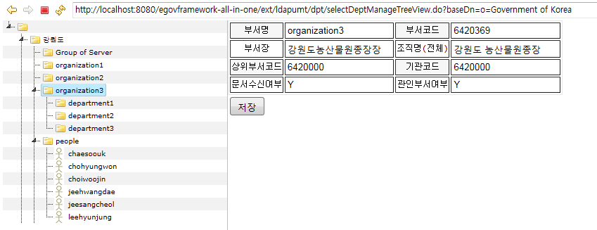
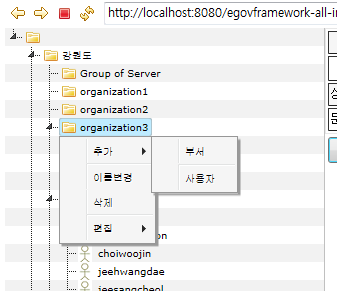
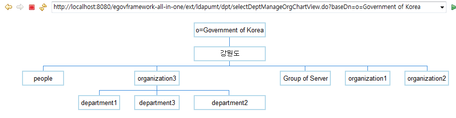
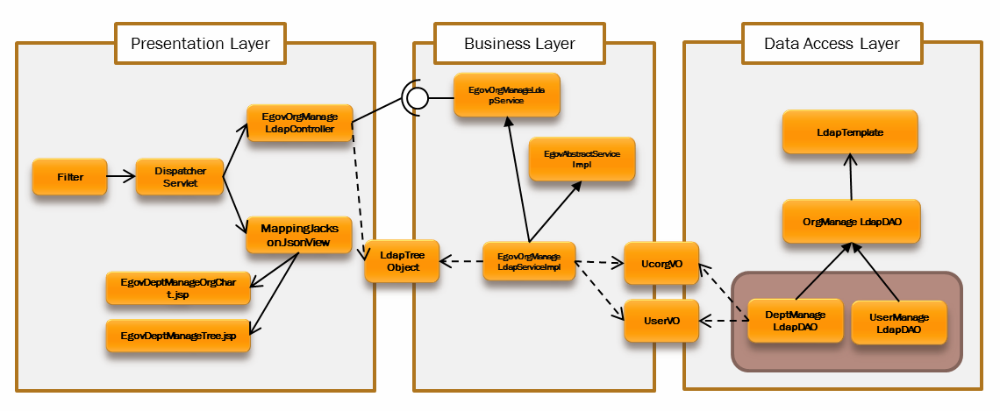
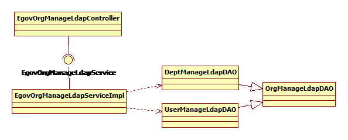
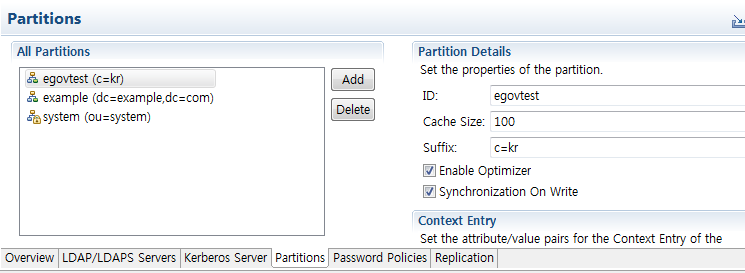
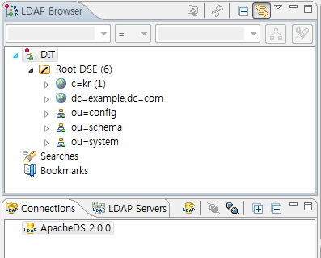
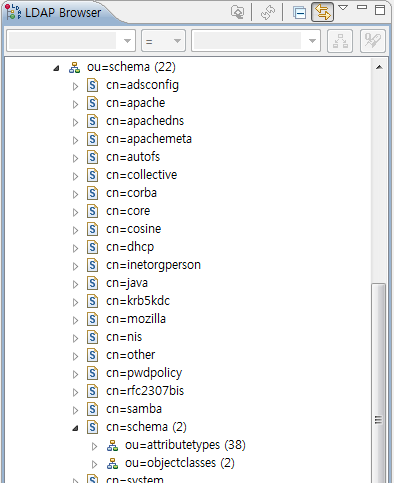
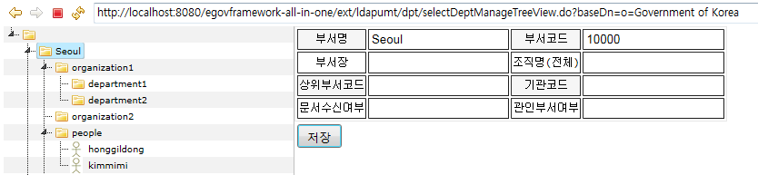
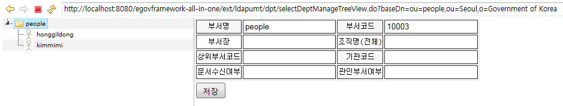

## 개요

 **LDAP조직도관리**는 조직과 사용자 정보를 효율적으로 관리하기 위한 컴포넌트로,  
LDAP과의 연계를 통해 조회 성능을 향상시키고, 차트형태와 같이 다양한 방식으로 조직도를 표현할 수 있는 기능을 제공한다.  

 LDAP조직도관리는 아래와 같은 기능을 포함한다.

| 기능 | 설명 |
| --- | --- |
| 조직도 조회 | LDAP에 저장된 조직도 정보를 트리형태 또는 차트형태로 렌더링 |
| 엔트리 동적생성 기능 | UI를 통한 새로운 엔트리 추가 기능 |
| 엔트리 정보 편집 | UI를 통한 기존 엔트리 속성값수정/삭제/이동 기능 |
| 행자부 표준지원 | 행자부 유통표준 LDAP스키마인 UCORG2를 지원 |

## 설명

 LDAP조직도관리 컴포넌트에서 조직도 정보는 아래와 같이 트리형태과 차트형태 두가지로 표현한다.  
엔트리 추가/수정/삭제를 위한 컨텍스트 메뉴는 트리형태로 표현된 경우에만 제공한다.

### 조직도 조회 화면1 - 트리형태

- '/ext/ldapumt/dpt/selectDeptManageTreeView.do?baseDn=…'을 이용해 LDAP 서버로부터 데이터를 조회하면, 조직도 정보가 화면 왼쪽에 트리형태로 표현된다.
- 하나의 엔트리가 하위 엔트리를 가지는 경우, 해당 엔트리 앞에 삼각형으로 표시된다.
- 각 엔트리에 대한 상세 정보는 오른쪽 화면에 출력되고, 데이터를 변경한 후 저장 버튼을 누르면 LDAP 서버에 변경된 데이터가 저장된다.
- 조직도 정보는 최초 request로 넘어온 dn의 하위 엔트리에 대해서만 조회를 하고, 하위 엔트리의 펼침 버튼을 눌렀을 때만 LDAP에서 추가 조회하기 때문에 부하를 최소화할 수 있다.

 

#### 조직도 컨텍스트 메뉴

- 컨텍스트 메뉴를 이용하면 화면상에서 부서와 사용자 엔트리를 추가할 수 있고, 원하는 엔트리 이름을 변경하거나 삭제할 수 있다.
- 트리목록 중 변경을 원하는 엔트리 위치에서 마우스 우클릭하면 컨텍스트 메뉴가 나온다.

| 컨텍스트 메뉴 | 하위 메뉴 | 설명 |
| --- | --- | --- |
| 추가 | 부서, 사용자 | 엔트리 추가 |
| 이름변경 | - | 엔트리 이름 변경 |
| 삭제 | - | 엔트리 삭제 |
| 편집 | 이동부서선택 | 엔트리 위치 이동 |

 

### 조직도 조회 화면2 - 차트(그래프)형태

- '/ext/ldapumt/dpt/selectDeptManageOrgChartView.do?baseDn=…'을 이용해 LDAP 서버로부터 데이터를 조회하면, 조직도 정보가 차트 형태로 표현된다.
- 엔트리를 한번 클릭하면 우측 하단에 엔트리 상세정보가 나타나며, 내용을 변경할 수 있다.
- 엔트리를 더블 클릭을 하면 하위 엔트리를 LDAP에서 추가 조회하여 동적으로 보여준다.

 

### 관련 패키지 및 소스

| 유형 | 소스 | 설명 |
| --- | --- | --- |
| Controller | egovframework.com.ext.ldapumt.web.EgovOrgManageLdapController.java | 조직도 관리를 위한 컨트롤러 클래스 |
| VO | egovframework.com.ext.ldapumt.service.LdapTreeObject.java | 웹에서의 tree구현을 위한 오브젝트 클래스 |
| VO | egovframework.com.ext.ldapumt.service.LdapObject.java | LDAP과 인터페이스를 위한 추상클래스 |
| VO | egovframework.com.ext.ldapumt.service.UcorgVO.java | 부서 VO클래스 |
| VO | egovframework.com.ext.ldapumt.service.UserVO.java | 사용자 VO클래스 |
| Service | egovframework.com.ext.ldapumt.service.EgovOrgManageLdapService.java | 조직도 관리를 위한 서비스 인터페이스 |
| ServiceImpl | egovframework.com.ext.ldapumt.service.impl.EgovOrgManageLdapServiceImpl.java | 조직도 관리를 위한 서비스 구현클래스 |
| Execute Interface | egovframework.com.ext.ldapumt.service.impl.Executable.java | ORMapping 지원을 위한 클래스 |
| Object Mapper | egovframework.com.ext.ldapumt.service.impl.ObjectMapper.java | LdapTemplate을 사용하기 위한 ObjectMapper클래스 |
| DAO | egovframework.com.ext.ldapumt.service.impl.OrgManageLdapDAO.java | 조직도 관리를 위한 추상 Data Access Object |
| DAO | egovframework.com.ext.ldapumt.service.impl.DeptManageLdapDAO.java | 부서 관리를 위한 Data Access Object |
| DAO | egovframework.com.ext.ldapumt.service.impl.com.ext.ldapumt.service.impl.UserManageLdapDAO.java | 사용자 관리를 위한 Data Access Object |
| XML | /resources/egovframework/spring/com/context-ldap.xml | LDAP Spring 설정 관련 XML |
| 패키지 | /html/egovframework/com/ext/ldapumt | JSTree 패키지 |
| JSP | /WEB-INF/jsp/egovframework/com/ext/ldapumt/EgovDeptManageTree.jsp | 조직도 관리를 위한 트리 JSP 페이지 |
| JSP | /WEB-INF/jsp/egovframework/com/ext/ldapumt/EgovDeptManageOrgChart.jsp | 조직도 관리를 위한 조직도 차트 JSP 페이지 |

#### 아키텍쳐

 

#### 클래스 다이어그램

 

## 사용방법

 1. ldap 서버와 연결하기 위한 서버 연결 정보를 context-ldap.xml파일에 작성한다.

```xml
<ldap:context-source url="LDAP 서버 URL" base="최상위 DN" username="LDAP 서버 ID" password="LDAP 서버 PASSWORD" />
<!-- 예시, <ldap:context-source url="ldap://localhost:10389" base="c=kr" username="uid=admin,ou=system" password="secret" /> -->
```

 2. ldap 서버에 저장된 데이터를 조회하기 위한 URL 호출 방법은 다음과 같다. - 트리형태로 보기

```bash
/ext/ldapumt/dpt/selectDeptManageTreeView.do?baseDn=[DN|RDN]
//예시, /ext/ldapumt/dpt/selectDeptManageTreeView.do?baseDn=o=Government of Korea
```

 - 차트형태로 보기

```bash
/ext/ldapumt/dpt/selectDeptManageOrgChartView.do?baseDn=[DN|RDN]
//예시, /ext/ldapumt/dpt/selectDeptManageOrgChartView.do?baseDn=o=Government of Korea
```

 3. LDAP조직도관리 컴포넌트를 위한 조직 스키마(ucOrg2)와 조직원 스키마(User)가 담긴 LDIF 파일  
(단, 아래 파일은 ApacheDS 서버에서 export한 파일임, 다른 서버에서 import할 경우 정상적으로 import되지 않을 수 있음)

 [schema.zip](https://www.egovframe.go.kr/wiki/lib/exe/fetch.php?media=egovframework:schema.zip)

### object class :: ucOrg2

| attribute | description | attribute | description | attribute | description |
| --- | --- | --- | --- | --- | --- |
| docSystemInfo | 기관별 문서함 | ou | 해당기관의 명칭(필수) | ouCode | 기관코드(필수) |
| ouDocumentReceipientSymbol | 수신 문서 symbol | ouLevel | 조직의 차수 | ouOrder | 차상위 기관내의 조직의 서열 |
| ouReceiveDocumentYN | 대외문서 처리과여부 | ouSendOutDocumentYN | 대외문서 송신여부 | ouSMTPAddress | 조직 전자메일 주소 |
| parentouCode | 차상위 기관코드 | repouCode | 대표기관코드 | signCertificate | 서명용 전자 관인 |
| topouCode | 최상위 기관코드 | typeBig | 대분류 | typeMid | 중분류 |
| typeSml | 소분류 | ucChieftitle | 발신인명의 | ucOrganizationalUnitName | 해당 기관의 명칭 |
| ucOrgFullName | 상위기관을 포함한 전체 조직명 | useGroupware | 조직 사용하는 그룹웨어명 | userCertificate | 조직 인증서 정보 |
| wsignCertificate | 무선 서명용 인증서 | wuserCertificate | 무선 암호화용 인증서 |

### object class :: User

| attribute | description | attribute | description | attribute | description |
| --- | --- | --- | --- | --- | --- |
| birthday | 생일 | business | 업무 | cn | 행정전자서명 아이디 |
| companyName | 사용자가 속한 부처명 | departmentName | 사용자가 속한 실국명 | dispatchYN | 파견여부 |
| displayName | 화면에 보여줄 사용자의 이름 예) 홍길동 | facsimileTelephoneNumber | 회사팩스번호 | givenName | 사용자의 영문이름 |
| grade | 직급 | homePhone | 사용자의 집 전화번호 | homePostalAddress | 집주소 |
| insayn | 인사권한여부 | mail | SMTP | mgrTopOuCode | 최상위 기관코드 |
| mobile | 사용자의 휴대 전화번호 | office | 사용자의 사무실 전화번호 | orgManagerYN | 관리자여부 |
| ou | 해당기관의 명칭 | ouCode | 기관코드 | ouLevel | 조직의 차수 |
| ouOrder | 차상위 기관내의 조직의 서열 | parentouCode | 차상위 기관코드 | position | 사용자직위 |
| postalAddress | 회사주소 | RegDate | 등록일 | RegDestType | 등록목적타입 |
| repouCode | 대표기관코드 | signCertificate | 서명용 전자관인 | telephoneNumber | 회사전화번호 |
| topouCode | 상위기관코드 | ucOrgFullName | 상위기관포함 전체 조직명 | useEndDate | 사용종료일 |
| userCertificate | 사용자 인증서 정보 | userFullName | 자신이 속한 조직 전체명 + 사용자명 | userType | 사용자 타입 |
| useStartDate | 사용시작일 | wsignCertificate | 무선 서명용 인증서 | wuserCertificate | 무선 암호화용 인증서 |

## 조직도 조회화면 테스트방법

 1. **[환경구성 및 설치]** Apache Directory Studio 2.0.0 설치 후 Apache Directory Studio.exe 실행

- 설치 - [https://directory.apache.org/studio/downloads.html](https://directory.apache.org/studio/downloads.html)

 2. **[서버 생성]** LDAP Servers 탭 > ApacheDS 2.0.0 더블클릭 (없으면 추가) > Partitions 탭 > Add 버튼 > 아래와 같이 입력 후 저장 (Ctrl + S)

 

 3. **[서버 실행]** LDAP Servers 탭 > ApacheDS 2.0.0 우클릭 > Create a Connection, Run (서버 실행)

 4. **[LDAP 디렉토리 생성]** Connections 탭 > ApacheDS 2.0.0 더블클릭 > LDAP Browser 탭 > DIT-Root DSE-c=kr 디렉토리 생성 확인

 

 5. **[LDAP 스키마 추가]** LDAP Browser 탭 > DIT 우클릭 > Import > LDIF Import > Browse > schema.ldif 선택 > Finish  
(Import 결과, ou=schema > cn=schema 아래 ou=attributetypes, ou=objectclasses 디렉토리 생성)

 

 6. **[LDAP 엔트리 생성]** 조직(ucOrg2)과 조직원(User) 스키마를 기준으로 필요한 조직, 조직원 엔트리를 생성 (아래는 예시)  

```bash
c=kr
  o=Government of Korea --- 1)
     ou=Seoul            --- 2)
        ou=organization1
          ou=department1
          ou=department2
        ou=organization2
        ou=people
          cn=honggildong --- 3)
          cn=kimmimi

```

- 1) c=kr 우클릭 > New Entry > Next > object classes에서 'organization' Add > RDN 입력 (o=Government of Korea)
- 2) o=Government of Korea 우클릭 > New Entry > Next > object classes에서 'ucOrg2' 입력 후 새로고침 버튼 > Add > RDN 입력 (ou=Seoul) > Attribute 추가 입력(동일한 방식으로 ou=organization1, 2와 ou=department1, 2, ou=people 생성)
- 3) ou=people 우클릭 > New Entry > Next > object classes에서 'User' 입력 후 새로고침 버튼 > Add > RDN 입력 (cn=honggildong) > Attribute 추가 입력

 7. **[최종 결과]** 실행 결과 및 URL 호출 방법 (현재 조직정보는 필수값만 입력된 상태)

- o=Government of Korea를 기준으로 조회한 화면

 

- ou=people,ou=Seoul,o=Government of Korea를 기준으로 조회한 화면

 