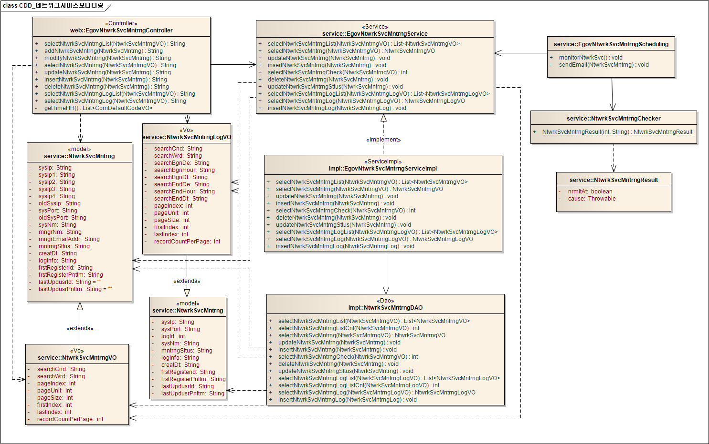
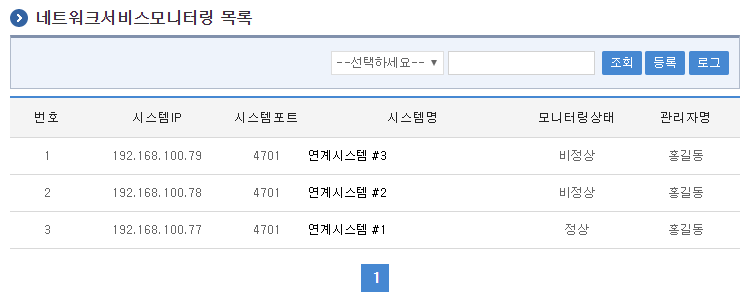
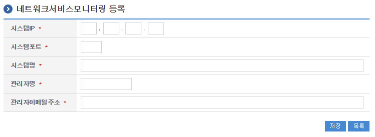
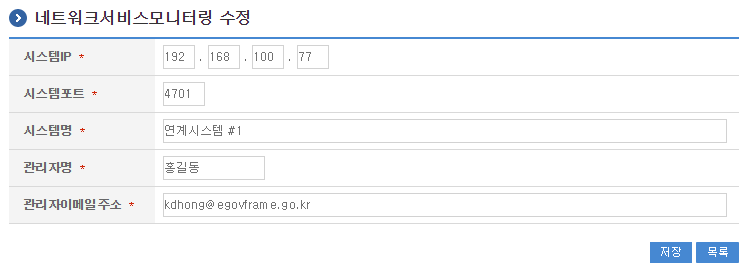
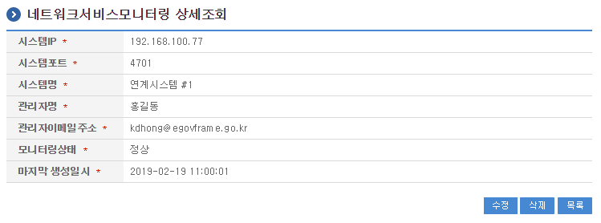
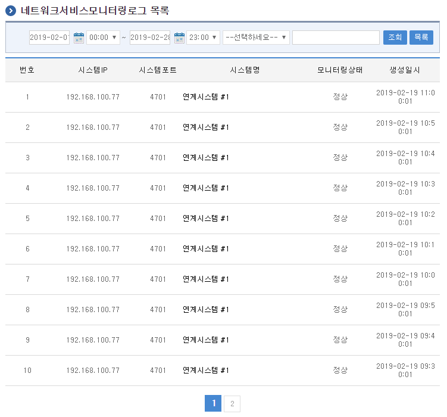
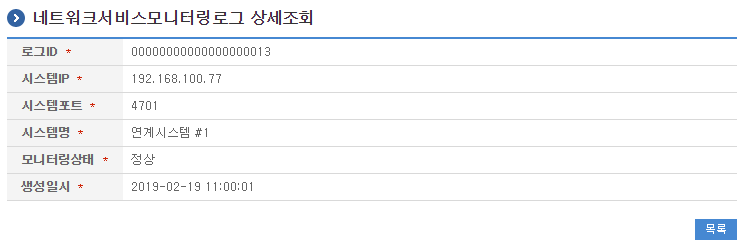

<!-- markdownlint-disable MD025 MD013 -->

# 네트워크서비스모니터링

## 개요

**네트워크서비스모니터링**은 네트워크서비스 상태를 주기적으로 모니터링하는 기능을 제공한다.
모니터링하고자 하는 네트워크서비스는 네트워크서비스대상목록으로 시스템에 등록되어 있어야 한다.

## 설명

네트워크서비스모니터링은 네트워크서비스모니터링을 등록하기 위한 목적으로 네트워크서비스모니터링의 등록, 수정, 삭제, 조회, 목록조회의 기능을 수반한다.

1. **네트워크서비스모니터링목록조회** : 네트워크서비스모니터링으로 정의된 정보를 최근 등록 순서대로 조회하고, 그 결과 목록을 화면에 반영한다.
2. **네트워크서비스모니터링등록** : 네트워크서비스모니터링정보를 등록하고, 등록 결과를 조회한다.
3. **네트워크서비스모니터링수정** : 기 등록된 네트워크서비스모니터링정보의 항목들을 수정한다.
4. **네트워크서비스모니터링삭제** : 기 등록된 네트워크서비스모니터링정보를 삭제한다.
5. **네트워크서비스모니터링조회** : 등록된 네트워크서비스모니터링정보를 조회한다.
6. **네트워크서비스모니터링로그목록조회** : 네트워크서비스모니터링로그로 정의된 정보를 최근 등록 순서대로 조회하고, 그 결과 목록을 화면에 반영한다.
7. **네트워크서비스모니터링로그조회** : 등록된 네트워크서비스모니터링로그정보를 조회한다.

### 관련 소스

| 유형 | 대상소스명 | 비고 |
| --- | --- | --- |
| Controller | `egovframework.com.utl.sys.nsm.web.EgovNtwrkSvcMntrngController.java` | 네트워크서비스모니터링을 위한 컨트롤러 클래스 |
| Service | `egovframework.com.utl.sys.nsm.service.EgovNtwrkSvcMntrngService.java` | 네트워크서비스모니터링을 위한 서비스 인터페이스 |
| ServiceImpl | `egovframework.com.utl.sys.nsm.service.impl.EgovNtwrkSvcMntrngServiceImpl.java` | 네트워크서비스모니터링을 위한 서비스 구현 클래스 |
| DAO | `egovframework.com.utl.sys.nsm.service.impl.NtwrkSvcMntrngDAO.java` | 네트워크서비스모니터링을 위한 데이터처리 클래스 |
| Model | `egovframework.com.utl.sys.nsm.service.NtwrkSvcMntrng.java` | 네트워크서비스모니터링을 위한 Model 클래스 |
| Model | `egovframework.com.utl.sys.nsm.service.NtwrkSvcMntrngLog.java` | 네트워크서비스모니터링로그정보를 위한 Model 클래스 |
| VO | `egovframework.com.utl.sys.nsm.service.NtwrkSvcMntrngVO.java` | 네트워크서비스모니터링을 위한 VO 클래스 |
| VO | `egovframework.com.utl.sys.nsm.service.NtwrkSvcMntrngLogVO.java` | 네트워크서비스모니터링로그정보를 위한 VO 클래스 |
| 스케줄링 | `egovframework/com/utl/sys/nsm/service/EgovNtwrkSvcMntrngScheduling.java` | 네트워크서비스모니터링을 위한 스케줄링 클래스 |
| 스케줄링 | `egovframework/com/utl/sys/nsm/service/NtwrkSvcMntrngChecker.java` | 네트워크서비스모니터링을 위한 스케줄링 클래스 |
| 기타 | `egovframework/com/utl/sys/nsm/service/NtwrkSvcMntrngResult.java` | 네트워크서비스 모니터링에 대한 결과를 처리하기 위한 클래스 |
| JSP | `/WEB-INF/jsp/egovframework/utl/sys/nsm/EgovNtwrkSvcMntrngList.jsp` | 네트워크서비스모니터링목록조회를 위한 jsp페이지 |
| JSP | `/WEB-INF/jsp/egovframework/utl/sys/nsm/EgovNtwrkSvcMntrngRegist.jsp` | 네트워크서비스모니터링 등록을 위한 jsp페이지 |
| JSP | `/WEB-INF/jsp/egovframework/utl/sys/nsm/EgovNtwrkSvcMntrngUpdt.jsp` | 네트워크서비스모니터링 수정을 위한 jsp페이지 |
| JSP | `/WEB-INF/jsp/egovframework/utl/sys/nsm/EgovNtwrkSvcMntrngDetail.jsp` | 등록된 네트워크서비스모니터링을 조회하기 위한 jsp페이지 |
| JSP | `/WEB-INF/jsp/egovframework/utl/sys/nsm/EgovNtwrkSvcMntrngLogList.jsp` | 네트워크서비스모니터링로그목록조회를 위한 jsp페이지 |
| JSP | `/WEB-INF/jsp/egovframework/utl/sys/nsm/EgovNtwrkSvcMntrngLogDetail.jsp` | 등록된 네트워크서비스모니터링로그를 조회하기 위한 jsp페이지 |
| Query XML | `resources/egovframework/mapper/com/utl/sys/nsm/EgovNtwrkSvcMntrng_SQL_*.xml` | 네트워크서비스모니터링을 위한 각 DB용 Query XML |
| Validator Rule XML | `resources/egovframework/validator/validator-rules.xml` | Validator Rule을 정의한 XML |
| Validator XML | `resources/egovframework/validator/com/utl/sys/nsm/EgovNtwrkSvcMntrng.xml` | 네트워크서비스모니터링을 위한 Validator XML |
| Message properties | `resources/egovframework/message/com/utl/sys/nsm/message_*.properties` | 네트워크서비스모니터링을 위한 Message properties |
| Idgen XML | `resources/egovframework/spring/com/idgn/context-idgn-NtwrkSvcMntrngLog.xml` | 네트워크서비스모니터링을 위한 Id생성 Idgen XML |

### 클래스 다이어그램



### 관련 테이블

| 테이블명 | 테이블명(영문) | 비고 |
| --- | --- | --- |
| 네트워크서비스모니터링 | COMTNNTWRKSVCMNTRNG | 네트워크서비스모니터링정보를 관리하기 위한 속성정보를 정의하고, 관리한다. |
| 네트워크서비스모니터링로그정보 | COMTNNTWRKSVCMNTRNGLOGINFO | 네트워크서비스모니터링로그정보를 관리하기 위한 속성정보를 정의하고, 관리한다. |

### ID Generation 관련 DDL 및 DML

ID Generation Service를 활용하기 위해서 Sequence 저장테이블인 COMTECOPSEQ에 `NTWRKSVC_LOGID` 항목을 추가해야 한다.

```sql
CREATE TABLE COMTECOPSEQ (
    table_name varchar(16) NOT NULL,
    next_id DECIMAL(30) NOT NULL,
    PRIMARY KEY (table_name)
);

INSERT INTO COMTECOPSEQ VALUES ('NTWRKSVC_LOGID','0');
```

### ID Generation 환경설정

`context-idgn-NtwrkSvcMntrngLog.xml`

```xml
<bean name="egovNtwrkSvcMntrngLogIdGnrService" class="egovframework.rte.fdl.idgnr.impl.EgovTableIdGnrServiceImpl" destroy-method="destroy">
    <property name="dataSource" ref="egov.dataSource" />
    <property name="strategy"   ref="ntwrkSvcMntrngLogIdStrategy" />
    <property name="blockSize"  value="10" />
    <property name="table"      value="COMTECOPSEQ" />
    <property name="tableName"  value="NTWRKSVC_LOGID" />
</bean>
<bean name="ntwrkSvcMntrngLogIdStrategy" class="egovframework.rte.fdl.idgnr.impl.strategy.EgovIdGnrStrategyImpl">
    <property name="prefix"     value="" />
    <property name="cipers"     value="20" />
    <property name="fillChar"   value="0" />
</bean>
```

### 스케줄러 등록

네트워크서비스모니터링 스케줄러를 등록하기 위해서 `context-scheduling.xml` 파일에 다음과 같이 등록한다.

```xml
<!-- 네트워크서비스모니터링 -->
<bean id="ntwrkSvcMntrng"
    class="org.springframework.scheduling.quartz.MethodInvokingJobDetailFactoryBean">
    <property name="targetObject" ref="egovNtwrkSvcMntrngScheduling" />
    <property name="targetMethod" value="monitorNtwrkSvc" />
    <property name="concurrent" value="false" />
</bean>

<!-- 네트워크서비스모니터링 트리거-->
<bean id="ntwrkSvcMntrngTrigger"
    class="org.springframework.scheduling.quartz.SimpleTriggerBean">
    <property name="jobDetail" ref="ntwrkSvcMntrng" />
    <!-- 시작하고 1분후에 실행한다. (milisecond) -->
    <property name="startDelay" value="60000" />
    <!-- 매 10분마다 실행한다. (milisecond) -->
    <property name="repeatInterval" value="600000" />
</bean>
```

- `startDelay`는 서버 시작후 몇 초 뒤에 시작할지를 설정한다.(ms 단위 : 현재 1분)
- `repeatInterval`는 몇 초에 한 번씩 실행될지를 설정한다.(ms 단위 : 현재 10분)

```xml
<!-- 모니터링 스케줄러 -->
<bean id="mntrngScheduler" class="org.springframework.scheduling.quartz.SchedulerFactoryBean">
    <property name="triggers">
        <list>
            <ref bean="ntwrkSvcMntrngTrigger" />
        </list>
    </property>
</bean>
```

## 참고자료

### 관련 화면 및 수행 매뉴얼

#### 네트워크서비스모니터링 목록조회

네트워크서비스모니터링 목록은 페이지당 10건씩 조회되며 페이징은 10페이지씩 이루어진다. 검색조건은 시스템명, 시스템IP, 관리자명, 상태에 대해서 수행된다.



- **조회** : 기 등록된 네트워크서비스모니터링의 목록을 조회한다.
- **등록** : 신규 네트워크서비스모니터링을 등록하기 위해서는 상단의 등록 버튼을 통해서 **네트워크서비스모니터링 등록** 화면으로 이동한다.
- **시스템명클릭** : 해당 **네트워크서비스모니터링대상 상세조회** 화면으로 이동한다.

#### 네트워크서비스모니터링 등록

네트워크서비스모니터링의 속성정보를 입력한 뒤 등록한다.



- **저장** : 신규 네트워크서비스모니터링을 등록하기 위해서는 네트워크서비스모니터링 속성을 입력한 뒤 하단의 **저장 버튼**을 통해서 네트워크서비스모니터링을 등록한다.
- **목록** : 네트워크서비스모니터링 목록조회 화면으로 이동한다.

#### 네트워크서비스모니터링 수정

네트워크서비스모니터링의 속성정보를 변경한 후 저장한다.



- **저장** : 기 등록된 네트워크서비스모니터링 속성을 수정한 뒤 하단의 **저장 버튼**을 통해서 네트워크서비스모니터링정보를 수정한다.
- **목록** : 네트워크서비스모니터링 목록조회 화면으로 이동한다.

#### 네트워크서비스모니터링 상세조회

네트워크서비스모니터링의 속성정보를 조회한다.



- **수정** : 기 등록된 네트워크서비스모니터링 속성을 수정한 뒤 하단의 **수정 버튼**을 통해서 네트워크서비스모니터링수정화면으로 이동한다.
- **삭제** : 기 등록된 네트워크서비스모니터링정보를 삭제한다.
- **목록** : 네트워크서비스모니터링 목록조회 화면으로 이동한다.

#### 네트워크서비스모니터링로그 목록조회

네트워크서비스모니터링로그 목록은 페이지당 10건씩 조회되며 페이징은 10페이지씩 이루어진다. 검색조건은 시스템명, 시스템IP, 관리자명, 상태, 모니터링시각에 대해서 수행된다.



- **조회** : 기 등록된 네트워크서비스모니터링로그의 목록을 조회한다.
- **시스템명클릭** : 해당 **네트워크서비스모니터링로그 상세조회** 화면으로 이동한다.

#### 네트워크서비스모니터링로그 상세조회

네트워크서비스모니터링로그의 속성정보를 조회한다.



- **목록** : 네트워크서비스모니터링로그 목록조회 화면으로 이동한다.
