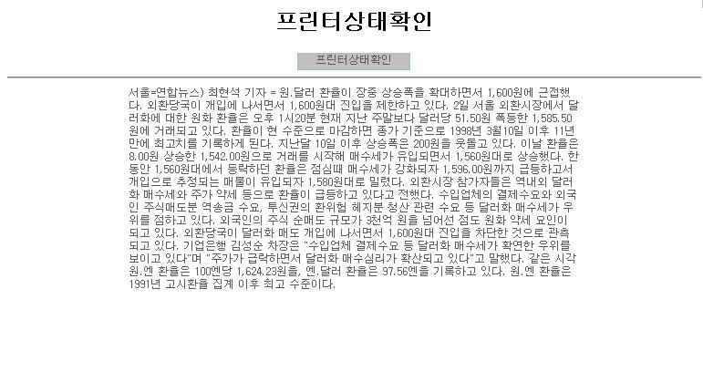
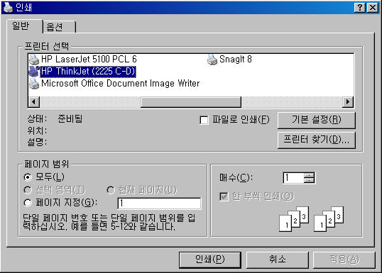

# 요소기술 - 프린터상태확인

## 개요

 인터넷 웹 브라우저에서 인쇄/출력 시 프린터 상태 확인 팝업 창을 자동으로 보여주는 기능을 제공한다.

## 설명

 사용자가 프린터상태확인 클릭시 프린터상태확인 창이 열려, 프린터 상태를 볼수 있으며, 프린터 설정도 가능하다.

##### 관련소스

| 유형 | 대상소스 | 설명 | 비고 |
| --- | --- | --- | --- |
| Controller | egovframework.com.utl.fcc.web.EgovComUtlTestController.java | 테스트용 controller |  |
| JSP | /WEB-INF/jsp/egovframework/cmm/utl/EgovPrintStatus.jsp | 프린터상태확인 테스트 페이지 |  |

##### 관련테이블

 **N/A**

## 환경설정

 **해당없음**

## 사용방법

##### 1. 프린터상태확인

   
프린터상태확인 버튼: 프린터상태확인 팝업 창이 열린다.  
```html
<input type=button value="프린터상태확인" onclick="window.print();">
```

##### 2. 프린터상태확인 팝업

 

## 참고자료

 N/A