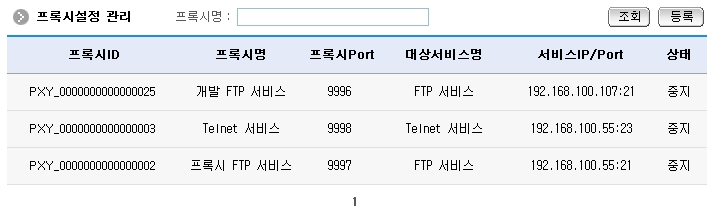
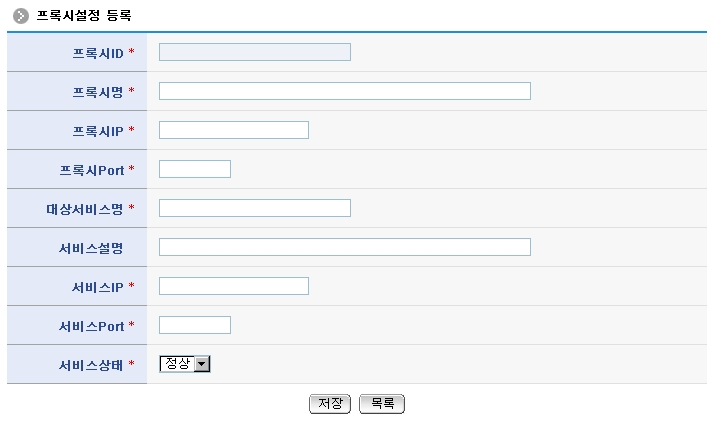
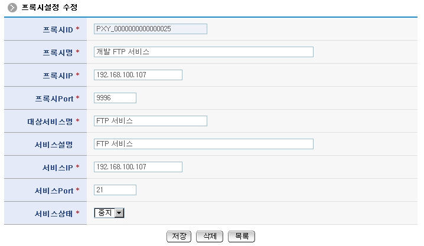
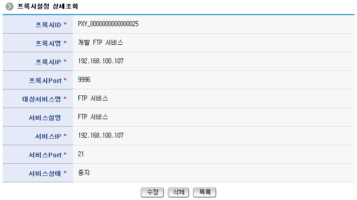
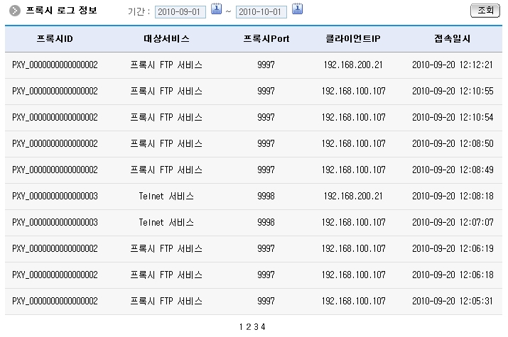

## 개요

**프록시서비스**는 네트워크 연결에 대한 프록시 설정을 동적으로 관리하고, 연결에 대한 기본 서비스(telnet, ftp, jdbc 연결)에 대한 로깅을 기록할 수 있는 네트워크 서비스 기능을 제공한다.

## 설명

**프록시서비스**는 네트워크 연결에 대한 프록시 설정 정보의 등록, 수정, 삭제, 조회, 목록조회의 기능 및 프록시 로그생성, 로그조회의 기능을 수반한다.

1. 프록시설정목록조회: 프록시설정 정보를 최근 등록 순서대로 조회하고, 그 결과를 화면에 반영한다.
2. 프록시설정등록: 프록시설정 정보를 등록하고, 등록한 결과를 조회한다.
3. 프록시설정수정: 기 등록된 프록시설정 정보를 수정한다.
4. 프록시설정삭제: 기 등록된 프록시설정 정보를 삭제한다.
5. 프록시설정상세조회: 프록시설정 목록에서 선택한 프록시설정 상세정보를 보여준다.
6. 프록시로그생성: 프록시설정을 통해 접속한 클라이언트의 접속 로그를 생성한다.
7. 프록시로그조회: 프록시설정을 통해 접속한 클라이언트의 접속 로그를 확인한다.

### 관련소스

| 유형 | 대상소스명 | 비고 |
| --- | --- | --- |
| Controller | egovframework.com.utl.sys.pxy.web.EgovProxySvcController.java | 정보관리 컨트롤러 |
| Service | egovframework.com.utl.sys.pxy.service.EgovProxySvcService.java | 정보관리 인터페이스 |
| ServiceImpl | egovframework.com.utl.sys.pxy.service.impl.EgovProxySvcServiceImpl.java | 정보관리 서비스 구현체 |
| DAO | egovframework.com.utl.sys.pxy.service.impl.ProxySvcDAO.java | 정보관리 DAO |
| Model | egovframework.com.utl.sys.pxy.service.ProxySvc.java | 정보관리 모델 |
| Model | egovframework.com.utl.sys.pxy.service.ProxyLog.java | 로그관리 모델 |
| VO | egovframework.com.utl.sys.pxy.service.ProxySvcVO.java | 정보관리 VO |
| VO | egovframework.com.utl.sys.pxy.service.ProxyLogVO.java | 로그관리 VO |
| JSP | /WEB-INF/jsp/egovframework/com/utl/sys/pxy/EgovProxyLogList.jsp | 로그조회 화면 |
| JSP | /WEB-INF/jsp/egovframework/com/utl/sys/pxy/EgovProxySvcList.jsp | 목록조회 화면 |
| JSP | /WEB-INF/jsp/egovframework/com/utl/sys/pxy/EgovProxySvcDetail.jsp | 상세조회 화면 |
| JSP | /WEB-INF/jsp/egovframework/com/utl/sys/pxy/EgovProxySvcRegist.jsp | 등록 화면 |
| JSP | /WEB-INF/jsp/egovframework/com/utl/sys/pxy/EgovProxySvcUpdt.jsp | 수정 화면 |
| Query XML | resources/.../EgovProxySvc_SQL_altibase.xml | Altibase용 Query XML |
| Query XML | resources/.../EgovProxySvc_SQL_cubrid.xml | Cubrid용 Query XML |
| Query XML | resources/.../EgovProxySvc_SQL_maria.xml | MariaDB용 Query XML |
| Query XML | resources/.../EgovProxySvc_SQL_mysql.xml | MySQL용 Query XML |
| Query XML | resources/.../EgovProxySvc_SQL_oracle.xml | Oracle용 Query XML |
| Query XML | resources/.../EgovProxySvc_SQL_postgres.xml | PostgreSQL용 Query XML |
| Query XML | resources/.../EgovProxySvc_SQL_tibero.xml | Tibero용 Query XML |
| Query XML | resources/.../EgovProxySvc_SQL_goldilocks.xml | Goldilocks용 Query XML |
| Validator Rule | resources/egovframework/validator/validator-rules.xml | Validator Rule XML |
| Validator XML | resources/.../validator/com/utl/sys/pxy/EgovProxySvc.xml | Validator XML |
| Message prop | resources/.../message/com/utl/sys/pxy/message_en.properties | 영문 Message |
| Message prop | resources/.../message/com/utl/sys/pxy/message_ko.properties | 한글 Message |
| Idgen XML | resources/.../spring/com/idgn/context-idgn-ProxySvc.xml | Idgen XML |

### 클래스 다이어그램


### 관련테이블

| 테이블명 | 테이블명(영문) | 비고 |
| --- | --- | --- |
| 프록시정보 | COMTNPROXYINFO | 네트워크 연결에 대한 프록시 설정을 관리한다. |
| 프록시로그정보 | COMTNPROXYLOGINFO | 프록시연결에 대한 로그를 관리한다. |

### ID Generation 관련 DDL 및 DML

ID Generation Service를 활용하기 위해서 Sequence 저장테이블인 COMTECOPSEQ에 `PROXYSVC_ID`, `PROXYLOG_ID` 항목을 추가해야 한다.

```sql
CREATE TABLE COMTECOPSEQ (
    table_name varchar(16) NOT NULL,
    next_id DECIMAL(30) NOT NULL,
    PRIMARY KEY (table_name)
);

INSERT INTO COMTECOPSEQ VALUES ('PROXYSVC_ID','0');
INSERT INTO COMTECOPSEQ VALUES ('PROXYLOG_ID','0');
```

### ID Generation 환경설정 (context-idgn-ProxySvc.xml)

```xml
<!-- 프록시서비스 ID -->
<bean name="egovProxySvcIdGnrService" class="egovframework.rte.fdl.idgnr.impl.EgovTableIdGnrServiceImpl" destroy-method="destroy">
    <property name="dataSource" ref="egov.dataSource" />
    <property name="strategy"   ref="ProxySvcIdStrategy" />
    <property name="blockSize"  value="10" />
    <property name="table"      value="COMTECOPSEQ" />
    <property name="tableName"  value="PROXYSVC_ID" />
</bean>
<bean name="ProxySvcIdStrategy" class="egovframework.rte.fdl.idgnr.impl.strategy.EgovIdGnrStrategyImpl">
    <property name="prefix"     value="PXY_" />
    <property name="cipers"     value="16" />
    <property name="fillChar"   value="0" />
</bean>

<!-- 프록시Log ID -->
<bean name="egovProxyLogIdGnrService" class="egovframework.rte.fdl.idgnr.impl.EgovTableIdGnrServiceImpl" destroy-method="destroy">
    <property name="dataSource" ref="egov.dataSource" />
    <property name="strategy"   ref="ProxyLogIdStrategy" />
    <property name="blockSize"  value="10" />
    <property name="table"      value="COMTECOPSEQ" />
    <property name="tableName"  value="PROXYLOG_ID" />
</bean>
<bean name="ProxyLogIdStrategy" class="egovframework.rte.fdl.idgnr.impl.strategy.EgovIdGnrStrategyImpl">
    <property name="prefix"     value="PLG_" />
    <property name="cipers"     value="16" />
    <property name="fillChar"   value="0" />
</bean>
```

## 참고자료

### 관련화면 및 수행메뉴얼

#### 프록시설정 목록조회

| Action | URL | Controller method | QueryID |
| --- | --- | --- | --- |
| 조회 | /utl/sys/pxy/selectProxySvcList.do | selectProxySvcList | proxySvcDAO.selectProxySvcList |
| - | - | - | proxySvcDAO.selectProxySvcListTotCnt |

프록시설정 목록은 페이지당 10건씩 조회되며 페이징은 10페이지씩 이루어진다. 검색조건은 프록시명에 대해서 수행된다.



- **조회**: 기 등록된 프록시설정 목록을 조회한다.
- **등록**: 프록시설정정보를 등록하기 위해서는 **등록 버튼**을 선택하여 **프록시설정 등록** 화면으로 이동한다.
- **상세조회**: 프록시설정의 상세정보를 조회하기 위해 **프록시ID**를 선택하여 **프록시설정 상세조회** 화면으로 이동한다.

#### 프록시설정 등록

| Action | URL | Controller method | QueryID |
| --- | --- | --- | --- |
| 저장 | /utl/sys/pxy/addProxySvc.do | insertProxySvc | proxySvcDAO.insertSynchrnServer |
| 목록 | /utl/sys/pxy/selectProxySvcList.do | selectProxySvcList | proxySvcDAO.selectProxySvcList |

프록시설정 속성정보를 입력한 뒤 등록한다.



- **저장**: 신규 프록시설정정보를 등록하기 위해서는 프록시설정정보 속성을 입력한 뒤 하단의 **저장 버튼**을 통해서 프록시설정정보를 등록한다. **프록시ID**는 등록시 자동으로 부여된다.
- **목록**: 프록시설정 목록조회 화면으로 이동한다.

#### 프록시설정 수정

| Action | URL | Controller method | QueryID |
| --- | --- | --- | --- |
| 저장 | /utl/sys/pxy/updtProxySvc.do | updateProxySvc | proxySvcDAO.updateProxySvc |
| 삭제 | /utl/sys/pxy/removeProxySvc.do | deleteProxySvc | proxySvcDAO.deleteProxySvc |

프록시설정 속성정보를 변경한 후 저장한다.
**서비스상태**정보는 **정상**일 경우 프록시서비스가 클라이언트 접속에 대한 모니터링 로그기록 동작을 수행하고, **중지**일 경우 그 동작을 멈춘다.



- **저장**: 프록시설정정보를 수정하기 위해서는 프록시설정정보 속성을 변경한 뒤 하단의 **저장 버튼**을 통해서 프록시설정정보를 수정한다.
- **삭제**: 기 등록된 프록시설정정보를 삭제하기 위해서는 하단의 **삭제 버튼**을 통해서 프록시설정정보를 삭제한다.
- **목록**: 프록시설정정보 목록조회 화면으로 이동한다.

#### 프록시설정 상세조회

| Action | URL | Controller method | QueryID |
| --- | --- | --- | --- |
| 조회 | /utl/sys/pxy/getProxySvc.do | selectProxySvc | proxySvcDAO.selectProxySvc |

프록시설정 목록에서 선택한 프록시설정 상세정보를 보여준다.



- **수정**: 프록시설정정보를 수정하기 위해서는 하단의 **수정 버튼**을 선택한 뒤 프록시설정 수정 화면으로 이동한다.
- **삭제**: 기 등록된 프록시설정정보를 삭제하기 위해서는 하단의 **삭제 버튼**을 통해서 프록시설정정보를 삭제한다.
- **목록**: 프록시설정 목록조회 화면으로 이동한다.

#### 프록시로그 조회

| Action | URL | Controller method | QueryID |
| --- | --- | --- | --- |
| 조회 | /utl/sys/pxy/selectProxyLogList.do | selectProxyLogList | proxySvcDAO.selectProxyLogList |
| - | - | - | proxySvcDAO.selectProxyLogListTotCnt |

클라이언트는 프록시서비스의 ip, port 접속하면 해당 로그가 생성되고, 그 로그를 조회할 수 있다.



- **조회**: 기 등록된 프록시로그 목록을 조회한다.
