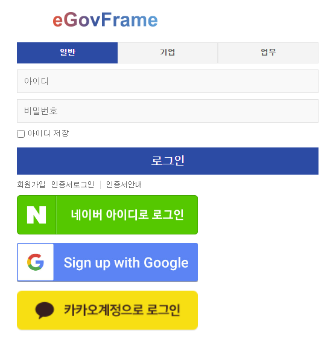
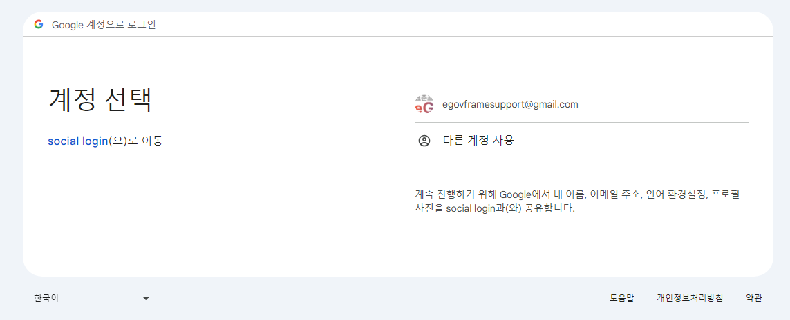
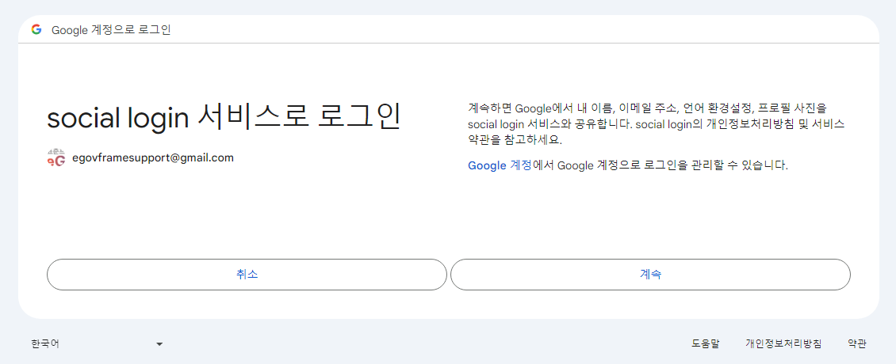
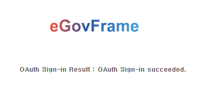

## 개요

 Social Login은 네이버, 구글, 카카오의 로그인API를 이용해 로그인을 진행하는 연계로그인 기능을 제공합니다.

## 특징

 Social Login 연동은 다음과 같은 특징을 제공합니다.  

- 네이버(Naver), 구글(Google), 카카오(KaKao) 계정으로 로그인

##### 관련소스

| 유형 | 대상소스 | 설명 | 비고 |
| --- | --- | --- | --- |
| Controller | egovframework.com.ext.oauth.web.EgovSignupController.java | 소셜 로그인을 처리하는 컨트롤러 클래스 |  |
| Service | egovframework.com.ext.oauth.service.NAVERAPI20.java | 네이버 로그인을 돕는 서비스 |  |
| Service | egovframework.com.ext.oauth.service.OAuthConfig.java | 소셜 로그인 인증과 토큰 관련 URL이 있는 서비스 |  |
| Service | egovframework.com.ext.oauth.service.OAuthLogin.java | 소셜 로그인 인증 및 로그인 정보를 처리하는 서비스 |  |
| VO | egovframework.com.ext.oauth.service.OAuthUniversalUser.java | 소셜 로그인 계정에 대한 VO |  |
| VO | egovframework.com.ext.oauth.service.OAuthVO.java | 소셜 로그인 인증을 받기 위한 VO |  |
| JSP | WEB_INF/jsp/egovframework/com/uat/uia/EgovLoginUsr.jsp | 소셜 로그인을 연동하는 페이지 |  |
| JSP | WEB_INF/jsp/egovframework/com/uat/uia/EgovLoginUsrOauth.jsp | 소셜 로그인을 처리하는 페이지 |  |
| JSP | WEB_INF/jsp/egovframework/com/uat/uia/EgovLoginUsrOauthResult.jsp | 소셜 로그인 결과를 출력하는 페이지 |  |
| XML | resources/egovframework/spring/com/context-oauth.xml | 소셜 로그인의 ID, Secret 등 인증값을 설정하는 XML |  |

## 설정방법

### 소셜 로그인 API 생성 방법

 각 소셜에서 로그인API를 등록해 ClientID / ClientSecret 를 발급받고 RedirectURl을 지정해야합니다.

 <로그인 API 등록 URL>

- 구글(Google) : [https://console.cloud.google.com/apis/dashboard?hl=ko](https://console.cloud.google.com/apis/dashboard?hl=ko)
- 네이버(Naver) : [https://developers.naver.com/products/login/api/api.md](https://developers.naver.com/products/login/api/api.md)
- 카카오(Kakao) : [https://developers.kakao.com/docs/latest/ko/kakaologin/common](https://developers.kakao.com/docs/latest/ko/kakaologin/common)

### 소셜 Oauth 인증값 설정(context-oauth.xml)

 각 소셜페이지에서 로그인API를 생성하고 받은 ClientID와 ClientSecret을 xml에 설정해야합니다.

- 구글 로그인 인증 설정

```xml
<bean id="googleAuthVO" class="egovframework.com.ext.oauth.service.OAuthVO">
	<constructor-arg value="google" /> <!-- Service Name -->
	<constructor-arg value="googleClientID" /> <!-- googleClientID -->
	<constructor-arg value="googleClientSecret" /> <!-- googleClientSecret -->
	<constructor-arg value="http://localhost:8080/auth/google/callback" /> <!-- googleRedirectUrl -->
	<constructor-arg value="profile email" /> <!-- GoogleScope -->
</bean>
```

- 네이버 로그인 인증 설정

```xml
<bean id="naverAuthVO" class="egovframework.com.ext.oauth.service.OAuthVO">
	<constructor-arg value="naver" /> <!-- Service Name -->
	<constructor-arg value="naverClientID" /> <!-- naverClientID -->
	<constructor-arg value="naverClientSecret" /> <!-- naverClientSecret -->
	<constructor-arg value="http://127.0.0.1:8080/auth/naver/callback" /> <!-- naverRedirectUrl -->
	<constructor-arg value="profile" /> <!-- naverScope -->
</bean>
```

- 카카오 로그인 인증 설정

```xml
<bean id="kakaoAuthVO" class="egovframework.com.ext.oauth.service.OAuthVO">
	<constructor-arg value="kakao" /> <!-- Service Name -->
	<constructor-arg value="kakaoClientID" /> <!-- kakaoClientID -->
	<constructor-arg value="kakaoClientSecret" /> <!-- kakaoClientSecret -->
	<constructor-arg value="http://localhost:8080/auth/kakao/callback" /> <!-- kakaoRedirectUrl -->
	<constructor-arg value="profile_nickname account_email" /> <!-- kakaoScope -->
</bean>
```

### 사용자 인증 처리

#### 비즈니스 규칙

 소셜 로그인 버튼이 있는 로그인 화면으로 이동한다.

#### 관련코드

```java
@RequestMapping(value = "/uat/uia/oauthLoginUsr", method = RequestMethod.GET)
public String login(Model model) throws Exception {
	LOGGER.debug("===>>> OAuth Login .....");
 
	OAuthLogin naverLogin = new OAuthLogin(naverAuthVO);
	LOGGER.debug("naverLogin.getOAuthURL() = "+naverLogin.getOAuthURL());
	model.addAttribute("naver_url", naverLogin.getOAuthURL());
 
	OAuthLogin googleLogin = new OAuthLogin(googleAuthVO);
	LOGGER.debug("googleLogin.getOAuthURL() = "+googleLogin.getOAuthURL());
	model.addAttribute("google_url", googleLogin.getOAuthURL());
 
	OAuthLogin kakaoLogin = new OAuthLogin(kakaoAuthVO);
	LOGGER.debug("kakaoLogin.getOAuthURL() = "+kakaoLogin.getOAuthURL());
	model.addAttribute("kakao_url", kakaoLogin.getOAuthURL());
 
	return "egovframework/com/uat/uia/EgovLoginUsrOauth";
}
```

### 인증 완료 후 응답 처리

#### 비즈니스 규칙

 로그인API 인증 완료 후 응답받는 callback 메소드로 인증된 사용자 정보를 처리한다.

#### 관련코드

```java
@RequestMapping(value = "/auth/{oauthService}/callback", method = { RequestMethod.GET, RequestMethod.POST })
public String oauthLoginCallback(@PathVariable String oauthService, Model model, @RequestParam String code) throws Exception {
 
	LOGGER.debug("oauthLoginCallback: service={}", oauthService);
	LOGGER.debug("===>>> code = "+ code);
 
	OAuthVO oauthVO = null;
	if (StringUtils.equals(OAuthConfig.GOOGLE_SERVICE_NAME, oauthService))
		oauthVO = googleAuthVO;
	else if (StringUtils.equals(OAuthConfig.NAVER_SERVICE_NAME, oauthService))
		oauthVO = naverAuthVO;
	else
		oauthVO = kakaoAuthVO;
 
	// 1. code를 이용해서 Access Token 받기
	// 2. Access Token을 이용해서 사용자 제공정보 가져오기
	OAuthLogin oauthLogin = new OAuthLogin(oauthVO);
 
	OAuthUniversalUser oauthUser = oauthLogin.getUserProfile(code); // 1,2번 동시
	LOGGER.debug("Profile ===>>" + oauthUser);
 
	// ========================================================================
	// 다음 부분은 업무의 목적에 맞게 커스텀 코드를 작성한다.
	// 3. 해당 유저가 DB에 존재하는지 체크 (google, naver, kakao에서 전달받은 ID가 존재하는지 체크)
    // String resultDBInfo = ""; // DB 체크 결과
 
	if (oauthUser == null) {
		model.addAttribute("message", "This user does not exist. Please sign up.");
	} else {
		model.addAttribute("message", "OAuth Sign-in succeeded.");
	}
 
	return "egovframework/com/uat/uia/EgovLoginUsrOauthResult";
}
```

### 소셜 로그인 버튼 구현(EgovLoginUsrOauth.jsp)

```html
<a href="${ naver_url }">" alt="Naver Login" /></a>
<a href="${ google_url }">" alt="Google Login" /></a>
<a href="${ kakao_url }">" alt="Kakao Login" /></a>
```

## 사용방법

- {contextPath}/uat/uia/oauthLoginUsr 로 이동하여 소셜로그인을 진행합니다.

 

#### 사용예시

- 소셜 로그인을 진행할 계정으로 로그인합니다.

 

- 선택된 계정으로 계정 인증을 시도합니다

 

- 소셜 로그인이 성공한 경우 결과창

 

 ※ 소셜 로그인 인증 성공 시 Console에 로그인 정보가 출력됩니다. (소셜별 상이)

```json
{
  "name": "전자정부 표준프레임워크 센터",
  "given_name": "전자정부 표준프레임워크 센터",
  "picture": "https://lh3.googleusercontent.com/a/ACg8ocJtuOXmgP2tukDz_UrlNT1lND9m_Npfiuea3EqfrUroumV-SrBBu003ds96-c",
  "email": "egovframesupport@gmail.com",
  "email_verified": true,
  "locale": "ko"
}

```

## 참고자료

 [Spring Social](https://projects.spring.io/spring-social/)

