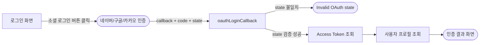
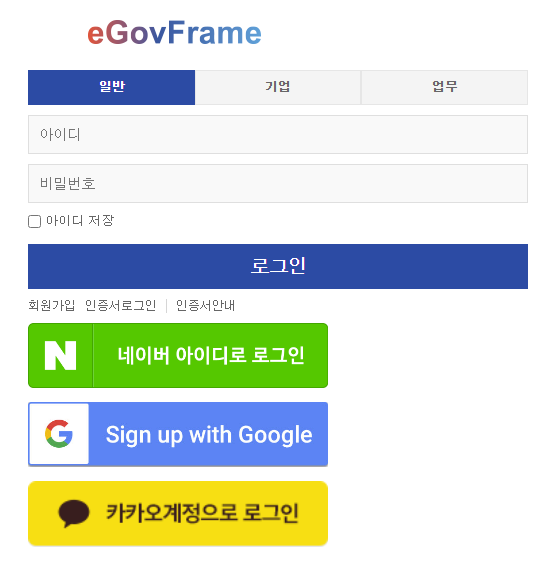
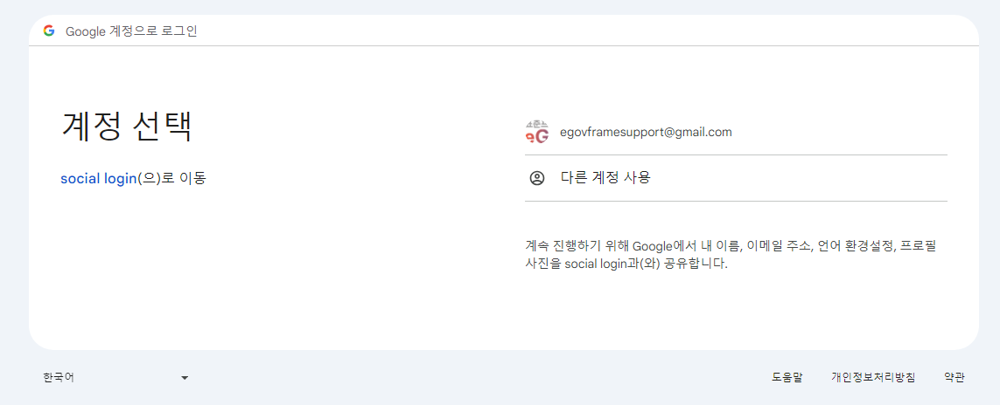
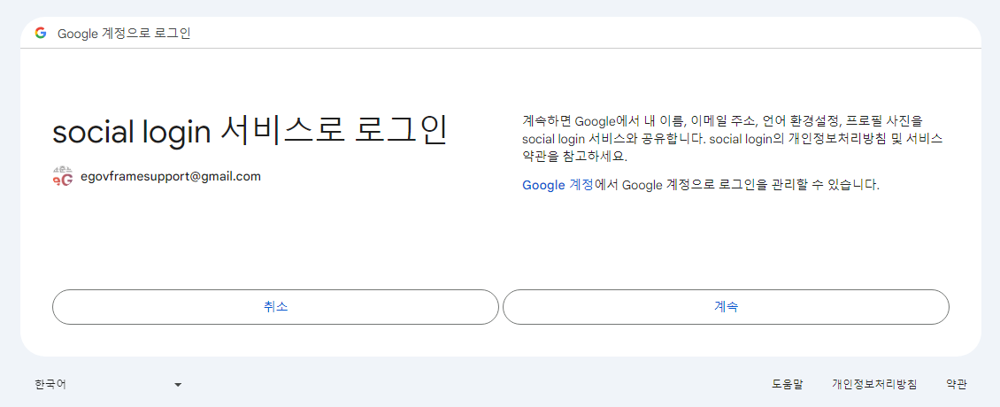
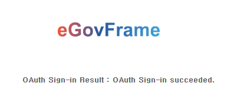

## 개요

Social Login은 네이버(Naver), 구글(Google), 카카오(Kakao)의 로그인 API를 이용하여 사용자를 인증하는 소셜 로그인 기능을 제공한다.

사용자는 각 서비스의 계정을 이용하여 별도의 로그인 정보를 입력하지 않고 연계 로그인을 진행할 수 있다.

구현은 [ScribeJava](https://github.com/scribejava/scribejava) 기반 OAuth 2.0 클라이언트를 사용한다.


```mermaid
flowchart LR
    L[로그인 화면] -->|소셜 로그인 버튼 클릭| A([네이버/구글/카카오 인증])
    A -->|callback + code + state| C[oauthLoginCallback]
    C -->|state 불일치| F([Invalid OAuth state])
    C -->|state 검증 성공| T[Access Token 조회]
    T --> P[사용자 프로필 조회]
    P --> R([인증 결과 화면])
```

## 특징

Social Login은 다음과 같은 기능을 제공한다.

- 네이버(Naver), 구글(Google), 카카오(Kakao) 계정을 이용한 로그인
- OAuth 2.0 인증을 통한 사용자 정보 조회
- 서비스별 Client ID, Client Secret 및 Redirect URI 설정 지원
- CSRF 방어를 위한 OAuth `state` 생성·세션 보관·콜백 검증

샘플 구현은 프로필 조회와 결과 메시지 표시까지 제공한다. 회원 DB 매핑과 세션 로그인은 업무에 맞게 추가로 구현해야 한다.

### 관련소스

| 유형 | 대상소스 | 설명 | 비고 |
| --- | --- | --- | --- |
| Controller | egovframework.com.ext.oauth.web.EgovSignupController.java | 소셜 로그인 화면과 콜백을 처리하는 컨트롤러 |  |
| Class | egovframework.com.ext.oauth.service.OAuthLogin.java | 인가 URL 생성, Access Token 및 프로필 조회 |  |
| Interface | egovframework.com.ext.oauth.service.OAuthConfig.java | 제공자별 인증·토큰·프로필 URL과 서비스명 상수 |  |
| API | egovframework.com.ext.oauth.service.NaverAPI20.java | 네이버 OAuth 2.0 Authorization/Token URL을 제공하는 scribejava API 구현체 |  |
| VO | egovframework.com.ext.oauth.service.OAuthUniversalUser.java | 소셜 로그인 계정에 대한 VO |  |
| VO | egovframework.com.ext.oauth.service.OAuthVO.java | 소셜 로그인 인증을 받기 위한 VO |  |
| JSP | WEB-INF/jsp/egovframework/com/uat/uia/EgovLoginUsrOauth.jsp | 소셜 로그인 버튼이 있는 로그인 화면 |  |
| JSP | WEB-INF/jsp/egovframework/com/uat/uia/EgovLoginUsrOauthResult.jsp | 소셜 로그인 결과를 출력하는 페이지 |  |
| XML | resources/egovframework/spring/com/context-oauth.xml | 소셜 로그인의 ID, Secret 등 인증값을 설정하는 XML |  |

## 설정방법

### 소셜 로그인 API 생성 방법

 각 소셜 로그인 서비스에서 애플리케이션을 등록하고 `Client ID`와 `Client Secret`을 발급받은 뒤, `Redirect URI`를 설정해야 한다.

 <로그인 API 등록 URL>

- 구글(Google) : [https://console.cloud.google.com/apis/dashboard?hl=ko](https://console.cloud.google.com/apis/dashboard?hl=ko)
- 네이버(Naver) : [https://developers.naver.com/products/login/api/api.md](https://developers.naver.com/products/login/api/api.md)
- 카카오(Kakao) : [https://developers.kakao.com/docs/latest/ko/kakaologin/common](https://developers.kakao.com/docs/latest/ko/kakaologin/common)

### 소셜 OAuth 인증값 설정 (`context-oauth.xml`)

각 소셜 로그인 서비스에서 발급받은 `Client ID`와 `Client Secret`, 인증 완료 후 이동할 `Redirect URI` 등의 정보를 `context-oauth.xml`에 설정한다.

- 구글 로그인 인증 설정

```xml
<bean id="googleAuthVO" class="egovframework.com.ext.oauth.service.OAuthVO">
	<constructor-arg value="google" /> <!-- Service Name -->
	<constructor-arg value="googleClientID" /> <!-- googleClientID -->
	<constructor-arg value="googleClientSecret" /> <!-- googleClientSecret -->
	<constructor-arg value="http://localhost:8080/auth/google/callback" /> <!-- googleRedirectUrl -->
	<constructor-arg value="profile email" /> <!-- GoogleScope -->
</bean>
```

- 네이버 로그인 인증 설정

```xml
<bean id="naverAuthVO" class="egovframework.com.ext.oauth.service.OAuthVO">
	<constructor-arg value="naver" /> <!-- Service Name -->
	<constructor-arg value="naverClientID" /> <!-- naverClientID -->
	<constructor-arg value="naverClientSecret" /> <!-- naverClientSecret -->
	<constructor-arg value="http://127.0.0.1:8080/auth/naver/callback" /> <!-- naverRedirectUrl -->
	<constructor-arg value="profile" /> <!-- naverScope -->
</bean>
```

- 카카오 로그인 인증 설정

```xml
<bean id="kakaoAuthVO" class="egovframework.com.ext.oauth.service.OAuthVO">
	<constructor-arg value="kakao" /> <!-- Service Name -->
	<constructor-arg value="kakaoClientID" /> <!-- kakaoClientID -->
	<constructor-arg value="kakaoClientSecret" /> <!-- kakaoClientSecret -->
	<constructor-arg value="http://localhost:8080/auth/kakao/callback" /> <!-- kakaoRedirectUrl -->
	<constructor-arg value="profile_nickname account_email" /> <!-- kakaoScope -->
</bean>
```

### 사용자 인증 처리

#### 비즈니스 규칙

 소셜 로그인 버튼이 있는 로그인 화면으로 이동한다. CSRF 방어용 `state`를 1회 생성해 세션에 보관하고, 모든 제공자 인가 URL에 부착한다.

#### 관련코드

```java
@RequestMapping(value = "/uat/uia/oauthLoginUsr", method = RequestMethod.GET)
public String login(Model model, HttpSession session) throws Exception {
	LOGGER.debug("===>>> OAuth Login .....");

	model.addAttribute("loginRequestVO", new LoginRequestVO());
	model.addAttribute("defaultForm", new ComDefaultVO());

	// 콜백에서 대조할 CSRF 방어용 state를 1회 생성해 세션에 보관하고 모든 제공자 인가 URL에 부착한다.
	String state = generateState();
	session.setAttribute(OAUTH_STATE_SESSION_KEY, state);

	OAuthLogin naverLogin = new OAuthLogin(naverAuthVO);
	model.addAttribute("naver_url", naverLogin.getOAuthURL(state));

	OAuthLogin googleLogin = new OAuthLogin(googleAuthVO);
	model.addAttribute("google_url", googleLogin.getOAuthURL(state));

	OAuthLogin kakaoLogin = new OAuthLogin(kakaoAuthVO);
	model.addAttribute("kakao_url", kakaoLogin.getOAuthURL(state));

	return "egovframework/com/uat/uia/EgovLoginUsrOauth";
}
```

### 인증 완료 후 응답 처리

#### 비즈니스 규칙

 로그인 API 인증 완료 후 콜백에서 `state`를 세션 값과 대조한다. 검증에 성공하면 `code`로 Access Token과 사용자 프로필을 조회한다.

 `state`가 없거나 세션 값과 다르면 `"Invalid OAuth state."`를 반환하고 프로필 조회를 진행하지 않는다. 프로필 응답에 사용자 식별자가 없으면 예외가 발생한다.

 샘플 구현은 회원 DB 조회와 세션 로그인을 수행하지 않는다. 해당 처리는 주석 안내처럼 업무에 맞게 구현한다.

#### 관련코드

```java
@RequestMapping(value = "/auth/{oauthService}/callback", method = { RequestMethod.GET, RequestMethod.POST })
public String oauthLoginCallback(@PathVariable String oauthService, Model model,
		@RequestParam String code, @RequestParam(required = false) String state, HttpSession session) throws Exception {

	LOGGER.debug("oauthLoginCallback: service={}", oauthService);

	// CSRF(로그인 CSRF) 방어 - 콜백의 state를 세션에 보관한 값과 대조한다. 1회용이므로 검증 후 제거한다.
	String sessionState = (String) session.getAttribute(OAUTH_STATE_SESSION_KEY);
	session.removeAttribute(OAUTH_STATE_SESSION_KEY);
	if (sessionState == null || !sessionState.equals(state)) {
		LOGGER.warn("OAuth state가 일치하지 않아 콜백 요청을 차단합니다. service={}", oauthService);
		model.addAttribute("message", "Invalid OAuth state.");
		return "egovframework/com/uat/uia/EgovLoginUsrOauthResult";
	}

	OAuthVO oauthVO = null;
	if (StringUtils.equals(OAuthConfig.GOOGLE_SERVICE_NAME, oauthService)) {
		oauthVO = googleAuthVO;
	} else if (StringUtils.equals(OAuthConfig.NAVER_SERVICE_NAME, oauthService)) {
		oauthVO = naverAuthVO;
		if (state == null || state.isEmpty()) {
			model.addAttribute("message", "Invalid OAuth state.");
			return "egovframework/com/uat/uia/EgovLoginUsrOauthResult";
		}
	} else {
		oauthVO = kakaoAuthVO;
	}

	// 1. code를 이용해서 Access Token 받기
	// 2. Access Token을 이용해서 사용자 제공정보 가져오기
	OAuthLogin oauthLogin = new OAuthLogin(oauthVO);

	OAuthUniversalUser oauthUser = oauthLogin.getUserProfile(code); // 1,2번 동시
	if (oauthUser != null) {
		LOGGER.debug("OAuth profile received for service={}", oauthService);
	}

	// ========================================================================
	// 다음 부분은 업무의 목적에 맞게 커스텀 코드를 작성한다.
	// 3. 해당 유저가 DB에 존재하는지 체크 (google, naver, kakao에서 전달받은 ID가 존재하는지 체크)
	// String resultDBInfo = ""; // DB 체크 결과

	if (oauthUser == null) {
		model.addAttribute("message", "This user does not exist. Please sign up.");
	} else {
		model.addAttribute("message", "OAuth Sign-in succeeded.");
	}

	return "egovframework/com/uat/uia/EgovLoginUsrOauthResult";
}
```

### 소셜 로그인 버튼 구현(EgovLoginUsrOauth.jsp)

```html
<a href="${ naver_url }">" alt="Naver Login" /></a>
<a href="${ google_url }">" alt="Google Login" /></a>
<a href="${ kakao_url }">" alt="Kakao Login" /></a>
```

## 사용방법

`{contextPath}/uat/uia/oauthLoginUsr`로 이동하여 소셜 로그인을 진행한다.

 

### 사용예시

- 소셜 로그인을 진행할 계정으로 로그인합니다.

 

- 선택된 계정으로 사용자 인증을 시도합니다

 

- 소셜 로그인이 성공한 경우 결과창을 확인 할 수 있습니다.

 

> [!NOTE]
> 프로필 JSON은 DEBUG 레벨에서만 기록되며, 식별자·이름·이메일 등 민감정보 값은 마스킹된다. 샘플 구현은 결과 메시지만 화면에 표시하고, 회원 DB 조회와 세션 로그인은 수행하지 않는다.

## 참고자료

* [ScribeJava](https://github.com/scribejava/scribejava)
* [Google Identity - OAuth 2.0](https://developers.google.com/identity/protocols/oauth2)
* [네이버 로그인 API](https://developers.naver.com/docs/login/api/api.md)
* [카카오 로그인](https://developers.kakao.com/docs/latest/ko/kakaologin/common)
