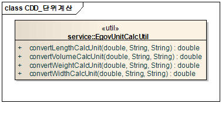
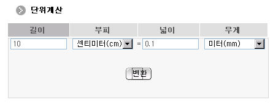

## 개요

단위계산 컴포넌트는 제곱미터를 평으로, 평을 제곱미터로 환산하는 등 넓이, 길이, 무게, 부피 등에 대한 단위를 환산하는 기능을 제공한다.

## 설명

해당 컴포넌트는 다음과 같이 다양한 단위의 환산 기능을 제공한다.

* **길이**: 길이를 다른 길이 단위로 환산하는 기능을 제공한다.
* **부피**: 부피를 다른 길이 단위로 환산하는 기능을 제공한다.
* **넓이**: 넓이를 다른 길이 단위로 환산하는 기능을 제공한다.
* **무게**: 무게를 다른 길이 단위로 환산하는 기능을 제공한다.

### 관련 소스

| 유형 | 대상 소스명 | 비고 |
| --- | --- | --- |
| Class | `egovframework.com.utl.fda.ucc.service.EgovUnitCalcUtil.java` | 단위계산을 위한 자바 클래스 |

### 클래스 다이어그램

## 관련 화면 및 수행 매뉴얼

### 단위계산 환산

| Action | URL | Controller method | QueryID |
| --- | --- | --- | --- |
| 단위계산 | `/EgovPageLink.do?link=cmm/utl/EgovUnitCalc` | `moveToPage` | |

넓이, 길이, 무게, 부피 탭으로 이동하여 각 입력 단위를 입력 후 환산 단위를 선택하여 단위계산을 수행한다.

* **변환**: 입력 단위를 환산 단위로 변환한다.
