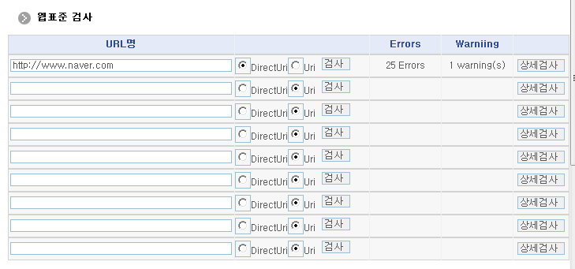
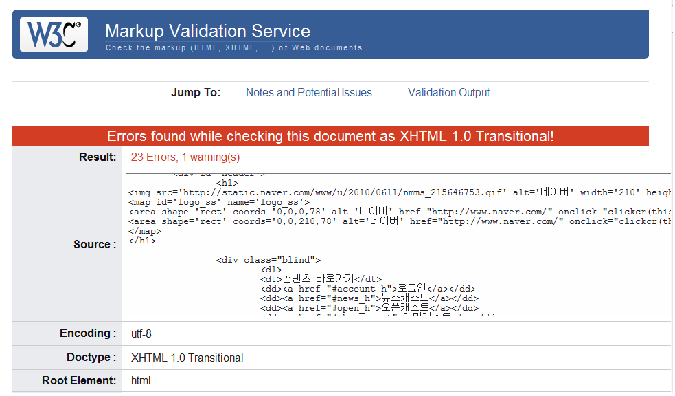

## 개요

웹표준검사는 웹 브라우저 호환성을 위해 웹표준을 준수했는지를 검사하는 기능을 제공한다.

## 설명

웹표준검사는 웹 브라우저 호환성을 위해 웹표준을 준수했는지를 검사 기능을 제공한다.

- 웹표준검사(Private) : 브라우저 호환성을 위해 웹표준을 준수했는지를 Private IP를 통하여 검사한다.
- 웹표준검사(Public) : 브라우저 호환성을 위해 웹표준을 준수했는지를 Public IP를 통하여 검사한다.

### 관련소스

| 유형 | 대상소스명 | 비고 |
| --- | --- | --- |
| JSP | `/WEB-INF/jsp/egovframework/utl/sys/wsi/EgovWebStandardInspection.jsp` | 웹표준검사 위한 jsp페이지 |

## 참고자료

### 웹표준검사 관련화면 및 수행메뉴얼

<!-- markdownlint-disable MD013 -->
| Action | URL | Controller method | QueryID |
| --- | --- | --- | --- |
| 조회 | `/utl/sys/wsi/EgovWebStandardInspection` | `"link=utl/sys/wsi/EgovWebStandardInspection"` | `"EgovWebStandardInspection"` |
<!-- markdownlint-enable MD013 -->

웹표준검사는 총 9개의 URL을 입력하여 다중 호환성 검사 기능을 제공하며, 상세검사를 통하여 Validation Output를 제공한다.

- 검사: 웹 호환성을 위해 웹표준을 준수했는지를 검사하여 Error, Warning 건수를 표시한다.
- 상세검사: 웹표준 Validation Output을 팝업 화면으로 제공한다.

