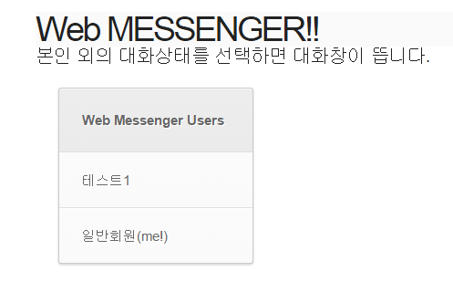
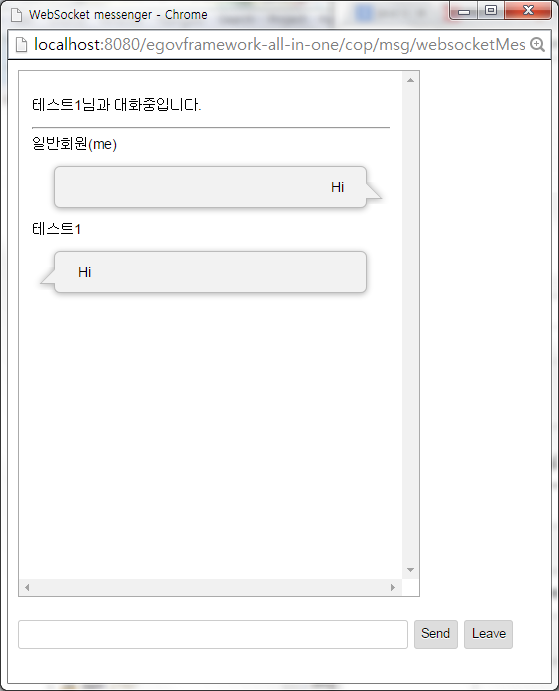
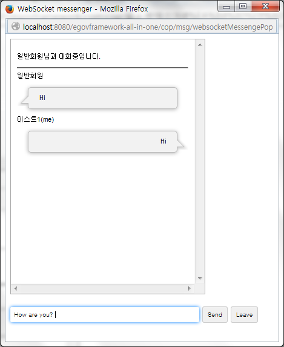

# 협업 - 웹소켓 메신저

## 개요

 **웹소켓 메신저**는 HTML5 WebSocket와 Java Websocket을 이용하여 메신저 기능을 제공한다.  
(Spring 4.X버전은 Java websocket을 지원하지만 Spring 3.X버전은 websocket을 따로 지원하지 않는다. 현재 egov 3.1버전은 Spring 3.2.9로 되어있어 websocket지원을 위한 별도의 서버코드가 필요하다. 그러나 추후 Spring 4.X로 버전업 시 보다 편리하게 서버구현, 클라이언트 구현이 가능하다.)

## 설명

- **웹소켓 메신저**기능을 이용하기 위해서는 몇가지 제한이 있다.

```bash
  ① Client 환경- WebSocket 지원 브라우저 확인(IE10이상, 이 외의 브라우저 대부분 지원)
  ② Server 환경- WebSocket 지원 Server 확인(Tomcat 8이상, Jeus 8이상, 이 외 서버 지원여부 확인필요)
  ③ Server 환경- jdk 7 이상
```

#### 관련소스

| 유형 | 대상소스명 | 비고 |
| --- | --- | --- |
| Controller | egovframework.com.ext.msg.web.EgovWebSocketMessengerController.java | 웹소켓 메신저 메인화면을 나타내기 위한 컨트롤러 |
| EndPoint | egovframework.com.ext.msg.server.UsersServerEndPoint.java | 현재 가능한 대화사용자 리스트를 처리하는 WebSocket 서버클래스(EndPoint) |
| EndPoint | egovframework.com.ext.msg.server.ChatServerEndPoint.java | 두 명의 사용자가 대화할 때 접속 처리및 메시지처리 기능을 하는 WebSocket 서버클래스(EndPoint) |
| 서버지원 Configurator | egovframework.com.ext.msg.server.config.ChatServerAppConfig.java | 사용자리스트에서 다른사용자 선택 시, 사용자와 대화가능한 방(새로운 EndPoint 객체)을 만드는 Configurator |
| 서버지원 Configurator | egovframework.com.ext.msg.server.config.ServerAppConfig.java | EndPoint를 bean으로 담기 위해 설정하는 Configurator(다른 Bean과 연동 시 EndPoint에 설정해주어야 함) |
| Decoder | egovframework.com.ext.msg.server.model.decoder.MessageDecoder.java | 클라이언트에서 서버로 전달되는 메시지를 decoding하는 클래스 |
| Encoder | egovframework.com.ext.msg.server.model.encoder.MessageEncoder.java | 서버에서 클라이언트로 전달되는 메시지를 encoding하는 클래스 |
| VO | egovframework.com.ext.msg.server.model.Message.java | Message VO들의 인터페이스 |
| VO | egovframework.com.ext.msg.server.model.ChatMessage.java | 대화정보를 담는 VO |
| VO | egovframework.com.ext.msg.server.model.UsersMessage.java | 사용자 리스트를 담는 VO |
| JSP | /WEB-INF/jsp/egovframework/com/ext/msg/EgovMessenger.jsp | 웹소켓메시지 실행을 위한 시작jsp페이지 |
| JSP | /WEB-INF/jsp/egovframework/com/ext/msg/EgovMessengerMain.jsp | 현재의 대화사용자를 보여주는 웹소켓 메인 jsp페이지 |
| JSP | /WEB-INF/jsp/egovframework/com/ext/msg/popup/chatPopupBubble.jsp | 다른 사용자와의 대화창을 나타내는 jsp페이지 |

#### 관련Resource

| 유형 | 대상소스명 | 비고 |
| --- | --- | --- |
| css | /css/egovframework/com/ext/msg/bubbleChat.css | 대화상자를 나타내는 css |
| css | /css/egovframework/com/ext/msg/table.css | 대화상대 리스트를 나타내는 css |

## 관련화면 및 수행메뉴얼

#### 1. 대화가능한 사용자 리스트 조회하기

| Action | URL | 처리 클래스 | 설명 |
| --- | --- | --- | --- |
| 이동 | /cop/msg/websocketMessengerMain.do | EgovWebSocketMessengerController.java | 사용자 리스트 조회화면으로 이동 |
| 조회 | /usersServerEndpoint(ws호출) | UsersServerEndPoint.java | 접속한 사용자를 리스트에 등록하고 사용자리스트를 가져옴 |

##### < 대화가능한 사용자 리스트 화면 >

 

 다른사용자 선택 : 선택한 사용자와 대화하는 화면으로 이동한다  

* * *

#### 2. 다른 사용자와 대화하기

| Action | URL | 처리 클래스 | 설명 |
| --- | --- | --- | --- |
| 이동 | /cop/msg/websocketMessengePopup.do | EgovWebSocketMessengerController.java | 대화창 팝업을 새로 띄움 |
| Msg전달 | /chat/(random하게 생성된 room Id) | ChatServerEndPoint.java | 선택한 사용자와 대화 가능하도록 메시지를 전달하는 서버역할 |

##### < 대화창 >

  

 Send : Input에 입력한 메시지를 전달한다.  
Leave : 대화방을 나온다.  

## 참고자료

- [html5 websocket tutorial](https://www.tutorialspoint.com/html5/html5_websocket.htm)