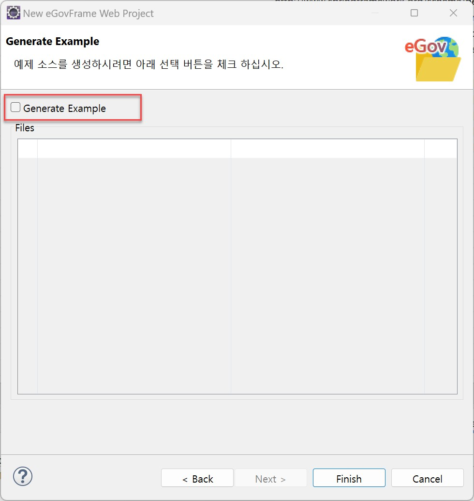
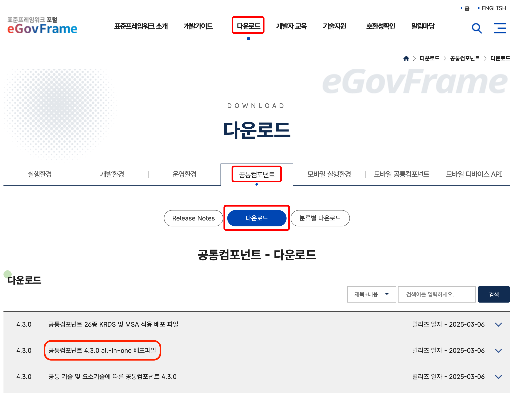
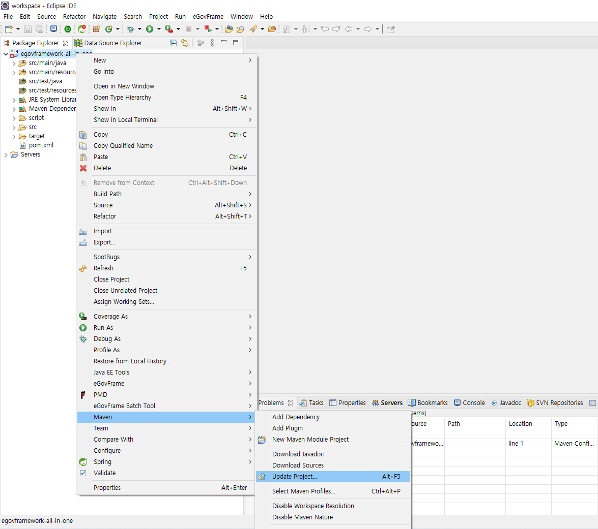
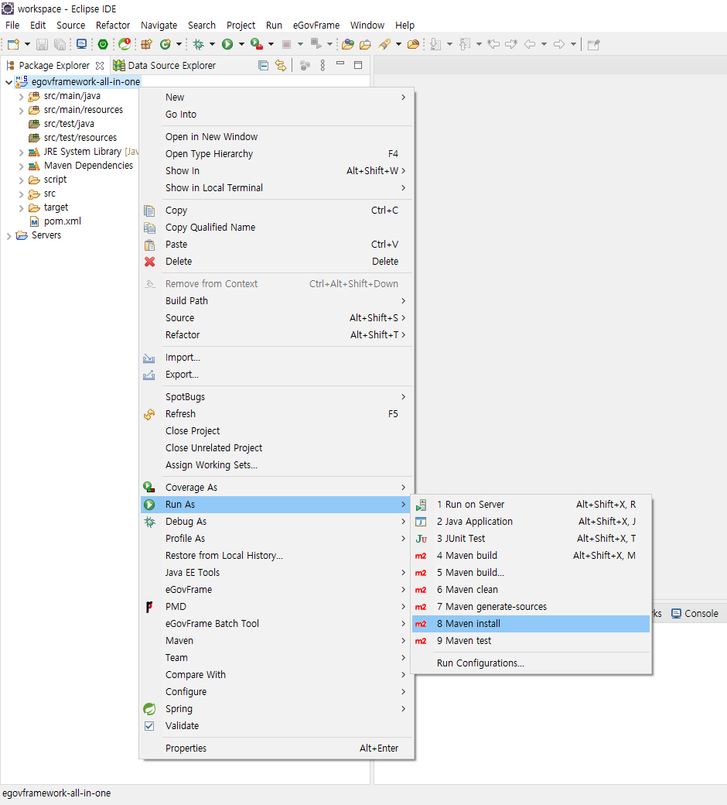

# 공통컴포넌트 시작하기

## 개요

개발자의 편의성을 위하여 eGovFrame 기반의 웹 공통컴포넌트 254종의 설치를 돕는 생성 마법사를 제공한다.

## 주요 개념

### 공통컴포넌트 생성 마법사

eGovFrame 기반으로 생성한 프로젝트에 공통컴포넌트 관련 파일 복사 기능을 담고 있는 공통컴포넌트 생성 마법사를 제공한다.

## 사용 방법

### 공통컴포넌트 생성

#### 공통컴포넌트 생성 마법사 사용 단계

1. 메뉴표시줄에서 우클릭 > New > eGovFrame Web Project를 선택한다. (단, eGovFrame 퍼스펙티브 내에서)
   

2. Project name을 입력하고, Target Runtime으로 **Apache Tomcat v9.0**을 선택한다.
   - Dynamic Web Module version을 **3.1**에 맞춘다.
   - Group Id를 기입한다.
   - version에 **4.3.0**을 입력한 후 Finish 버튼을 클릭한다.
   

3. 만약 위에서 Finish 버튼이 아니라 Next 버튼을 클릭했다면, Generate Example 버튼을 체크하지 **않고** Finish 버튼을 클릭한다.
   

4. 포털에 접속하여 "**다운로드 > 공통컴포넌트 > 다운로드 > 공통컴포넌트 4.3.0 all-in-one 배포파일**"을 다운로드 받는다.
   

5. 다운로드 받은 배포파일의 압축을 풀고, 압축을 푼 파일들을 복사해서 이클립스의 egovframework-all-in-one 프로젝트 아래에 붙여넣는다.
   

6. 프로젝트명을 마우스 우클릭하여 Maven > Update Project… > Force Update of Snapshots/Releases 체크 후 Update를 실행한다.
   

7. 프로젝트명을 마우스 우클릭하여 run as > maven install을 실행한다.
   

8. 프로젝트명을 마우스 우클릭하여 run as > run on server을 실행한다.
   

9. 공통컴포넌트를 설치한 뒤, 실행시키면 아래와 같은 창을 확인할 수 있다.
   

### 공통컴포넌트 설정

#### 공통컴포넌트 설정 도구 사용 단계

1. 공통컴포넌트를 설치한 프로젝트 내에 위치한 "globals.properties" 파일의 정보를 변경한다.
   - globals.properties 파일의 위치: src/main/resources > egovframework > egovProps > globals.properties

2. 해당 properties 파일에 수동으로 정보를 입력한다.
   

3. maven clean, maven install을 실행한 후 run as > run on server를 실행한다.