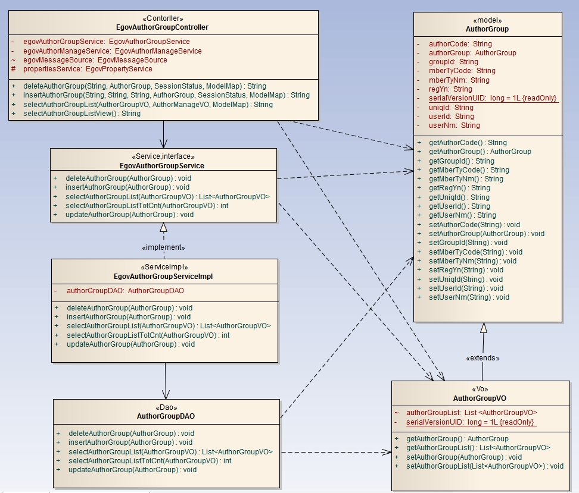
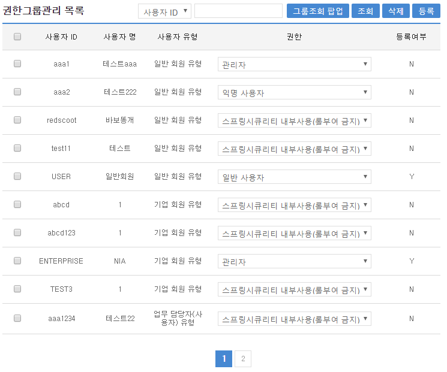
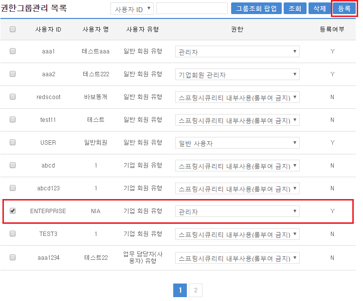
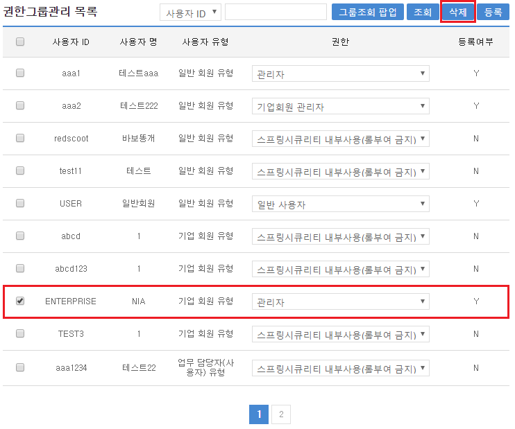
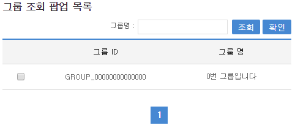

# 권한 그룹 관리

## 개요

 **권한그룹관리**는 시스템 사용을 위해 사용자의 특성에 따라 그룹을 설정하고, 특정 그룹을 선택한 뒤 해당 그룹에 속한 사용자에게 일괄적으로 권한을 부여할 수 있는 관리기능을 제공한다.

## 설명

 **권한그룹관리**는 그룹단위로 사용자권한을 관리하기 위한 목적으로 **등록, 수정, 삭제, 목록조회**의 기능을 수반한다.

```bash
  ① 권한그룹 등록 : 그룹별 사용자를 조회하여 권한정보를 일괄 및 개별 등록한다.
  ② 권한그룹 수정 : 그룹별 사용자에게 할당된 권한정보를 일괄 및 개별 수정한다.
  ③ 권한그룹 삭제 : 그룹별 사용자에게 할당된 권한정보를 일괄 및 개별 삭제한다.
  ④ 권한그룹 목록 : 그룹별 사용자에게 할당된 권한정보를 조회한다.
```

### 패키지 참조 관계

 권한그룹관리 패키지는 권한관리 패키지와 요소기술의 공통 패키지(cmm)에 대해서만 직접적인 함수적 참조 관계를 가진다. 하지만, 컴포넌트 배포 시 오류 없이 실행되기 위하여 패키지 간의 참조관계에 따라 부서권한관리, 그룹관리, 롤관리, 스프링시큐리티, 사용자통합인증, 요소기술(유틸리티) 시스템, 웹에디터, 메일연동 인터페이스 패키지와 함께 배포 파일을 구성한다.

- 패키지 간 참조 관계 : [보안 Package Dependency](../intro/package-reference.md/#보안)

### 관련소스

| 유형 | 대상소스명 | 비고 |
| --- | --- | --- |
| Controller | egovframework.com.sec.rgm.web.EgovAuthorGroupController.java | 권한그룹 관리를 위한 컨트롤러 클래스 |
| Service | egovframework.com.sec.rgm.service.EgovAuthorGroupService.java | 권한그룹 관리를 위한 서비스 인터페이스 |
| ServiceImpl | egovframework.com.sec.rgm.service.impl.EgovAuthorGroupServiceImpl.java | 권한그룹 관리를 위한 서비스 구현 클래스 |
| Model | egovframework.com.sec.rgm.service.AuthorGroup.java | 권한그룹 관리를 위한 Model 클래스 |
| VO | egovframework.com.sec.rgm.service.AuthorGroupVO.java | 권한그룹 관리를 위한 VO 클래스 |
| DAO | egovframework.com.sec.rgm.service.impl.AuthorGroupDAO.java | 권한그룹 관리를 위한 데이터처리 클래스 |
| JSP | /WEB-INF/jsp/egovframework/com/sec/rgm/EgovAuthorGroupManage.jsp | 권한그룹 관리를 위한 jsp페이지 |
| QUERY XML | resources/egovframework/mapper/com/sec/rgm/EgovAuthorGroup\_SQL\_mysql.xml | 권한그룹 관리 MySQL용 QUERY XML |
| QUERY XML | resources/egovframework/mapper/com/sec/rgm/EgovAuthorGroup\_SQL\_cubrid.xml | 권한그룹 관리 Cubrid용 QUERY XML |
| QUERY XML | resources/egovframework/mapper/com/sec/rgm/EgovAuthorGroup\_SQL\_oracle.xml | 권한그룹 관리 Oracle용 QUERY XML |
| QUERY XML | resources/egovframework/mapper/com/sec/rgm/EgovAuthorGroup\_SQL\_tibero.xml | 권한그룹 관리 Tibero용 QUERY XML |
| QUERY XML | resources/egovframework/mapper/com/sec/rgm/EgovAuthorGroup\_SQL\_altibase.xml | 권한그룹 관리 Altibase용 QUERY XML |
| QUERY XML | resources/egovframework/mapper/com/sec/rgm/EgovAuthorGroup\_SQL\_maria.xml | 권한그룹 관리 Maria용 QUERY XML |
| QUERY XML | resources/egovframework/mapper/com/sec/rgm/EgovAuthorGroup\_SQL\_postgres.xml | 권한그룹 관리 Postgres용 QUERY XML |
| QUERY XML | resources/egovframework/mapper/com/sec/rgm/EgovAuthorGroup\_SQL\_goldilocks.xml | 권한그룹 관리 Goldilocks용 QUERY XML |
| Message properties | resources/egovframework/message/com/sec/rgm/message\_ko.properties | 권한그룹 관리 Message properties(한글) |
| Message properties | resources/egovframework/message/com/sec/rgm/message\_en.properties | 권한그룹 관리 Message properties(영문) |

### 클래스 다이어그램

 

### XML 설정 파일

| 파일명 | 위치 | 비고 |
| --- | --- | --- |
| context-security | src/main/resources/egovframework/spring/com/context-security.xml | 스프링 시큐리티와 관련된 설정이 적용된 파일 |

### 관련테이블

| 테이블명 | 테이블명(영문) | 비고 |
| --- | --- | --- |
| 사용자보안설정테이블 | COMTNEMPLYRSCRTYESTBS | 사용자보안 설정을 관리한다. |

## 관련기능

 권한그룹관리기능은 크게 **권한그룹 목록조회**, **권한그룹 등록 및 수정**, **권한그룹 삭제**, **그룹목록 조회팝업** 기능으로 구성되어 있다.

### 권한그룹목록 조회

#### 비즈니스 규칙

 권한그룹 목록은 페이지 당 10건씩 조회되며 페이징은 10페이지씩 이루어진다. 검색조건은 그룹, 사용자ID, 사용자명 대해서 수행되고, 그룹은 팝업을 통하여 선택한다.  
그룹 단위로 사용자별 권한을 등록할 경우 조회조건 선택항목을 **그룹**으로 선택한 뒤 팝업버튼을 선택하면 그룹을 조회할 수 있는 팝업이 실행된다.

#### 관련코드

 N/A

#### 관련화면 및 수행매뉴얼

| Action | URL | Controller method | SQL Namespace | SQL QueryID |
| --- | --- | --- | --- | --- |
| 목록조회 | /sec/rgm/EgovAuthorGroupList.do | selectAuthorGroupList | “authorGroupDAO” | “selectAuthorGroupList” |
|  |  |  | “authorGroupDAO” | “selectAuthorGroupListTotCnt” |

 

 조회조건 : 사용자ID, 사용자명, 그룹으로 구분하여 검색 기능에 제공한다.  
조회 : 그룹의 목록을 조회한다.  

### 권한그룹 등록 및 수정

#### 비즈니스 규칙

 조회된 사용자별 권한을 **등록**하기 위해서는 조회 목록의 선택 체크박스에 선택을 한 뒤 권한 항목에 해당 권한정보를 선택하고 등록 버튼을 선택한다.  
수정 화면은 등록 화면과 동일하고, 기 등록된 사용자의 권한을 수정한 뒤 등록 버튼을 선택한다.  

#### 관련코드

 N/A

#### 관련화면 및 수행매뉴얼

| Action | URL | Controller method | SQL Namespace | SQL QueryID |
| --- | --- | --- | --- | --- |
| 등록 | /sec/rgm/EgovAuthorGroupInsert.do | insertAuthorGroup | “authorGroupDAO” | “insertAuthorGroup” |
| 수정 | /sec/rgm/EgovAuthorGroupInsert.do | insertAuthorGroup | “authorGroupDAO” | “updateAuthorGroup” |

 

 선택 : 등록 및 수정대항 목록을 선택한다.  
등록 : 선택된 사용자에게 권한을 설정한다.  

### 권한그룹 삭제

#### 비즈니스 규칙

 조회된 사용자별 권한을 **삭제**하기 위해서는 조회 목록의 선택 체크박스에 선택을 삭제 버튼을 선택한다.

#### 관련코드

 N/A

#### 관련화면 및 수행매뉴얼

| Action | URL | Controller method | SQL Namespace | SQL QueryID |
| --- | --- | --- | --- | --- |
| 삭제 | /sec/rgm/EgovAuthorGroupDelete.do | deleteAuthorGroup | “authorGroupDAO” | “deleteAuthorGroup” |

 

 삭제 : 선택된 사용자에게 설정된 권한을 해제한다.

### 그룹목록 조회 팝업

#### 비즈니스 규칙

 그룹별 사용자의 권한 목록을 조회하기 위해 그룹선택을 위한 **팝업**을 호출한다. 검색조건을 **그룹**으로 선택한 후 검색한다.  
팝업에 조회된 그룹목록 중 해당 그룹을 선택하거나 체크박스를 선택 후 확인버튼을 선택한다.

#### 관련코드

 N/A

#### 관련화면 및 수행매뉴얼

| Action | URL | Controller method | SQL Namespace | SQL QueryID |
| --- | --- | --- | --- | --- |
| 조회 | /sec/gmt/EgovGroupSearchList.do | selectGroupSearchList | “groupManageDAO” | “selectGroupList” |
|  |  |  | “groupManageDAO” | “selectGroupListTotCnt” |

 

 조회 : 그룹 목록을 조회한다.  
확인 : 조회된 그룹목록중 선택한 그룹을 부모창에 전달한다.