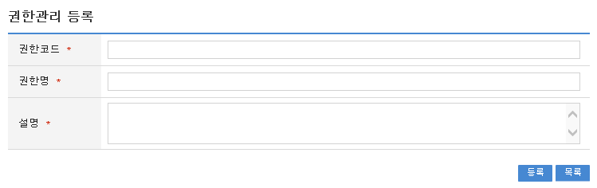

# 권한관리 기능

## 개요

시스템 사용자에게 사용권한을 부여하기 위해 권한을 정의하고, 관리한다.

## 설명

### 패키지 참조 관계

권한관리 패키지는 요소기술의 공통 패키지(cmm)에 대해서만 직접적인 함수적 참조 관계를 가진다. 
하지만, 컴포넌트 배포 시 오류 없이 실행되기 위하여 패키지 간의 참조관계에 따라 
부서권한관리, 그룹관리, 권한그룹관리, 롤관리, 스프링시큐리티, 사용자통합인증, 요소기술(유틸리티) 시스템, 웹에디터, 메일연동 인터페이스 패키지와 함께 배포 파일을 구성한다.

\* 패키지 간 참조 관계 : [보안 Package Dependency](../intro/package-reference.md/#보안)

### 클래스

| 유형                 | 대상소스명                                                                          | 비고                               |
|--------------------|--------------------------------------------------------------------------------|----------------------------------|
| Controller         | egovframework.com.sec.ram.web.EgovAuthorManageController.java                  | 권한 관리를 위한 컨트롤러 클래스               |
| Service            | egovframework.com.sec.ram.service.EgovAuthorManageService.java                 | 권한 관리를 위한  서비스 인터페이스             |
| ServiceImpl        | egovframework.com.sec.ram.service.impl.EgovAuthorManageServiceImpl.java        | 권한 관리를 위한 서비스 구현 클래스             |
| Model              | egovframework.com.sec.ram.service.AuthorManage.java                            | 권한 관리를 위한 Model 클래스              |
| VO                 | egovframework.com.sec.ram.service.AuthorManageVO.java                          | 권한 관리를 위한 VO 클래스                 |
| DAO                | egovframework.com.sec.ram.service.impl.AuthorManageDAO.java                    | 권한 관리를 위한 데이터처리 클래스              |
| JSP                | /WEB-INF/jsp/egovframework/com/sec/ram/EgovAuthorManage.jsp                    | 권한 관리를 위한 jsp페이지                 |
| JSP                | /WEB-INF/jsp/egovframework/com/sec/ram/EgovAuthorInsert.jsp                    | 권한 등록을 위한 jsp페이지                 |
| JSP                | /WEB-INF/jsp/egovframework/com/sec/ram/EgovAuthorUpdate.jsp                    | 권한 수정을 위한 jsp페이지                 |
| Query XML          | resources/egovframework/mapper/com/sec/ram/EgovAuthorManage_SQL_mysql.xml      | 권한 관리를 위한 MySQL용 Query XML       |
| Query XML          | resources/egovframework/mapper/com/sec/ram/EgovAuthorManage_SQL_cubrid.xml     | 권한 관리를 위한 Cubrid용 Query XML      |
| Query XML          | resources/egovframework/mapper/com/sec/ram/EgovAuthorManage_SQL_oracle.xml     | 권한 관리를 위한 Oracle용 Query XML      |
| Query XML          | resources/egovframework/mapper/com/sec/ram/EgovAuthorManage_SQL_tibero.xml     | 권한 관리를 위한 Tibero용 Query XML      |
| Query XML          | resources/egovframework/mapper/com/sec/ram/EgovAuthorManage_SQL_altibase.xml   | 권한 관리를 위한 Altibase용 Query XML    |
| Query XML          | resources/egovframework/mapper/com/sec/ram/EgovAuthorManage_SQL_maria.xml      | 권한 관리를 위한 Maria용 Query XML       |
| Query XML          | resources/egovframework/mapper/com/sec/ram/EgovAuthorManage_SQL_postgres.xml   | 권한 관리를 위한 Postgres용 Query XML    |
| Query XML          | resources/egovframework/mapper/com/sec/ram/EgovAuthorManage_SQL_goldilocks.xml | 권한 관리를 위한 Goldilocks용 Query XML  |
| Validator XML      | resources/egovframework/validator/com/sec/ram/SecurityManage.xml               | 권한 관리를 위한 Validator XML          |
| Message properties | resources/egovframework/message/com/sec/ram/message_ko.properties              | 권한 관리를 위한 Message properties(한글) |
| Message properties | resources/egovframework/message/com/sec/ram/message_en.properties              | 권한 관리를 위한 Message properties(영문) |

### 클래스 다이어그램

### 테이블 

| 테이블명 | 테이블명(영문)        | 비고                             |
|------|-----------------|--------------------------------|
| 권한정보 | COMTNAUTHORINFO | 업무시스템별 사용자의 권한을 보안상 분류하여 정의한다. |

## 관련기능

권한관리기능은 크게 **권한 목록조회**, **권한 등록**, **권한 수정**, **권한 삭제** 기능으로 분류된다.

### 권한 목록조회

#### 비즈니스 규칙

- 권한 목록은 페이지 당 10건씩 조회되며 페이징은 10페이지씩 이루어진다.
- 검색조건은 권한명에 대해서 수행된다.

#### 관련코드

N/A

#### 관련화면 및 수행매뉴얼

| Action | URL                        | Controller method | SQL Namespace     | SQL QueryID              |
|--------|----------------------------|-------------------|-------------------|--------------------------|
| 조회     | /sec/ram/EgovAuthorList.do | selectAuthorList  | "authorManageDAO" | "selectAuthorList"       |
|        |                            |                   | "authorManageDAO" | "selectAuthorListTotCnt" |

- 조회 : 등록된 권한 목록을 조회한다.
- 삭제 : 기 등록된 권한을 삭제하기 위해서는 왼쪽의 체크박스를 체크한 뒤 상단의 삭제 버튼을 통해서 삭제한다.
- 등록 : 신규 권한을 등록하기 위해서는 상단의 등록 버튼을 통해서 **권한 등록** 화면으로 이동한다.
- 조회목록 선택 : 기존 권한의 속성정보를 수정하고자 하는 경우 해당 권한 코드(권한 ID)를 클릭하여 상세 조회 및 수정기능을 제공하는 **권한 수정** 화면으로 이동한다.

\* 권한별 롤 정보를 등록하기 위해서는 롤 정보 컬럼의  이미지를 선택하여 **[권한별_롤관리](authority-role-management.md)** 화면으로 이동한다.

### 권한 등록

#### 비즈니스 규칙

- 권한의 속성정보를 입력한 뒤 등록한다.

#### 관련코드

- N/A

#### 관련화면 및 수행매뉴얼

| Action | URL                              | Controller method | SQL Namespace     | SQL QueryID    |
|--------|----------------------------------|-------------------|-------------------|----------------|
| 등록화면   | /sec/ram/EgovAuthorInsertView.do | insertAuthorView  |                   |                |
| 등록     | /sec/ram/EgovAuthorInsert.do     | insertAuthor      | "authorManageDAO" | "insertAuthor" |

- 등록 : 신규 권한을 등록하기 위해서는 상단의 **등록 버튼**을 통해서 저장한다.
- 목록 : 권한 목록화면으로 이동한다.

### 권한 수정

#### 비즈니스 규칙

- 권한의 속성정보를 변경한 후 저장한다.

#### 관련코드

- N/A

#### 관련화면 및 수행매뉴얼

| Action | URL                          | Controller method | SQL Namespace     | SQL QueryID    |
|--------|------------------------------|-------------------|-------------------|----------------|
| 수정화면   | /sec/ram/EgovAuthor.do       | selectAuthor      | "authorManageDAO" | "selectAuthor" |
| 수정     | /sec/ram/EgovAuthorUpdate.do | updateAuthor      | "authorManageDAO" | "updateAuthor" |

- 다음 화면은 **권한 상세조회 화면과 동일**하다.

- 수정 : 기 등록된 권한을 수정하기 위해서는 상단의 **수정 버튼**을 통해서 저장한다.
- 목록 : 권한 목록화면으로 이동한다.

### 권한 삭제

#### 비즈니스 규칙

- 권한 목록을 조회한 뒤 삭제 대상을 체크박스로 선택하고, 삭제버튼을 클릭한다.

#### 관련코드

- N/A

#### 관련화면 및 수행매뉴얼

| Action | URL                          | Controller method | SQL Namespace     | SQL QueryID    |
|--------|------------------------------|-------------------|-------------------|----------------|
| 삭제     | /sec/ram/EgovAuthorDelete.do | deleteAuthor      | "authorManageDAO" | "deleteAuthor" |

- 선택 : 삭제하려는 목록을 체크박스로 설정한다. 멀티 삭제가 가능하다.
- 삭제 : 기 등록된 권한을 삭제하기 위해서는 상단의 **삭제 버튼**을 통해서 삭제한다.

