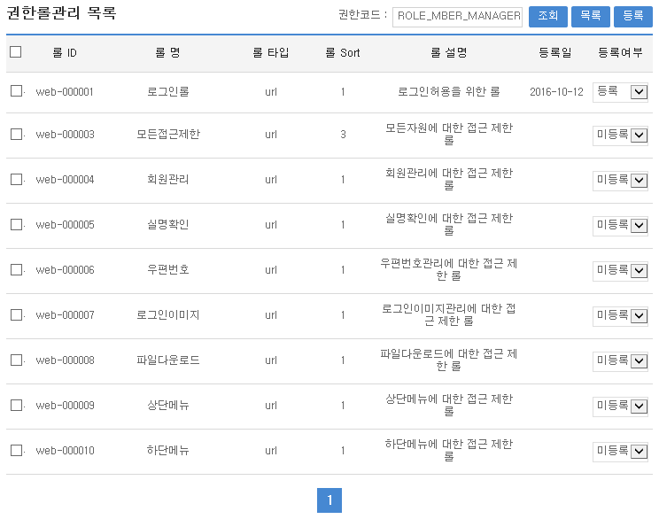
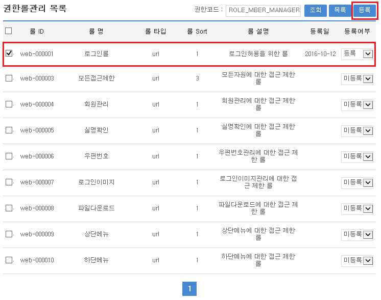
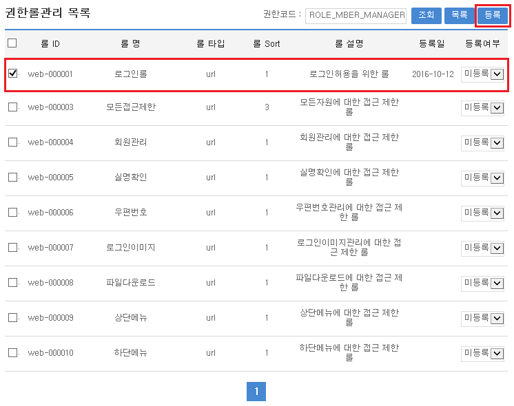

# 권한별 롤관리

## 개요

롤(Role)은 접근대상이 되는 자원을 의미한다. 
롤관리 컴포넌트를 통하여 시스템 내에서 접근하고자 하는 자원을 정의하고 관리할 수 있다. 
본 컴포넌트에서 사용 가능한 자원은 URL, method, aop 세 가지 유형이 있다.
**권한별롤관리**는 시스템 사용을 위해 사용자의 특성에 따라 정의된 권한에 특정 자원에 접근할 수 있는 롤을 부여할 수 있는 관리기능을 제공한다.

## 설명

**권한별롤관리**는 권한별로 시스템 접근에 대한 롤을 관리하기 위한 목적으로 **등록, 수정, 삭제 조회**의 기능을 수반한다.

```
    ① 권한별 롤 등록 : 권한별 시스템 접근 롤정보를 일괄 및 개별 등록한다.
    ② 권한별 롤 수정 : 권한별 시스템 접근 롤정보를 일괄 및 개별 수정한다.
    ③ 권한별 롤 삭제 : 권한별 시스템 접근 롤정보를 일괄 및 개별 삭제한다.
    ④ 권한별 롤 조회 : 권한별 시스템 접근 롤정보 목록을 조회한다.
```

### 패키지 참조 관계

권한관리 패키지는 요소기술의 공통 패키지(cmm)에 대해서만 직접적인 함수적 참조 관계를 가진다. 
하지만, 컴포넌트 배포 시 오류 없이 실행되기 위하여 패키지 간의 참조관계에 따라 
부서권한관리, 그룹관리, 권한그룹관리, 롤관리, 스프링시큐리티, 사용자통합인증, 요소기술(유틸리티) 시스템, 웹에디터, 메일연동 인터페이스 패키지와 함께 배포 파일을 구성한다.

\* 패키지 간 참조 관계 : [보안 Package Dependency](../intro/package-reference.md/#보안)

### 클래스

| 유형                 | 대상소스명                                                                              | 비고                                  |
|--------------------|------------------------------------------------------------------------------------|-------------------------------------|
| Controller         | egovframework.com.sec.ram.web.EgovAuthorRoleController.java                        | 권한별 롤 관리를 위한 컨트롤러 클래스               |
| Service            | egovframework.com.sec.ram.service.EgovAuthorRoleManageService.java                 | 권한별 롤 관리를 위한  서비스 인터페이스             |
| ServiceImpl        | egovframework.com.sec.ram.service.impl.EgovAuthorRoleManageServiceImpl.java        | 권한별 롤 관리를 위한 서비스 구현 클래스             |
| Model              | egovframework.com.sec.ram.service.AuthorRoleManage.java                            | 권한별 롤 관리를 위한 Model 클래스              |
| VO                 | egovframework.com.sec.ram.service.AuthorRoleManageVO.java                          | 권한별 롤 관리를 위한 VO 클래스                 |
| DAO                | egovframework.com.sec.ram.service.impl.AuthorRoleManageDAO.java                    | 권한별 롤 관리를 위한 데이터처리 클래스              |
| JSP                | /WEB-INF/jsp/egovframework/com/sec/ram/EgovAuthorRoleManage.jsp                    | 권한별 롤 관리를 위한 jsp페이지                 |
| Query XML          | resources/egovframework/mapper/com/sec/ram/EgovAuthorRoleManage_SQL_mysql.xml      | 권한별 롤 관리를 위한 MySQL용 Query XML       |
| Query XML          | resources/egovframework/mapper/com/sec/ram/EgovAuthorRoleManage_SQL_cubrid.xml     | 권한별 롤 관리를 위한 Cubrid용 Query XML      |
| Query XML          | resources/egovframework/mapper/com/sec/ram/EgovAuthorRoleManage_SQL_oracle.xml     | 권한별 롤 관리를 위한 Oracle용 Query XML      |
| Query XML          | resources/egovframework/mapper/com/sec/ram/EgovAuthorRoleManage_SQL_tibero.xml     | 권한별 롤 관리를 위한 Tibero용 Query XML      |
| Query XML          | resources/egovframework/mapper/com/sec/ram/EgovAuthorRoleManage_SQL_altibase.xml   | 권한별 롤 관리를 위한 Altibase용 Query XML    |
| Query XML          | resources/egovframework/mapper/com/sec/ram/EgovAuthorRoleManage_SQL_maria.xml      | 권한별 롤 관리를 위한 Maria용 Query XML       |
| Query XML          | resources/egovframework/mapper/com/sec/ram/EgovAuthorRoleManage_SQL_postgres.xml   | 권한별 롤 관리를 위한 Postgres용 Query XML    |
| Query XML          | resources/egovframework/mapper/com/sec/ram/EgovAuthorRoleManage_SQL_goldilocks.xml | 권한별 롤 관리를 위한 Goldilocks용 Query XML  |
| Validator XML      | resources/egovframework/validator/com/sec/ram/SecurityManage.xml                   | 권한별 롤 관리를 위한 Validator XML          |
| Message properties | resources/egovframework/message/com/sec/ram/message_ko.properties                  | 권한별 롤 관리를 위한 Message properties(한글) |
| Message properties | resources/egovframework/message/com/sec/ram/message_en.properties                  | 권한별 롤 관리를 위한 Message properties(영문) |


### 클래스 다이어그램


### 테이블

| 테이블명  | 테이블명(영문)              | 비고                 |
|-------|-----------------------|--------------------|
| 권한롤관계 | COMTNAUTHORROLERELATE | 권한별로 롤 매핑정보를 관리한다. |

## 관련기능

권한별 롤관리기능은 크게 **권한별 롤 목록조회**, **권한별 롤 등록**, **권한별 롤 삭제** 기능으로 분류된다.

### 권한별 롤 목록 조회

#### 비즈니스 규칙

- 권한별 롤 목록은 페이지 당 10건씩 조회되며, 페이징은 10페이지씩 이루어진다.
- 검색조건은 권한코드 대해서 수행되고, 조회조건은 수정할 수 없다.

#### 관련코드

- N/A

#### 관련화면 및 수행매뉴얼

| Action | URL                            | Controller method    | SQL Namespace         | SQL QueryID                  |
|--------|--------------------------------|----------------------|-----------------------|------------------------------|
| 조회     | /sec/ram/EgovAuthorRoleList.do | selectAuthorRoleList | "authorRoleManageDAO" | "selectAuthorRoleList"       |
|        |                                |                      | "authorRoleManageDAO" | "selectAuthorRoleListTotCnt" |




- 조회 : 조회조건에 설정된 권한코드에 등록된 롤 정보를 조회한다.
- 목록 : 권한관리 화면으로 이동한다.
- 등록 : 선택한 롤의 등록여부를 설정할 수 있다.


### 권한별 롤 등록

#### 비즈니스 규칙

- 조회된 권한별 롤 정보를 **등록**하기 위해서는 조회 목록의 선택 체크박스를 선택한 뒤 등록여부 항목을 **등록**으로 선택하고 등록버튼을 선택한다.

#### 관련코드

- N/A

#### 관련화면 및 수행매뉴얼

| Action | URL                              | Controller method | SQL Namespace         | SQL QueryID        |
|--------|----------------------------------|-------------------|-----------------------|--------------------|
| 등록     | /sec/ram/EgovAuthorRoleInsert.do | insertAuthorRole  | "authorRoleManageDAO" | "insertAuthorRole" |



- 등록여부 : 등록을 선택한다.
- 선택 : 처리할 롤 정보를 선택한다.
- 등록 : 선택된 롤 정보를 해당 권한에 매핑한다.


### 권한별 롤 삭제

#### 비즈니스 규칙

- 조회된 권한별 롤 정보를 **삭제**하기 위해서는 조회 목록의 선택 체크박스를 선택한 뒤 등록여부 항목을 **미등록**으로 선택하고 등록버튼을 선택한다.

#### 관련코드

- N/A

#### 관련화면 및 수행매뉴얼

| Action | URL                              | Controller method | SQL Namespace         | SQL QueryID        |
|--------|----------------------------------|-------------------|-----------------------|--------------------|
| 삭제     | /sec/ram/EgovAuthorRoleInsert.do | insertAuthorRole  | "authorRoleManageDAO" | "deleteAuthorRole" |



- 등록여부 : 미등록을 선택한다.
- 선택 : 처리할 롤 정보를 선택한다.
- 등록 : 선택된 롤 정보를 해당 권한에서 삭제한다.

