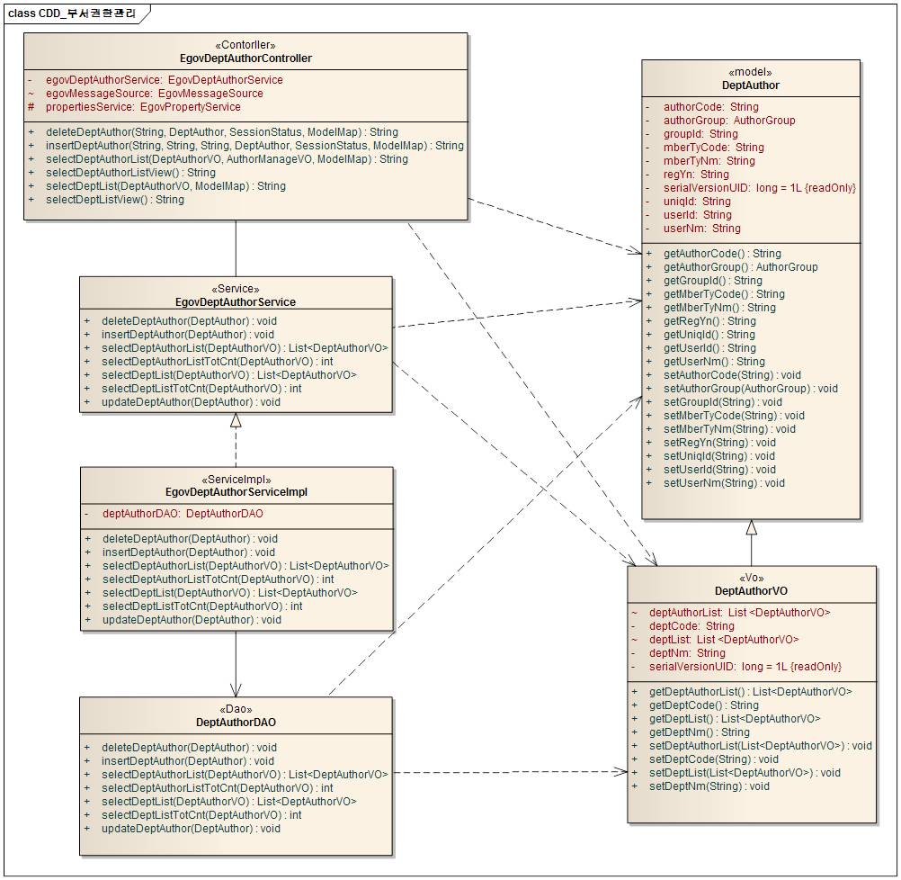
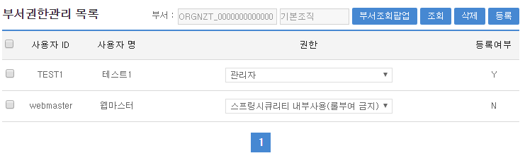
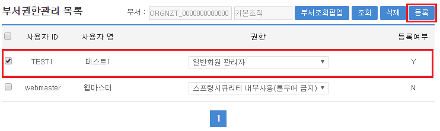
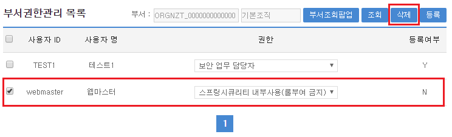
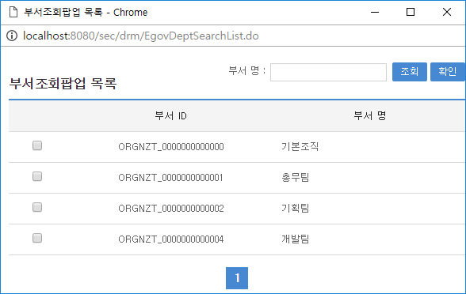

# 부서 권한관리

## 개요

 **부서권한관리**는 시스템 사용을 위해 사용자에게 권한을 부여할 경우 사용자가 업무담당자에 한해서 부서별로 사용자에게 일괄 권한을 부여하는 기능을 제공한다.

## 설명

 **부서권한관리**는 부서별 업무담당자의 권한을 관리하기 위한 목적으로 **등록, 수정, 삭제, 목록조회**의 기능을 수반한다.

```bash
  ① 부서별 권한 등록 : 부서별 업무담당자를 조회하여 권한정보를 일괄 및 개별 등록한다.
  ② 부서별 권한 수정 : 부서별 업무담당자에게 할당된 권한정보를 일괄 및 개별 수정한다.
  ③ 부서별 권한 삭제 : 부서별 업무담당자에게 할당된 권한정보를 일괄 및 개별 삭제한다.
  ④ 부서별 권한 목록 : 부서별 업무담당자에게 할당된 권한정보를 조회한다.
```

## 설명

### 패키지 참조 관계

 부서권한관리 패키지는 권한관리 패키지와 요소기술의 공통 패키지(cmm)에 대해서만 직접적인 함수적 참조 관계를 가진다. 하지만, 컴포넌트 배포 시 오류 없이 실행되기 위하여 패키지 간의 참조관계에 따라 그룹관리 , 권한그룹관리, 롤관리, 스프링시큐리티, 사용자통합인증, 요소기술(유틸리티) 시스템, 웹에디터, 메일연동 인터페이스 패키지와 함께 배포 파일을 구성한다.

- 패키지 간 참조 관계 : [보안 Package Dependency](https://www.egovframe.go.kr/wiki/doku.php?id=egovframework:com:v2:init_pkg_dependency#보안)

### 관련소스

| 유형 | 대상소스명 | 비고 |
| --- | --- | --- |
| Controller | egovframework.com.sec.drm.web.EgovDeptAuthorController.java | 부서권한관리를 위한 컨트롤러 클래스 |
| Service | egovframework.com.sec.drm.service.EgovDeptAuthorService.java | 부서권한관리를 위한 서비스 인터페이스 |
| ServiceImpl | egovframework.com.sec.drm.service.impl.EgovDeptAuthorServiceImpl.java | 부서권한관리를 위한 서비스 구현 클래스 |
| Model | egovframework.com.sec.drm.service.DeptAuthor.java | 부서권한관리를 위한 Model 클래스 |
| VO | egovframework.com.sec.drm.service.DeptAuthorVO.java | 부서권한관리를 위한 VO 클래스 |
| DAO | egovframework.com.sec.drm.service.impl.DeptAuthorDAO.java | 부서권한관리를 위한 데이터처리 클래스 |
| JSP | /WEB-INF/jsp/egovframework/com/sec/drm/EgovDeptAuthorManage.jsp | 부서권한관리를 위한 jsp페이지 |
| JSP | /WEB-INF/jsp/egovframework/com/sec/drm/EgovDeptSearch.jsp | 부서목록 조회를 위한 jsp페이지 |
| QUERY XML | resources/egovframework/mapper/com/sec/drm/EgovDeptAuthor\_SQL\_mysql.xml | 부서권한관리 MySQL용 QUERY XML |
| QUERY XML | resources/egovframework/mapper/com/sec/drm/EgovDeptAuthor\_SQL\_cubrid.xml | 부서권한관리 Cubrid용 QUERY XML |
| QUERY XML | resources/egovframework/mapper/com/sec/drm/EgovDeptAuthor\_SQL\_oracle.xml | 부서권한관리 Oracle용 QUERY XML |
| QUERY XML | resources/egovframework/mapper/com/sec/drm/EgovDeptAuthor\_SQL\_tibero.xml | 부서권한관리 Tibero용 QUERY XML |
| QUERY XML | resources/egovframework/mapper/com/sec/drm/EgovDeptAuthor\_SQL\_altibase.xml | 부서권한관리 Altibase용 QUERY XML |
| QUERY XML | resources/egovframework/mapper/com/sec/drm/EgovDeptAuthor\_SQL\_maria.xml | 부서권한관리 Maria용 QUERY XML |
| QUERY XML | resources/egovframework/mapper/com/sec/drm/EgovDeptAuthor\_SQL\_postgres.xml | 부서권한관리 Postgres용 QUERY XML |
| QUERY XML | resources/egovframework/mapper/com/sec/drm/EgovDeptAuthor\_SQL\_goldilocks.xml | 부서권한관리 Goldilocks용 QUERY XML |
| Message properties | resources/egovframework/message/com/sec/drm/message\_ko.properties | 부서권한관리 Message properties(한글) |
| Message properties | resources/egovframework/message/com/sec/drm/message\_en.properties | 부서권한관리 Message properties(영문) |

### 클래스 다이어그램

 

### 관련테이블

| 테이블명 | 테이블명(영문) | 비고 |
| --- | --- | --- |
| 사용자보안설정 | COMTNEMPLYRSCRTYESTBS | 사용자별로 권한을 설정한다. |
| 사용자정보 | COMTNEMPLYRINFO | 업무시스템을 사용하는 사용자 정보를 정의한다. |
| 조직정보 | COMTNORGNZTINFO | 공통서비스 구현에 있어 필요한 조직에 관련된 정보를 정의한다. |

## 관련기능

 부서권한관리기능은 크게 **부서권한 목록조회**, **부서권한 등록 및 수정**, **부서권한 삭제**, **부서목록 조회 팝업** 기능으로 분류된다.

### 부서권한목록 조회

#### 비즈니스 규칙

 부서권한 목록은 페이지 당 10건씩 조회되며 페이징은 10페이지씩 이루어진다. 검색조건은 부서코드에 대해서 수행되고, 부서정보는 팝업을 통한 검색으로 선택할 수 있다.

#### 관련코드

 N/A

#### 관련화면 및 수행메뉴얼

| Action | URL | Controller method | SQL Namespace | SQL QueryID |
| --- | --- | --- | --- | --- |
| 조회 | /sec/drm/EgovDeptAuthorList.do | selectDeptAuthorList | “deptAuthorDAO” | “selectDeptAuthorList” |
|  |  |  | “deptAuthorDAO” | “selectDeptAuthorListTotCnt” |

 

 부서조회팝업 : 부서 선택을 위한 팝업을 호출한다.  
조회 : 해당 부서의 사용자 별 권한 정보 목록을 조회한다.  

### 부서권한 등록 및 수정

#### 비즈니스 규칙

 조회된 부서별 사용자 권한을 **등록**하기 위해서는 조회 목록의 선택 체크박스에 선택을 한 뒤 권한 항목에 해당 권한정보를 선택하고 등록 버튼을 선택한다. 수정 화면은 등록 화면과 동일하고, 기 등록된 사용자의 권한을 수정한 뒤 등록 버튼을 선택한다.

#### 관련코드

 N/A

#### 관련화면 및 수행메뉴얼

| Action | URL | Controller method | SQL Namespace | SQL QueryID |
| --- | --- | --- | --- | --- |
| 등록 | /sec/drm/EgovDeptAuthorInsert.do | insertDeptAuthor | “deptAuthorDAO” | “insertDeptAuthor” |
| 수정 | /sec/drm/EgovDeptAuthorInsert.do | insertDeptAuthor | “deptAuthorDAO” | “updateDeptAuthor” |

 

 선택 : 사용자에게 권한을 부여하기 위해 체크박스를 선택한다. 멀티선택이 가능하다.  
등록 : 선택된 사용자에게 권한을 등록한다.  

### 부서권한 삭제

#### 비즈니스 규칙

 조회된 부서별 사용자 권한을 **삭제**하기 위해서는 조회 목록의 선택 체크박스에 선택을 삭제 버튼을 선택한다.

#### 관련코드

 N/A

#### 관련화면 및 수행메뉴얼

| Action | URL | Controller method | SQL Namespace | SQL QueryID |
| --- | --- | --- | --- | --- |
| 삭제 | /sec/drm/EgovDeptAuthorDelete.do | deleteDeptAuthor | “deptAuthorDAO” | “deleteDeptAuthor” |

 

 선택 : 사용자에게 권한을 부여하기 위해 체크박스를 선택한다. 멀티선택이 가능하다.  
삭제 : 선택된 사용자에게 권한을 해제한다.  

### 부서목록 조회 팝업

#### 비즈니스 규칙

 부서별 사용자의 권한 목록을 조회하기 위해 부서선택을 위한 **팝업**을 호출한다. 팝업에 조회된 부서목록 중 해당 부서를 선택하거나 체크박스를 선택 후 확인버튼을 선택한다.

#### 관련코드

 N/A

#### 관련화면 및 수행메뉴얼

| Action | URL | Controller method | SQL Namespace | SQL QueryID |
| --- | --- | --- | --- | --- |
| 조회 | /sec/drm/EgovDeptSearchList.do | selectDeptList | “deptAuthorDAO” | “selectDeptList” |
|  |  |  | “deptAuthorDAO” | “selectDeptListTotCnt” |

 

 조회 : 부서 목록을 조회한다.  
확인 : 선택된 부서를 조회조건으로 선택한다.