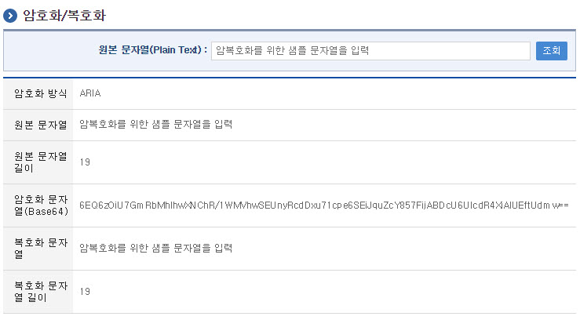

# 암호화/복호화

## 개요

 암호화/복호화는 보안을 위하여 데이터를 암호화하거나 암호화된 데이터를 복호화하기 위해, ARIA 방식을 통한 데이터의 암호화 및 복호화 기능을 제공한다.

## 전제조건

 암복호화 기능을 사용하기 위해서는 전자정부 표준프레임워크 실행환경중 egovframework.rte.fdl.crypto-x.x.x.jar 라이브러리를 필요로 한다.

 보다 자세한 사항은 실행환경의 [암호화/복호화](https://www.egovframe.go.kr/wiki/doku.php?id=egovframework:rte:fdl:encryption_decryption) 서비스를 참조한다.

## 설명

 암복호화는 서비스를 통해 데이터 암호화 및 복호화를 제공하는 기능으로 별도의 화면에서 평문을 입력하고 암호화 문자열을 암호화하여 BASE64형태로 전달받으며, 이를 다시 원문으로 복호화 하는 참고 화면을 제공한다.

### 패키지 참조 관계

 암호화/복호화 패키지는 요소기술의 공통 패키지(cmm)에 대해서만 직접적인 함수적 참조 관계를 가진다.

- 패키지 간 참조 관계 : [보안 Package Dependency](https://www.egovframe.go.kr/wiki/doku.php?id=egovframework:com:v2:init_pkg_dependency#보안)

### 관련소스

| 유형 | 대상소스 | 비고 |
| --- | --- | --- |
| Controller | egovframework.com.sec.pki.web.EgovCryptoController.java | 암호화/복호화 테스트를 위한 컨트롤러 클래스 |
| Service | egovframework.com.sec.pki.service.EgovGPKIService.java | 암호화/복호화를 위한 서비스 인터페이스 |
| ServiceImpl | egovframework.com.sec.pki.service.impl.EgovGPKIServiceImpl.java | 암호화/복호화를 위한 서비스 구현 클래스 |
| JSP | /WEB-INF/jsp/egovframework/com/sec/pki/EgovCryptoInfo.jsp | 암호화/복호화 테스트를 위한 jsp페이지 |
| Message properties | resources/egovframework/message/com/sec/pki/message\_ko.properties | 암호화/복호화를 위한 Message properties(한글) |
| Message properties | resources/egovframework/message/com/sec/pki/message\_en.properties | 암호화/복호화를 위한 Message properties(영문) |

### 환경설정

 암호화/복호화 기능을 활용하기 위하여 필요한 항목 및 그 환경 설정은 다음과 같다.

#### crypto ARIA 암복호화 라이브러리 설치 확인

 ARIA 방식의 암호화 복호화 서비스를 사용하기 위해서는 표준프레임워크 실행환경 구성요소중 cryto라이브러리가 설치되어야 한다.

##### pom.xml 추가 (dependency추가)

```xml
<dependency>
    <groupId>egovframework.rte</groupId>
    <artifactId>egovframework.rte.fdl.crypto</artifactId>
    <version>${egovframework.rte.version}</version>
</dependency>

```

##### context-crypto.xml 설정

```xml
<egov-crypto:config id="egovCryptoConfig"
    initial="false"
    crypto="false"
    algorithm="SHA-256"
    algorithmKey="egovframe"
    algorithmKeyHash="gdyYs/IZqY86VcWhT8emCYfqY1ahw2vtLG+/FzNqtrQ="
    cryptoBlockSize="1024"
/>

```

##### Controller에서 서비스 주입

```java
@Controller
public class EgovCryptoController {

    /** 암호화서비스 */
    @Resource(name = "egovEnvCryptoService")
    EgovEnvCryptoService cryptoService;
    
    @Resource(name = "egovEnvPasswordEncoderService")
    EgovPasswordEncoder egovPasswordEncoder;
    ..........

```

 \* 해당 샘플은 v3.8 이상을 사용하여야 정상적인 구동이 가능하다.

## 관련화면

 암복호화 테스트 화면은 다음과 같다.

### 암호화/복호화 테스트

#### 관련코드

```java
cryptoService.encrypt(encrypt); // 암호화한후에 URLEncoding 처리함.
cryptoService.encryptNone(encrypt); // 암호화한후에 URLEncoding 처리 안함.

return cryptoService.decrypt(decrypt); // 복호화전에 URLDecoding 처리함.
cryptoService.decryptNone(decrypt); // 복호화전에 URLDecoding 처리 안함.

```

#### 관련화면 및 수행매뉴얼

| Action | URL | Controller method | SQL Namespace | SQL QueryID |
| --- | --- | --- | --- | --- |
| 테스트조회 | /sec/pki/EgovCryptoInfo.do | displayCryptoInfo | ”“ | ”“ |

 

 테스트는 전달된 평문에 대한 암호화 데이타를 BASE64로 표시하여주고 암호화 데이타를 복호화 하여 문자열로 출력한다.