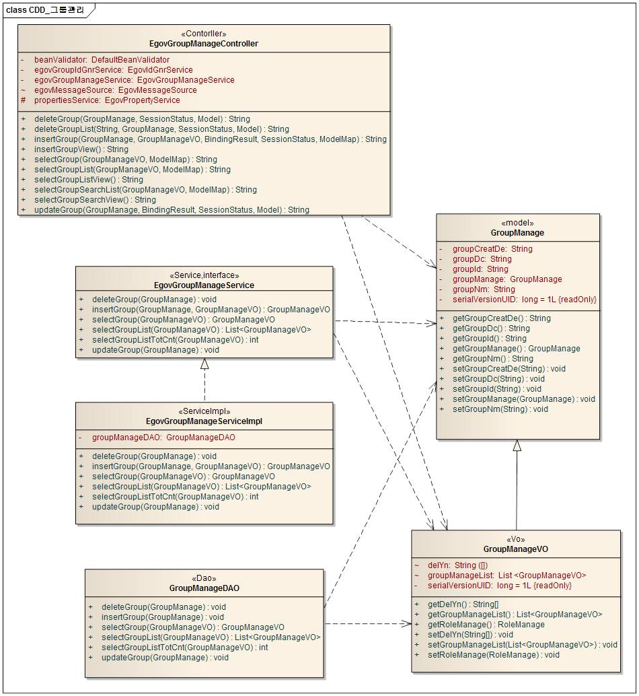
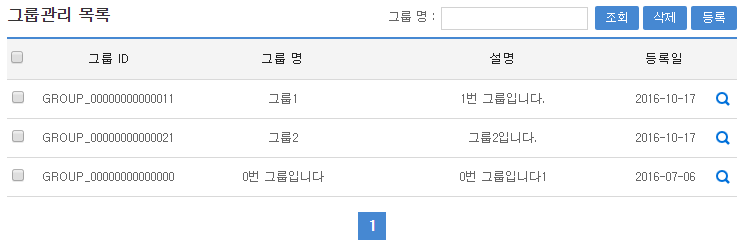
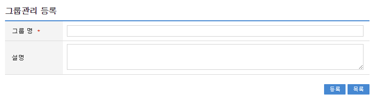
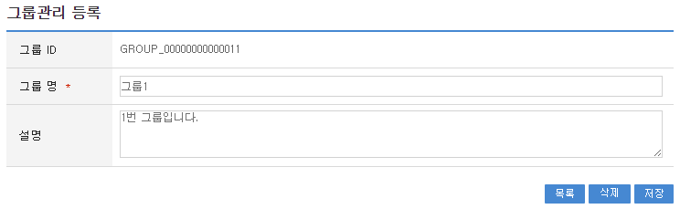
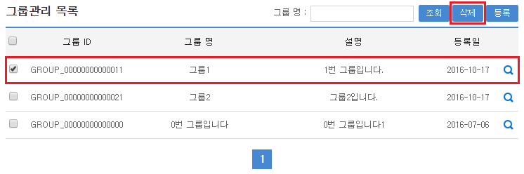

# 그룹 관리

## 개요

 **그룹관리**는 시스템을 사용하는 목적별 사용자 그룹을 생성하여 그룹에 해당하는 사용자에게 권한을 일괄적으로 할당하기 위해 그룹을 정의한다.

## 설명

 **그룹관리**는 시스템을 사용하는 목적별 사용자 그룹을 생성하여 그룹에 해당하는 사용자에게 권한을 일괄적으로 할당하기위한 목적으로 그룹의 **등록, 수정, 삭제, 조회, 목록조회**의 기능을 수반한다.

```bash
  ① 그룹등록 : 시스템을 사용하는 목적별 사용자 그룹정보를 등록한다.
  ② 그룹수정 : 시스템을 사용하는 목적별 사용자 그룹정보를 수정한다.
  ③ 그룹삭제 : 시스템을 사용하는 목적별 사용자 그룹정보를 삭제한다.
  ④ 그룹조회 : 시스템을 사용하는 목적별 사용자 그룹정보를 조회한다.
  ⑤ 그룹목록 : 시스템을 사용하는 목적별 사용자 그룹정보목록을 조회한다.
```

## 설명

### 패키지 참조 관계

 그룹관리 패키지는 요소기술의 공통 패키지(cmm)에 대해서만 직접적인 함수적 참조 관계를 가진다. 하지만, 컴포넌트 배포 시 오류 없이 실행되기 위하여 패키지 간의 참조관계에 따라 권한관리, 부서권한관리, 권한그룹관리, 롤관리, 스프링시큐리티, 사용자통합인증, 요소기술(유틸리티) 시스템, 웹에디터, 메일연동 인터페이스 패키지와 함께 배포 파일을 구성한다.

- 패키지 간 참조 관계 : [보안 Package Dependency](../intro/package-reference.md/#보안)

### 관련소스

| 유형 | 대상소스명 | 비고 |
| --- | --- | --- |
| Controller | egovframework.com.sec.gmt.web.EgovGroupManageController.java | 그룹 관리를 위한 컨트롤러 클래스 |
| Service | egovframework.com.sec.gmt.service.EgovGroupManageService.java | 그룹 관리를 위한 서비스 인터페이스 |
| ServiceImpl | egovframework.com.sec.gmt.service.impl.EgovGroupManageServiceImpl.java | 그룹 관리를 위한 서비스 구현 클래스 |
| Model | egovframework.com.sec.gmt.service.GroupManage.java | 그룹 관리를 위한 Model 클래스 |
| VO | egovframework.com.sec.gmt.service.GroupManageVO.java | 그룹 관리를 위한 VO 클래스 |
| DAO | egovframework.com.sec.gmt.service.impl.GroupManageDAO.java | 그룹 관리를 위한 데이터처리 클래스 |
| JSP | /WEB-INF/jsp/egovframework/com/sec/gmt/EgovGroupManage.jsp | 그룹 관리를 위한 jsp페이지 |
| JSP | /WEB-INF/jsp/egovframework/com/sec/gmt/EgovGroupInsert.jsp | 그룹 등록를 위한 jsp페이지 |
| JSP | /WEB-INF/jsp/egovframework/com/sec/gmt/EgovGroupUpdate.jsp | 그룹 수정를 위한 jsp페이지 |
| JSP | /WEB-INF/jsp/egovframework/com/sec/gmt/EgovGroupSearch.jsp | 그룹 조회를 위한 jsp페이지 |
| QUERY XML | resources/egovframework/mapper/com/sec/gmt/GroupManage\_SQL\_mysql.xml | 그룹 관리를 위한 MySQL용 QUERY XML |
| QUERY XML | resources/egovframework/mapper/com/sec/gmt/GroupManage\_SQL\_cubrid.xml | 그룹 관리를 위한 Cubrid용 QUERY XML |
| QUERY XML | resources/egovframework/mapper/com/sec/gmt/GroupManage\_SQL\_oracle.xml | 그룹 관리를 위한 Oracle용 QUERY XML |
| QUERY XML | resources/egovframework/mapper/com/sec/gmt/GroupManage\_SQL\_tibero.xml | 그룹 관리를 위한 Tibero용 QUERY XML |
| QUERY XML | resources/egovframework/mapper/com/sec/gmt/GroupManage\_SQL\_altibase.xml | 그룹 관리를 위한 Altibase용 QUERY XML |
| QUERY XML | resources/egovframework/mapper/com/sec/gmt/GroupManage\_SQL\_maria.xml | 그룹 관리를 위한 Maria용 QUERY XML |
| QUERY XML | resources/egovframework/mapper/com/sec/gmt/GroupManage\_SQL\_postgres.xml | 그룹 관리를 위한 Postgres용 QUERY XML |
| QUERY XML | resources/egovframework/mapper/com/sec/gmt/GroupManage\_SQL\_goldilocks.xml | 그룹 관리를 위한 Goldilocks용 QUERY XML |
| Message properties | resources/egovframework/message/com/sec/gmt/message\_ko.properties | 그룹 관리 Message properties(한글) |
| Message properties | resources/egovframework/message/com/sec/gmt/message\_en.properties | 그룹 관리 Message properties(영문) |
| Idgen XML | resources/egovframework/spring/com/idgn/context-idgn-Group.xml | 그룹 관리 Id생성 Idgen XML |

### 클래스 다이어그램

 

### ID Generation

#### ID Generation 관련 DDL 및 DML

- ID Generation Service를 활용하기 위해서 Sequence 저장테이블인 COMTECOPSEQ에 **GROUP\_ID** 항목을 추가한다.

```sql
  CREATE TABLE COMTECOPSEQ
  (
	TABLE_NAME            VARCHAR(20) NOT NULL,
	NEXT_ID               NUMERIC(30) NULL,
	 PRIMARY KEY (TABLE_NAME)
  );
 
  INSERT INTO COMTECOPSEQ VALUES('GROUP_ID','1');
 
```

#### ID Generation 환경설정(context-idgn-Group.xml)

```xml
    <bean name="egovGroupIdGnrService" class="egovframework.rte.fdl.idgnr.impl.EgovTableIdGnrServiceImpl" destroy-method="destroy">
        <property name="dataSource" ref="egov.dataSource" />
        <property name="strategy"   ref="groupIdStrategy" />
        <property name="blockSize"  value="10"/>
        <property name="table"      value="COMTECOPSEQ"/>
        <property name="tableName"  value="GROUP_ID"/>
    </bean>
    <bean name="groupIdStrategy" class="egovframework.rte.fdl.idgnr.impl.strategy.EgovIdGnrStrategyImpl">
        <property name="prefix"   value="GROUP_" />
        <property name="cipers"   value="14" />
        <property name="fillChar" value="0" />
    </bean>
```

### 테이블

| 테이블명 | 테이블명(영문) | 비고 |
| --- | --- | --- |
| 그룹정보 | COMTNAUTHORGROUPINFO | 권한을 그룹별로 부여하기 위해 그룹을 관리한다. |

## 관련기능

 그룹관리기능은 크게 **그룹 목록조회**, **그룹 등록**, **그룹 수정**, **그룹 삭제** 기능으로 분류된다.

### 그룹 목록조회

#### 비즈니스 규칙

 그룹 목록은 페이지 당 10건씩 조회되며 페이징은 10페이지씩 이루어진다. 검색조건은 그룹명 대해서 수행된다.

#### 관련코드

 N/A

#### 관련화면 및 수행메뉴얼

| Action | URL | Controller method | SQL Namespace | SQL QueryID |
| --- | --- | --- | --- | --- |
| 조회 | /sec/gmt/EgovGroupList.do | selectGroupList | “groupManageDAO” | “selectGroupList” |
|  |  |  | “groupManageDAO” | “selectGroupListTotCnt” |

 

 조회 : 기 등록된 그룹의 목록을 조회한다.  
삭제 : 기존 그룹의 속성정보를 삭제하고자 하는 경우 해당 체크박스를 선택하고 **삭제 버튼**을 선택한다.  
등록 : 신규 그룹을 등록하기 위해서는 상단의 등록 버튼을 통해서 **그룹 등록** 화면으로 이동한다.  

### 그룹 등록

#### 비즈니스 규칙

 그룹의 속성정보를 입력한 뒤 등록한다.

#### 관련코드

 N/A

#### 관련화면 및 수행메뉴얼

| Action | URL | Controller method | SQL Namespace | SQL QueryID |
| --- | --- | --- | --- | --- |
| 등록화면 | /sec/gmt/EgovGroupInsertView.do | insertGroupView |  |  |
| 등록 | /sec/gmt/EgovGroupInsert.do | insertGroup | “groupManageDAO” | “insertGroup” |

 

 등록 : 신규 그룹을 등록하기 위해서는 그룹 속성을 입력한 뒤 상단의 **등록 버튼**을 통해서 그룹을 등록한다.  
목록 : 그룹 목록조회 화면으로 이동한다.  

### 그룹 수정

#### 비즈니스 규칙

 그룹의 속성정보를 변경한 후 저장한다.

#### 관련코드

 N/A

#### 관련화면 및 수행메뉴얼

| Action | URL | Controller method | SQL Namespace | SQL QueryID |
| --- | --- | --- | --- | --- |
| 수정화면 | /sec/gmt/EgovGroup.do | selectGroup | “groupManageDAO” | “selectGroup” |
| 수정 | /sec/gmt/EgovGroupUpdate.do | updateGroup | “groupManageDAO” | “updateGroup” |

 

 목록 : 그룹 목록조회 화면으로 이동한다.  
삭제 : 기 등록된 그룹을 삭제한다.  
저장 : 기 등록된 그룹 속성을 수정한 뒤 상단의 **수정 버튼**을 통해서 그룹을 수정한다.  

### 그룹 삭제

#### 비즈니스 규칙

 그룹 목록을 조회한 뒤 삭제 대상을 체크박스로 선택하고, 삭제버튼을 클릭한다.

#### 관련코드

 N/A

#### 관련화면 및 수행메뉴얼

| Action | URL | Controller method | SQL Namespace | SQL QueryID |
| --- | --- | --- | --- | --- |
| 삭제 | /sec/gmt/EgovGroupDelete.do | deleteGroup | “groupManageDAO” | “deleteGroup” |

 

 선택 : 삭제하려는 목록을 체크박스로 설정한다. 멀티 삭제가 가능하다.  
삭제 : 기 등록된 그룹을 삭제하기 위해서는 상단의 삭제 버튼을 통해서 삭제한다.