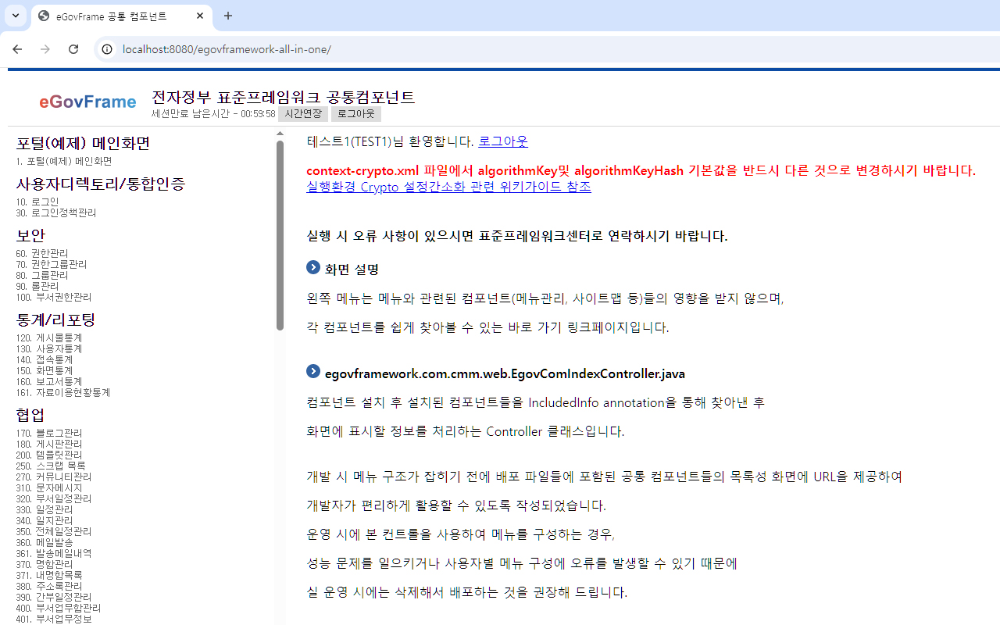
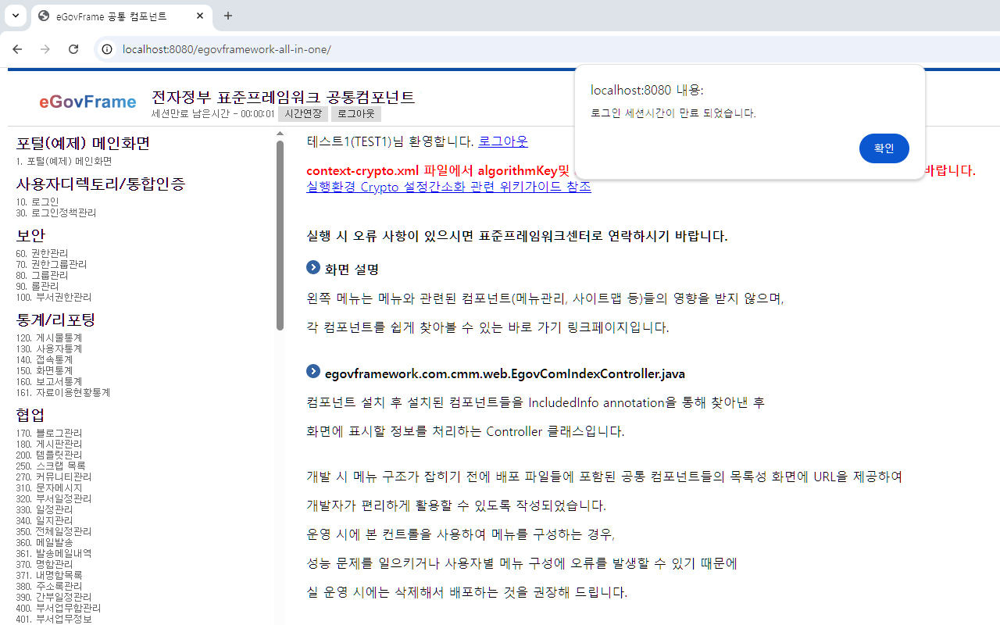

# 로그인 시간관리

## 개요

 로그인후 만료시간까지의 남은 시간을 표시한다.

## 설명

 세션에 객체 정보 저장, 취득, 제거의 기능을 갖으며 HttpServletRequest 객체의 HttpSession 정보를 사용하여 처리된다.

### 관련소스

| 유형 | 대상소스 | 설명 | 비고 |
| --- | --- | --- | --- |
| Filter | egovframework.com.cmm.filter.SessionTimeoutCookieFilter.java | 시간관리 필터 |  |
| Controller | egovframework.com.cmm.web.EgovComIndexController.java | 상단프레임 Controller | 시간관리 표시 |
| Controller | egovframework.com.uat.uia.web.EgovLoginController.java | 로그인시간 연장 Controller | 시간연장 |
| JSP | /WEB-INF/jsp/egovframework/com/cmm/EgovUnitTop.jsp | 상단프레임 페이지 | 시간관리 표시 |

### 필터 쿠키값 설정

| 쿠키명 | 변수타입 | 설명 | 내용 |
| --- | --- | --- | --- |
| egovLatestServerTime | long | 서버의 최근 시간 | 시스템의 최근 시간을 밀리초 단위의 Epoch시간(Unix time, POSIX time)으로 기록한다. |
| egovExpireSessionTime | long | 세션 객체 생성 | HttpSession에서 만료 시간을 밀리초 단위의 Epoch시간(Unix time, POSIX time)으로 기록한다. |

### Output

- String, long : 필터를 통해 쿠키명(String)에 값(long)형태로 저장된다.

## 환경설정

 세션 만료 시간을 적절하게 설정하여야 한다.  
너무 짧으면 사용시 불편을 초래할수 있고, 너무 길면 보안상 좋지 않으며 서버에 세션정보가 누적되어 성능저하나 오동작을 유발할수 있다.

### web.xml 설정

 서버의 세션타임아웃 시간을 설정한다. 분 단위는 기재한다. ex) 60 = 1시간 , 600 = 10시간

```xml
    <session-config>
        <session-timeout>60</session-timeout>
    </session-config>
```

### SessionTimeoutCookieFilter 설정

 EgovWebApplicationInitializer.java 파일에 다음 코드를 추가하여 Filter를 설정한다.

```java
import egovframework.com.cmm.filter.SessionTimeoutCookieFilter;
 
public class EgovWebApplicationInitializer implements WebApplicationInitializer {
 
    private static final Logger LOGGER = LoggerFactory.getLogger(EgovWebApplicationInitializer.class);
    @Override
    public void onStartup(ServletContext servletContext) throws ServletException {
 
    .... 중략 ....
 
    FilterRegistration.Dynamic sessionTimeoutFilter = servletContext.addFilter("sessionTimeoutFilter", new SessionTimeoutCookieFilter());
    sessionTimeoutFilter.addMappingForUrlPatterns(null, false, "*.do");
 
    .... 중략 ....
```

## 사용방법

### 로그인 시간관리 시간연장

#### 비즈니스 규칙

 회원가입시 또는 비밀번호 변경시 비밀번호 수정날짜가 관리된다.  
비밀번호 수정날짜에서 특정한 시일이 경과하면 비밀번호 만료에 대한 안내 팝업을 출력하여 비밀번호 변경을 유도한다.

#### 관련코드

```java
 
/**
 * 세션타임아웃 시간을 연장한다.
 * Cookie에 egovLatestServerTime, egovExpireSessionTime 기록하도록 한다.
 * @return result - String
 * @exception Exception
 */
@RequestMapping(value="/uat/uia/refreshSessionTimeout.do")
public ModelAndView refreshSessionTimeout(@RequestParam Map<String, Object> commandMap) throws Exception {
	ModelAndView modelAndView = new ModelAndView();
	modelAndView.setViewName("jsonView");
 
	modelAndView.addObject("result", "ok");
 
	return modelAndView;
}
```

#### 관련화면 및 수행매뉴얼

| Action | URL | Controller method | SQL Namespace | SQL QueryID |
| --- | --- | --- | --- | --- |
| 로그인 시간연장 | /uat/uia/refreshSessionTimeout.do | refreshSessionTimeout |  |  |

### 로그인 시간관리 남은시간 표시

 쿠키로부터 만료 예정시간(egovLatestServerTime), 서버현재시간(egovExpireSessionTime)을 구하여 그 차이를 계산하여 로그인 남은 시간을 표시한다.

#### 관련코드

```xml
 
<script type="text/javascript">
 
	var objLeftTime;
	var objClickInfo;
	var latestTime;
	var expireTime;
	var timeInterval = 1000; // 1초 간격 호출
	var firstLocalTime = 0;
	var elapsedLocalTime = 0;
	var stateExpiredTime = false;
	var logoutUrl = "<c:url value='/uat/uia/actionLogout.do'/>";
	var timer;
 
	function init() {
		objLeftTime = document.getElementById("leftTimeInfo");
 
		if (objLeftTime == null) {
			console.log("'leftTimeInfo' ID is not exist!");
			return;
		}
		objClickInfo = document.getElementById("clickInfo");
		//console.log(objLeftTime.textContent);
 
		latestTime = getCookie("egovLatestServerTime");
		expireTime = getCookie("egovExpireSessionTime");
		//console.log("latestServerTime = "+latestTime);
		//console.log("expireSessionTime = "+expireTime);
 
		elapsedTime = 0;
		firstLocalTime = (new Date()).getTime();
		showRemaining();
 
		timer = setInterval(showRemaining, timeInterval); // 1초 간격 호출
	}
```

## 관련화면

### 남은 로그인 시간 표시

| Action | URL | Controller method | SQL Namespace | SQL QueryID |
| --- | --- | --- | --- | --- |
| 상단프레임 영역 출력 | /EgovTop.do | top() |  |  |

 남은 로그인 시간 표시  


 남은 로그인 시간이 만료 된 경우  


## 참고자료

- 쿠키처리 참조: [쿠키처리](../elementary-technology/handling_cookie.md)
- 세션처리 참조: [세션처리](../elementary-technology/handling_session.md)