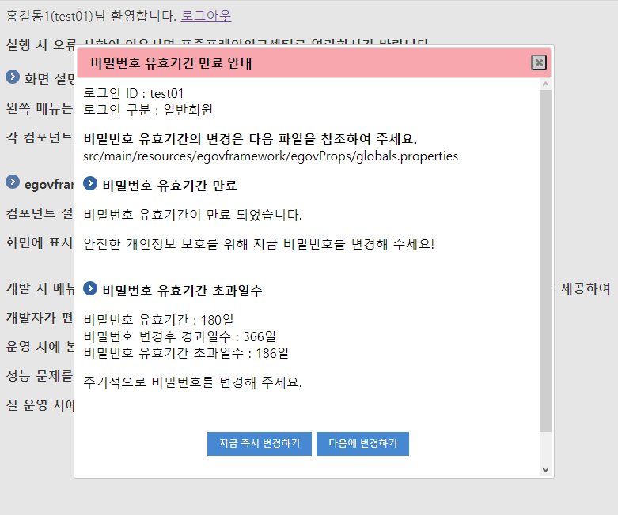

# 비밀번호 만료기간 관리

## 개요

 아이디 생성후 또는 비밀번호를 변경후 정해진 기간이 경과하면 비밀번호 변경을 요청한다.

## 설명

 계정별 비밀번호 생성 또는 변경일시는 DB테이블의 컬럼에 저장되며 지정된 기간이 경과하면 로그인시 체크하여 변경을 요청한다.

### 관련소스

| 유형 | 대상소스 | 설명 | 비고 |
| --- | --- | --- | --- |
| Controller | egovframework.com.cmm.web.EgovComIndexController.java | 초기 컨텐츠표시 Controller | 시간관리 표시 |
| Service | egovframework.com.uat.uia.service.EgovLoginService | 비밀번호 만료 및 로그인 관련 서비스 인터페이스 |  |
| ServiceImpl | egovframework.com.uat.uia.service.impl.EgovLoginServiceImpl | 비밀번호 만료 및 로그인 관련 서비스 구현 클래스 |  |
| DAO | egovframework.com.uat.uia.service.impl.EgovLoginServiceImpl | 비밀번호 만료 및 로그인위한 데이터처리 클래스 |  |
| JSP | /WEB-INF/jsp/egovframework/com/cmm/EgovUnitContent.jsp | 초기 컨텐츠표시 페이지 | 시간관리 표시 팝업호출 |
| JSP | /WEB-INF/jsp/egovframework/com/uat/uia/EgovExpirePwd.jsp | 비밀번호 만료 안내 페이지 | 시간관리 표시 팝업 |
| Query XML | resources/egovframework/mapper/com/uat/uia/EgovLoginUsr\_SQL\_mysql.xml | 비밀번호 만료 및 로그인을위한 MySQL용 Query XML |
| Query XML | resources/egovframework/mapper/com/uat/uia/EgovLoginUsr\_SQL\_oracle.xml | 비밀번호 만료 및 로그인을 위한 Oracle용 Query XML |
| Query XML | resources/egovframework/mapper/com/uat/uia/EgovLoginUsr\_SQL\_tibero.xml | 비밀번호 만료 및 로그인을 위한 Tibero용 Query XML |
| Query XML | resources/egovframework/mapper/com/uat/uia/EgovLoginUsr\_SQL\_altibase.xml | 비밀번호 만료 및 로그인을 위한 Altibase용 Query XML |
| Query XML | resources/egovframework/mapper/com/uat/uia/EgovLoginUsr\_SQL\_cubrid.xml | 비밀번호 만료 및 로그인을 위한 Cubrid용 Query XML |
| Query XML | resources/egovframework/mapper/com/uat/uia/EgovLoginUsr\_SQL\_maria.xml | 비밀번호 만료 및 로그인을 위한 Maria용 Query XML |
| Query XML | resources/egovframework/mapper/com/uat/uia/EgovLoginUsr\_SQL\_postgres.xml | 비밀번호 만료 및 로그인을 위한 Postgres용 Query XML |
| Query XML | resources/egovframework/mapper/com/uat/uia/EgovLoginUsr\_SQL\_goldilocks.xml | 비밀번호 만료 및 로그인을 위한 Goldilocks용 Query XML |

### 관련테이블

| 테이블명 | 테이블명(영문) | 비고 |
| --- | --- | --- |
| 일반회원 | COMTNGNRLMBER | 일반회원 정보를 관리한다.  
주민등록번호(IHIDNUM) 컬럼이 존재하나 데이터 저장 및 조회 로직에서는 제외되어 있으므로  
필요시 **암호화**하여 구현해야 함  
CHG\_PWD\_LAST\_PNTTM 컴럼 사용(비밀번호 최초등록 또는 수정 일시 기록) |
| 기업회원 | COMTNENTRPRSMBER | 기업회원 정보를 관리한다.  
신청인주민등록번호(APPLCNT\_IHIDNUM) 컬럼이 존재하나 데이터 저장 및 조회 로직에서는 제외되어 있으므로,  
필요시 **암호화**하여 구현해야 함  
CHG\_PWD\_LAST\_PNTTM 컴럼 사용(비밀번호 최초등록 또는 수정 일시 기록) |
| 업무사용자 | COMTNEMPLYRINFO | 업무사용자 정보를 관리한다.  
CHG\_PWD\_LAST\_PNTTM 컴럼 사용(비밀번호 최초등록 또는 수정 일시 기록) |

## 환경설정

 비밀번호 등록 또는 수정후 만료 기간을 설정할수 있다.

### globals.properties 설정

 설정파일에 Globals.ExpirePwdDay를 설정한다. 일 단위로 기재한다. ex) 180 = 180일  
비밀번호 등록 또는 수정일로부터 지정된 일수 까지는 유효하고 해당 기간이 지나면 안내 팝업이 출력된다.

```bash
    # 비밀번호 유효기간 설정
    Globals.ExpirePwdDay = 180
```

## 사용방법

### 비밀번호 만료기간 체크

#### 비즈니스 규칙

 비밀번호 등록 또는 수정날짜에서 특정한 시일이 경과하였는지 확인한다.

#### 관련코드

```java
 
@RequestMapping("/EgovContent.do")
public String setContent(ModelMap model) throws Exception {
 
	// 설정된 비밀번호 유효기간을 가져온다. ex) 180이면 비밀번호 변경후 만료일이 앞으로 180일 
	String propertyExpirePwdDay = EgovProperties.getProperty("Globals.ExpirePwdDay");
	int expirePwdDay = 0 ;
	try {
		expirePwdDay =  Integer.parseInt(propertyExpirePwdDay);
	} catch (Exception e) {
		LOGGER.debug("convert expirePwdDay Err : "+e.getMessage());
	}
 
	model.addAttribute("expirePwdDay", expirePwdDay);
 
	// 비밀번호 설정일로부터 몇일이 지났는지 확인한다. ex) 3이면 비빌번호 설정후 3일 경과
	LoginVO loginVO = (LoginVO) EgovUserDetailsHelper.getAuthenticatedUser();
	model.addAttribute("loginVO", loginVO);
	int passedDayChangePWD = 0;
	if ( loginVO != null ) {
		LOGGER.debug("===>>> loginVO.getId() = "+loginVO.getId());
		LOGGER.debug("===>>> loginVO.getUniqId() = "+loginVO.getUniqId());
		LOGGER.debug("===>>> loginVO.getUserSe() = "+loginVO.getUserSe());
		// 비밀번호 변경후 경과한 일수
		passedDayChangePWD = loginService.selectPassedDayChangePWD(loginVO);
		LOGGER.debug("===>>> passedDayChangePWD = "+passedDayChangePWD);
		model.addAttribute("passedDay", passedDayChangePWD);
	}
 
	// 만료일자로부터 경과한 일수 => ex)1이면 만료일에서 1일 경과
	model.addAttribute("elapsedTimeExpiration", passedDayChangePWD - expirePwdDay);
 
	return "egovframework/com/cmm/EgovUnitContent";
}
```

#### 관련화면 및 수행매뉴얼

| Action | URL | Controller method | SQL Namespace | SQL QueryID |
| --- | --- | --- | --- | --- |
| 초기 컨텐츠 화면 | /EgovContent.do | setContent | “LoginUsr” | “selectPassedDayChangePWD” |

## 관련화면

### 비밀번호 만료기간 표시

#### 비즈니스 규칙

 회원가입시 또는 비밀번호 변경시 비밀번호 수정날짜가 관리된다.  
비밀번호 수정날짜에서 특정한 시일이 경과하면 비밀번호 만료에 대한 안내 팝업을 출력하여 비밀번호 변경을 유도한다.

#### 관련코드

```java
 
@RequestMapping(value="/uat/uia/noticeExpirePwd.do")
public String noticeExpirePwd(@RequestParam Map<String, Object> commandMap, ModelMap model) throws Exception {
 
	// 설정된 비밀번호 유효기간을 가져온다. ex) 180이면 비밀번호 변경후 만료일이 앞으로 180일 
	String propertyExpirePwdDay = EgovProperties.getProperty("Globals.ExpirePwdDay");
	int expirePwdDay = 0 ;
	try {
		expirePwdDay =  Integer.parseInt(propertyExpirePwdDay);
	} catch (NumberFormatException e) {
		LOGGER.debug("convert expirePwdDay Err : "+e.getMessage());
	} catch (Exception e) {
		LOGGER.debug("convert expirePwdDay Err : "+e.getMessage());
	}
 
	model.addAttribute("expirePwdDay", expirePwdDay);
 
	// 비밀번호 설정일로부터 몇일이 지났는지 확인한다. ex) 3이면 비빌번호 설정후 3일 경과
	LoginVO loginVO = (LoginVO) EgovUserDetailsHelper.getAuthenticatedUser();
	model.addAttribute("loginVO", loginVO);
	int passedDayChangePWD = 0;
	if ( loginVO != null ) {
		LOGGER.debug("===>>> loginVO.getId() = "+loginVO.getId());
		LOGGER.debug("===>>> loginVO.getUniqId() = "+loginVO.getUniqId());
		LOGGER.debug("===>>> loginVO.getUserSe() = "+loginVO.getUserSe());
		// 비밀번호 변경후 경과한 일수
		passedDayChangePWD = loginService.selectPassedDayChangePWD(loginVO);
		LOGGER.debug("===>>> passedDayChangePWD = "+passedDayChangePWD);
		model.addAttribute("passedDay", passedDayChangePWD);
	}
 
	// 만료일자로부터 경과한 일수 => ex)1이면 만료일에서 1일 경과
	model.addAttribute("elapsedTimeExpiration", passedDayChangePWD - expirePwdDay);
 
	return "egovframework/com/uat/uia/EgovExpirePwd";
```

#### 관련화면 및 수행매뉴얼

| Action | URL | Controller method | SQL Namespace | SQL QueryID |
| --- | --- | --- | --- | --- |
| 비밀번호 만료 팝업 | /uat/uia/noticeExpirePwd.do | noticeExpirePwd | “LoginUsr” | “selectPassedDayChangePWD” |

 

- 지금 즉시 변경하기 : 비밀번호 변경화면으로 이동한다.
- 다음에 변경하기 : 비밀번호 팝업창을 닫는다. 창을 닫아도 화면 새로고침시 다시 팝업이 출력된다.

## 참고자료

- [기업회원관리](../user-support/company-member-manage.md)
- [사용자관리](https://www.egovframe.go.kr/wiki/doku.php?id=egovframework:com:v4.3:uss:%EC%82%AC%EC%9A%A9%EC%9E%90%EA%B4%80%EB%A6%AC)
- [회원관리](https://www.egovframe.go.kr/wiki/doku.php?id=egovframework:com:v4.3:uss:%ED%9A%8C%EC%9B%90%EA%B4%80%EB%A6%AC)