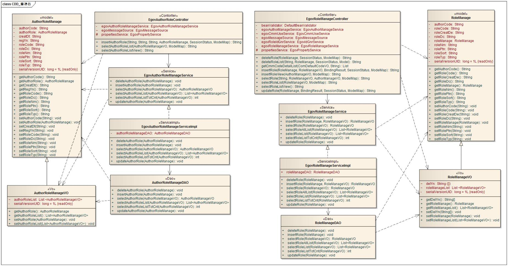
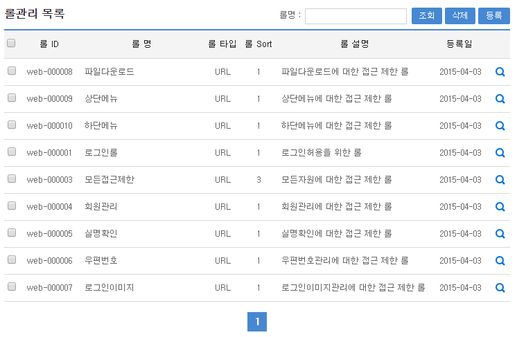
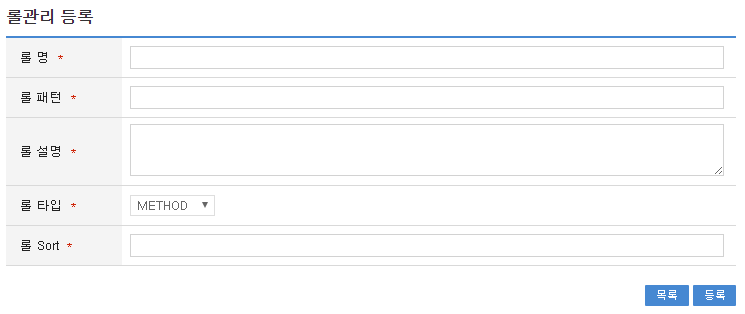
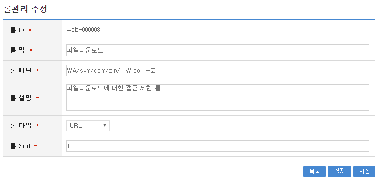
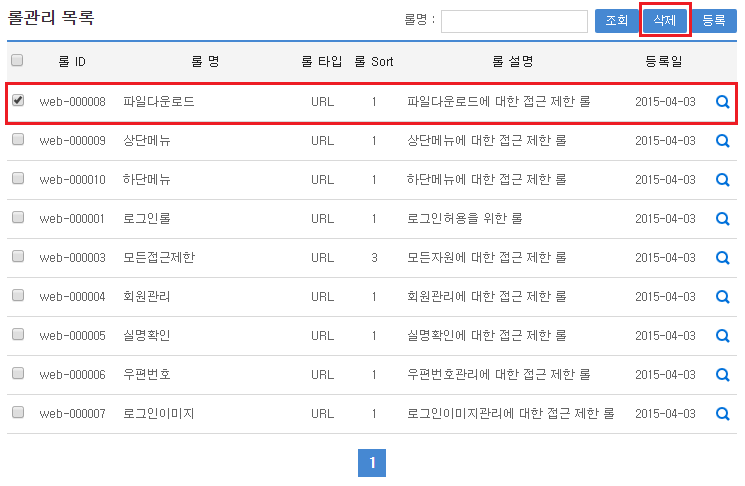

# 롤 관리

## 개요

 **롤관리**는 시스템을 사용하는 사용자 혹은 사용자 그룹별로 부여된 권한정보에 준하여 시스템에 접근할 수 있는 권한을 제어하는 기능을 제공하고, 그와 관련한 롤 정보를 관리할 수 있는 기능을 제공한다.

## 설명

 **롤관리**는 사용자 권한별 롤 정보를 관리하기 위한 목적으로 롤의 **등록, 수정, 삭제, 조회, 목록조회**의 기능을 수반한다.

```bash
  ① 롤등록 : 시스템 메뉴 및 기능화면에 따른 접근권한, 데이터 입력, 수정, 삭제의 접근 정보를 등록한다.
  ② 롤수정 : 시스템 메뉴 및 기능화면에 따른 접근권한, 데이터 입력, 수정, 삭제의 접근 정보를 수정한다.
  ③ 롤삭제 : 시스템 메뉴 및 기능화면에 따른 접근권한, 데이터 입력, 수정, 삭제의 접근 정보를 삭제한다.
  ④ 롤조회 : 시스템 메뉴 및 기능화면에 따른 접근권한, 데이터 입력, 수정, 삭제의 접근 정보를 조회한다.
  ⑤ 롤목록 : 시스템 메뉴 및 기능화면에 따른 접근권한, 데이터 입력, 수정, 삭제의 접근 정보 목록을 조회한다.
```

## 설명

### 패키지 참조 관계

 롤관리 패키지는 요소기술의 공통 패키지(cmm)와 권한관리 패키지에 대해서 직접적인 함수적 참조 관계를 가진다. 하지만, 컴포넌트 배포 시 오류 없이 실행되기 위하여 패키지 간의 참조관계에 따라 부서권한관리, 권한그룹관리, 그룹관리, 스프링시큐리티, 사용자통합인증, 요소기술(유틸리티) 시스템, 웹에디터, 메일연동 인터페이스 패키지와 함께 배포 파일을 구성한다.

- 패키지 간 참조 관계 : [보안 Package Dependency](../intro/package-reference.md/#보안)

### 관련소스

| 유형 | 대상소스명 | 비고 |
| --- | --- | --- |
| Controller | egovframework.com.sec.rmt.web.EgovRoleManageController.java | 롤 관리를 위한 컨트롤러 클래스 |
| Service | egovframework.com.sec.rmt.service.EgovRoleManageService.java | 롤 관리를 위한 서비스 인터페이스 |
| ServiceImpl | egovframework.com.sec.rmt.service.impl.EgovRoleManageServiceImpl.java | 롤 관리를 위한 서비스 구현 클래스 |
| VO | egovframework.com.sec.rmt.service.RoleManageVO.java | 롤 관리를 위한 VO 클래스 |
| DAO | egovframework.com.sec.rmt.service.impl.RoleManageDAO.java | 롤 관리를 위한 데이터처리 클래스 |
| Model | egovframework.com.sec.rmt.service.RoleManage.java | 롤 관리를 위한 Model 클래스 |
| JSP | /WEB-INF/jsp/egovframework/com/sec/rmt/EgovRoleManage.jsp | 롤 관리를 위한 jsp페이지 |
| JSP | /WEB-INF/jsp/egovframework/com/sec/rmt/EgovRoleInsert.jsp | 롤 등록를 위한 jsp페이지 |
| JSP | /WEB-INF/jsp/egovframework/com/sec/rmt/EgovRoleUpdate.jsp | 롤 수정를 위한 jsp페이지 |
| QUERY XML | resources/egovframework/mapper/com/sec/rmt/EgovRoleManage\_SQL\_mysql.xml | 롤 관리를 위한 MySQL용 QUERY XML |
| QUERY XML | resources/egovframework/mapper/com/sec/rmt/EgovRoleManage\_SQL\_cubrid.xml | 롤 관리를 위한 Cubrid용 QUERY XML |
| QUERY XML | resources/egovframework/mapper/com/sec/rmt/EgovRoleManage\_SQL\_oracle.xml | 롤 관리를 위한 Oracle용 QUERY XML |
| QUERY XML | resources/egovframework/mapper/com/sec/rmt/EgovRoleManage\_SQL\_tibero.xml | 롤 관리를 위한 Tibero용 QUERY XML |
| QUERY XML | resources/egovframework/mapper/com/sec/rmt/EgovRoleManage\_SQL\_altibase.xml | 롤 관리를 위한 Altibase용 QUERY XML |
| QUERY XML | resources/egovframework/mapper/com/sec/rmt/EgovRoleManage\_SQL\_maria.xml | 롤 관리를 위한 Maria용 QUERY XML |
| QUERY XML | resources/egovframework/mapper/com/sec/rmt/EgovRoleManage\_SQL\_postgres.xml | 롤 관리를 위한 Postgres용 QUERY XML |
| QUERY XML | resources/egovframework/mapper/com/sec/rmt/EgovRoleManage\_SQL\_goldilocks.xml | 롤 관리를 위한 Goldilocks용 QUERY XML |
| Message properties | resources/egovframework/message/com/sec/rmt/message\_ko.properties | 롤 관리 Message properties(한글) |
| Message properties | resources/egovframework/message/com/sec/rmt/message\_en.properties | 롤 관리 Message properties(영문) |
| Idgen XML | resources/egovframework/spring/com/idgn/context-idgn-Role.xml | 롤 관리 Id생성 Idgen XML |

### 클래스 다이어그램

 

### XML 설정 파일

 스프링 시큐리티를 사용하는 경우 (globals.properties 에서 Globals.Auth=security 로 설정한 경우)

| 파일명 | 위치 | 비고 |
| --- | --- | --- |
| context-security | src/main/resources/egovframework/spring/com/context-security.xml | 스프링 시큐리티와 관련된 설정이 적용된 파일 |

 세션방식을 사용하는 경우 (globals.properties 에서 Globals.Auth=session 으로 설정한 경우)

| 파일명 | 위치 | 비고 |
| --- | --- | --- |
| egov-com-access | src/main/webapp/WEB-INF/config/egovframework/springmvc/egov-com-access.xml | 세션방식의 접근제어가 적용된 파일 |

### ID Generation

#### ID Generation 관련 DDL 및 DML

- ID Generation Service를 활용하기 위해서 Sequence 저장테이블인 COMTECOPSEQ에 **ROLE\_ID** 항목을 추가한다.

```sql
  CREATE TABLE COMTECOPSEQ
  (
	TABLE_NAME            VARCHAR(20) NOT NULL,
	NEXT_ID               NUMERIC(30) NULL,
	 PRIMARY KEY (TABLE_NAME)
  );
 
  INSERT INTO COMTECOPSEQ VALUES('ROLE_ID','1');
 
```

#### ID Generation 환경설정(context-idgn-Role.xml)

```xml
    <bean name="egovRoleIdGnrService" class="egovframework.rte.fdl.idgnr.impl.EgovTableIdGnrServiceImpl" destroy-method="destroy">
        <property name="dataSource" ref="egov.dataSource" />
        <property name="strategy"   ref="roleIdStrategy" />
        <property name="blockSize"  value="10"/>
        <property name="table"      value="COMTECOPSEQ"/>
        <property name="tableName"  value="ROLE_ID"/>
    </bean>
    <bean name="roleIdStrategy" class="egovframework.rte.fdl.idgnr.impl.strategy.EgovIdGnrStrategyImpl">
        <property name="prefix"   value="" />
        <property name="cipers"   value="6" />
        <property name="fillChar" value="0" />
    </bean>
```

### 테이블

| 테이블명 | 테이블명(영문) | 비고 |
| --- | --- | --- |
| 롤정보 | COMTNROLEINFO | 권한에 종속되는 보안요소로써 사이트 접근 권한 이하 등록 롤, 수정 롤, 삭제 롤을 부여할 수 있다. |

### 관련코드

 롤관리의 속성 중 롤타입에 대한 공통코드를 정의한다.

| 코드분류 | 코드분류명 | 코드ID | 코드명 |
| --- | --- | --- | --- |
| COM029 | 롤유형코드 | url | URL |
| COM029 | 롤유형코드 | method | METHOD |
| COM029 | 롤유형코드 | pointcut | POINTCUT |

## 관련기능

 롤관리기능은 크게 **롤 목록조회**, **롤 등록**, **롤 수정**, **롤 삭제** 기능으로 구성되어 있다.

### 롤목록 조회

#### 비즈니스 규칙

 롤 목록은 페이지 당 10건씩 조회되며, 페이징은 10페이지씩 이루어진다. 검색조건은 롤명 대해서 수행된다.

#### 관련코드

 N/A

#### 관련화면 및 수행메뉴얼

| Action | URL | Controller method | SQL Namespace | SQL QueryID |
| --- | --- | --- | --- | --- |
| 조회 | /sec/rmt/EgovRoleList.do | selectRoleList | “roleManageDAO” | “selectRoleList” |
|  |  |  | “roleManageDAO” | “selectAuthorListTotCnt” |

 

 조회조건 : 조회조건으로 롤 명을 입력 후 조회한다.  
조회 : 등록된 롤 정보 목록을 조회한다.  
등록 : 롤 정보를 등록할 경우 등록버튼을 선택하면 롤을 등록할 수 있는 화면으로 이동한다.  

### 롤 등록

#### 비즈니스 규칙

 롤 정보를 **등록**하기 위해서 롤 등록 화면의 각 입력항목에 롤 정보를 입력한 뒤 등록버튼을 선택한다.

#### 관련코드

 N/A

#### 관련화면 및 수행메뉴얼

| Action | URL | Controller method | SQL Namespace | SQL QueryID |
| --- | --- | --- | --- | --- |
| 등록화면 | /sec/rmt/EgovRoleInsertView.do | insertRoleView |  |  |
| 등록 | /sec/rmt/EgovRoleInsert.do | insertRole | “roleManageDAO” | “insertRole” |

 

 목록 : 롤 목록 화면으로 이동한다.  
등록 : 롤 정보를 신규로 등록할 경우 각 속성정보를 입력 후 등록버튼을 선택한다.  

### 롤 수정

#### 비즈니스 규칙

 롤 수정 화면은 상세조회 화면과 동일하고, 기 등록된 롤 정보를 수정한 뒤 저장버튼을 선택한다.

#### 관련코드

 N/A

#### 관련화면 및 수행메뉴얼

| Action | URL | Controller method | SQL Namespace | SQL QueryID |
| --- | --- | --- | --- | --- |
| 수정화면 | /sec/rmt/EgovRole.do | selectRole | “roleManageDAO” | “selectRoleList” |
| 수정 | /sec/rmt/EgovRoleUpdate.do | updateRole | “roleManageDAO” | “updateRole” |
| 삭제 | /sec/rmt/EgovRoleDelete.do | deleteRole | “roleManageDAO” | “deleteRole” |

 

 목록 : 롤 목록 화면으로 이동한다.  
삭제 : 삭제버튼을 선택하여 롤 정보를 삭제한다.  
저장 : 롤 정보를 수정할 경우 각 속성정보를 변경 후 저장버튼을 선택한다.  

### 롤 삭제

#### 비즈니스 규칙

 롤 정보를 **삭제**하기 위해서 롤 목록 조회 화면의 삭제대상 롤 정보를 선택한 뒤 삭제버튼을 선택한다.

#### 관련코드

 N/A

#### 관련화면 및 수행메뉴얼

| Action | URL | Controller method | SQL Namespace | SQL QueryID |
| --- | --- | --- | --- | --- |
| 삭제 | /sec/rmt/EgovRoleListDelete.do | deleteRoleList | “roleManageDAO” | “deleteRole” |

 

 선택 : 삭제하기 위한 롤 정보를 선택한다. 멀티선택이 가능하다.  
삭제 : 삭제버튼을 선택하여 롤 정보를 삭제한다.