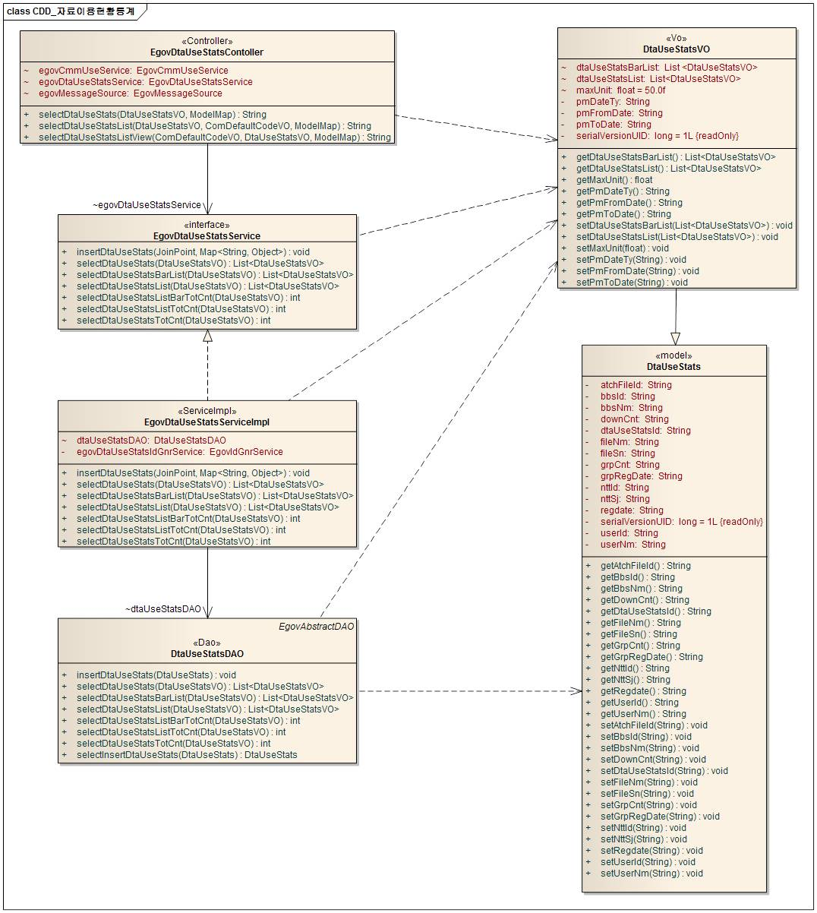
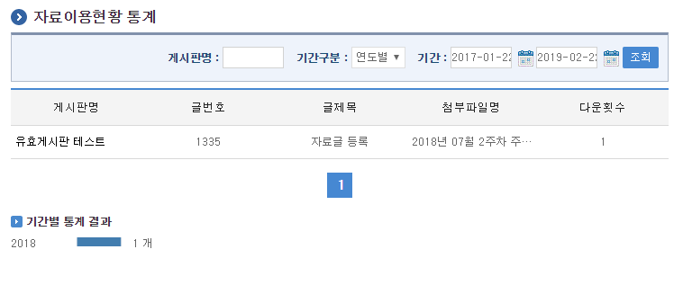
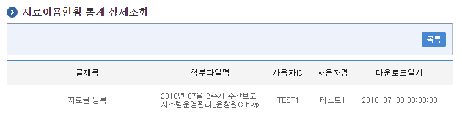

# 자료이용현황통계

## 개요

 자료이용현황통계는 각종 게시판 다운로드 현황에 대한 통계자료를 특정 조건에 맞게 제공한다.

## 설명

 자료이용현황통계는 각종 게시판에서 다운받은 첨부파일에 대해 게시판별, 기간구분별, 기간별 통계자료를 제공한다.

 ① 자료이용현황목록조회 : 등록된 자료이용현황정보를 최근 등록 순서대로 조회하고, 그 결과 목록을 화면에 반영한다.  
② 자료이용현황상세조회 : 자료이용현황 목록을 조회한 뒤 특정 목록을 선택하면, 상세현황이 조회된다.  
③ 자료이용현황등록 : 게시글에 등록된 자료를 다운로드 받을 경우 자료이용현황이 생성된다.  

### 패키지 참조 관계

 자료이용현황통계 패키지는 요소기술의 공통(cmm) 패키지와 포맷/계산/변환(fcc) 패키지에 대해서 직접적인 함수적 참조 관계를 가진다. 하지만, 컴포넌트 배포 시 오류 없이 실행되기 위하여 패키지 간의 참조관계에 따라 달력 패키지와 함께 배포 파일을 구성한다.

- 패키지 간 참조 관계 : [통계/리포팅 Package Dependency](../intro/package-reference.md#통계리포팅)

### 관련소스

| 유형 | 대상소스명 | 비고 |
| --- | --- | --- |
| Controller | egovframework.com.sts.dst.web.EgovDtaUseStatsContoller.java | 자료이용현황통계를 위한 컨트롤러 클래스 |
| Service | egovframework.com.sts.dst.service.EgovDtaUseStatsService.java | 자료이용현황통계를 위한 서비스 인터페이스 |
| ServiceImpl | egovframework.com.sts.dst.service.impl.EgovDtaUseStatsServiceImpl.java | 자료이용현황통계를 위한 서비스 구현 클래스 |
| Model | egovframework.com.sts.dst.service.DtaUseStats.java | 자료이용현황통계를 위한 Model 클래스 |
| VO | egovframework.com.sts.dst.service.DtaUseStatsVO.java | 자료이용현황통계를 위한 VO 클래스 |
| DAO | egovframework.com.sts.dst.service.impl.DtaUseStatsDAO.java | 자료이용현황통계를 위한 데이터처리 클래스 |
| JSP | /WEB-INF/jsp/egovframework/com/sts/dst/EgovDtaUseStatsList.jsp | 자료이용현황통계 목록조회를 위한 jsp페이지 |
| JSP | /WEB-INF/jsp/egovframework/com/sts/dst/EgovDtaUseStatsDetail.jsp | 자료이용현황통계 상세조회를 위한 jsp페이지 |
| Query XML | resources/egovframework/mapper/com/sts/dst/EgovDtaUseStats\_SQL\_mysql.xml | 자료이용현황통계 MySQL용 Query XML |
| Query XML | resources/egovframework/mapper/com/sts/dst/EgovDtaUseStats\_SQL\_cubrid.xml | 자료이용현황통계 Cubrid용 Query XML |
| Query XML | resources/egovframework/mapper/com/sts/dst/EgovDtaUseStats\_SQL\_oracle.xml | 자료이용현황통계 Oracle용 Query XML |
| Query XML | resources/egovframework/mapper/com/sts/dst/EgovDtaUseStats\_SQL\_tibero.xml | 자료이용현황통계 Tibero용 Query XML |
| Query XML | resources/egovframework/mapper/com/sts/dst/EgovDtaUseStats\_SQL\_altibase.xml | 자료이용현황통계 Altibase용 Query XML |
| Query XML | resources/egovframework/mapper/com/sts/dst/EgovDtaUseStats\_SQL\_maria.xml | 자료이용현황통계 Maria용 Query XML |
| Query XML | resources/egovframework/mapper/com/sts/dst/EgovDtaUseStats\_SQL\_postgres.xml | 자료이용현황통계 PostgreSQL용 Query XML |
| XML | resources/egovframework/spring/com/context-dtauseaop.xml | 자료이용현황통계 통계정보를 등록하기 위한 AOP Config XML |
| Message properties | resources/egovframework/message/com/sts/dst/message\_ko.properties | 자료이용현황통계 Message properties(한글) |
| Message properties | resources/egovframework/message/com/sts/dst/message\_en.properties | 자료이용현황통계 Message properties(영문) |
| Idgen XML | resources/egovframework/spring/com/idgn/context-idgn-DtaUseStats.xml | 자료이용현황통계 Id생성 Idgen XML |

### 클래스 다이어그램

 

### ID Generation

#### ID Generation 관련 DDL 및 DML

```sql
CREATE TABLE COMTECOPSEQ ( table_name varchar(16) NOT NULL,
		   next_id DECIMAL(30) NOT NULL,
		   PRIMARY KEY (table_name));

INSERT INTO COMTECOPSEQ VALUES('DUS_ID','0');
```

#### ID Generation 환경설정(context-idgn-DtaUseStats.xml)

```xml
<bean name="egovDtaUseStatsIdGnrService"
    class="egovframework.rte.fdl.idgnr.impl.EgovTableIdGnrService"
    destroy-method="destroy">
    <property name="dataSource" ref="egov.dataSource" />
    <property name="strategy"   ref="dtaUseStatsIdStrategy" />
    <property name="blockSize"  value="1"/>
    <property name="table"      value="COMTECOPSEQ"/>
    <property name="tableName"  value="DUS_ID"/>
</bean>

<bean name="dtaUseStatsIdStrategy"
    class="egovframework.rte.fdl.idgnr.impl.strategy.EgovIdGnrStrategyImpl">
    <property name="prefix" value="DUS_" />
    <property name="cipers" value="16" />
    <property name="fillChar" value="0" />
</bean>
```

### 관련테이블

| 테이블명 | 테이블명(영문) | 비고 |
| --- | --- | --- |
| 자료이용현황통계 | COMTNDTAUSESTATS | 각종 게시판 다운로드 현황에 대한 통계자료를 특정 조건에 맞게 제공하기 위한 속성을 정의한다. |

## 관련기능

 자료이용현황통계는 크게 자료이용현황통계 목록조회, 자료이용현황통계 상세정보, 자료이용현황통계 등록 기능으로 분류된다.

### 자료이용현황통계 목록조회

#### 비즈니스 규칙

 자료이용현황통계 목록은 페이지 당 5건씩 조회되며 페이징은 10페이지씩 이루어진다.  
검색조건은 게시판명, 기간구분, 기간에 대해서 수행된다.

#### 관련코드

 N/A

#### 관련화면 및 수행매뉴얼

| Action | URL | Controller method | QueryID |
| --- | --- | --- | --- |
| 대상목록 조회 | /sts/dst/selectDtaUseStatsList.do | selectDtaUseStatsList | "dtaUseStatsDAO.selectDtaUseStatsList", "dtaUseStatsDAO.selectDtaUseStatsListTotCnt" |
| 전체카운트 조회 | /sts/dst/selectDtaUseStatsList.do | selectDtaUseStatsList | "dtaUseStatsDAO.selectDtaUseStatsListBarTotCnt" |
| 그래프 조회 | /sts/dst/selectDtaUseStatsList.do | selectDtaUseStatsList | "dtaUseStatsDAO.selectDtaUseStatsBarList" |

 

 조회 : 기 생성된 자료이용현황통계 목록을 조회한다.  

### 자료이용현황통계 상세정보

#### 비즈니스 규칙

 자료이용현황통계 정보에 해당하는 보고서 정보를 조회한다.

#### 관련코드

 N/A

#### 관련화면 및 수행매뉴얼

| Action | URL | Controller method | QueryID |
| --- | --- | --- | --- |
| 상세조회 | /sts/dst/getDtaUseStats.do | selectDtaUseStats | "dtaUseStatsDAO.selectDtaUseStats" |

 

 목록 : 자료이용현황통계 목록조회 화면으로 이동한다.  

### 자료이용현황통계 등록

#### 비즈니스 규칙

 게시판의 첨부파일이 다운로드 될 때 실행되는 메소드 정보를 가로채어 해당 정보를 조합하여 자료이용현황통계를 등록한다.

#### 관련코드

 N/A

#### 관련화면 및 수행매뉴얼

| Action | URL | Service method | QueryID |
| --- | --- | --- | --- |
| 등록 이벤트 | execution(public * egovframework.com.cmm.web.EgovFileDownloadController.cvplFileDownload(..)) and args(commandMap, ..) | insertDtaUseStats | "dtaUseStatsDAO.insertDtaUseStats" |

```xml
<!--  자료이용현황 통계자료 생성 -->
<aop:config>
    <aop:aspect id="dtaUseStatsManageAspect" ref="egovDtaUseStatsService">
        <aop:after
             method="insertDtaUseStats"
             pointcut="execution(public * egovframework.com.cmm.web.EgovFileDownloadController.cvplFileDownload(..)) and args(commandMap, ..)"
              />
    </aop:aspect>
</aop:config>
```
