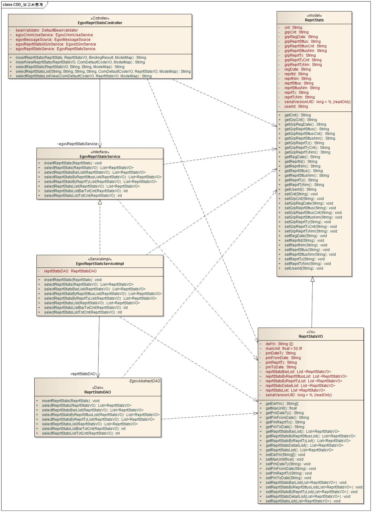
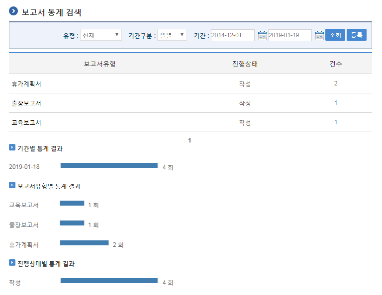
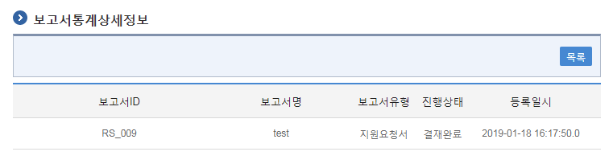
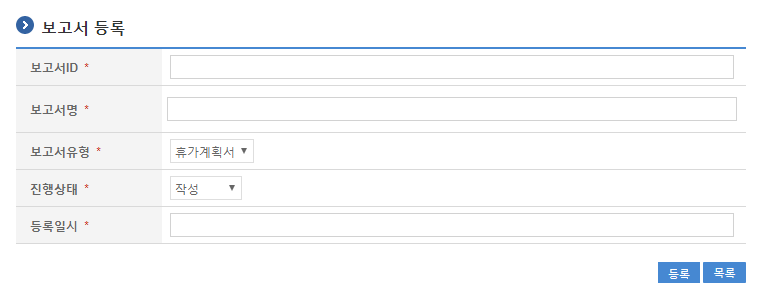

# 보고서통계

## 개요

 보고서통계는 각종 보고서현황에 대한 통계자료를 특정 조건에 맞게 제공한다.

## 설명

 보고서통계는 생성된 보고서에 대한 기간별, 유형별, 진행상태별 통계자료를 제공한다.

 ① 보고서현황목록조회 : 등록된 보고서정보를 최근 등록 순서대로 조회하고, 그 결과 목록을 화면에 반영한다.  
② 보고서현황상세조회 : 보고서목록을 조회한 뒤 특정 보고서를 선택하면, 해당 보고서의 상세현황이 조회된다.  
③ 보고서현황통계등록 : 등록된 보고서를 대상으로 통계 정보를 생성한다.  

### 패키지 참조 관계

 보고서통계 패키지는 요소기술의 공통(cmm) 패키지와 포맷/계산/변환(fcc) 패키지에 대해서 직접적인 함수적 참조 관계를 가진다. 하지만, 컴포넌트 배포 시 오류 없이 실행되기 위하여 패키지 간의 참조관계에 따라 달력 패키지와 함께 배포 파일을 구성한다.

- 패키지 간 참조 관계 : [통계/리포팅 Package Dependency](../intro/package-reference.md#통계리포팅)

### 관련소스

| 유형 | 대상소스명 | 비고 |
| --- | --- | --- |
| Controller | egovframework.com.sts.rst.web.EgovReprtStatsController.java | 보고서통계를 위한 컨트롤러 클래스 |
| Service | egovframework.com.sts.rst.service.EgovReprtStatsService.java | 보고서통계를 위한 서비스 인터페이스 |
| ServiceImpl | egovframework.com.sts.rst.service.impl.EgovReprtStatsServiceImpl.java | 보고서통계를 위한 서비스 구현 클래스 |
| Model | egovframework.com.sts.rst.service.ReprtStats.java | 보고서통계를 위한 Model 클래스 |
| VO | egovframework.com.sts.rst.service.ReprtStatsVO.java | 보고서통계를 위한 VO 클래스 |
| DAO | egovframework.com.sts.rst.service.impl.ReprtStatsDAO.java | 보고서통계를 위한 데이터처리 클래스 |
| JSP | /WEB-INF/jsp/egovframework/com/sts/rst/EgovReprtStatsList.jsp | 보고서통계 목록조회를 위한 jsp페이지 |
| JSP | /WEB-INF/jsp/egovframework/com/sts/rst/EgovReprtStatsDetail.jsp | 보고서통계 상세조회를 위한 jsp페이지 |
| JSP | /WEB-INF/jsp/egovframework/com/sts/rst/EgovReprtStatsRegis.jsp | 보고서통계 등록을 위한 jsp페이지 |
| Query XML | resources/egovframework/mapper/com/sts/rst/EgovReprtStats\_SQL\_mysql.xml | 보고서통계를 위한 MySQL용 Query XML |
| Query XML | resources/egovframework/mapper/com/sts/rst/EgovReprtStats\_SQL\_cubrid.xml | 보고서통계를 위한 Cubrid용 Query XML |
| Query XML | resources/egovframework/mapper/com/sts/rst/EgovReprtStats\_SQL\_oracle.xml | 보고서통계를 위한 Oracle용 Query XML |
| Query XML | resources/egovframework/mapper/com/sts/rst/EgovReprtStats\_SQL\_tibero.xml | 보고서통계를 위한 Tibero용 Query XML |
| Query XML | resources/egovframework/mapper/com/sts/rst/EgovReprtStats\_SQL\_altibase.xml | 보고서통계를 위한 Altibase용 Query XML |
| Query XML | resources/egovframework/mapper/com/sts/rst/EgovReprtStats\_SQL\_maria.xml | 보고서통계를 위한 Maria용 Query XML |
| Query XML | resources/egovframework/mapper/com/sts/rst/EgovReprtStats\_SQL\_postgres.xml | 보고서통계를 위한 PostgreSQL용 Query XML |
| Message properties | resources/egovframework/message/com/sts/rst/message\_ko.properties | 보고서통계 Message properties(한글) |
| Message properties | resources/egovframework/message/com/sts/rst/message\_en.properties | 보고서통계 Message properties(영문) |
| Idgen XML | resources/egovframework/spring/com/idgn/context-idgn-ReprtStats.xml | 보고서통계 Id생성 Idgen XML |

### 클래스 다이어그램

 

### ID Generation

#### ID Generation 관련 DDL 및 DML

```sql
CREATE TABLE COMTECOPSEQ ( table_name varchar(16) NOT NULL,
		   next_id DECIMAL(30) NOT NULL,
		   PRIMARY KEY (table_name));

INSERT INTO COMTECOPSEQ VALUES('RS_ID','0');
```

#### ID Generation 환경설정(context-idgn-ReprtStats.xml)

```xml
<bean name="egovReprtStatsIdGnrService"
    class="egovframework.rte.fdl.idgnr.impl.EgovTableIdGnrService"
    destroy-method="destroy">
    <property name="dataSource" ref="egov.dataSource" />
    <property name="strategy"   ref="reprtStatsIdStrategy" />
    <property name="blockSize"  value="1"/>
    <property name="table"      value="COMTECOPSEQ"/>
    <property name="tableName"  value="RS_ID"/>
</bean>

<bean name="reprtStatsIdStrategy"
    class="egovframework.rte.fdl.idgnr.impl.strategy.EgovIdGnrStrategyImpl">
    <property name="prefix" value="RS_" />
    <property name="cipers" value="3" />
    <property name="fillChar" value="0" />
</bean>
```

### 관련테이블

| 테이블명 | 테이블명(영문) | 비고 |
| --- | --- | --- |
| 보고서통계 | COMTNREPRTSTATS | 각종 보고서현황에 대한 통계자료를 특정 조건에 맞게 제공하기 위한 속성을 정의한다. |

## 관련기능

 보고서통계기능은 크게 보고서통계 목록조회, 보고서통계 상세정보, 보고서 등록 기능으로 분류된다.

### 보고서통계 목록조회

#### 비즈니스 규칙

 보고서통계 목록은 페이지당 5건씩 조회되며 페이징은 10페이지씩 이루어진다.  
검색조건은 유형, 기간구분, 기간에 대해서 수행된다.

#### 관련코드

 N/A

#### 관련화면 및 수행매뉴얼

| Action | URL | Controller method | QueryID |
| --- | --- | --- | --- |
| 조회 | /sts/rst/selectReprtStatsList.do | selectReprtStatsList | "reprtStatsDAO.selectReprtStatsList", "reprtStatsDAO.selectReprtStatsListTotCnt" |

 

 조회 : 기 생성된 보고서통계 목록을 조회한다.  
등록 : 신규 보고서통계를 등록하기 위해서는 등록버튼을 선택하여 보고서 등록 화면으로 이동한다.  

### 보고서통계 상세정보

#### 비즈니스 규칙

 보고서통계 정보에 해당하는 보고서 정보를 조회한다.

#### 관련코드

 N/A

#### 관련화면 및 수행매뉴얼

| Action | URL | Controller method | QueryID |
| --- | --- | --- | --- |
| 조회 | /sts/rst/getReprtStats.do | selectReprtStats | "reprtStatsDAO.selectReprtStats" |

 

 목록 : 보고서통계 목록조회 화면으로 이동한다.  

### 보고서 등록

#### 비즈니스 규칙

 보고서통계 속성정보를 입력한 뒤 저장한다.

#### 관련코드

 N/A

#### 관련화면 및 수행매뉴얼

| Action | URL | Controller method | QueryID |
| --- | --- | --- | --- |
| 등록 | /sts/rst/addReprtStats.do | insertReprtStats | "reprtStatsDAO.insertReprtStats" |

 

 등록 : 보고서통계 속성을 입력한 뒤 상단의 등록 버튼을 통해서 보고서통계정보를 등록한다.  
목록 : 보고서통계 목록조회 화면으로 이동한다.  
