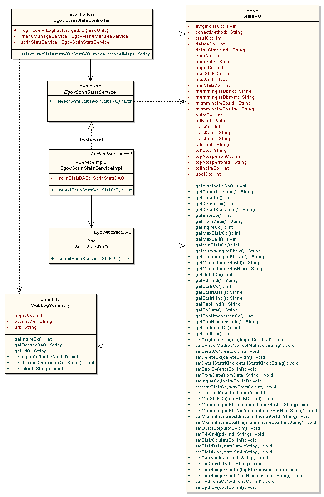
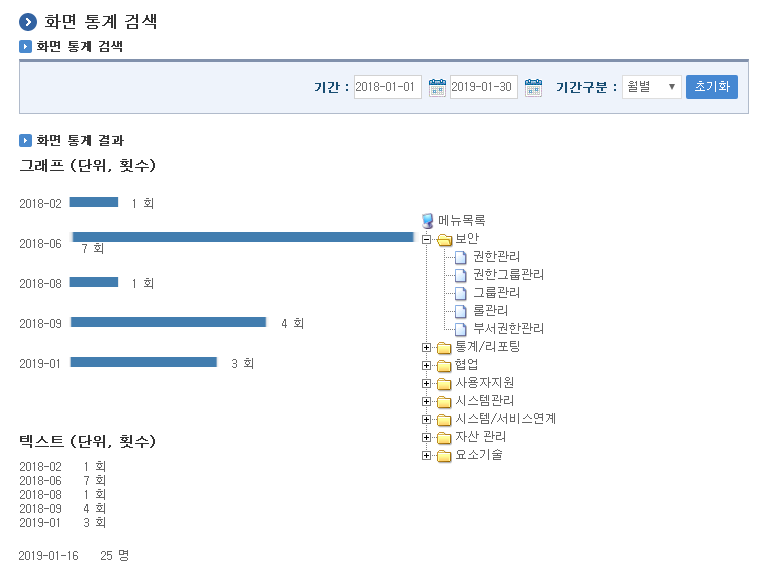

# 화면 통계

## 개요

 화면통계 기능은 각종 화면현황에 대한 통계자료를 메뉴관리를 통하여 현재 서비스되고 있는 메뉴별에 따라 기간별(연도별, 월별, 일별)로 그래프와 텍스트 형태 두가지 방식으로 제공한다.

- 기능흐름

| 기능명 | 기능 흐름 |
| --- | --- |
| 웹로그통계 집계 | *****웹로그정보 요약 배치수행*****  → *****웹로그요약정보 집계*****  |
| 화면통계 검색 | 검색조건 입력 → 조건별 화면 통계 검색 |

## 설명

 화면 통계 수치를 특정 검색 조건에 따라 정보를 조회하는 기능이다.

### 패키지 참조 관계

 화면통계 패키지는 리포팅 공통(sts.com) 패키지와 메뉴관리 패키지에 대해서 직접적인 함수적 참조 관계를 가진다. 하지만, 컴포넌트 배포 시 오류 없이 실행되기 위하여 패키지 간의 참조관계에 따라 공통(cmm), 프로그램관리, 포맷/계산/변환, 시스템, 메일연동 인터페이스, 웹에디터, 메뉴생성관리, 달력 패키지와 함께 배포 파일을 구성한다.

- 패키지 간 참조 관계 : [통계/리포팅 Package Dependency](../intro/package-reference.md/#통계리포팅)

### 관련소스

| 유형 | 대상소스명 | 비고 |
| --- | --- | --- |
| Controller | egovframework.com.sts.sst.web.EgovScrinStatsController.java | 화면 통계를 위한 컨트롤러 클래스 |
| Service | egovframework.com.sts.sst.service.EgovScrinStatsService.java | 화면 통계를 위한 서비스 인터페이스 |
| ServiceImpl | egovframework.com.sts.sst.service.impl.EgovScrinStatsServiceImpl.java | 화면 통계를 위한 서비스 구현 클래스 |
| VO | egovframework.com.sts.com.StatsVO.java | 통계를 위한 VO 클래스 |
| DAO | egovframework.com.sts.sst.service.impl.ScrinStatsDAO.java | 화면 통계를 위한 데이터 처리 클래스 |
| Model | egovframework.com.sts.sst.service.WebLogSummary.java | 화면 통계를 위한 모델 클래스 |
| Scheduling | egovframework.com.sym.log.wlg.service.EgovWebLogScheduling.java | 웹 로그 집계를 위한 스케줄 클래스 |
| JSP | WEB\_INF/jsp/egovframework/com/sts/sst/EgovScrinStats.jsp | 화면 통계 페이지 |
| Query XML | resources/egovframework/mapper/com/sts/sst/EgovScrinStats\_SQL\_mysql.xml | 화면 통계를 위한 MySQL용 Query XML |
| Query XML | resources/egovframework/mapper/com/sts/sst/EgovScrinStats\_SQL\_cubrid.xml | 화면 통계를 위한 Cubrid용 Query XML |
| Query XML | resources/egovframework/mapper/com/sts/sst/EgovScrinStats\_SQL\_oracle.xml | 화면 통계를 위한 Oracle용 Query XML |
| Query XML | resources/egovframework/mapper/com/sts/sst/EgovScrinStats\_SQL\_tibero.xml | 화면 통계를 위한 Tibero용 Query XML |
| Query XML | resources/egovframework/mapper/com/sts/sst/EgovScrinStats\_SQL\_altibase.xml | 화면 통계를 위한 Altibase용 Query XML |
| Query XML | resources/egovframework/mapper/com/sts/sst/EgovScrinStats\_SQL\_maria.xml | 화면 통계를 위한 Maria용 Query XML |
| Query XML | resources/egovframework/mapper/com/sts/sst/EgovScrinStats\_SQL\_postgres.xml | 화면 통계를 위한 PostgreSQL용 Query XML |
| Message properties | resources/egovframework/message/com/sts/sst/message\_ko.properties | 화면 통계 Message properties(한글) |
| Message properties | resources/egovframework/message/com/sts/sst/message\_en.properties | 화면 통계 Message properties(영문) |

### 클래스 다이어그램

 

### 관련테이블

| 테이블명 | 테이블명(영문) | 비고 |
| --- | --- | --- |
| 웹로그요약 | COMTSWEBLOGSUMMARY | 웹로그 요약 정보를 관리한다. |

### 환경설정

 하루에 한번씩 웹로그 정보를 모두 조회하여 요약하는 작업이 배치형태로 구성되어야 한다.  
본 기능은 전자정부 표준프레임워크 실행환경의 **[scheduling](/egovframe-runtime/foundation-layer/scheduling.md)** 기능을 활용하여 구성되어있다.  

- 작업 클래스 생성(src/main/java/egovframework/com/sym/log/wlg/service/EgovWebLogScheduling.java)

```java
@Service("egovWebLogScheduling")
public class EgovWebLogScheduling {

	@Resource(name="EgovWebLogService")
	private EgovWebLogService webLogService;

	/**
	 * 웹 로그정보를 요약한다.
	 * 전날의 로그를 요약하여 입력하고, 일주일전의 로그를 삭제한다.
	 *
	 * @param
	 * @return
	 * @throws Exception
	 */
	public void webLogSummary() throws Exception {
		webLogService.logInsertWebLogSummary();
	}

}
```

- 작업 수행 Bean 설정(src/main/resources/egovframework/spring/com/scheduling/context-scheduling-sym-log-wlg.xml)

```xml
<bean id="webLogging" class="org.springframework.scheduling.quartz.MethodInvokingJobDetailFactoryBean">
    <property name="targetObject" ref="egovWebLogScheduling" />
    <property name="targetMethod" value="webLogSummary" />
    <property name="concurrent" value="false" />
</bean>
```

- 트리거 Bean 설정(src/main/resources/egovframework/spring/com/scheduling/context-scheduling-sym-log-wlg.xml)

```xml
<bean id="webLogTrigger" class="org.springframework.scheduling.quartz.SimpleTriggerBean">
    <property name="jobDetail" ref="webLogging" />
    <property name="startDelay" value="60000" />
    <property name="repeatInterval" value="3600000" />
</bean>
```

- 스케줄러 Bean 설정(src/main/resources/egovframework/spring/com/scheduling/context-scheduling-sym-log-wlg.xml)

```xml
<bean id="logSummaryScheduler" class="org.springframework.scheduling.quartz.SchedulerFactoryBean">
    <property name="triggers">
        <list>
            <ref bean="webLogTrigger" />
        </list>
    </property>
</bean>
```

## 관련기능

### 화면 통계

#### 비즈니스 규칙

 하루 단위로 집계되는 웹로그 요약 정보를 통해 메뉴별 화면 통계 자료를 조회한다.

#### 관련코드

 N/A

#### 관련화면 및 수행매뉴얼

| Action | URL | Controller method | QueryID |
| --- | --- | --- | --- |
| 화면 통계검색 | /sts/sst/selectScrinStats.do | selectUserStats | "ScrinStatsDAO.selectScrinStats" |

 

 기간: 통계 검색을 할 시작-종료 기간을 입력한다.  
기간구분: 연도별, 월별, 일별 기간별 통계 형태를 선택한다.  
메뉴선택: 횟수를 조회할 메뉴를 선택한다.  
초기화: 검색 조건을 초기화한다.  

## 참고자료

- 실행환경 참조 : [scheduling](/egovframe-runtime/foundation-layer/scheduling.md)
