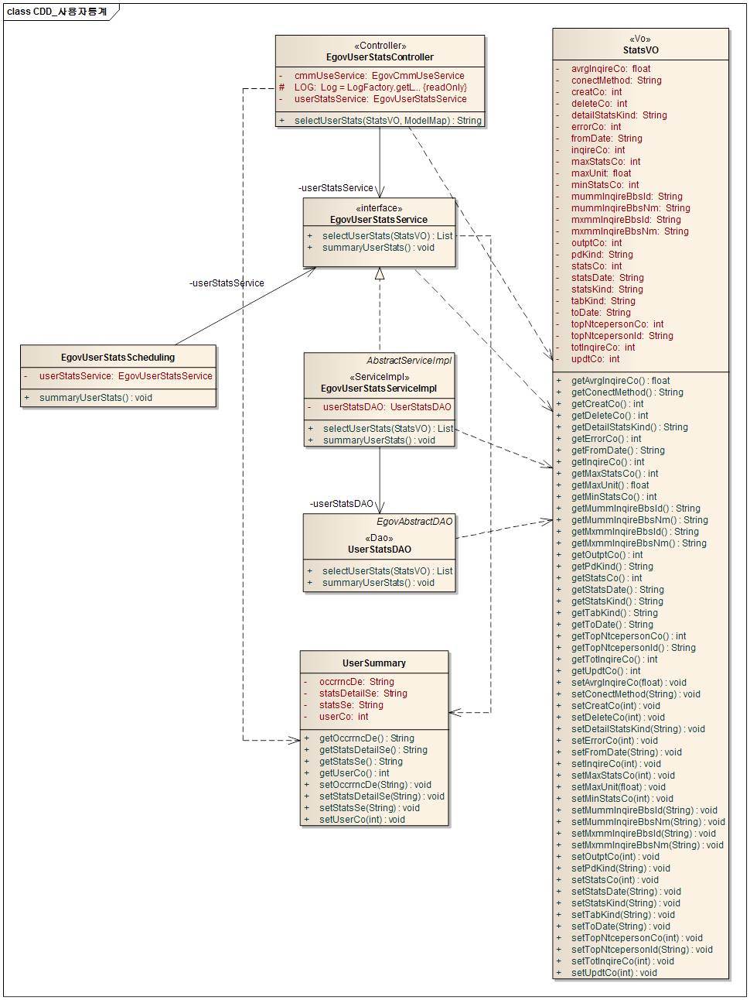
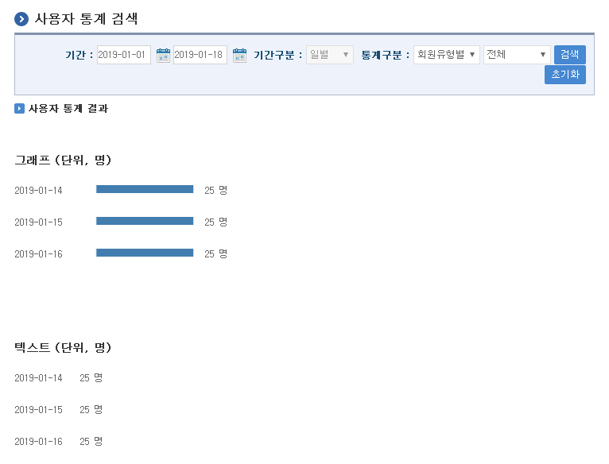

# 사용자 통계

## 개요

 사용자통계 기능은 각종 사용자 현황에 대한 통계자료를 회원유형, 회원상태, 성별에 따라 기간별(연도별, 월별, 일별)로 그래프와 텍스트 형태 두가지 방식으로 제공한다.

- 기능흐름

| 기능명 | 기능 흐름 |
| --- | --- |
| 사용자통계 집계 | *****사용자정보 요약 배치수행*****  → *****사용자요약정보 집계*****  |
| 사용자통계 검색 | 검색조건 입력 → 조건별 사용자 통계 검색 |

## 설명

 사용자 통계 수치를 특정 검색 조건에 따라 정보를 조회하는 기능이다.

### 패키지 참조 관계

 사용자통계 패키지는 요소기술의 공통(cmm) 패키지와 리포팅 공통(sts.com) 패키지에 대해서 직접적인 함수적 참조 관계를 가진다. 하지만, 컴포넌트 배포 시 오류 없이 실행되기 위하여 패키지 간의 참조관계에 따라 달력 패키지와 함께 배포 파일을 구성한다.

- 패키지 간 참조 관계 : [통계/리포팅 Package Dependency](https://www.egovframe.go.kr/wiki/doku.php?id=egovframework:com:v2:init_pkg_dependency#통계_리포팅)

### 관련소스

| 유형 | 대상소스명 | 비고 |
| --- | --- | --- |
| Controller | egovframework.com.sts.ust.web.EgovUserStatsController.java | 사용자 통계를 위한 컨트롤러 클래스 |
| Service | egovframework.com.sts.ust.service.EgovUserStatsService.java | 사용자 통계를 위한 서비스 인터페이스 |
| ServiceImpl | egovframework.com.sts.ust.service.impl.EgovUserStatsServiceImpl.java | 사용자 통계를 위한 서비스 구현 클래스 |
| Model | egovframework.com.sts.ust.service.UserSummary.java | 사용자 통계를 위한 모델 클래스 |
| DAO | egovframework.com.sts.ust.service.impl.UserStatsDAO.java | 사용자 통계를 위한 데이터 처리 클래스 |
| Scheduling | egovframework.com.sts.ust.service.EgovUserStatsScheduling.java | 사용자 통계 집계를 위한 스케줄 클래스 |
| JSP | WEB\_INF/jsp/egovframework/com/sts/ust/EgovUserStats.jsp | 사용자 통계 페이지 |
| Query XML | resources/egovframework/mapper/com/sts/ust/EgovUserStats\_SQL\_mysql.xml | 사용자 통계를 위한 MySQL용 Query XML |
| Query XML | resources/egovframework/mapper/com/sts/ust/EgovUserStats\_SQL\_cubrid.xml | 사용자 통계를 위한 Cubrid용 Query XML |
| Query XML | resources/egovframework/mapper/com/sts/ust/EgovUserStats\_SQL\_oracle.xml | 사용자 통계를 위한 Oracle용 Query XML |
| Query XML | resources/egovframework/mapper/com/sts/ust/EgovUserStats\_SQL\_tibero.xml | 사용자 통계를 위한 Tibero용 Query XML |
| Query XML | resources/egovframework/mapper/com/sts/ust/EgovUserStats\_SQL\_altibase.xml | 사용자 통계를 위한 Altibase용 Query XML |
| Query XML | resources/egovframework/mapper/com/sts/ust/EgovUserStats\_SQL\_maria.xml | 사용자 통계를 위한 Maria용 Query XML |
| Query XML | resources/egovframework/mapper/com/sts/ust/EgovUserStats\_SQL\_postgres.xml | 사용자 통계를 위한 PostgresSQL용 Query XML |
| Query XML | resources/egovframework/mapper/com/sts/ust/EgovUserStats\_SQL\_goldilocks.xml | 사용자 통계를 위한 Goldilocks용 Query XML |
| Message properties | resources/egovframework/message/com/sts/ust/message\_ko.properties | 사용자 통계 Message properties(한글) |
| Message properties | resources/egovframework/message/com/sts/ust/message\_en.properties | 사용자 통계 Message properties(영문) |

### 클래스 다이어그램

 

### 관련테이블

| 테이블명 | 테이블명(영문) | 비고 |
| --- | --- | --- |
| 사용자통계요약 | COMTSUSERSUMMARY | 사용자 통계 정보를 관리한다. |

### 환경설정

 하루에 한번씩 사용자 정보를 모두 조회하여 회원유형, 회원상태, 성별 조건에 부합하는 회원수를 요약하는 작업이 배치형태로 구성되어야 한다.  
본 기능은 전자정부 표준프레임워크 실행환경의 **[scheduling](https://www.egovframe.go.kr/wiki/doku.php?id=egovframework:rte:fdl:scheduling)** 기능을 활용하여 구성되어있다.  

- 작업 클래스 생성(src/main/java/egovframework/com/sts/ust/service/EgovUserStatsScheduling.java)

```java
public class EgovUserStatsScheduling {
 
	/** EgovUserStatsService */
	@Resource(name = "userStatsService")
        private EgovUserStatsService userStatsService;
 
	/**
	 * 사용자 통계를 위한 집계를 하루단위로 작업하는 배치 프로그램
	 * @exception Exception
	 */
	public void summaryUserStats() throws Exception {
		userStatsService.summaryUserStats();
	}
}
```

- 작업 수행 Bean 설정(src/main/resources/egovframework/spring/com/context-scheduling-sts-ust.xml)

```xml
<bean id="userStats" class="org.springframework.scheduling.quartz.MethodInvokingJobDetailFactoryBean">
    <property name="targetObject" ref="egovUserStatsScheduling" />
    <property name="targetMethod" value="summaryUserStats" />
    <property name="concurrent" value="false" />
</bean>
```

- 트리거 Bean 설정(src/main/resources/egovframework/spring/com/context-scheduling-sts-ust.xml)

```xml
<bean id="userStatsTrigger" class="org.springframework.scheduling.quartz.SimpleTriggerBean">
    <property name="jobDetail" ref="userStats" />
    <!-- 시작하고 2분후에 실행한다. (milisecond) -->
    <property name="startDelay" value="120000" />
    <!-- 매 12시간마다 실행한다. (milisecond) -->
    <property name="repeatInterval" value="43200000" />
</bean>
```

- 스케줄러 Bean 설정(src/main/resources/egovframework/spring/com/context-scheduling-sts-ust.xml)

```xml
<bean id="statsSummaryScheduler" class="org.springframework.scheduling.quartz.SchedulerFactoryBean">
    <property name="triggers">
        <list>
            <ref bean="userStatsTrigger" />
        </list>
    </property>
</bean>
```

## 관련기능

### 사용자 통계

#### 비즈니스 규칙

 하루 단위로 집계되는 사용자 요약 정보를 통해 조건별 사용자 통계 자료를 조회한다.

#### 관련코드

 N/A

#### 관련화면 및 수행메뉴얼

| Action | URL | Controller method | QueryID |
| --- | --- | --- | --- |
| 사용자 통계검색 | /sts/ust/selectUserStats.do | selectUserStats | “UserStatsDAO.selectUserStats”, |

 

 기간: 통계 검색을 할 시작-종료 기간을 입력한다.  
기간구분: 연도별, 월별, 일별 기간별 통계 형태를 선택한다.  
통계구분: 회원유형, 회원상태, 성별 구분을 선택한다.  
세부통계구분: 선택된 통계구분에 해당되는 세부 구분을 선택한다.  
검색: 조건에 맞는 사용자 통계를 검색한다.  
초기화: 검색 조건을 초기화한다.  

## 참고자료

- 실행환경 참조 : [scheduling](https://www.egovframe.go.kr/wiki/doku.php?id=egovframework:rte:fdl:scheduling)