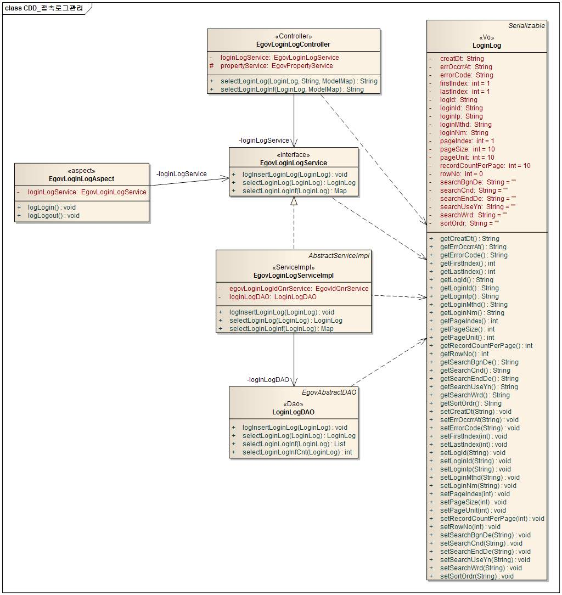
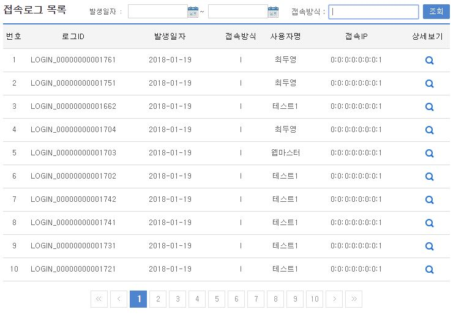
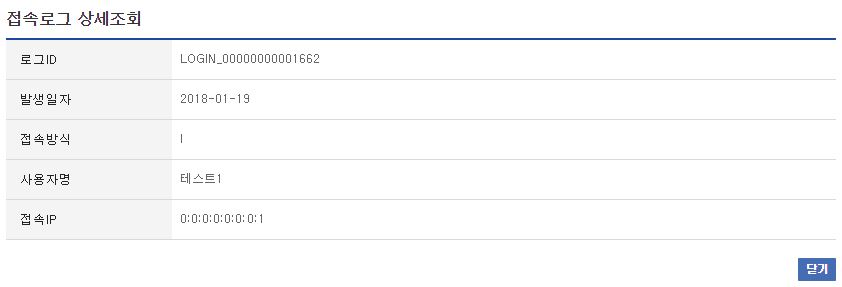

# 접속로그관리

## 개요

 접속로그관리는 사용자가 시스템 로그인/아웃한 로그를 검색, 조회하는 기능을 제공한다.

## 설명

 접속로그관리는 로그인 패키지(egovframework-certlogin-x.x.x.zip) 설치 후에 사용이 가능하다.
 (단독 설치 후 실행 시 에러발생)
 접속로그관리는 로그인로그의 등록, 조회, 목록의 기능을 수반한다.

 ① 접속로그등록 : 로그인로그정보를 등록한다. - AOP 기능을 이용
 ② 접속로그조회 : 로그인로그정보의 상세내용을 조회한다.
 ③ 접속로그목록 : 로그인로그정보의 목록을 검색, 조회한다.

### 패키지 참조 관계

 접속로그관리 패키지는 요소기술의 공통(cmm) 패키지에 대해서만 직접적인 함수적 참조 관계를 가진다.
 패키지 간 참조 관계 : [시스템관리 Package Dependency](../intro/package-reference.md/#시스템관리)

### 관련소스

| 유형 | 대상소스명 | 비고 |
| --- | --- | --- |
| Controller | egovframework.com.sym.log.clg.web.EgovLoginLogController.java | 접속로그 관리를 위한 컨트롤러 클래스 |
| Service | egovframework.com.sym.log.clg.service.EgovLoginLogService.java | 접속로그 관리를 위한  서비스 인터페이스 |
| ServiceImpl | egovframework.com.sym.log.clg.service.impl.EgovLoginLogServiceImpl.java | 접속로그 관리를 위한 서비스 구현 클래스 |
| Model | egovframework.com.sym.log.clg.service.LoginLog.java | 접속로그 관리를 위한 VO 클래스 |
| DAO | egovframework.com.sym.log.clg.service.impl.LoginLogDAO.java | 접속로그 관리를 위한 데이터처리 클래스 |
| Aspect | egovframework.com.sym.log.clg.service.EgovLoginLogAspect.java | 접속로그 등록을 위한 Aspect 클래스 |
| JSP | /WEB-INF/jsp/egovframework/com/sym/log/clg/EgovLoginLogList.jsp | 접속로그 목록을 위한 jsp페이지 |
| JSP | /WEB-INF/jsp/egovframework/com/sym/log/clg/EgovLoginLogDetail.jsp | 접속로그 상세조회를 위한 jsp페이지 |
| Query XML | resources/egovframework/mapper/com/sym/log/clg/EgovLoginLog\_SQL\_altibase.xml | 접속로그 관리를 위한 Altibase용 Query XML |
| Query XML | resources/egovframework/mapper/com/sym/log/clg/EgovLoginLog\_SQL\_cubrid.xml | 접속로그 관리를 위한 Cubrid용 Query XML |
| Query XML | resources/egovframework/mapper/com/sym/log/clg/EgovLoginLog\_SQL\_maria.xml | 접속로그 관리를 위한 MariaDB용 Query XML |
| Query XML | resources/egovframework/mapper/com/sym/log/clg/EgovLoginLog\_SQL\_mysql.xml | 접속로그 관리를 위한 MySQL용 Query XML |
| Query XML | resources/egovframework/mapper/com/sym/log/clg/EgovLoginLog\_SQL\_oracle.xml | 접속로그 관리를 위한 Oracle용 Query XML |
| Query XML | resources/egovframework/mapper/com/sym/log/clg/EgovLoginLog\_SQL\_postgres.xml | 접속로그 관리를 위한 PostgreSQL용 Query XML |
| Query XML | resources/egovframework/mapper/com/sym/log/clg/EgovLoginLog\_SQL\_tibero.xml | 접속로그 관리를 위한 Tibero용 Query XML |
| Query XML | resources/egovframework/mapper/com/sym/log/clg/EgovLoginLog\_SQL\_goldilocks.xml | 접속로그 관리를 위한 Goldilocks용 Query XML |
| Idgen XML | resources/egovframework/spring/com/idgn/context-idgn-LoginLog.xml | 접속로그 관리 Id생성 Idgen XML |
| AOP XML | webapp/WEB-INF/config/egovframework/springmvc/egov-com-loginaop.xml | 접속로그 관리 AOP 설정 XML |
| Message properties | resources/egovframework/message/com/sym/log/clg/message\_ko.properties | 접속로그 관리를 위한 Message properties(한글) |
| Message properties | resources/egovframework/message/com/sym/log/clg/message\_en.properties | 접속로그 관리를 위한 Message properties(영문) |

### 클래스 다이어그램

 

### ID Generation

#### ID Generation 관련 DDL 및 DML

 ID Generation Service를 활용하기 위해서 Sequence 저장테이블인 COMTECOPSEQ에 LOGINLOG_ID 항목을 추가한다.

```sql
CREATE TABLE COMTECOPSEQ(TABLE_NAME VARCHAR(20) NOT NULL,
	     NEXT_ID NUMERIC(30) NULL,
	     PRIMARY KEY (TABLE_NAME));
 
  INSERT INTO COMTECOPSEQ VALUES('LOGINLOG_ID','1');
```

#### ID Generation 환경설정(context-idgn-LoginLog.xml)

```xml
<bean name="egovLoginLogIdGnrService" class="egovframework.rte.fdl.idgnr.impl.EgovTableIdGnrServiceImpl" destroy-method="destroy">
        <property name="dataSource" ref="egov.dataSource" />
        <property name="strategy"   ref="loginLogStrategy" />
        <property name="blockSize"  value="10"/>
        <property name="table"      value="COMTECOPSEQ"/>
        <property name="tableName"  value="LOGINLOG_ID"/>
    </bean>
    <bean name="loginLogStrategy" class="egovframework.rte.fdl.idgnr.impl.strategy.EgovIdGnrStrategyImpl">
        <property name="prefix"   value="LOGIN_" />
        <property name="cipers"   value="14" />
        <property name="fillChar" value="0" />
    </bean>
```

### 관련 테이블

| 테이블명 | 테이블명(영문) | 비고 |
| --- | --- | --- |
| 접속로그 | COMTNLOGINLOG | 로그인로그 정보를 관리한다. |

### AOP

#### egov-com-loginaop.xml

```xml
<bean id="loginlog" class="egovframework.com.sym.log.clg.service.EgovLoginLogAspect" />
 
	<aop:config>
		<aop:aspect id="loginLogAspect" ref="loginlog">
			<!--  로그인 Method -->
			<aop:before pointcut="execution(public * egovframework.com.uat.uia.web.EgovLoginController.actionMain(..)) " method="logLogin" />
			<!--  로그아웃 Method -->
			<aop:before pointcut="execution(public * egovframework.com.uat.uia.web.EgovLoginController.actionLogout(..))" method="logLogout" />
		</aop:aspect>
	</aop:config>
```

 접속로그 등록 기능구현을 위하여 AOP를 설정한다.
 접속로그 등록 기능구현을 위하여 EgovLoginLogAspect 클래스를 생성한다.

 package egovframework.com.sym.log.clg.service;
 import egovframework.com.cmm.LoginVO;
 import egovframework.com.cmm.util.EgovUserDetailsHelper;
 import javax.annotation.Resource;
 public class EgovLoginLogAspect {
 @Resource(name="EgovLoginLogService")
 private EgovLoginLogService loginLogService;
 /**
 * 로그인 로그정보를 생성한다.
 * EgovLoginController.actionMain Method
 *
 * @param
 * @return void
 * @throws Exception
 */
 public void logLogin() throws Throwable {
 String uniqId = ";
 String ip = ";
 /* Authenticated  */
 Boolean isAuthenticated = EgovUserDetailsHelper.isAuthenticated();
 if(isAuthenticated.booleanValue()) {
 LoginVO user = (LoginVO)EgovUserDetailsHelper.getAuthenticatedUser();
 uniqId = user.getUniqId();
 ip = user.getIp();
 }
 LoginLog loginLog = new LoginLog();
 loginLog.setLoginId(uniqId);
 loginLog.setLoginIp(ip);
 loginLog.setLoginMthd("I"); // 로그인:I, 로그아웃:O
 loginLog.setErrOccrrAt("N");
 loginLog.setErrorCode(");
 loginLogService.logInsertLoginLog(loginLog);
 }
 /**
 * 로그아웃 로그정보를 생성한다.
 * EgovLoginController.actionLogout Method
 *
 * @param
 * @return void
 * @throws Exception
 */
 public void logLogout() throws Throwable {
 String uniqId = ";
 String ip = ";
 /* Authenticated  */
 Boolean isAuthenticated = EgovUserDetailsHelper.isAuthenticated();
 if(isAuthenticated.booleanValue()) {
 LoginVO user = (LoginVO)EgovUserDetailsHelper.getAuthenticatedUser();
 uniqId = user.getUniqId();
 ip = user.getIp();
 }
 LoginLog loginLog = new LoginLog();
 loginLog.setLoginId(uniqId);
 loginLog.setLoginIp(ip);
 loginLog.setLoginMthd("O"); // 로그인:I, 로그아웃:O
 loginLog.setErrOccrrAt("N");
 loginLog.setErrorCode(");
 loginLogService.logInsertLoginLog(loginLog);
 }
 }

## 관련기능

 접속로그관리는 접속로그 목록조회, 접속로그 상세조회 기능으로 구분된다.

### 접속로그 목록조회

#### 비즈니스 규칙

 로그인로그 목록은 페이지 당 10건씩 조회되며 페이징은 10페이지씩 이루어진다. 검색조건은 발생일자와 로그유형에 대해서 수행된다.

#### 관련코드

 N/A

#### 관련화면 및 수행매뉴얼

| Action | URL | Controller method | SQL Namespace | SQL QueryID |
| --- | --- | --- | --- | --- |
| 목록조회 | /sym/log/clg/SelectLoginLogList.do | selectLoginLogInf | "LoginLog" | "selectLoginLogInf" |
|  |  |  |  | "selectLoginLogInfCnt" |

 

 로그인로그 상세조회 기능을 수행하기 위해서는 상세보기 버튼을 클릭한다.

### 접속로그 상세조회

#### 비즈니스 규칙

 로그인로그 상세조회는 팝업창으로 구성되며, 닫기 버튼을 클릭하면 창을 닫는다.

#### 관련코드

 N/A

#### 관련화면 및 수행메뉴얼

| Action | URL | Controller method | SQL Namespace | SQL QueryID |
| --- | --- | --- | --- | --- |
| 상세조회 | /sym/log/clg/SelectLoginLogDetail.do | selectLoginLog | "LoginLog" | "selectLoginLog" |

 

## 참고자료

 실행환경 참조 : AOP
 실행환경 참조 : ID Generation
