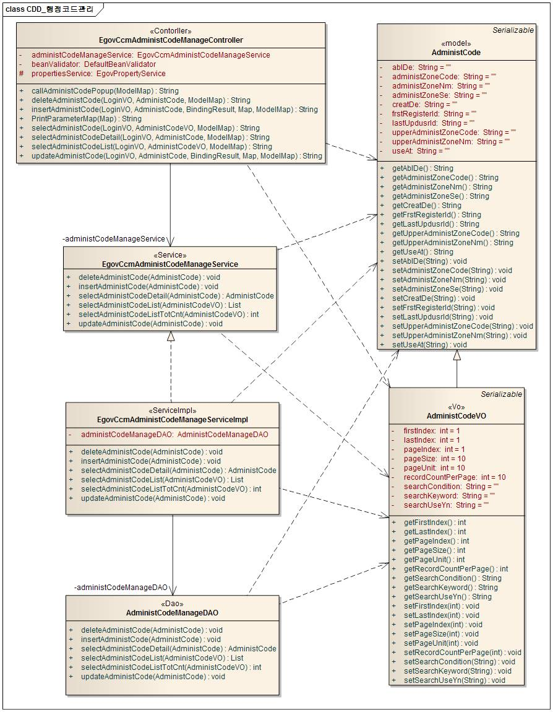
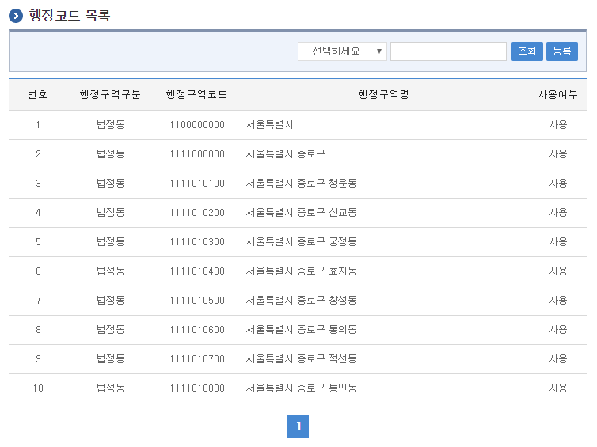
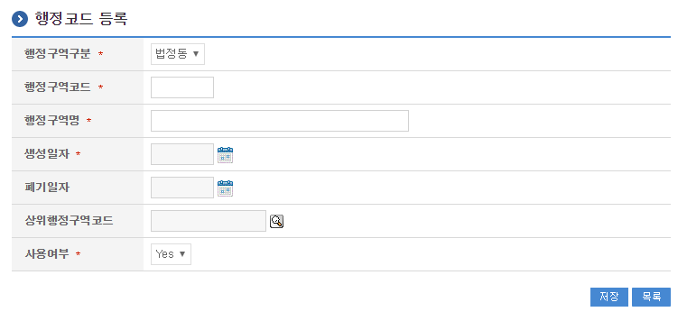
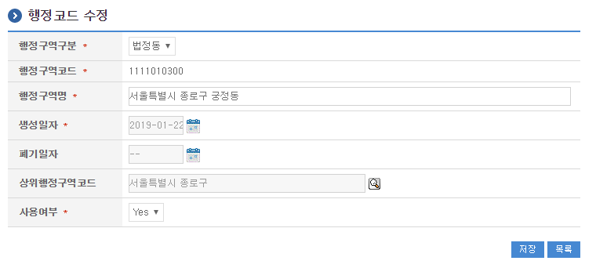
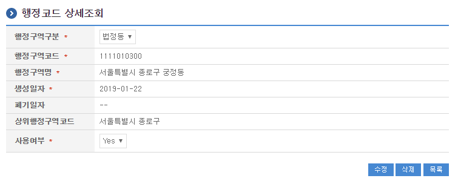

# 행정코드관리

## 개요

 행정코드 관리는 법정동, 행정동을 등록, 수정, 목록조회, 상세조회를 제공한다.

## 설명

### 패키지 참조 관계

 행정코드관리 패키지(adc)는 요소기술의 공통 패키지(cmm)에 대해서만 직접적인 함수적 참조 관계를 가진다. 하지만, 컴포넌트 배포 시 오류 없이 실행되기 위하여 패키지 간의 참조관계에 따라 행정코드관리 패키지(acr), 달력 패키지와 함께 배포 파일을 구성한다.
 패키지 간 참조 관계 : 시스템관리 Package Dependency

### 관련소스

| 유형 | 대상소스명 | 비고 |
| --- | --- | --- |
| Controller | egovframework.com.sym.ccm.adc.web.EgovCcmAdministCodeManageController.java | 행정코드 관리를 위한 컨트롤러 클래스 |
| Service | egovframework.com.sym.ccm.adc.service.EgovCcmAdministCodeManageService.java | 행정코드 관리를 위한 서비스 인터페이스 |
| ServiceImpl | egovframework.com.sym.ccm.adc.service.impl.EgovCcmAdministCodeManageServiceImpl.java | 행정코드 관리를 위한 위한 서비스구현 클래스 |
| Model | egovframework.com.sym.ccm.adc.service.AdministCode.java | 행정코드 정보 Model 클래스 |
| VO | egovframework.com.sym.ccm.adc.service.AdministCodeVO.java | 행정코드 관리를 위한 VO 클래스 |
| DAO | egovframework.com.sym.ccm.adc.service.impl.AdministCodeManageDAO.java | 행정코드 정보 관리를 위한 데이터처리 클래스 |
| JSP | /WEB-INF/jsp/egovframework/com/sym/ccm/adc/EgovCcmAdministCodeDetail.jsp | 행정코드 상세보기를 위한 JSP 페이지 |
| JSP | /WEB-INF/jsp/egovframework/com/sym/ccm/adc/EgovCcmAdministCodeList.jsp | 행정코드 목록을 위한 JSP 페이지 |
| JSP | /WEB-INF/jsp/egovframework/com/sym/ccm/adc/EgovCcmAdministCodeModify.jsp | 행정코드 수정을 위한 JSP 페이지 |
| JSP | /WEB-INF/jsp/egovframework/com/sym/ccm/adc/EgovCcmAdministCodeRegist.jsp | 행정코드 등록을 위한 JSP 페이지 |
| QUERY XML | resources/egovframework/mapper/com/sym/ccm/adc/EgovAdministCodeManage\_SQL\_mysql.xml | 행정코드 MySQL용 QUERY XML |
| QUERY XML | resources/egovframework/mapper/com/sym/ccm/adc/EgovAdministCodeManage\_SQL\_cubrid.xml | 행정코드 Cubrid용 QUERY XML |
| QUERY XML | resources/egovframework/mapper/com/sym/ccm/adc/EgovAdministCodeManage\_SQL\_oracle.xml | 행정코드 Oracle용 QUERY XML |
| QUERY XML | resources/egovframework/mapper/com/sym/ccm/adc/EgovAdministCodeManage\_SQL\_tibero.xml | 행정코드 Tibero용 QUERY XML |
| QUERY XML | resources/egovframework/mapper/com/sym/ccm/adc/EgovAdministCodeManage\_SQL\_altibase.xml | 행정코드 Altibase용 QUERY XML |
| QUERY XML | resources/egovframework/mapper/com/sym/ccm/adc/EgovAdministCodeManage\_SQL\_maria.xml | 행정코드 MariaDB용 QUERY XML |
| QUERY XML | resources/egovframework/mapper/com/sym/ccm/adc/EgovAdministCodeManage\_SQL\_postgres.xml | 행정코드 PostgreSQL용 QUERY XML |
| QUERY XML | resources/egovframework/mapper/com/sym/ccm/adc/EgovAdministCodeManage\_SQL\_goldilocks.xml | 행정코드 Goldilocks용 QUERY XML |
| Message properties | resources/egovframework/message/com/sym/ccm/adc/message\_ko.properties | 행정코드관리를 위한 Message properties(한글) |
| Message properties | resources/egovframework/message/com/sym/ccm/adc/message\_en.properties | 행정코드관리를 위한 Message properties(영문) |

### 클래스 다이어그램

 

### 관련테이블

| 테이블명 | 테이블명(영문) | 비고 |
| --- | --- | --- |
| 행정코드 | COMTCADMINISTCODE | 행정코드 정보를 관리한다. |

## 관련기능

 행정코드의 관리는 행정코드 목록조회, 행정코드 상세조회, 행정코드 등록, 행정코드 수정 처리 할 수 있도록 구성되어있다.

### 행정코드 목록조회

#### 비즈니스 규칙

 행정코드 목록은 페이지 당 10건씩 조회되며 페이징은 10페이지씩 이루어진다. 검색조건은 법정동 지역명, 행정동 지역명에 대해서 수행된다.

#### 관련코드

 N/A

#### 관련화면 및 수행매뉴얼

| Action | URL | Controller method | QueryID |
| --- | --- | --- | --- |
| 목록조회 | /sym/ccm/adc/EgovCcmAdministCodeList.do | selectAdministCodeList | “AdministCodeManageDAO.selectAdministCodeList”, |
|  |  |  | “AdministCodeManageDAO.selectAdministCodeListTotCnt” |

 페이지 당 검색 범위를 변경하고자 하는 경우
 context-properties.xml 파일의 pageUnit, pageSize를 변경한다.(단 해당 설정은 전체 공통서비스 기능에 영향을 미친다.)

 

 조회: 조회하기 위해서는 상단의 검색조건을 선택 후 해당하는 검색문자를 입력 후 조회 버튼을 클릭한다
 등록: 등록하기 위해서는 상단의 등록 버튼을 통해서 행정코드 등록 화면으로 이동한다.
 목록클릭: 행정코드 상세조회 화면으로 이동한다.

### 행정코드 등록

#### 비즈니스 규칙

 행정코드에 대한 상세내용을 등록한다. 등록이 성공하면 행정코드 목록 화면으로 이동한다.

#### 관련코드

 N/A

#### 관련화면 및 수행매뉴얼

| Action | URL | Controller method | QueryID |
| --- | --- | --- | --- |
| 등록 | /sym/ccm/adc/EgovCcmAdministCodeRegist.do | insertAdministCode | “AdministCodeManageDAO.insertAdministCode” |

 

 목록: 행정코드 목록 화면으로 이동한다.
 저장: 입력한 행정코드 정보들이 저장 처리된다.

### 행정코드 수정

#### 비즈니스 규칙

 수정이 성공하면 행정코드 목록 화면으로 이동한다.

#### 관련코드

 N/A

#### 관련화면 및 수행매뉴얼

| Action | URL | Controller method | QueryID |
| --- | --- | --- | --- |
| 수정 | /sym/ccm/adc/EgovCcmAdministCodeModify.do | updateAdministCode | “AdministCodeManageDAO.updateAdministCode” |

 

 저장: 수정된 정보들이 저장 처리된다.
 목록: 행정코드 목록 화면으로 이동한다.

### 행정코드 상세 조회

#### 비즈니스 규칙

 상세조회에는 삭제 처리가 포함되어 있고 삭제가 성공하면 행정코드 목록 화면으로 이동한다.

#### 관련코드

 N/A

#### 관련화면 및 수행매뉴얼

| Action | URL | Controller method | QueryID |
| --- | --- | --- | --- |
| 상세조회 | /sym/ccm/adc/EgovCcmAdministCodeDetail.do | selectAdministCodeDetail | “AdministCodeManageDAO.selectAdministCodeDetail” |
| 삭제 | /sym/ccm/adc/EgovCcmAdministCodeRemove.do | deleteAdministCode | “AdministCodeManageDAO.deleteAdministCode” |

 

 수정: 수정버튼 클릭 시 행정코드 수정 화면으로 이동한다.
 삭제: 삭제버튼 클릭 시 삭제여부를 확인하는 메시지를 보여주고 삭제처리를 할 수 있다.
 목록: 행정코드 목록 화면으로 이동한다.
