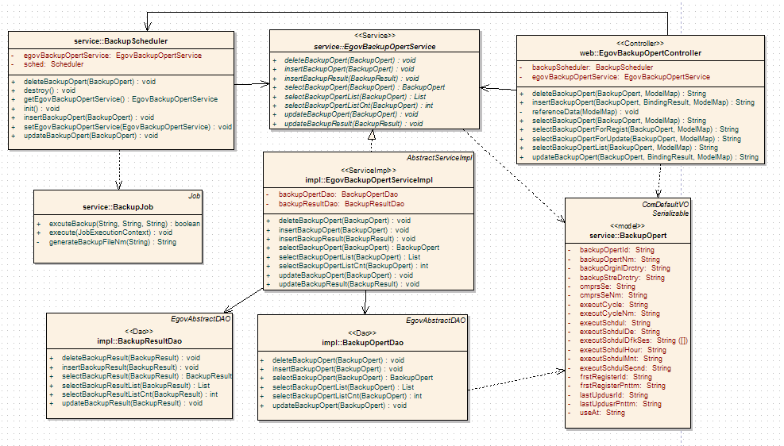
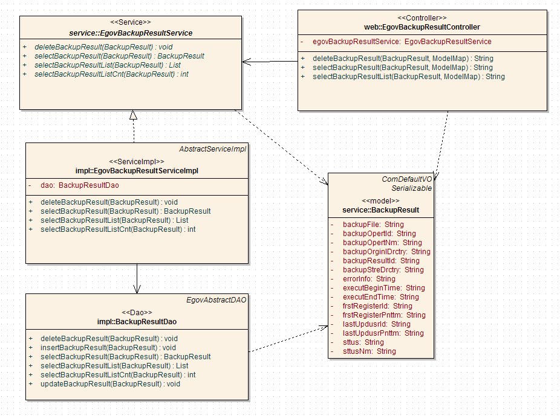
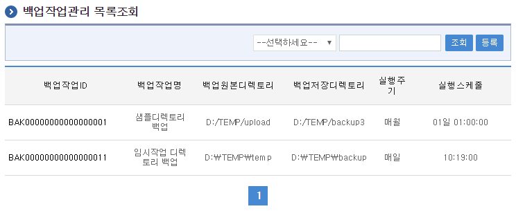
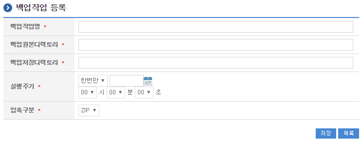
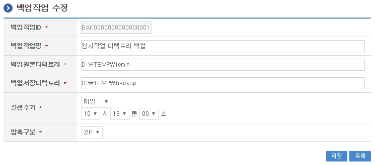
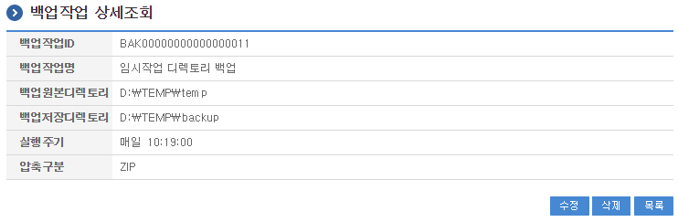
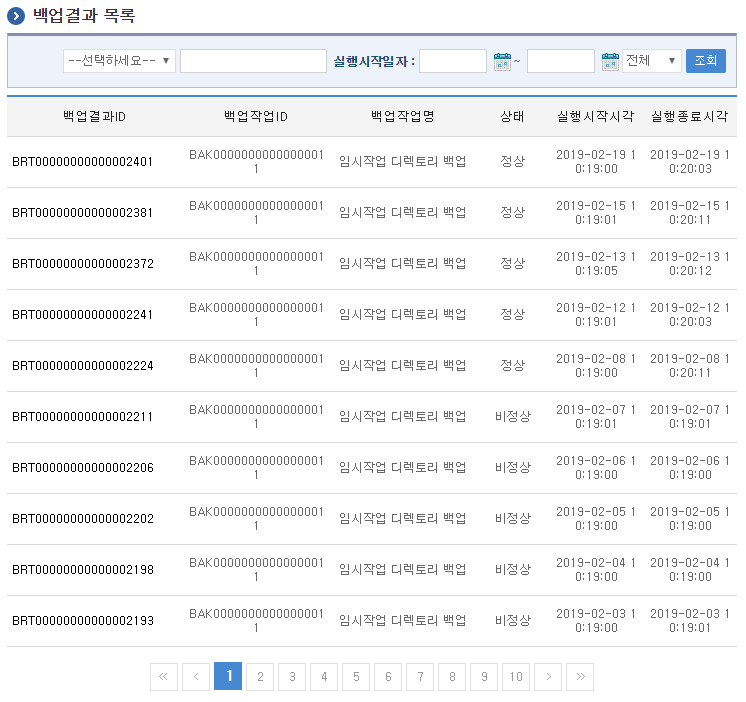
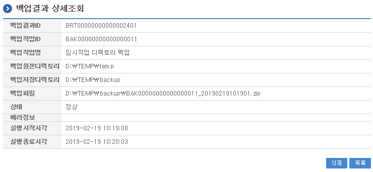

# 백업관리

## 개요

 백업관리는 시스템에서 주기적으로 실행하는 백업작업을 관리하고 백업결과를 조회하는 기능을 제공한다.

## 설명

 백업작업관리는 백업작업을 등록하기 위한 목적으로 백업작업의 등록, 수정, 삭제, 조회, 목록조회의 기능을 수반한다.

```text
  ① 백업작업목록조회 : 백업작업으로 정의된 정보를 최근 등록 순서대로 조회하고, 그 결과 목록을 화면에 반영한다.
  ② 백업작업등록 : 백업작업정보를 등록하고, 등록 결과를 조회한다.
  ③ 백업작업수정 : 기 등록된 백업작업정보의 항목들을 수정한다.
  ④ 백업작업삭제 : 기 등록된 백업작업정보를 삭제한다.
  ⑤ 백업작업조회 : 등록된 백업작업정보를 조회한다.
```

 백업결과관리는 백업결과을 관리하기 위한 목적으로 백업작업의 조회, 삭제, 목록조회의 기능을 수반한다.

```text
  ① 백업결과목록조회 : 백업결과으로 정의된 정보를 최근 등록 순서대로 조회하고, 그 결과 목록을 화면에 반영한다.
  ④ 백업결과삭제 : 기 등록된 백업결과정보를 삭제한다.
  ⑤ 백업결과조회 : 등록된 백업결과정보를 조회한다.
```

#### 관련소스

| 유형 | 대상소스명 | 비고 |
| --- | --- | --- |
| Controller | egovframework.com.sym.sym.bak.web.EgovBackupOpertController.java | 백업작업 관리를 위한 컨트롤러 클래스 |
| Controller | egovframework.com.sym.sym.bak.web.EgovBackupResultController.java | 백업결과 관리를 위한 컨트롤러 클래스 |
| Service | egovframework.com.sym.sym.bak.service.EgovBackupOpertService.java | 백업작업 관리를 위한 서비스 인터페이스 |
| Service | egovframework.com.sym.sym.bak.service.EgovBackupResultService.java | 백업결과 관리를 위한 서비스 인터페이스 |
| ServiceImpl | egovframework.com.sym.sym.bak.service.impl.EgovBackupOpertServiceImpl.java | 백업작업 관리를 위한 서비스 구현 클래스 |
| ServiceImpl | egovframework.com.sym.sym.bak.service.impl.EgovBackupResultServiceImpl.java | 백업결과 관리를 위한 서비스 구현 클래스 |
| DAO | egovframework.com.sym.sym.bak.service.impl.BackupOpertDAO.java | 백업작업 관리를 위한 데이터처리 클래스 |
| DAO | egovframework.com.sym.sym.bak.service.impl.BackupResultDAO.java | 백업결과 관리를 위한 데이터처리 클래스 |
| Model | egovframework.com.sym.sym.bak.service.BackupOpert.java | 백업작업 관리를 위한 Model 클래스 |
| Model | egovframework.com.sym.sym.bak.service.BackupResult.java | 백업결과 관리를 위한 Model 클래스 |
| JSP | /WEB-INF/jsp/egovframework/com/sym/sym/bak/EgovBackupOpertList.jsp | 백업작업 목록조회를 위한 jsp페이지 |
| JSP | /WEB-INF/jsp/egovframework/com/sym/sym/bak/EgovBackupOpertRegist.jsp | 백업작업 등록를 위한 jsp페이지 |
| JSP | /WEB-INF/jsp/egovframework/com/sym/sym/bak/EgovBackupOpertUpdt.jsp | 백업작업 수정를 위한 jsp페이지 |
| JSP | /WEB-INF/jsp/egovframework/com/sym/sym/bak/EgovBackupOpertDetail.jsp | 등록된 백업작업를 반영하기 위한 jsp페이지 |
| JSP | /WEB-INF/jsp/egovframework/com/sym/sym/bak/EgovBackupResultList.jsp | 백업결과 목록조회를 위한 jsp페이지 |
| JSP | /WEB-INF/jsp/egovframework/com/sym/sym/bak/EgovBackupResultDetail.jsp | 등록된 백업결과를 반영하기 위한 jsp페이지 |
| QUERY XML | resources/egovframework/mapper/com/sym/sym/bak/EgovBackupOpert\_SQL\_mysql.xml | 백업작업관리 MySQL용 QUERY XML |
| QUERY XML | resources/egovframework/mapper/com/sym/sym/bak/EgovBackupOpert\_SQL\_oracle.xml | 백업작업관리 Oracle용 QUERY XML |
| QUERY XML | resources/egovframework/mapper/com/sym/sym/bak/EgovBackupOpert\_SQL\_tibero.xml | 백업작업관리 Tibero용 QUERY XML |
| QUERY XML | resources/egovframework/mapper/com/sym/sym/bak/EgovBackupOpert\_SQL\_altibase.xml | 백업작업관리 Altibase용 QUERY XML |
| QUERY XML | resources/egovframework/mapper/com/sym/sym/bak/EgovBackupOpert\_SQL\_cubrid.xml | 백업작업관리 Cubrid용 QUERY XML |
| QUERY XML | resources/egovframework/mapper/com/sym/sym/bak/EgovBackupOpert\_SQL\_maria.xml | 백업작업관리 Maria용 QUERY XML |
| QUERY XML | resources/egovframework/mapper/com/sym/sym/bak/EgovBackupOpert\_SQL\_postgres.xml | 백업작업관리 Goldilocks용 QUERY XML |
| QUERY XML | resources/egovframework/mapper/com/sym/sym/bak/EgovBackupOpert\_SQL\_goldilocks.xml | 백업작업관리 Postgres용 QUERY XML |
| QUERY XML | resources/egovframework/mapper/com/sym/sym/bak/EgovBackupResult\_SQL\_mysql.xml | 백업결과관리 MySQL용 QUERY XML |
| QUERY XML | resources/egovframework/mapper/com/sym/sym/bak/EgovBackupResult\_SQL\_oracle.xml | 백업결과관리 Oracle용 QUERY XML |
| QUERY XML | resources/egovframework/mapper/com/sym/sym/bak/EgovBackupResult\_SQL\_tibero.xml | 백업결과관리 Tibero용 QUERY XML |
| QUERY XML | resources/egovframework/mapper/com/sym/sym/bak/EgovBackupResult\_SQL\_altibase.xml | 백업결과관리 Altibase용 QUERY XML |
| QUERY XML | resources/egovframework/mapper/com/sym/sym/bak/EgovBackupResult\_SQL\_cubrid.xml | 백업결과관리 Cubrid용 QUERY XML |
| QUERY XML | resources/egovframework/mapper/com/sym/sym/bak/EgovBackupResult\_SQL\_maria.xml | 백업결과관리 Maria용 QUERY XML |
| QUERY XML | resources/egovframework/mapper/com/sym/sym/bak/EgovBackupResult\_SQL\_postgres.xml | 백업결과관리 Postgres용 QUERY XML |
| QUERY XML | resources/egovframework/mapper/com/sym/sym/bak/EgovBackupResult\_SQL\_goldilocks.xml | 백업결과관리 Goldilocks용 QUERY XML |
| Message properties | resources/egovframework/message/com/message-common\_ko.properties | 백업작업관리 Message properties |
| Message properties | resources/egovframework/message/com/sym/sym/bak/message\_ko.properties | 백업작업관리를 위한 Message properties(한글) |
| Message properties | resources/egovframework/message/com/sym/sym/bak/message\_en.properties | 백업작업관리를 위한 Message properties(영문) |
| Idgen XML | resources/egovframework/spring/com/idgn/context-idgn-BackupOpert.xml | 백업작업관리를 위한 Id생성 Idgen XML |

#### 클래스 다이어그램

 

 

#### 관련테이블

| 테이블명 | 테이블명(영문) | 비고 |
| --- | --- | --- |
| 백업작업 | COMTNBACKUPOPERT | 백업작업정보를 관리하기 위한 속성정보를 정의하고, 관리한다. |
| 백업스케줄요일 | COMTNBACKUPSCHDULDFK | 백업스케줄요일정보를 관리하기 위한 속성정보를 정의하고, 관리한다. |
| 백업결과 | COMTNBACKUPRESULT | 백업결과정보를 관리하기 위한 속성정보를 정의하고, 관리한다. |

#### ID Generation

 ID Generation Service를 활용하기 위해서 Sequence 저장테이블인  COMTECOPSEQ에 BACKUP_OPERT_ID, BACKUP_RESULT_ID 항목을 추가한다.

```sql
  INSERT INTO COMTECOPSEQ VALUES('BACKUP_OPERT_ID','0');
  INSERT INTO COMTECOPSEQ VALUES('BACKUP_RESULT_ID','0');
```

#### ID Generation 관련 DDL 및 DML

 ID Generation Service를 활용하기 위해서 Sequence 저장테이블인  COMTECOPSEQ에 BACKUP_OPERT_ID, BACKUP_RESULT_ID 항목을 추가해야 한다.

```sql
    CREATE TABLE COMTECOPSEQ ( table_name varchar(16) NOT NULL, 
                               next_id DECIMAL(30) NOT NULL,
                               PRIMARY KEY (table_name)
    );
 
    INSERT INTO COMTECOPSEQ VALUES('BACKUP_OPERT_ID','0');
    INSERT INTO COMTECOPSEQ VALUES('BACKUP_RESULT_ID','0');
```

#### ID Generation 환경설정(context-idgn-BatchOpert.xml)

```xml
    <!--  배치작업 ID -->
    <bean name="egovBatchOpertIdGnrService" class="egovframework.rte.fdl.idgnr.impl.EgovTableIdGnrServiceImpl" destroy-method="destroy">
        <property name="dataSource" ref="egov.dataSource" />
        <property name="strategy"   ref="batchOpertIdStrategy" />
        <property name="blockSize"  value="10"/>
        <property name="table"      value="COMTECOPSEQ"/>
        <property name="tableName"  value="BATCH_OPERT_ID"/>
    </bean>
    <bean name="batchOpertIdStrategy" class="egovframework.rte.fdl.idgnr.impl.strategy.EgovIdGnrStrategyImpl">
        <property name="prefix"     value="BAT" />
        <property name="cipers"     value="17" />
        <property name="fillChar"   value="0" />
    </bean>
 
    <!-- 배치스케줄 ID -->
    <bean name="egovBatchSchdulIdGnrService" class="egovframework.rte.fdl.idgnr.impl.EgovTableIdGnrServiceImpl" destroy-method="destroy">
        <property name="dataSource" ref="egov.dataSource" />
        <property name="strategy"   ref="batchSchdulIdStrategy" />
        <property name="blockSize"  value="10"/>
        <property name="table"      value="COMTECOPSEQ"/>
        <property name="tableName"  value="BATCH_SCHDUL_ID"/>
    </bean>
    <bean name="batchSchdulIdStrategy" class="egovframework.rte.fdl.idgnr.impl.strategy.EgovIdGnrStrategyImpl">
        <property name="prefix"     value="BSC" />
        <property name="cipers"     value="17" />
        <property name="fillChar"   value="0" />
    </bean>
```

## 관련화면 및 수행메뉴얼

#### 백업작업 목록조회

| Action | URL | Controller method | QueryID |
| --- | --- | --- | --- |
| 조회 | /sym/bat/selectBackupOpertList.do | selectBackupOpertList | "BackupOpertDAO.selectBackupOpertList" |
| 조회 | /sym/bat/selectBackupOpertList.do | selectBackupOpertList | "BackupOpertDAO.selectBackupOpertListCnt" |

 백업작업 목록은 페이지당 10건씩 조회되며 페이징은 10페이지씩 이루어진다.
 검색조건은 백업작업명,백업원본디렉토리에 대해서 수행된다.

 

 조회 : 기 등록된 백업작업의 목록을 조회한다.
 등록 : 신규 백업작업를 등록하기 위해서는 상단의 등록 버튼을 통해서 백업작업 등록 화면으로 이동한다.

#### 백업작업 등록

| Action | URL | Controller method | QueryID |
| --- | --- | --- | --- |
| 등록 | /sym/bat/addBackupOpert.do | insertBackupOpert | "BackupOpertDAO.insertBackupOpert" |

 백업작업의 속성정보를 입력한 뒤 등록한다.

 

 저장 : 신규 백업작업를 등록하기 위해서는 백업작업 속성을 입력한 뒤 상단의 저장 버튼을 통해서 백업작업를 등록한다. 백업원본디렉토리, 백업저장디렉토리는 서버 상에 존재하는 디렉토리를 입력하여야 한다.
 목록 : 백업작업 목록조회 화면으로 이동한다.

#### 백업작업 수정

| Action | URL | Controller method | QueryID |
| --- | --- | --- | --- |
| 수정 | /sym/bat/updateBackupOpert | updateBackupOpert | "BackupOpertDAO.updateBackupOpert" |

 백업작업의 속성정보를 변경한 후 저장한다.

 

 저장 : 기 등록된 백업작업 속성을 수정한 뒤 상단의 저장 버튼을 통해서 백업작업정보를 수정한다.
 목록 : 백업작업 목록조회 화면으로 이동한다.

#### 백업작업 상세조회

| Action | URL | Controller method | QueryID |
| --- | --- | --- | --- |
| 상세조회 | /sym/bat/getBackupOpert.do | selectBackupOpert | "BackupOpertDAO.selectBackupOpert" |
| 삭제 | /sym/bat/deleteBackupOpert.do | deleteBackupOpert | "BackupOpertDAO.deleteBackupOpert" |

 백업작업의 속성정보를 조회한다.

 

 수정 : 기 등록된 백업작업 속성을 수정한 뒤 상단의 수정 버튼을 통해서 백업작업수정화면으로 이동한다.
 삭제 : 기 등록된 백업작업정보를 삭제한다.
 목록 : 백업작업 목록조회 화면으로 이동한다.

#### 백업결과 목록조회

| Action | URL | Controller method | QueryID |
| --- | --- | --- | --- |
| 조회 | /sym/bat/selectBackupResultList.do | selectBackupResultList | "BackupResultDAO.selectBackupResultList" |
| 조회 | /sym/bat/selectBackupResultList.do | selectBackupResultList | "BackupResultDAO.selectBackupResultListCnt" |

 백업결과 목록은 페이지당 10건씩 조회되며 페이징은 10페이지씩 이루어진다.
 검색조건은 백업작업명,백업작업ID에 대해서 수행된다.
 백업결과 목록의 상태는 정상, 비정상, 수행중으로 구분되어 조회할 수 있다.
 백업 상태는 백업작업이 실행되면 '수행중'이었다가 백업작업이 정상 종료되면 '정상', 비정상 종료되면 '비정상'으로 설정된다.

 

 조회 : 기 등록된 백업결과의 목록을 조회한다.

#### 백업결과 상세조회

| Action | URL | Controller method | QueryID |
| --- | --- | --- | --- |
| 상세조회 | /sym/bat/getBackupResult.do | selectBackupResult | "BackupResultDAO.selectBackupResult" |
| 삭제 | /sym/bat/deleteBackupResult.do | deleteBackupResult | "BackupResultDAO.deleteBackupResult" |

 백업결과의 속성정보를 조회한다.

 

 삭제 : 기 등록된 백업결과정보를 삭제한다.
 목록 : 백업결과 목록조회 화면으로 이동한다.
